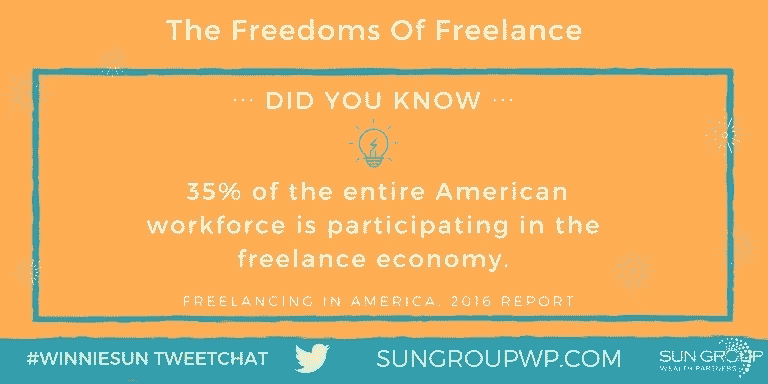

# 自由职业者给了公司提高生产力所需的动力

> 原文：<https://medium.datadriveninvestor.com/brace-for-the-freelancing-ride-of-a-lifetime-5ae72ea07c6e?source=collection_archive---------3----------------------->

## 终极自由加上对未知的恐惧会带来高额回报

F 重选。对一个人来说，这是终极自由。另一方面，是对未知的恐惧。对许多人来说，这是两者的可怕结合。

[娜塔莉·兹法特](https://twitter.com/NatalieZfat)、[福布斯](https://twitter.com/Forbes)撰稿人兼视频记者；[劳伦·伯杰](https://twitter.com/InternQueen)，职业专家、畅销书作家；金融行业最受欢迎的专业人士之一 Winnie Sun 谈到了自由职业者的自由和危险。

随着自助出版变得越来越普遍，自由职业者的代理变得不那么必要了。展示你自己最好的东西。

“这是千真万确的，”孙说。“我知道生活教练乔伊斯·努森博士在自助出版一本好书方面做得很好。与此同时，作家玛莎·科利尔与一家机构合作得非常出色。

“两种方式都可以，”她说。“这只是取决于你希望实现和获得什么。”

 [## 尽情享受你一天中的每一分钟

### 自由职业者拥有完全自由的力量

medium.com](https://medium.com/datadriveninvestor/feel-free-to-enjoy-every-minute-of-your-day-cae2b4ec2655) 

很多时候都是关系问题。

“我相信先与那些更了解情况的人合作，为他们的帮助付费，并最终单干，”孙说。“专注于你最擅长的事情。与那些能让你的生活轻松一点的人分享。”

对她来说，Zfat 依赖于机构。

“你不能单干，”她说。“授权可能很难，但有了合适的团队——有时是代理，有时是助理——任何自由职业者都可以最大限度地提高生产率。”

伯杰很矛盾。

“一切皆有可能，”她说。“代理代表不是必需的。弄清楚你想做什么，然后实现它。”

当写一份专业的标书时，看看其他成功的自由职业者是怎么做的。准确评估自己的价值。不要承诺超出你能力范围的东西。

“这是一个很好的提醒，”孙说。“不要贪多嚼不烂。你可能会遇到其他机会。你需要为此敞开大门。”

# 求助

她说，申办准备可以是一个共同的努力。

“加入一个焦点小组，比如脸书或者 LinkedIn，”孙说。“试着弄清楚别人是如何定位出价的，以及他们是如何定价的。

“此外，在你报价之前，试着让潜在客户给你一份预算，”她说。"然后你要确保你没有低估自己."

不要害怕把你的眼光放高。

“总是要求比你想要的更多的东西，”Zfat 说。“每个公司都理所当然地考虑自己的底线。为谈判留有余地。”

记得强调你的优势。

伯杰说:“确保你不只是在谈论你的能力，而是你能给公司带来的价值。

 [## 自由职业者拯救陷入困境的公司

### 个体企业家为工作地点和成本提供了灵活性

medium.com](https://medium.com/datadriveninvestor/freelancers-ride-to-the-rescue-of-struggling-companies-e20ac85362b1) 

明确你的定位，在你的专业领域找到自由职业者的工作。知道你最擅长什么，并专注于此。成为建立你的声誉的可靠来源。

“首先，确定你喜欢做什么，你喜欢什么类型的企业，”孙说。“第二，找出你目前的大部分客户是做什么的，他们在什么行业。

“这通常是一个很好的开始，指出你应该关注的地方，”她说。

创造多种颜色的外套。

“让你的服务多样化，”Zfat 说。“如果你没有做别人没有做的事情，你最好做得更好、更快或更便宜。”

最重要的是，带着感觉去做。

“当我是一名自由作家时，我写的是我热爱的内容，”伯杰说。“我就是这样找到了自己的定位。”

自由职业者可以在他们的网站上设定价格。他们也可能更喜欢一件一件地谈判，如果你的专业知识难以量化，比如写作，这更好。

你想通过写作来讲述这个故事。通过文字或文章获得固定费用可能会诱使你夸大一篇文章或将其剪短以填充一个正方形。

“作为一个雇佣自由职业者的人，我更喜欢像 Fiverr T3 和 Upwork T5 这样的网站，它们能给我预先定价，”孙说。“这是透明的，感觉像是一种更诚实的关系。”

当你提前得到最好的信息时，定价是最好的。

“作为一名自由职业者，没有两个项目是完全一样的，”Zfat 说。“一个客户可能支付费用，而另一个客户提供每日津贴。设定合适的价格就是要问正确的问题。”

她有一个 YouTube 视频，“ [*作为自由职业者如何设定自己的费率*](https://www.youtube.com/watch?v=K8IlwtqRkRQ) ”

“我推荐定制定价，这样你就可以解释为什么某些东西以某种方式定价，”伯杰说。“那么客户就不会做出假设。”

# 引人注目的投资组合

准备标书时，了解客户对展示产品的偏好。对于作者来说，一些企业主希望整篇文章都有图片，其他人只需要文字。有些人可能想要活页夹里的文章，有些人想要网上故事的链接。接受他们的要求。

“我已经雇了几个自由职业者，”孙说。“在网站、YouTube、Instagram、脸书或类似网站上建立一个作品集是一个很好的起点。”

Zfat 同意网上是一条路要走。

“你知道吗，95%的人力资源专业人士在招聘人才时会使用社交媒体——包括自由职业者？”她说。“我以前说过，现在我再说一遍:社交媒体是你的简历。”

 [## 如何知道你的价格是正确的

### 当你一个人做生意时，挑战会成倍增加

medium.com](https://medium.com/datadriveninvestor/how-to-know-your-price-is-right-78ee160a8a32) 

代言也很重要。

“网站是展示你作品的一个很好的方式，”伯杰说。"你也应该收集客户推荐."

口碑是自由职业者最好的参考。结交能给你指明正确方向并为你背书的业内人士。

“我一直在招聘，”孙说。“我在 Fiverr、 [craigslist](https://twitter.com/craigslist/) 等网站上，甚至在我的个人网络或社交媒体上寻找自由职业者。”

Berger 和 Zfat 增加了引荐来源，如 LinkedIn、代理人和公关人员，以及个人和专业联系人。

# 动作快点

如果你有一个电梯推销，它必须很快。这座建筑可能只有两层。想想你做了什么击中了潜在客户的痛点。练习说出你如何回答问题——在 15 秒或更短的时间内说出来。

“当我刚刚起步时，我曾经有过一次电梯推销，”孙说。“现在，我意识到我想与之合作的客户类型不是那种我会用电梯推销来赢得的人。

“我分享我所做的事情，让他们在准备好的时候来找我，”她说。“我认为这是一种更礼貌的营销方式。”

 [## 从你的未来和为什么你最适合这份工作开始

### 你完美的演讲将你职业生涯中的点点滴滴联系起来

medium.com](https://medium.com/an-idea/lead-with-your-future-and-why-youre-best-for-the-job-7f4d85474bc4) 

Zfat 建议不要在电梯里按错按钮。

“正如我的朋友、商业教练[南希·斯内尔](https://twitter.com/CoachNancySnell/)喜欢说的那样，‘我不在令人信服的游戏中，我在合作的游戏中。’如果你在电梯里遇到别人，和他们交流，但避免强行推销，”Zfat 说。

伯杰的 YouTube 频道有一个关于[电梯推销](https://www.youtube.com/watch?v=Lb0Yz_5ZYzI&t=3s)的视频。

“社交媒体对所有类型的业务都有帮助，尤其是自由职业者，因为它可以帮助你甚至与大公司合作，”孙说。

“你可以讲述你的故事，分享你的才华，甚至和传统大公司一样快地签下客户，”她说。

也有很少或没有成本。

“不管你做什么工作，记住:社交媒体是一个免费的焦点小组，”Zfat 说。“与你的追随者、客户和社区交谈，了解他们的兴趣。给人民他们想要的。”

上网也能缩小差距。

伯杰说:“使用社交媒体与你无法接触到的人联系。”

自由职业者可以利用大量网站和应用程序。

“作为一个雇佣过自由职业者的人，我喜欢 Fiverr、Upwork 和 LinkedIn 来寻找有才华的人一起工作，”孙说。

Zfat 和 Berger 加上了 [WeWork](https://twitter.com/WeWork/) 、 [Peerspace](https://twitter.com/Peerspace/) 、[美国运通](https://twitter.com/AmericanExpress/)和[图钉](https://twitter.com/thumbtack/)。

# 画你的画

个人品牌与自由职业相交，并告诉你是谁。这应该融入到你的自由职业工作中。一切都应该融入你完整的职业图景。

“个人品牌可以提高你的优秀作品的知名度，”孙说。“永远专注于成为你所做事情的最佳版本。出色地服务你的客户和顾客。然后用个人品牌来放大。”

 [## 给自己最好的机会赚更多的钱

### 零工经济在危机期间扩大了安全网

medium.com](https://medium.com/financial-strategy/give-yourself-the-best-chance-to-earn-more-money-446743708e04) 

伯杰强调要分清轻重缓急。

“你的个人品牌就是一切，”她说。然而，在某些时候，你必须埋头做好工作。

Zfat 本质上活在她的品牌中。

“我的个人品牌是我的事，”她说。“这意味着，每当我签下一个客户，我都有责任问自己和我的团队，‘这个品牌是否适合我的个人品牌？’"

对于自由职业者来说，像 WeWork 这样的合作空间越来越受欢迎，越来越多。

“这里的空间很美，很有活力，社区对创业者来说很棒，”孙说。“我很喜欢与 WeWork 的合作关系。当我离开办公室出差时，它们是我的聚会场所。”

她还提供推荐折扣。

“我有点偏见，但我很少喜欢工作，”Zfat 说。“他们的应用程序让我在自己的大楼里有了生意——还有公证签名。”

同时，合作并不适合所有人。

“我喜欢共同工作的空间，”伯杰说。但是它们可能会很贵，而且会让人分心。找到你最有生产力的环境。”

# 在家工作纪律

在家工作时，有一个指定的——最好是封闭的——办公空间。这很重要，不仅是为了避免分心，也是为了税收目的，以防你想申请家庭办公室的信贷。

然而，随着新的减税和就业法案的出台，从现在开始，什么才算学分，所有的赌注都结束了。

“你不需要有一个办公室，但你需要有一个工作程序，”孙说。"安排好你的一天很重要，就像你要去办公室一样。"

 [## 暂时没有比家更好的地方了

### 远程工作是个例外，可能会成为常态

medium.com](https://medium.com/datadriveninvestor/theres-no-place-like-home-for-a-bit-77f6ea1e16b3) 

远程工作需要一种特殊的心态。

“在家工作需要纪律、克制和判断力，”Zfat 说。"在冒险之前，确保你能锻炼这三种能力."

划清界限也很重要。

伯杰说:“在家工作时，尽量避免做私事。”。“工作时间不是‘洗碗’时间。专注。”

时间管理是贡献自由职业时间的最重要的因素。知道你需要做什么，什么时候做。创建一个任意的计划。强迫自己坚持下去。如果你需要激励，检查你的电费和其他账单。

“这和做一个公司的领导没什么区别，”孙说。“你必须确定自己的时间表，同时优先考虑工作和营销。

“当你建立一个旁门左道时，你不可能拥有生活中的一切，”她说。“我不久前决定放弃我对看电视、电影和其他事物的热爱，以便有更多的时间用于家庭和工作。我现在只能在飞机上看屏幕。”

现实令人清醒。

“你必须愿意牺牲，尤其是在建设阶段，”孙说。

# 小心深水区

然而，独自工作也有它的吸引力。

“对我来说，自由职业是一份全职工作，但我强烈建议尝试一下，”Zfat 说。"在冒险之前，找一两个兼职客户来试水。"

伯杰强调要继续前进。

“不要整天坐在邮箱前，”她说。"整天只回复邮件的人无法完成项目."

 [## 收入流始于滴滴

### 兼职和自由职业可以减轻你的经济负担

medium.com](https://medium.com/datadriveninvestor/income-streams-start-from-drips-7ec21e042a59) 

在自由职业的收入取代你的日常工作收入之前，不要考虑做全职自由职业者。大多数情况下，不要放弃你的日常工作。

“当你的收入可以养活自己时，你就会知道什么时候你可以全职从事自由职业了，”孙说。“为你自己以及今天和未来依赖你的人提供生活保障非常重要。”

在试验的基础上轻松进入独奏生涯。

“接受一个或者两个客户，看看你有多喜欢自由职业，”Zfat 说。“为自己工作——并承担所有责任——并不适合每个人，但‘潜水前尝试’是找到答案的可靠方法。”

自由职业者应该在网上和网下推销自己。

“让你的名字出名的最好方法之一就是在社交媒体上做一个高质量的展示，”孙说。“最重要的是，让你的客户和顾客开心，让他们到处赞美你。

“找一个了解你需求的理财顾问，”她说。"作为自由职业者，这是最明智的选择之一。"

孙推荐，“ [*如何挑选理财顾问*](https://www.cnbc.com/2018/05/09/how-to-pick-a-financial-advisor.html?__source=sharebar|twitter&par=sharebar) ”

**关于作者**

吉姆·卡扎曼是拉戈金融服务公司的经理，曾在空军和联邦政府的公共事务部门工作。你可以在[推特](https://twitter.com/JKatzaman)、[脸书](https://www.facebook.com/jim.katzaman)和 [LinkedIn](https://www.linkedin.com/in/jim-katzaman-33641b21/) 上和他联系。