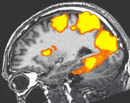
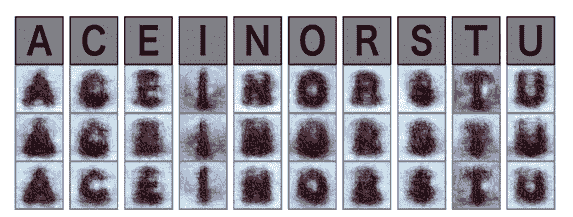
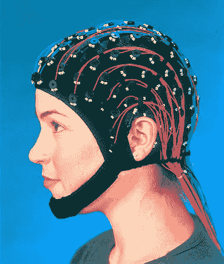
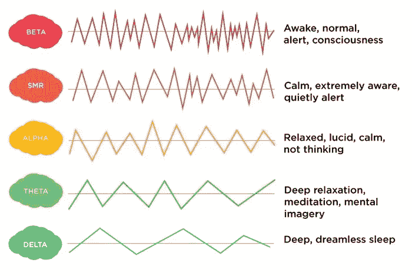
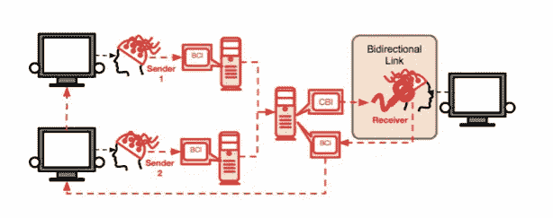

# 脑机接口读心术

> 原文：<https://medium.datadriveninvestor.com/brain-computer-interfaces-bdb927c48877?source=collection_archive---------15----------------------->

自从上个月我的第一篇关于一般敌对网络的文章以来，我对神经网络的兴趣一直持续着。在那篇文章中，我讨论了人工智能如何被用来生成原始图像。在这篇文章中，我将探索使用神经网络的另一种有趣的方式——提取信息，促进大脑和计算机以及其他大脑之间的交流。

你可能已经注意到，“读心人工智能”已经成为今年媒体的热门话题，从脸书探索技术的新闻到用你的想法写帖子，到埃隆·马斯克最近宣布他与 [Neuralink](https://interestingengineering.com/neuralink-how-the-human-brain-will-download-directly-from-a-computerhttps://interestingengineering.com/neuralink-how-the-human-brain-will-download-directly-from-a-computer) 的最新合作，这是一种植入头皮下的“神经系带”，使人能够与机器互动。

尽管最近围绕它的新闻不断，“读心术”技术实际上已经存在了几十年。有两种常用的方法来读取大脑模式——脑电图(EEG)和功能磁共振成像(fMRI)。然而，直到最近几十年，利用这些方法产生的数据还相当棘手。由于人工智能的进步，破译数据变得容易得多。这些方法的结合形成了所谓的脑机接口(BCI)。

**fMRI** 是两者中较新的发明。它通过跟踪整个大脑的血流来间接跟踪神经元的活动。当大脑特定区域的神经元活动增加时，该区域对氧气的需求增加，因此，流向该区域的血液增加以输送氧气。这种增加的血流量被 fMRI 检测到。这向我们展示了在特定时刻大脑的哪个区域在工作，这可以为大脑中发生的事情提供一些线索，然而，要弄清楚这个人在特定时刻到底在想什么并不容易。

进入神经网络。正如我在上一篇文章中所讨论的，神经网络是设计来模拟人类神经元活动的系统，并通过算法和训练集逐步改善任务。神经网络可以用来破译 fMRI 扫描中的模式，并将大脑活动的活跃区域与特定的思想或活动相关联。为了做到这一点，它需要接受数万或数十万次 fMRI 扫描的训练，并标记出当时正在发生的活动。例如，给它几幅功能性核磁共振扫描的图像，同时看一幅特定的图像。最终，它将能够自己识别在看图像时发生的大脑活动。

fMRI brain scan — side view

已经有一些很好的研究证明了神经网络和功能磁共振成像的使用。普渡大学的钟鸣·刘和他的团队训练了一个神经网络，从一个人正在看的 15 个选项(包括脸、鸟或飞机)中进行选择。为了让它能够做到这一点，他们在看这些东西的同时，用几次人脑活动的 fMRI 扫描来训练网络。成功率约为 50%，相当可观。

基于功能磁共振成像的脑机接口也已经被用于根据一个人在脑部扫描时正在观看的内容重建视频。加州大学伯克利分校的杰克·格兰特和他的团队通过记录受试者观看数小时电影预告片时的大脑活动来实现这一点。大脑活动与每个视频帧的内容相对应，然后用于训练神经网络。通过这一点，神经网络学会了根据记录的大脑活动预测某人正在观看的图像。下面是一个视频，展示了它产生的最准确的结果。如果你读过我之前关于生成性对抗性网络的帖子，你会发现这听起来很相似。在这种情况下，它实际上是一种不同类型的生成模型，但生成对抗网络确实已经在其他情况下使用，如[这项研究](https://www.biorxiv.org/content/biorxiv/early/2017/12/08/226688.full.pdf)，其中该系统用于基于 fMRI 输入生成图像和视频。

Movie reconstruction from human brain activity. Jack Gallant et al.

Yukiyasu Kaminani 也做了类似的工作，他在今年早些时候发表的一篇文章中，基于 fMRI 活动(下图)，使用神经网络重建了一个人正在看的字母的图像。卡米纳尼也用同样的技术研究了在梦中识别物体。

Alphabetical letter reconstructions. Top row show the images present to the participants. The other rows show the images generated by the neural network based on fMRI activity.

尽管使用功能性磁共振成像已经产生了惊人的工作，但仍有局限性。它贵得令人难以置信。这种方法本身(静止地躺在一个大机器里)对于日常使用是完全不切实际的。获得训练神经网络所需的数据量也很困难。

作为替代，脑电图(EEG)可以用来读取大脑模式。fMRI 记录的是基于大脑特定区域血流的大脑活动图像，而 EEG 记录的是真实的大脑信号。一顶覆盖着导电电极的帽子(类似于游泳帽，有下巴带)放在头皮上，记录神经元交流时发生的电流。

an EEG cap

追踪这些事件在图表上显示为波浪。脑电图中通常使用 5 种不同的脑电波(尽管还有很多很多)，它们都与不同类型的大脑活动相关联。

The 5 types of brainwaves. Source — [http://neurofeedbackalliance.org/understanding-brain-waves/](http://neurofeedbackalliance.org/understanding-brain-waves/)

脑电图已经存在了近一个世纪，但将其与神经网络结合使用极大地扩展了它的应用。脑电图有几个缺点，使它很难读取模式。首先，由于骨头是电的不良导体，头骨会干扰读数。由于来自其他活动的多余噪音，跟踪特定的大脑活动也非常困难。解决这个问题的一种方法是通过手术将电极植入颅骨下，使电极更接近大脑，这是脑电图的创造者汉斯·伯杰最初设计的方式，也是埃隆·马斯克正在他的新项目 Neuralink 中进行的工作，以神经花边的形式——一种超薄网格，直接植入大脑。这听起来很奇怪，但它已经在老鼠身上成功完成了。当然，对于大多数消费者来说，这在不久的将来很可能不是一个选项，但是侵入性较小的 cap 选项，加上良好的神经网络，可以提取有用的信息，并且对于消费者使用来说更加可行，并且已经产生了一些惊人的应用。基于脑电图的脑机接口已经被用于控制轮椅、神经假体、[无人机](https://www.newscientist.com/article/2180054-a-mind-reading-headset-lets-people-fly-drones-using-their-thoughts/)甚至人形机器人。

最近，BCI 越来越多地被研究用于游戏和社交媒体。去年，马克·扎克伯格在《脸书邮报》上写道:

*“我们正在开发一个系统，可以让你直接用大脑打字，速度比现在用手机打字快 5 倍左右。最终，我们想把它变成一种可以大规模生产的可穿戴技术。甚至一个简单的是/否的“大脑点击”都会让增强现实这样的事情感觉更加自然。*

似乎这还不够奇怪，脑机接口也被用来促进人脑之间的交流。华盛顿大学的 Rao 和他的团队创建了 BrainNet，这是有史以来第一个多人非直接脑对脑通信接口。这个界面允许三个人通过 BCI 交流来玩俄罗斯方块游戏。其中两人被分配了“发送者”的角色，向第三个人(接收者)发送指令，告诉他是否应该旋转俄罗斯方块。

接收者成功玩游戏的唯一方法是从发送者那里接收信息，因为他们可以看到俄罗斯方块堆在底部，而接收者看不到。

两个发送者戴着脑电图帽来传输他们的信号。大脑信号是由他们看着一个闪烁的 LED 灯产生的，这个 LED 灯显示“是”(旋转)，或者另一个显示“否”(不旋转)。观察这些迹象中的任何一个都会产生一个信号，该信号通过互联网被发送到神经网络并被其识别。

Brain-to-brain communication via BCIs andCBIs

神经网络将原始脑电图数据转换为单一命令，然后使用经颅磁刺激(TMS21)发送到接收器的视觉皮层。如果操作正确，发送者的“是”会在使用者的视觉中以光幻视(当你揉眼睛时出现的奇怪图案)的形式出现在接收者面前，而“否”不会产生足够的能量来触发光幻视。接收器还配备了脑电图，通过查看类似于发送者的 LED 是或否来执行旋转(或不旋转)俄罗斯方块的任务，然后神经网络再次接收并采取行动。他们设法以大约 70%的准确率完成了游戏，这是相当惊人的。

如你所见，阅读思想不再是科幻幻想。这正迅速成为现实。虽然这项技术仍处于相对早期的阶段，但它只能进一步发展，其可能性真的令人兴奋。能够把自己的想法储存在硬盘上，需要时再放回去。重温你的梦想并与他人分享。也许有一天我们甚至可以和动物交流！当然，和大多数技术一样，我相信你能想到很多潜在的负面影响，但不管怎样，我很期待看到它的发展。想想我们如何创造了一个模仿人脑的系统，然后用它来破译人脑，这也是很酷的。