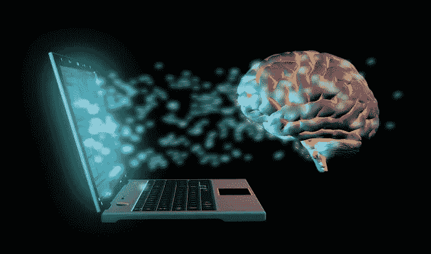
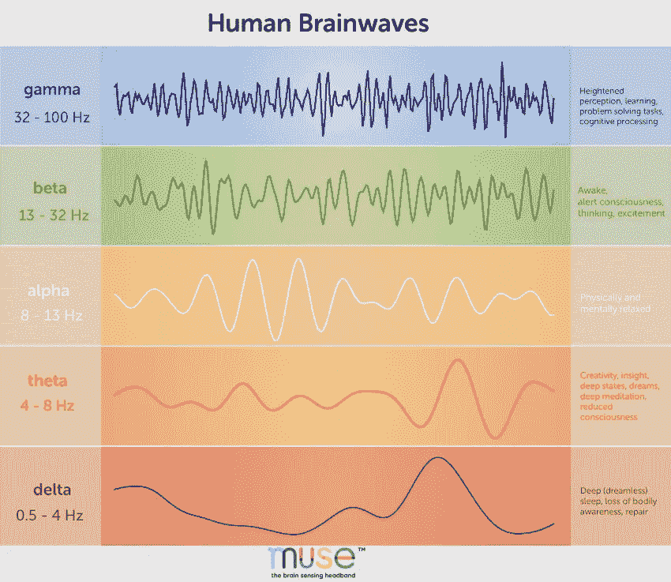
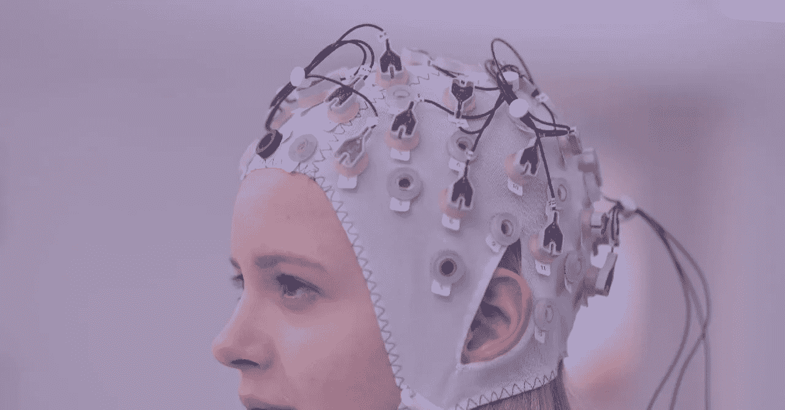
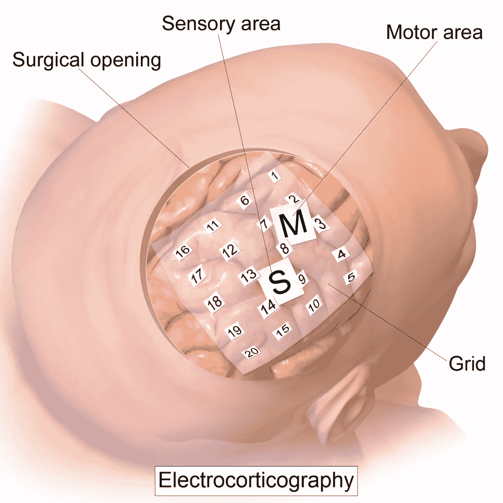

# 脑-机接口:人类进步的工具

> 原文：<https://medium.datadriveninvestor.com/brain-computer-interfaces-the-tool-for-human-advancement-1b8e20a4c6c0?source=collection_archive---------4----------------------->

如果我告诉你，只要想想，你就可以在任何时候出现在世界的任何地方，你会立刻想到一部科幻电影。随着脑机接口(BCI)的进步，这将很快成为现实！

# 什么是脑机接口？

一个脑机接口(BCI) 本质上是你的大脑和外部设备之间的一个通信通道。你的大脑可以通过两种方式与外部设备连接，侵入式和非侵入式。

当你执行一个动作时，你的大脑会发出脑电波，因为你的脑细胞(神经元)通过发送和接收微小的电信号来相互作用，我们将这些电信号视为脑电波。当执行一个动作时，你的大脑发出的脑电波被计算机解释，这就是侵入性和非侵入性技术读取你的大脑信号的方式。

 [## 模式和机器人:复杂的现实|数据驱动的投资者

### 哈耶克的名著《复杂现象理论》(哈耶克，1964)深入探讨了复杂性的话题，并断言…

www.datadriveninvestor.com](https://www.datadriveninvestor.com/2019/03/04/patterns-and-robotics-a-complex-reality/) 

在你的生活中，你做了这么多的动作，那么计算机如何正确地解释每一个脑电波呢？事实上，你的大脑只发出 5 种主要的不同类型的脑电波，正如你在上面的图片中看到的，伽马波，贝塔波，阿尔法波，西塔波和德尔塔波。

**执行一个动作时发出的脑电波被归类为五种主要脑电波之一。**

5 Different Types Of Brainwaves — By MUSE

伽马脑波在所有脑波中频率最高，因为这是一个你经常用脑的场景。例如，如果你正在学习人工智能及其对社会的影响，你的大脑会在这个动作中发出伽马波。

相反，δ脑波是所有脑波中频率最低的，因为你的大脑只会在你完全不用大脑的时候发出这种脑波。当你处于深度睡眠时，你的大脑会发出这种类型的脑波。

这两种类型的脑波是最高和最低频率的脑波，所有其他类型的脑波都介于两者之间。

# 无创技术是如何工作的？

不喜欢在大脑中植入芯片的人可以使用一种叫做**脑电图** ( **EEG) Cap** 的东西来与大脑交流。它的工作方式是在你的头皮表面周围放置电极，以检测当你头部的一组电子放电时产生的能量。

它有很多优点！首先，它有很高的时间分辨率。这意味着所提供的数据正在快速刷新，这对于获得大脑活动的最新结果非常重要。脑电图也非常有用，因为它们是一种相对便宜和安全的检查大脑活动的方法，而且非常容易使用，因为你所要做的就是把电极放在你的头皮上。

尽管优势惊人，但脑电图也有一个主要的缺点，那就是它的空间分辨率**很低。**脑电图的空间分辨率很低，因为大脑中的一组电子正在被激发，大脑帽无法准确定位信号的来源。

脑电图是一种廉价、安全、无创的检查大脑活动的超级有效的方法。

# 侵入性技术是如何工作的？

侵入性技术是一种需要将电极放置在颅骨内而不是颅骨上的技术。最常见的侵入性技术之一是皮层脑电图(ECoG)。ECoG 是一种使用放置在大脑表面的电极来测量大脑电活动的方法。

它是侵入性的原因是它需要一种叫做开颅术的手术。开颅手术是从颅骨中取出部分骨头以露出大脑的外科手术。需要进行开颅手术的原因是电极需要放置在大脑表面。

ECoGs 超级牛逼！它有很高的空间分辨率，这意味着它能非常有效地精确定位信号来自大脑的哪个部位。ECoG 还具有非常高的时间分辨率，这意味着它能以快速和刷新的速度提供数据。

ECoGs 在监测大脑活动方面有很多优势，人们唯一的缺点或不适可能是通过手术在你的大脑中植入电极。

# 使用脑机接口的公司

BCIs 的当前和未来用途非常令人兴奋，以下是一些大公司目前正在做的和希望利用这项惊人技术做的事情:

**神经链接**

[Neuralink](https://neuralink.com/) 是埃隆·马斯克(Elon Musk)旗下的一家公司，埃隆·马斯克认为人类在未来 50 年内被 AI 和机器接管的时间太早了。他对 Neuralink 的目标是将我们人类的思维与机器融合，目标是让人类领先于人工智能。

Neuralink 正在使用一种名为 Neural Lace 的技术，这是一种植入颅骨的超薄网格，形成了一个能够监控大脑功能的电子体。最终，Neural Lace 希望能够从计算机上传或下载信息。这项技术是为了让人脑从电脑上下载信息，从而加快我们的学习速度。

**缪斯**

[MUSE](https://choosemuse.com/how-it-works/) 是一家生产多传感器头带的公司，它可以提供关于你大脑活动、心率、呼吸和身体运动的实时反馈，以帮助你建立一致的冥想练习。

MUSE 头带是一种脑电图设备，被世界各地的神经科学研究人员广泛使用。MUSE 是一种安全有效的方法来测量你的大脑活动。你可以用这个头带来帮助科学实验，一直到它的主要目的，帮助你建立一个持续的冥想练习。

我可以亲自告诉你，MUSE 是一家令人难以置信的公司，做着令人惊叹的事情，因为我在 2019 年 Elevate Tech Fest 上见到了创始人兼首席执行官 Ariel Garten。

A picture with the founder and CEO of MUSE, Ariel Garten

**Neuropace**

Neuropace 是一家以预防癫痫为目标的公司。该公司使用一种 RNS 系统，该系统由一个小型的可植入神经刺激器组成，该神经刺激器与放置在大脑中两个癫痫发作区域的微小电线相连。

RNS 系统监测您的脑电波，同时寻找异常活动，然后检测癫痫发作时大脑产生的电模式，并通过向大脑发送脉冲做出响应，以使脑电波正常化，防止癫痫发作。它是安全的，因为不需要移除脑组织来实施该系统。

这些只是少数几家公司正在用脑机接口的惊人技术做着不可思议的事情！

# 关键要点:

*   不同类型的脑电波被用来了解我们大脑内部的情况
*   有两种不同的技术用于监测我们的脑电波，侵入式和非侵入式
*   这个技术只是在进步！现在许多公司都在使用这项技术，许多其他公司也在寻求在他们的产品中使用这项技术

***如果你喜欢这篇文章:***

*   ***分享给你的人脉***
*   ***关注我的***[***LinkedIn***](https://www.linkedin.com/in/krish-chandarana-25a197177/)***，***[***Twitter***](http://twitter.com/krishchandarana)***，以及*** [***中型***](https://medium.com/@krishchandarana) ***随时更新我在 AI 和 BCI 的进展！***
*   **查看我的网站** [**这里**](http://krishchandarana.com/)