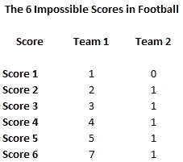

# 脑筋急转弯:大学足球只有六个不可能的比分

> 原文：<https://medium.datadriveninvestor.com/brain-teaser-there-are-only-six-impossible-scores-in-college-football-ba83ac6013e2?source=collection_archive---------2----------------------->

大学足球有一些不寻常的得分方式。其中一个选项以前从未出现过。

Photo by [Brayden George](https://unsplash.com/@bgeorge9803?utm_source=medium&utm_medium=referral) on [Unsplash](https://unsplash.com?utm_source=medium&utm_medium=referral)

由于加班规则，平局是不可能的，所以我在计算中排除了所有平局。这种计算取决于游戏在完成之前没有被“叫停”，例如，游戏在第三季度由于恶劣天气而被叫停。这一计算也不包括由于人的能力限制而不可能得到的分数。例如，1，000，000，000，000 到 0 的分数不会被考虑，因为人类的寿命不可能达到这样的分数。无限到零也被排除在外，因为这在数学上是不可能的。

考虑到这些排除在外的情况，下面是大学足球中不可能出现的六个比分。

Table of impossible football scores.

大学足球没有其他不可能的比分。我知道你一定在想什么。怎么会有 1 分？仅仅因为它从未发生并不意味着它是不可能的。

 [## 跑步摆脱疯狂:锻炼如何提高你的生产力|数据驱动的投资者

### 没有比锻炼更好的方式来开始一天的工作了。我试着一周至少做四天，在…

www.datadriveninvestor.com](https://www.datadriveninvestor.com/2018/10/23/running-to-get-rid-of-the-crazy-how-working-out-increases-your-productivity/) 

大学橄榄球赛中最常见的得分方式是触地得分。触地得分给一个队 6 分。大学足球中第二常见的得分方式是尝试后得分(PAT)。轻拍会给一个队 1 分。触地得分后才允许在比赛中轻拍。触地得分后的另一个选择是两分转换。它会给一个队 2 分。一次成功的射门会给球队带来 3 分。另一种得分方式是[安全](https://en.wikipedia.org/wiki/Safety_(gridiron_football_score))。

安全是事情开始变得不寻常的地方。一般安全给一个团队 2 分。其他评分方法只能以一种方式进行，而传统安全可以通过三种不同方式中的任何一种进行评分。持球者在自己的端线区被拦截或被逼出界。球在端区变得死气沉沉，除了一个不完整的向前传球，防守队要对它在那里负责。违例者在自己的端线区域内受罚，例如故意停飞。

转换安全是另一种类型的安全。如果一个队试图拍球，但球被阻挡并回到了进攻方的本方区域，这就是转换安全。辩方得到 2 分。还有另一种类型的转换安全称为单点安全。一分安全分为进攻和防守两种。进攻型一分安全，只知道在大学足球历史上发生过几次。还没有已知的防御性单点安全事件发生过。有趣的是，在 2004 年之前，还没有出现过进攻型单点安全的例子。我怀疑互联网是造成这种情况的原因。通过轻松地浏览任何类型的信息，粉丝们发现了这个模糊的规则。因此，这个问题在 2004 年的一场足球比赛中首次被提出。

进攻一分安全的一种得分方式是防守方挡住进攻方的拍子，把球追回来，只是在自己的端区把球摸索出来，把球追回来。请看下面的视频，这是一场德克萨斯对德克萨斯 A&M 的比赛。即使是 ABC 体育的播音员也不知道这一分的安全性，并认为裁判犯了一个错误。

This is a video from YouTube of an offensive one-point safety.

防守的一分安全是最有趣的。这在以前从未发生过。从理论上讲，这可能发生在 PAT 受阻的情况下。防守球员可以捡起球，跑到对方的端线区，以获得两分的安全。在到达终点区前几码，防守队员将球脱手。一名追赶的进攻球员捡球，但由于动量，球被带到了端区，并在端区被拦截。那将是防御性的一分安全。这也是为什么一个球队有可能只有 1 分的成绩。

It 不可能有 1 比 0 的比分，因为一分安全只能靠轻拍得分。对于 2 比 1 和 3 比 1 也是如此，因为分别在常规安全或射门得分后没有 PAT。4 比 1 是不可能的，因为 4 分只能在两个常规安全发生后出现。5 比 1 是不可能的，因为它只能发生在一次射门和一次常规安全之后。6 比 1 *是可能的*，因为进攻方可以触地得分，然后防守方可以安全得分 1 分。7 比 1 是不可能的，因为一个队只有成功踢一拍触地得分后才能到 7。防守型 1 分安全只有在轻拍不成功或者 2 分转换不成功的情况下才会出现。

如果其他人有什么不可能的分数，请放在评论里。我想不出另一个了。今年我会留意难以捉摸的防守一分安全。我很想看到阿拉巴马以 99 比 1 的比分击败奥本。