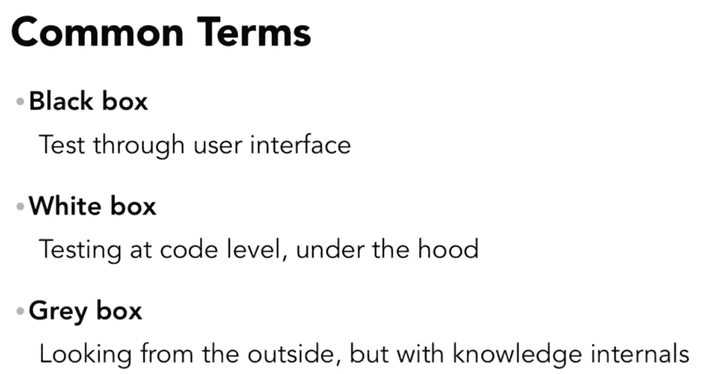
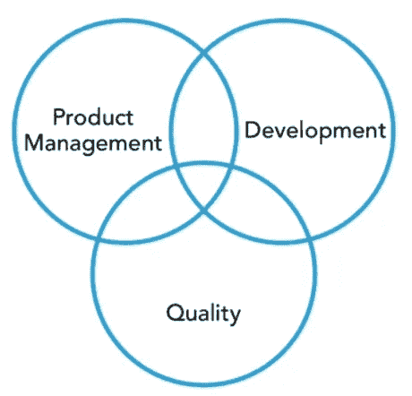

# 软件质量保证头脑风暴-1

> 原文：<https://medium.datadriveninvestor.com/brainstorming-on-software-quality-assurance-1-1a467fd48457?source=collection_archive---------28----------------------->

Photo by [NESA by Makers](https://unsplash.com/@nesabymakers?utm_source=medium&utm_medium=referral) on [Unsplash](https://unsplash.com/?utm_source=medium&utm_medium=referral)

当我们开始考虑质量和什么对我们的特定项目最有利时，对我们计划做什么和为什么做有一个看法是一个好主意。现在，这个问题的正确答案在整个行业中众说纷纭。一些人认为开发应该从编写测试开始，而另一些人认为只有当功能相当成熟时才需要开始测试。

不管我们认为什么时候是开始正式测试的合适时间，在我们的周期中尽可能早地包括每个对质量负责的人总是明智的。这些人对我们的目标越熟悉，他们就越容易确定最佳的测试策略。理想情况下，将集中于早期测试，并经常在 bug 一出现就识别它们。重要的是要记住，我们越早了解问题，解决问题就越容易。

让我们举一个例子，它完全远离软件开发，但是仍然包含一些早期合并测试的原则。现在，当我们建造一所房子时，我们需要蓝图、材料、组装人员以及负责管理整个项目的人。在我们开始之前，我们通常会申请许可。然后我们会沿途进行一些检查。比方说，我们已经有了房子的基本框架，一名电工开始铺设电线，这些电线最终将被隐藏在墙内。

并且这一系列步骤中的其他任何事情都不会受到影响。事实上，我们会节省相当多的时间和金钱。如果我们在每一步都完成后才发现问题，为了解决它，可能有很多事情要做。这种哲学适用于软件，并且应该被接受。尽早发现并修复的错误解决起来成本更低。

更是一种运营效率的实践。我们不仅努力实现功能，而且还专注于确保它们的实现方式符合我们的总体质量目标和用户的需求。

> **软件开发中的传统学科**

当我们听说质量工程师时，经常会听到定义个人角色和职责的子类别。我们知道，有许多不同种类的测试和策略来确保我们的产品满足一定的质量标准。这是我们在开始寻找人员担任特定角色之前想要了解的事情。我们最常听到的术语是黑盒、白盒和灰盒测试。

黑盒通常是指通过用户界面测试应用程序。

当测试将在代码级别完成时，使用白盒，我们在代码级别验证正在发生的一切。

最后，当我们的测试是两者的混合时，使用灰色框。我们从外部关注应用程序，但是我们对其内部有一些了解。

让我们假设一个项目有三个核心规程。产品管理通常是我们确定业务目标的地方。研究的目的是定义目标用户、他们的需求，以及需要构建什么来满足这些需求。开发是我们获取那些业务需求，从工程角度确定满足它们的最佳方式，并继续构建我们的产品。质量保证是我们将要努力的地方，以确保我们正在建造的东西符合我们所有的目标。

说到质量，不仅仅是关注确保产品的功能性。我们正在验证该产品是否真正满足我们用户的需求，并且从工程的角度来看，它正在以我们设定的方式进行。现在，我坚信整个项目的所有权在这三个学科之间平均分配。会有一些重叠。这并不意味着存在固有的冗余，而是整个项目的某些部分可能会被具有不同观点的多人所关注。

既然我们在本课程中关注的是质量，那么让我们看看质量学科与其他学科重叠的领域。如果我们看这里，我们会看到有一部分质量与产品管理重叠。当我们听到黑盒测试这个术语时，这是我们应该考虑的领域。与一些人可能让我们相信的相反，它不是一个纯粹手工测试来确保 UI 元素功能的功能。不仅仅如此。这是质量规程与我们的业务目标相交的地方，以确保它们得到满足。

> **黑盒测试**

黑盒测试是讨论质量保证时最常用的术语之一。这种测试方法的基本原则是关注功能，而不看内部。它是从用户界面看我们的产品并像用户一样与之互动的过程。根据定义，这种类型的测试对较低层次上发生的任何事情都没有任何特别的关注。这个术语来源于这样一个概念，如果我们有一个完全密封的黑匣子，我们将无法看到里面的东西。因此，我们只对我们可以利用的外部进行工作，对于我们计划测试的任何东西。

一个常见的误解是，黑盒测试人员只被给予手动任务，其中按钮被点击以确保它们产生特定的结果。实际上，这个术语并不意味着这个角色本质上是纯手工的。黑盒测试人员完全可以拥有技术技能，并执行需要脚本知识的自动化任务。该术语用于表示我们将从外部观察产品的每个测试用例。不管这些具体的职责是什么，一个好的黑盒测试人员应该了解我们的应用程序的所有部分是如何组合在一起的。

> **白盒测试**

White box Testing

W **白盒，**正如我之前提到的，最好将白盒测试视为与开发紧密结合。那是因为这是一个非常技术性的角色。有时被称为测试中的软件开发人员，这个人将专注于代码级别的测试。通常，他们会有其他与测试相关的职责，但可能不会专门测试我们的应用程序。术语“白盒”意味着容器是完全透明的，我们将能够专注于内部。白盒测试人员根本不会关心应用程序的 UI 或者整体可用性。

相反，他们将与开发人员密切合作，以确保他们编写的测试验证了所有的交互和行为，最终产生了呈现给用户的功能。假设我们正在构建一个计算器。将会有代码来定义数学运算是如何运作的。我们的白盒工程师将关注每个输入返回的期望值。会有很多可能的输入和结果。因此，这种能力的测试人员的任务是系统地分解这些可能性，找到一种策略来测试我们的计算器的每个组件都按预期运行。

> **灰箱测试**

Gray Box testing

让我们谈一点关于灰盒测试和它是什么。就像我们其他的盒子隐喻一样，我们可以通过从测试的角度想象一个测试人员接近一个盒子来形象化这一点。只有在这种情况下，它是半透明的，这允许对应该执行的测试用例以及结果的含义有更深入的理解。我在前面提到过，人们经常把灰盒测试作为黑盒测试的一个过渡点，关注点开始变得更加技术化，不再仅仅关注用户界面上的应用程序。

这是一个关键的区别。很多时候，当我们听到一个质量经理寻找具有灰箱技能的测试人员时，他们希望增加他们团队的技术知识。他们的内部目标可能是在他们的黑盒测试人员中促进灰盒技能的发展，这是一个真正的优势。我们需要记住的是，产品的交付方式使产品更容易到达用户手中，找到使用我们产品并提供反馈的人并不困难。

黑盒测试人员可能只关注与表单交互的测试用例，以及从 UI 获得的反馈。如果一切都按预期进行，那就太好了。但是，如果他们在表单中输入所有适当的信息，单击 submit，但什么也没有发生，该怎么办呢？嗯，灰箱测试人员可能会使用类似 web 调试器的工具来监控应用程序发送的内容，然后寻找有效的服务器响应。他们可能会看到，当他们单击提交按钮时，请求是从客户端发出的，但没有来自服务器的响应。

这一点很重要，因为它有助于准确识别问题发生的位置，在本例中是后端。他们也可能使用这样的工具来修改服务器响应，并验证客户端在不同情况下的行为。这些只是灰盒测试用例可能看起来的一些小例子。但是 ***重要的*** 要点是，在这一级别的测试中，您将扩展您的视野来窥视应用程序的内部，这最终会让您更好地理解问题可能发生在哪里，并提高您更准确地报告这些问题的能力。

感谢阅读。祝你阅读愉快。

> 注意:-我已经尽力总结了这个[学习参考](https://www.lynda.com/Developer-Programming-Foundations-tutorials/Welcome/126119/146201-4.html?srchtrk=index%3a1%0alinktypeid%3a2%0aq%3aProgramming+Foundations%3a+Software+Quality+Assurance%0apage%3a1%0as%3arelevance%0asa%3atrue%0aproducttypeid%3a2)。

*原载于 2019 年 1 月 8 日*[*medium.com*](https://medium.com/@erpragatisingh/brainstorming-on-software-quality-assurance-1-e77f4c86f8b9)*。*