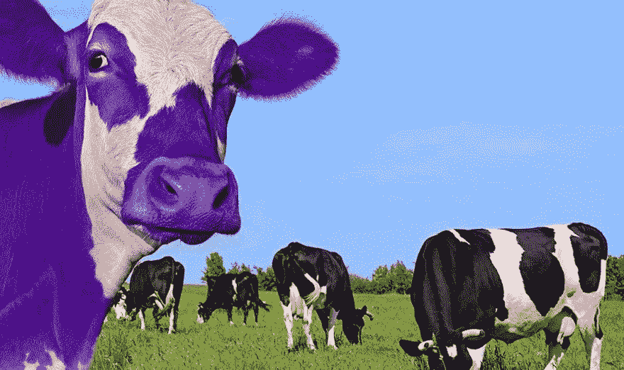

# 品牌营销人员跟上。AI 是新的电视！

> 原文：<https://medium.datadriveninvestor.com/brand-marketers-keep-up-ai-is-the-new-tv-12cbe8d8639c?source=collection_archive---------4----------------------->

不久前，为了建立一个成功的品牌并销售大量的商品和服务，有一个公式:

1.  打造人们需要的产品。
2.  把你的钱投入电视广告，你会看到销售额上升。
3.  再投资你的利润在电视广告和重复。

货架上的产品有一个标签“在电视上看到的”！

 [## 人工智能与创造力:作为创意引擎的比根——数据驱动的投资者

### 的确，2018 年可以被视为人工智能创造的创造力全盛时期的开始。当然可以…

www.datadriveninvestor.com](https://www.datadriveninvestor.com/2019/02/13/ai-creativity-biggan-as-a-creative-engine/) 

电视被炒作的很酷。更重要的是，这是一个巨大的扩音器。品牌拥有前所未有的影响力。一个直接的结果是，他们实现了全球规模。几乎所有在上个世纪取得突破的主要品牌(可口可乐、通用电气、麦当劳等)都是在电视广告上取得成功的。

但是事情已经改变了。

首先，市场已经饱和。消费者的大部分(如果不是全部)基本需求得到了满足。我们不再购买是因为我们“需要”这些产品，我们购买它们是因为它们让我们“感觉”如何。

第二，我们比以往任何时候都更忙。消费者的注意力在不断转移。我们没有时间做广告(尤其是电视广告)。人们没有时间去思考和比较 89 种不同洗发水中哪一种更好洗，他们会选择最有吸引力的包装或闻起来更好的。

结论是，只有当消费者“情感上容易接受”时，营销者才能够展示他们的广告。

幸运的是，随着向移动的转变([移动网络使用首次超过桌面](http://www.telegraph.co.uk/technology/2016/11/01/mobile-web-usage-overtakes-desktop-for-first-time/))，我们产生了大量可以利用的信息。新的计算系统和人工智能使得能够创建能够理解海量数据的系统，产生激光聚焦的个性化，并实时提供给非常庞大的人口。

智能系统可以通过不同方式帮助改善广告投放:

**理解世界上所有的噪音**

如果用户的性别是可获得的信息，那么对于系统来说，在显示“美容产品广告”和“妊娠测试产品广告”之间进行选择的决定会更容易。但是如果你有一个关于汽车、电影、健康产品、金融服务的完整的广告清单呢？

问题突然变得更加困难。你需要更多的信息来做出好的决定。与此同时，随着数据越来越多，你的选择也呈指数增长。例如，了解消费者的城市将增加可供选择的可能选项:只需添加英国的 69 个城市作为数据源，就可以将可能性从少数(男性或女性)增加到 69 个城市和男性或女性之间的所有可能组合(即 138 个选项)。如果我们加入其他信息来源会怎么样:客户使用的是什么类型的手机？现在是几点了？他们多大了？他们的交往史是怎样的？要为每个用户考虑数百万个选项。

被称为“非线性”方法的机器学习(人工智能最大的分支之一)可以帮助理解交互。这些方法与最新的云计算技术相结合，有助于从总体噪音中提取所有信息之间的相关交互。

**·完成您的数据**

通常，很难获得关于消费者的数据。人工智能可以帮助我们的数据库中的所有消费者“推断”这些信息。例如，当我们拥有数据时，我们可以了解男性和女性用户的特征(他们使用不同的应用程序，他们以不同的方式与相同的内容交互……)，并根据之前建立的模型预测新用户的性别。

然后，这个新的“预测性别”可以用作做出决策的主预测引擎的输入。

**扩充您的数据**

人工智能的其他技术可以用来学习有助于瞄准的“元数据”。自然语言处理(NLP)使机器能够理解人类语言。不仅是单词，还有上下文。像 NLP 一样，图像识别是另一套使机器能够理解图像的技术。这些强大的能力可以用来提取新的特征，以增强人工智能的瞄准能力。

*这些算法的输入可以是你的广告活动的书面描述、照片和视频、关于你的品牌的社交媒体帖子，甚至是新闻报道和从互联网上删除的文章。输出将是对模式和相关性的深入理解，当涉及到与广告的交互时，这些模式和相关性可用于预测用户行为。*

**·发现最佳交付媒介**

人工智能可以用作顶层，优化在不同媒体上运行的活动的支出。你应该给脸书广告、谷歌广告、Youtube 广告、程序化广告分配多少？在每种媒体中，有多少分配给你正在运行的不同格式？答案可能会因结果而异。

如果我们考虑到结果也会随着时间的推移而变化(特别是对于经验丰富的企业)，我们可以很快看到使用机器智能和适应性来保持我们的活动始终优化的优势。

**·过滤欺诈性流量**

机器人，远程操作的巨大计算机网络，正在模仿人类的在线行为，并被用来产生广告收入，有时主要是由恶意的人。

众所周知，这种做法是行业的一大瓶颈。数字广告欺诈在数字广告上花费的每 3 美元中占 1 美元，据估计，2016 年全球在线广告商因机器人而损失 72 亿美元！

通过教导 AI 正常流量应该是什么样子，欺诈性流量可以被标记出来。算法可以捕捉意外事件并即时过滤它们(用户在每天的特定时间点击同一广告超过 80 次？？？可疑的…)并且可以学习对抗自动进化的欺诈技术。

**产生洞察力**

除了对哪种媒介起作用以及作用程度的洞察，人工智能的使用还能发现关于客户的有意义的洞察。它可以解释为什么某些观众会以某种方式表现，并揭示新的意想不到的特殊客户。

所有这些信息都可以被品牌用来创造更好的故事，提炼他们的信息，并用相关的信息个性化客户提供。

但要完全释放人工智能的力量，还需要解决一些问题:

**用户隐私**

使用人工智能需要存储大量关于用户的数据。匿名化(针对受众层面，而不是个人层面)，保护它(针对数据持有者的网络攻击很常见)也是基本的商业做法。

**《终极货币》注意事项**

用户不希望被打断。我们都讨厌弹出来的广告！即使内容针对性很强，创意也是关键。营销人员应该转向新技术来增强用户体验。

聊天机器人、语音交互都是可以嵌入广告本身的新技术。

**结果的可解释性**

大多数强大的机器学习技术都是“黑盒”模型。用于获得高精度的参数和特征的数量对于我们的三维大脑来说是难以理解的。

换句话说，我们可能不知道确切的模型内部和外部是如何工作的，但我们了解创建它的学习算法。即使学术界做出了令人难以置信的努力来增强我们对这种技术的理解，仍然有很长的路要走。

**数据质量和可用性**

人工智能和你输入的数据一样聪明。数据质量至关重要。在移动世界，与人工智能提供商直接关联的出版商将提供最可靠的数据。数据的数量也很重要。

人类的大脑是一个令人着迷的东西，一个孩子只要给他看三次同一张图片就能学会认出一只老虎。但是要训练一个 AI，你需要数百万个数据点才能有好的结果。这就是为什么科技巨头正在主宰这个领域。谁最适合建立一个可以进行人脸识别的人工智能？当然是脸书。他们的数据库中有超过 10 亿张人脸。

使用哪些指标？

如今，营销人员使用的指标包括 CTR(点击率)、VCR(视频完成率)等。使用人工智能来优化这些指标在最好的情况下是次优的，在最坏的情况下是完全的浪费。70%的视频完成率如何转化为你让用户了解你的提议？3%的点击率如何让你知道你在多大程度上推动了用户购买？

人工智能应该用来优化有意义的指标:品牌认知度、考虑因素、购买意图、客流量……这些都可以通过询问用户来衡量。在“数据柔术”中，DJ Patil 认为，如果做得正确，可以让用户提供更多有用的高质量数据。在移动世界的背景下，在向用户展示广告之前和之后，调查用户样本有助于量化这些指标。使用某种抬升模型，可以进行优化。这正是像 LoopMe 的 [PurchaseLoop](https://loopme.com/purchaseloop/) 这样的产品试图实现的目标。

最后，人工智能无疑是一个神奇的工具。它正在改变我们生活的核心。这种变化可能是潜在的，但其数量级比用户感知的要高。尽管如此，它只是一个工具。只有当营销信息切中要点时，它才能提供结果，当产品是“紫色奶牛”时，它可能成为病毒式传播的平台([用塞思·戈丁的话说](http://www.sethgodin.com/purple/))。

只有当创意传达出品牌的“为什么”时，人工智能的全部潜力才能得到充分发挥。这是数字时代分销问题的最终解决方案。这是唯一能让我们更接近圣杯的方法:信息会在正确的时间，在正确的地点，当用户处于正确的精神状态时到达用户手中。