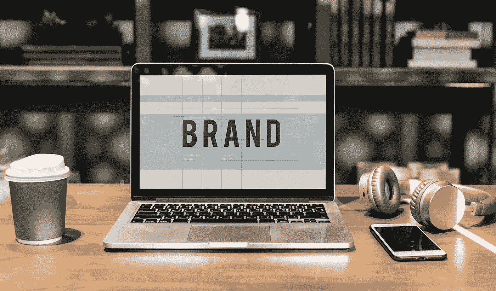

# 为健康和娱乐市场打造 CBD 品牌

> 原文：<https://medium.datadriveninvestor.com/branding-driven-growth-for-cbd-in-the-health-and-recreational-markets-fb02c7a4fb5e?source=collection_archive---------9----------------------->

丁然是新兴的大麻和大麻二酚产业的重要组成部分。但美国的法律准则限制了这种品牌的创造性。然而，对于创造以大麻衍生的 CBD 为特色的产品的公司来说，品牌的可能性要大得多。例如，在 2018 年农场法案之前，夏洛特网和钻石 CBD 都能够将产品投放市场，并开始在全国范围内建立品牌。这让夏洛特的网和钻石 CBD 在拥挤的领域里有了先机，也让他们可以更自由地为新兴的国内市场品牌化他们的产品。理解每家公司采取不同品牌策略的原因有助于理解每家公司成功的原因。

尽管 2018 年农业法案为大麻衍生的 CBD 提供了多种选择，THC 高达 0.3%，但大麻和含有大量 THC 的 CBD 产品在联邦层面上仍然是非法的。除了无法在全国范围内做广告之外，在特定州运营的 THC 产品公司还有不同程度的回旋余地，因此人们可以在特定的本地市场看到相当多的创造力。但是，CBD 行业的两家领先公司已经基于大麻衍生的 CBD 产品的合法性建立了国家品牌。

> [DDI 编辑推荐——给新手的投资建议](http://go.datadriveninvestor.com/invest1/matf)

# 夏洛特的网和钻石 CBD

在许多层面上，夏洛特的网络控股公司(CSE: [CWEB](https://www.bloomberg.com/quote/CWEB:CN) ，OTCMKTS: [CWBHF](https://www.bloomberg.com/quote/CWBHF:US) )在美国拥有最强的 CBD 品牌，其销售额证明了这一点。夏洛特的网站专注于 CBD 作为一种健康产品，THC 高达 0.3%。这限制了全国范围内某些方面的增长，但他们能够在药用大麻合法化的州之外运作。

钻石 CBD 是 [PotNetwork Holdings，Inc.](https://www.potnetworkholding.com/) ( [OTCMKTS:POTN](https://www.google.com/search?tbm=fin&q=OTCMKTS:+POTN&stick=H4sIAAAAAAAAAONgecRowS3w8sc9YSn9SWtOXmPU5OIKzsgvd80rySypFJLmYoOyBKX4uXj10_UNDZMsLLIq47MyeADYzeZ3PQAAAA&sa=X&ved=0ahUKEwie4eW7q63cAhXDdN4KHRqxAiEQlq4CCDIwAA&biw=1366&bih=672) )的全资子公司，采取了可以被称为休闲 CBD 的方式。他们使用大麻衍生的 CBD，不含 THC，这给了他们比夏洛特网更大的经营空间。他们对娱乐用途的关注导致了更广泛的有趣产品，这些产品的包装方式比人们在《夏洛特的网》上看到的更加丰富多彩。

两家公司都受益于 2018 年的农业法案，因为高质量的大麻现在将更广泛地供应，消费者对 CBD 好处的认识现在也高得多。但是由于他们对医疗和娱乐目的的强调不同，每个人都会以不同的方式受益。看看每一个如何处理基本的品牌概念揭示了这些差异。

# 品牌原则和 CBD 产业

品牌从确定谁是消费者开始。在夏洛特网站的案例中，消费者基础集中在健康问题上。相比之下，钻石 CBD 更侧重于休闲娱乐消费者。

品牌的四个具体原则有助于说明每家公司如何通过建立对身份和价值的清晰认知来满足其消费者群的需求:

*   目的
*   交付
*   共振
*   差异

目的意味着确定谁最有可能购买产品，并帮助公司专注于什么将获得他们的预期消费者的注意。它回答了以下问题:

*   品牌的功能目的对某人有什么作用？
*   它满足了需求吗？
*   对情绪有影响吗？
*   品牌能肯定一个人的任何东西吗，比如独立、快乐或健康？

从夏洛特网[大麻提取物](https://www.cwhemp.com/all-charlottes-web-hemp-cbd-supplements/cbd-oils)的产品页面可以看出，对健康问题的重视导致包装有些平静，并在包装上以可见的文字形式包含了相当多的信息。

相比之下，钻石 CBD 的 [CBD 油选择](https://www.diamondcbd.com/collections/cbd-oils)提供的产品更加丰富多彩，而具体的产品信息却更少。好奇的消费者可以在网站上获得更多信息，但是，鉴于产品是面向娱乐用户的，大多数产品不会被强调具体细节的包装所吸引。在一些，人们被告知产品是什么，他们是 100%天然的。

交付涉及产品本身的使用体验，赋予产品个性。它包括网站的外观和感觉、产品包装、销售地点和使用的清晰性。交付与目的密切相关，并导致上述包装的差异。

共鸣是指以消费者愿意支付的价格满足需求。产品必须有意义和相关性。如果一个品牌声音插入一个情感奖励，那么这个品牌声音的共鸣就变得强烈。品牌与它满足的购买者的情绪状态有关。

差异是指品牌差异化的程度，从而具有竞争优势。它比任何其他竞争对手都更好地实现了其类别的目标。它适应不断变化的景观，同时保持其价值和意义。

如果人们关注每个品牌的共鸣，就会发现夏洛特的网和钻石中心的区别。夏洛特的网络产品旨在引起寻求健康益处和平静状态的顾客的共鸣。包装相当低调却精致。相比之下，钻石 CBD 的包装引起了休闲消费者的共鸣，他们对 CBD 的放松效果感兴趣，但也在寻找适合愉快体验的产品。这种差异导致包装传达一种更乐观的感觉，同时呈现一种合法性的空气。

# 成功的品牌

当一个人比较夏洛特的网和钻石 CBD 之间的品牌差异时，你会发现成功的公司与他们的目标受众进行了清晰的沟通。用吸引人的包装展示自己的产品是不够的。这种包装还必须与预期的消费者沟通，这样他们就能认识到，不需要太多有意识的思考，产品就是为满足他们的需求而设计的。两家公司都提供了如何实现这一目标的独特例子。