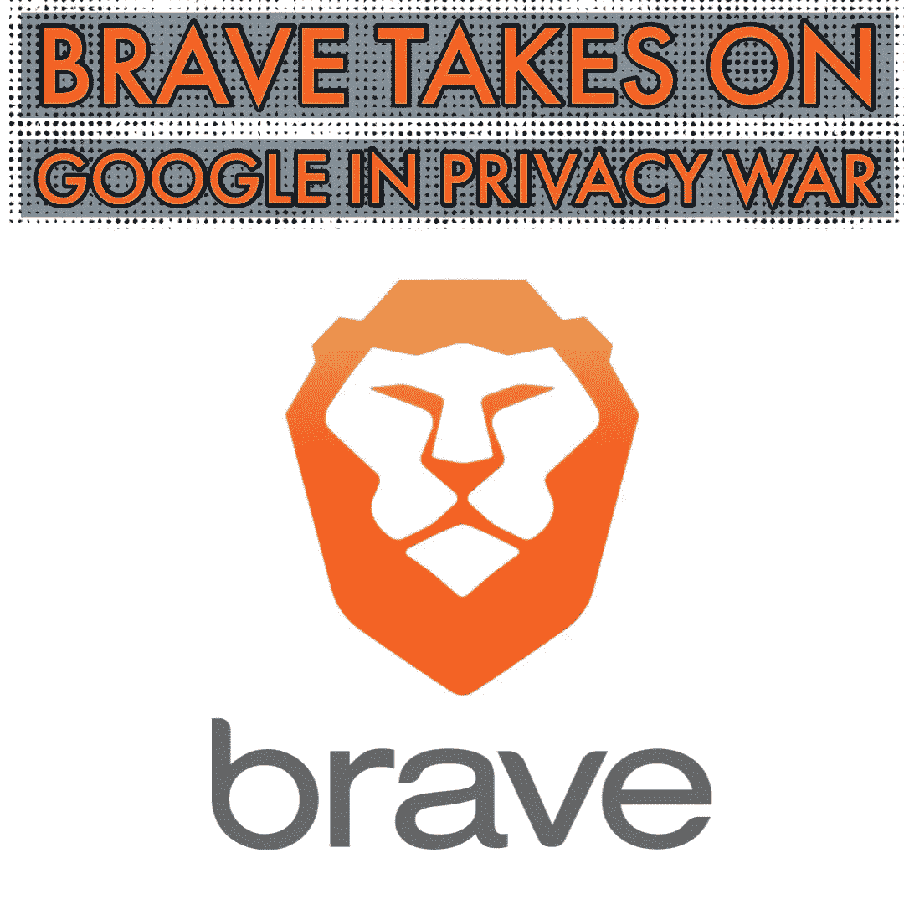
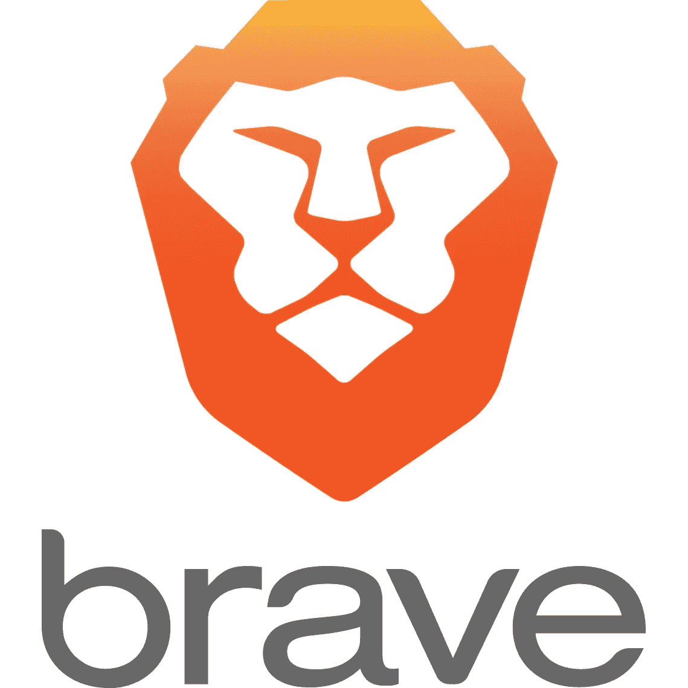
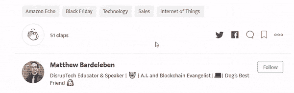

# 勇敢的浏览器在隐私战中挑战谷歌

> 原文：<https://medium.datadriveninvestor.com/brave-browser-takes-on-google-in-privacy-war-ddd3af01bfd9?source=collection_archive---------11----------------------->

勇敢浏览器的创造者们非常重视隐私。以至于他们愿意与谷歌为之而战。

> 对于那些不熟悉的人，Brave 是谷歌 Chrome、Mozilla Firefox、Safari 等浏览器的免费替代品。要了解更多信息，我推荐这个 3 分钟。阅读'[为什么我 90%的时间使用勇敢浏览器……](https://mattybv3.wordpress.com/2018/09/08/brave-browser-to-support-chrome-extensions/)'或者只是[免费下载并亲自试用](http://bit.ly/MBv3Brave)。

( **E *dit***

## 勇敢& Qwant vs 谷歌搜索

网络浏览器通常默认选择谷歌作为他们的搜索引擎。你可以在浏览器设置中改变这一点，但大多数人从来不这样做。实际上…大多数人甚至不知道除了谷歌之外的搜索引擎的存在。这就是为什么 Brave 决定在法国和德国使用 Qwant 作为默认搜索引擎，而不是谷歌，这是一件大事。

根据维基百科的说法，Qwant 宣称自己是“尊重你隐私的搜索引擎”，并“声称不使用用户跟踪，也不会对搜索结果进行个性化处理，以避免让用户陷入过滤泡沫”。

换句话说，Qwant 声称不会跟踪你，建立你的心理档案，然后只给你你可能同意的内容……这是谷歌、脸书等公司的主要商业模式。

虽然比起 Qwant，我还是更喜欢以隐私为中心的搜索引擎 [DuckDuckGo](https://duckduckgo.com/) 和[start page](https://www.startpage.com/)…嘿…这是朝着正确方向迈出的一步。

## 勇敢&欧盟对谷歌

拒绝使用谷歌的产品是一回事……提起法律诉讼是完全不同的另一回事。据路透社报道，当 Brave 在英国和爱尔兰对搜索公司谷歌和其他数字广告公司提起隐私诉讼时，他们正是这么做的。

请愿书打算呼吁欧洲的新 GDPR(一般数据保护条例)条款，以煽动 EU-广泛调查谷歌的做法。这是与开放权利组织合作发起的，它很容易成为一个测试案例，并为未来树立法律先例。

## 颠覆技术

似乎我们正处于一个混乱的时代。从金融市场到医药、交通到教育，一切似乎都在经历巨大的范式转变。区块链、CRISPR、自动驾驶汽车和开放课件几乎正在改变我们所做的一切。毫不奇怪，我们的网络浏览器和搜索引擎也不能幸免。

支持您的隐私权，保护您的个人信息，让[勇敢尝试这里](http://bit.ly/MBv3Brave)。

Please remember to hold ‘clap’ to 50, follow and share… THANK YOU so much!!!

## [连接&与我合作！](https://mattbardeleben.wordpress.com/contact/social-media/)

**商业:**[LinkedIn](https://www.linkedin.com/in/m-bardel/)|[Upwork](https://www.upwork.com/o/profiles/users/_~01578e4e301ac41eb1/)|[AngelList](https://angel.co/matthew-bardeleben)|[认证](https://mattbardeleben.wordpress.com/certifications-all-matthew-bardeleben/)
**社交:** [Twitter](https://twitter.com/@mattybv3) | [脸书](https://www.facebook.com/LearnDisruptProfitRepeat/)|[Reddit](https://www.reddit.com/user/MattyBv3)|[insta gram](https://www.instagram.com/mattybv3/)
**技术:** [堆栈溢出](https://stackoverflow.com/users/9948932/matty-b) |

 *****免费*** *技术培训，合法认证&转行指导由马修‘马蒂 Bv3’巴德莱本策划。***

** [## 学习。扰乱。利润。重复一遍。|全民创新技术教育

### 面向未来的自我、技能和职业。关于区块链、人工智能的免费在线课程、指南和教程…

learndisruptprofitrepeat.com](https://learndisruptprofitrepeat.com) 

[**MatthewBardeleben.com**](https://matthewbardeleben.com)
*马修·巴德莱本的个人作品集*

 [## 我的数字化转型

### 数字达尔文主义不仅限于消费者或企业…它适用于每个人。为了茁壮成长，更别说…

mattbardeleben.wordpress.com](https://mattbardeleben.wordpress.com/) 

原贴[此处。](https://mattybv3.wordpress.com/2018/09/13/brave-browser-takes-on-google-in-privacy-war/)**