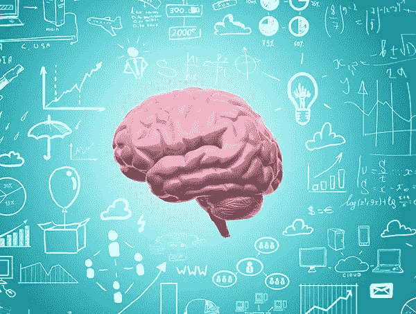

# 机器学习的美丽新世界

> 原文：<https://medium.datadriveninvestor.com/brave-new-world-of-machine-learning-fd695b6ce4ad?source=collection_archive---------7----------------------->

Brain at work

# 为什么我决定学习数据科学？

> “生活中没有什么可怕的，只有需要理解的。现在是了解更多的时候了，这样我们就可以少一些恐惧。”——玛丽·居里

因为我迷失在酱汁中，我需要答案。由于我短暂的注意力持续时间和对我尝试过的任何事情逐渐失去兴趣，我仍然在寻找我的人生目标。我的朋友说我多才多艺，我说“不确定”。如果我什么都喜欢，那“我的事”是什么？数据科学是我好奇心的答案。

# 值得吗？

> “统计学家就像艺术家一样，有一个坏习惯，就是爱上他们的模型”——乔治·e·p·博克斯

如今，最令人兴奋的事情发生在机器学习的使用上:自动驾驶汽车、人工智能、虚拟现实、医学、时尚、农业、营销。对数据科学家和工程师不断增长的需求反映了非 IT 行业自动化的发展进程。

# 未来将是自动化的

活在当下是激动人心的时刻。我们进入了信息时代。半导体成为最高国家利益。很快我们将建造自主农场、纺织厂和建造我们家园的机器。我们将修复 DNA 以保护后代免受致命疾病的侵害。不用通勤上班，只需插上虚拟现实头盔，在虚拟办公室工作。光明的未来在前方，没有恐惧，饥饿，可能还有爱。

# 虚拟存在？

进化是适者生存的产物。我们进化了，变得更强更聪明。但是如果我们不再需要为食物和住所而战，会发生什么呢？虚拟现实是现实世界的诱人替代，在这里我们可以创造新的身份，做任何我们想做的事情。没有任何限制。在适应新生活方式的过程中，如果不需要生存，我们可能会失去自私的基因和生活的目标。

# 有大团圆结局吗？

> “但我不想要安慰。我想要上帝，我想要诗歌，我想要真正的危险，我想要自由，我想要善良。我要罪恶。”――阿尔多斯·赫胥黎，美丽新世界

也许这将是一个美丽新世界，没有苦难和痛苦，温暖而舒适，也许这将是我们灭绝前的最后一次鞭策。有人说我们已经生活在模拟中，但我想相信我们是第一代有意识的生物，他们会创造出比我们更好、更快、更聪明的东西。我们已经通过使用神经网络创造人工智能来做到这一点，它们与我们的大脑工作方式相同，但速度更快。

这是我为什么选择数据科学的一个戏剧性的转变，但这是我经常思考的问题。