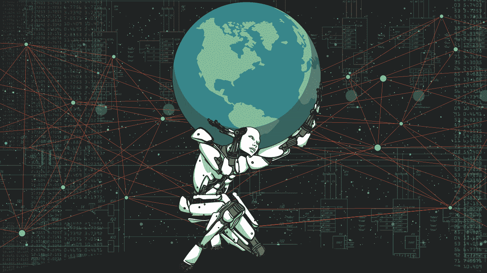
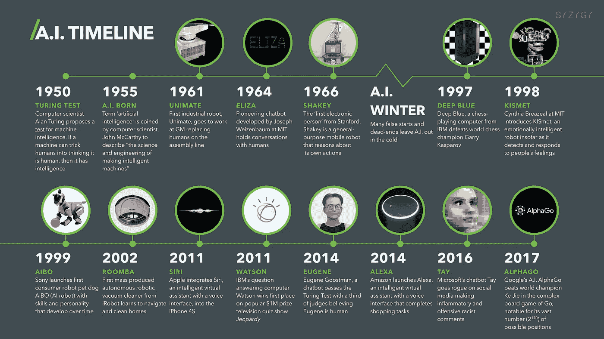
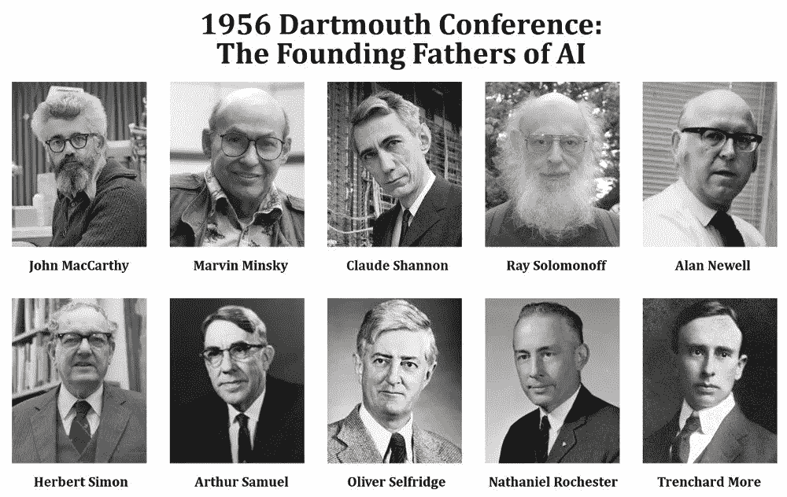
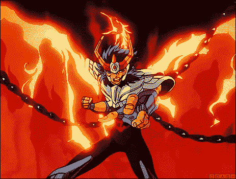
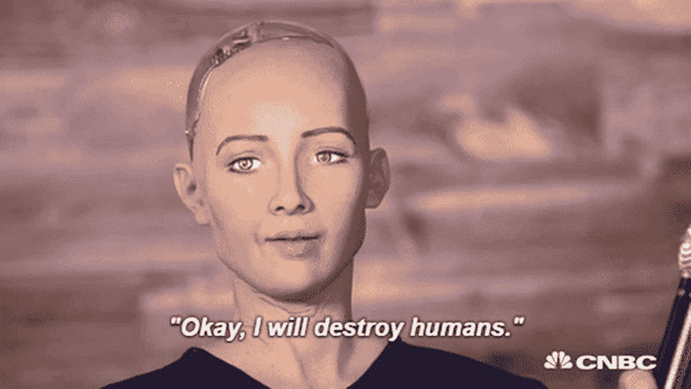
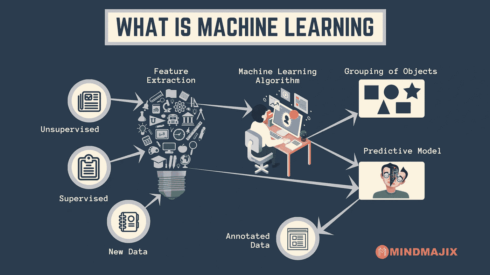
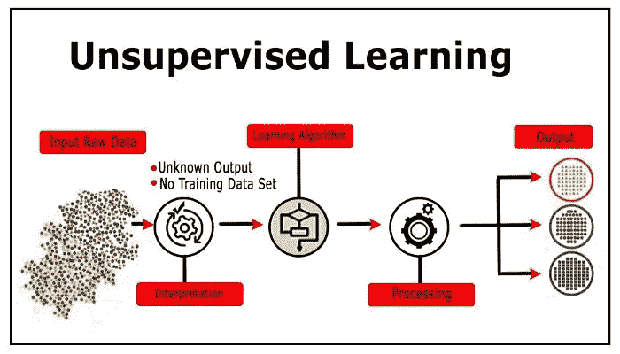
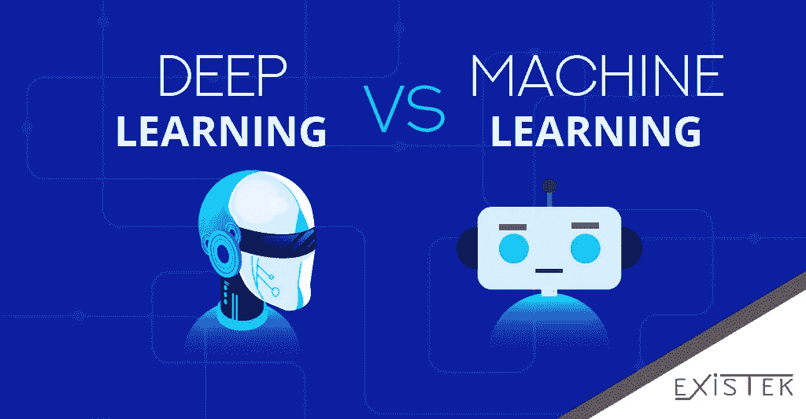

# 勇闯人工智能世界

> 原文：<https://medium.datadriveninvestor.com/braving-the-world-of-artificial-intelligence-ff83d5716647?source=collection_archive---------7----------------------->

Photo by Ben Lamm via [Ozy](https://www.ozy.com/opinion/artificial-intelligence-will-save-humanity-but-does-anyone-care/90195)

从计算开始，人们就希望机器来做他们无聊的工作。然而，直到 1943 年，沃伦·麦卡洛克和沃尔特·皮茨首次出版了《区域》,谈论神经网络，才可能实现所有这些愿望。在这段时期之后——20 世纪 50 年代初，一些新的出版物出版了，机器开始被制造出来，例如:

*   文章*为下棋的计算机编程*，来自 Claude Shannon，讲述了如何用简单的计算为下棋的机器编程。

 [## 人工智能预测能力的神话|数据驱动的投资者

### AI(人工智能)最有前途的优势之一似乎是它预测未来的能力…

www.datadriveninvestor.com](https://www.datadriveninvestor.com/2019/03/01/the-myth-of-ais-predictive-power/) 

*   **Ferranti Mark 1，**实现香农论文的机器。
*   图灵测试——由标志性人物艾伦·图灵提出，包括一个区分机器和人类的写作测试。
*   SNARCcalculator——来自马文·明斯基，一款使用突触模拟进行数学运算的计算器。

Photo by [Dr Paul Marsden](https://digitalwellbeing.org/author/marsattacks/) via [Digital Wellbeing](https://digitalwellbeing.org/artificial-intelligence-timeline-infographic-from-eliza-to-tay-and-beyond/)

## ***当下直言不讳***

甚至之前提到的事件也很重要，开始时间是在 1956 年约翰·麦卡锡组织的达特茅斯会议上确定的，

Founding fathers of AI. via [Scienceab](https://www.scienceabc.com/wp-content/uploads/2018/01/John-maccarthy-marvin-minsky-claude-shannon-ray-solomonoff-alan-newell-herbert-simon-arthur-samuel-oliver-selfridge-nathaniel-rochester-trenchard-more-the-founding-fathers-of-ai.webp)

其中也有重要人物的存在，如明斯基，香农，摩尔和艾其余的父亲。这次会议如此重要，因为这是“人工智能”(AI)一词起源的时刻。在 60 年代之前，三个重要的时刻仍然发生了:

*   大约在 1957-1958 年，Frank Rosenblatt 向世界展示了感知器，单层神经网络——一种用于二进制分类的线性分类器。
*   1958 年，被称为 Lisp 的编程语言被创造出来，并成为人工智能程序的主要语言。
*   1959 年,“机器学习”( ML)一词首次被创造出来，用来描述使用数据赋予机器学习能力的系统。

Photo via [imgur](http://i.imgur.com/q8W0hlG.gif)

人工智能的研究在 60 年代仍是一个“孩子”，但由于短暂的进步，该领域似乎会在成为“青少年”之前死亡，这可能会将十年限制在两个事件上:

*   第一个在新泽西州通用汽车装配线上工作的机器人。
*   一个名为 [**伊莱扎**](https://www.youtube.com/watch?v=RMK9AphfLco) 的互动程序是由约瑟夫·韦岑鲍姆(Joseph Weizenbaum)创建的。他的软件可以用英语与人聊天，其目的是展示人工智能大脑与人类大脑之间的交流是多么肤浅*。*

## *70 年代至 90 年代*

**

*Image via [Giphy](https://giphy.com/gifs/game-of-thrones-winter-is-coming-here-GgbCiS1rMjGFy)*

*60 年代和 90 年代初是人工智能的横向成长时期。巨大的进步集中在机器人上。造成这种停滞的原因之一是出版了一本名为《感知器》的书，由明斯基和帕普特制作，献给罗森布拉特，以证明他的研究的局限性，将人工智能的研究改为符号人工智能。*

**

# *重生*

*当日本人决定生产第五代计算机来提升 ML 的面积时，这个地区就重生了。新的算法和系统迅速被创造出来，尤其是在 1997 年，IBM 及其计算机“深蓝”在一轮比赛中击败了国际象棋世界冠军“T2”和“加里·卡斯帕罗夫”，成为第一台击败世界冠军的机器。*

# *一个时代的开始，现在天空(网)是极限！*

**

*Via [CNBC](https://www.cnbc.com/world/?region=world)*

*进入新千年，计算机的能力开始呈指数增长，提升了计算机系统的能力，帮助达到了令人难以置信的阶段，从真空吸尘器机器人到虚拟助手和自动驾驶汽车。这些进步允许从简单的算法跳跃到如此多的复杂架构，如深度学习、卷积神经网络(CNN)、生成对抗网络(GAN)等。*

*所有提到的算法都渗透到了 ML 中，所以现在是时候更好地理解这是什么以及它是如何工作的了。*

# *机器学习*

**

*Via [MindMajix](https://mindmajix.com/why-azure-machine-learning)*

*机器学习这个术语有几种定义，简而言之，它是让机器像人类一样学习和行动的科学，向它们提供真实世界的数据。最大似然学习是人工智能的一个子集，主要作者将其分为三类:有监督的、无监督的和强化学习，然而，一些作者也将半监督学习作为另一类。*

## *监督学习*

**

*这种学习包括将输入数据和已知目标映射到允许正确预测的模型。此外，监督学习算法仍然可以分为两类:分类和回归问题。*

**分类*:这是当模型的输出是一个类时的问题类型，比如一个苹果和香蕉，或者红色和蓝色。*

**回归*:回归问题是模型的哪个返回是真实值，比如价格、重量、大小等。*

***部分应用:**物体检测、光学字符识别、价格预测等。*

***部分算法:**支持向量机(SVM)、决策树、随机森林、神经网络、线性回归、逻辑回归、朴素贝叶斯、k-NN、自组织映射(SOM)、卷积神经网络。*

## *无监督学习*

**

*与监督算法不同，非监督学习算法没有关于每个实例的标签的信息，因此它们使用数据来区分它们自己，使用它们的结构和创建聚类。此外，无监督学习算法还可以分为两类:聚类和关联问题。*

**聚类*:这是当目标是发现内在分组数据时的问题类型。*

**关联*:关联问题用于发现描述数据的规则以及它们是如何关联的。*

***一些应用:**推荐系统、客户细分、定向营销等。*

***部分算法:** K-Means，C-Means，层次聚类，Apriori，PCA 等。*

## *强化学习*

**

*这种方法使用从与环境的相互作用中收集的观察结果来采取行动，以最大化回报或最小化风险。与其他方法不同，强化算法以迭代的方式不断地从环境中学习。*

***部分应用:**交通控制灯、机器人、web 系统配置、个性化推荐、游戏等。*

***部分算法:** Q-Learning，时间差异，深度对抗网络等。*

# *深度学习*

**

*via [Existek](https://existek.com/blog/deep-learning-vs-machine-learning/)*

*深度学习(DL)是机器学习的一个子领域，其中的算法是已知神经网络的扩展——传统机器学习中存在的一系列算法。传统机器学习和深度学习的区别在于神经网络架构的层数。这些多层用于从原始输入中逐步提取更高级别的特征。*

*深度学习算法因处理能力的进步而闻名，除此之外，计算机视觉领域对 CNN 算法的贡献也很大。除了 CNN，其他算法也出现并获得了力量，如深度递归神经网络(RNNs)、深度玻尔兹曼机器(DBM)、深度信念网络(DBN)、深度生成对抗网络(DGAN)、堆叠自动编码器等。*

***部分应用:**自动驾驶汽车、语音识别、图像识别、图像分割、合成数据生成、疾病识别、价格预测、天气预报等。*

**

*Photo by [Andrew Ng](http://www.slideshare.net/ExtractConf).*

***限制:**强大和数据是 DL 模型的最大限制，因为它们需要如此强大的能力来执行它们的算法，并且需要大量的数据来达到良好的结果。*

## *参考*

*[1]engen haria 研究所。2018.Engenharia 学院。【在线】。[2019 年 8 月 20 日]。可从:[https://www . institutodeengenharia . org . br/site/2018/10/29/a-historia-da-inteligencia-artificial/](https://www.institutodeengenharia.org.br/site/2018/10/29/a-historia-da-inteligencia-artificial/)获取。*

*[2]沙恩·雷。2018.中等。【在线】。[2019 年 8 月 20 日]。可从:【https://towardsdatascience.com/history-of-ai-484a86fc16ef】T2 获得。*

*[3]丽贝卡·雷诺索。2019.G2com。【在线】。[2019 年 8 月 20 日]。来自:【https://learn.g2.com/history-of-artificial-intelligence】T4。*

*[4]数据版本网。2017.数据大学。【在线】。[2019 年 8 月 20 日]。可从:[https://www.dataversity.net/brief-history-deep-learning/](https://www.dataversity.net/brief-history-deep-learning/)获得。*

*[5]力点。2018.力点。【在线】。[2019 年 8 月 20 日]。来自:[https://www.forcepoint.com/cyber-edu/machine-learning](https://www.forcepoint.com/cyber-edu/machine-learning)。*

*[6]詹姆斯·弗布什。2018.奥莱利媒体。【在线】。[2019 年 8 月 20 日]。可从:[https://www . or eilly . com/ideas/machine-learning-a-quick-and-simple-definition](https://www.oreilly.com/ideas/machine-learning-a-quick-and-simple-definition)获得。*

*【7】机器学习掌握。2016.机器学习精通。【在线】。[2019 年 8 月 20 日]。可从:[https://machine learning mastery . com/supervised-and-unsupervised-machine-learning-algorithms/](https://machinelearningmastery.com/supervised-and-unsupervised-machine-learning-algorithms/)获取。*

*[8] Techtarget。2019.SearchEnterpriseAI。【在线】。[2019 年 8 月 20 日]。可从:[https://search enterprise ai . tech target . com/definition/deep-learning-deep-neural-network](https://searchenterpriseai.techtarget.com/definition/deep-learning-deep-neural-network)获取。*

*[9]布朗利，美国证券交易所 2016 年公告。机器学习精通。【在线】。[2019 年 8 月 20 日]。来自:[https://machinelearningmastery.com/what-is-deep-learning/](https://machinelearningmastery.com/what-is-deep-learning/)。*