# 面向数字游牧者和远程工作者的巴西。我在巴西最喜欢的 5 个数字游牧民景点

> 原文：<https://medium.datadriveninvestor.com/brazil-for-digital-nomads-and-remote-workers-my-top-5-digital-nomad-spots-in-brazil-5ab22d53ccb6?source=collection_archive---------0----------------------->

巴西是一个非常大的国家。它是欧洲的两倍，几乎和美国一样大。每个地区都有不同的特色。这完全取决于你在寻找什么。虽然从经验来看，我认为许多数字游民正在寻找类似的东西，这些都在我之前写的博客中描述过。

我在巴西待了五次，每次都是几周或几个月，我有我最喜欢的景点，我会推荐你在你想发现巴西是一个数字游牧民族时去看看，记住大多数数字游牧民族都在寻找什么:生活成本，安全，数字游牧/创业社区，一些夜生活，最重要的是，完成一些事情的 wifi！

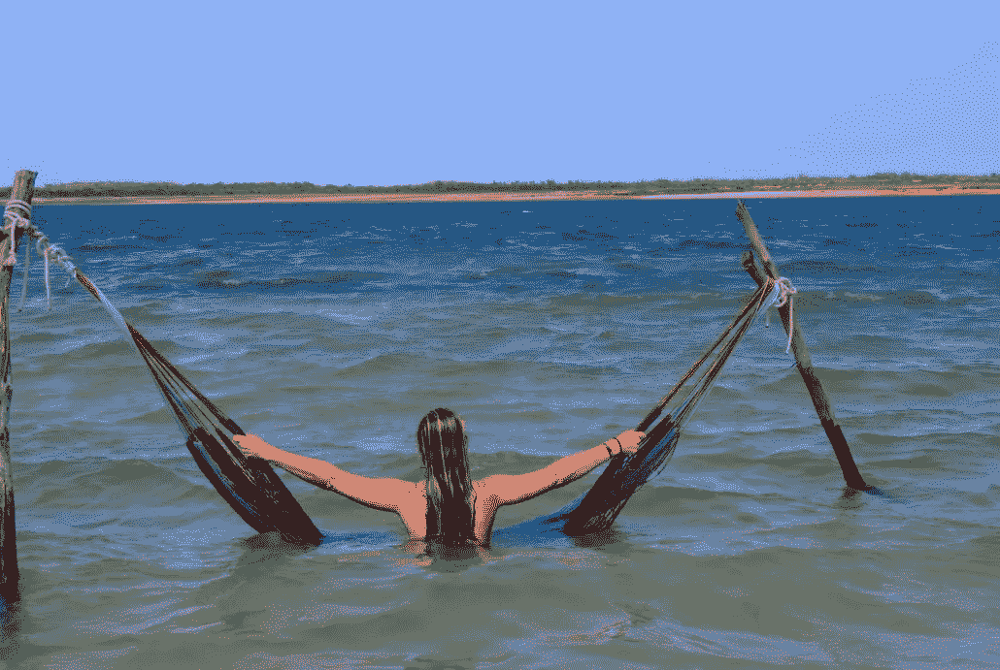

# 弗洛里亚诺波利斯的数字游牧民

Florianópolis，当地人称为 Floripa，是人间天堂，一个拥有一切的城市。美丽的白色沙滩、风景优美的山脉、活跃的户外生活方式和丰富的夜生活。它经常被描述为一个迷你的、更安全的里约，但也让我想起了南非的开普敦。它是巴西生活质量最高的城市之一，当你在这里时，这种度假的感觉并不奇怪。难怪 Floripa 被数字游民评价很高。

弗洛里帕是许多国际创业公司、自由职业者和企业家的家园。它有大量的共同工作空间。你比在巴西其他地方更多地接触英语。市政官员称它为有海滩的硅谷。虽然这很棒，也是成为巴西数字游牧者的最佳地点之一，但在我看来还远远不够。

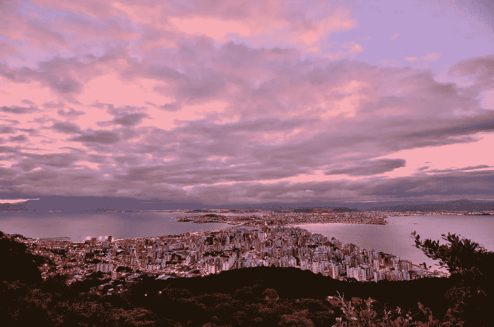

# 什么时候去

最佳去的时间是巴西的夏天(11 月到 3 月)。夏天又热又潮湿，这使它接近热带气候。

虽然当地人更喜欢冬天，当游客走了，他们有机会享受他们的城市。它不像欧洲或美国那样寒冷。冬天的平均温度大约是 18 摄氏度，在一些国家几乎可以称之为夏天。冬天的风确实很大。这可能会让它感觉更冷一点，但也让它成为冲浪和风筝冲浪的绝佳选择。

在淡季，你可以花更多的钱。雷亚尔(巴西货币)已经疲软了很长一段时间，在淡季住房是非常实惠的。不要指望亚洲的价格，但对于巴西的热点地区来说，这已经很不错了。

气候弗洛里亚诺波利斯

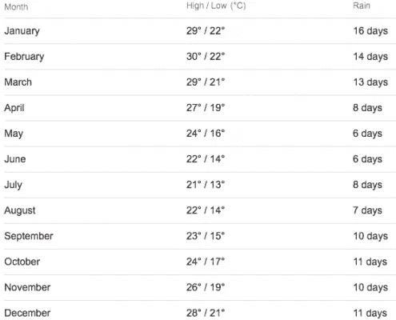

*温度*

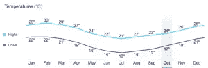

*降雨*

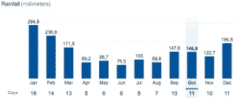

# 去哪里

在巴西的大部分地区，你会看到有门或有栅栏的房子，而弗洛里亚诺波利斯有开放式的花园。这就像你离开了巴西，进入了一个更加美国化或欧洲化的城市。最安全的社区是朱雷雷。如果你想住在海边或市中心，这不一定是最好的位置，但绝对是这个国家最安全的地方。

尽管弗洛里亚诺波利斯是一个岛屿，但它仍然很大。公共交通不是最好的，没有汽车出行会很困难。有公共汽车，但你最好的选择是乘出租车或优步。不要只是在路上招手打车，确保自己的安全，提前用***“radio taxi”或优步*** 预定出租车。安全总比后悔好。

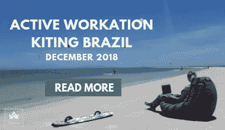

# Wifi 和互联网连接

当数字游牧民想要探索一个新的地方时，互联网往往是他们面临的最大问题。总的来说，巴西的互联网并不总是最好的。你在一个第三世界国家，而弗洛里亚诺波利斯仍然是一个岛屿。这个岛上的互联网是偶然的。

有些地方的互联网速度比鸽子还慢，有些地方的互联网连接非常好，你只需要去寻找。在 Lagoa en Centro，当然还有岛上的一个合作空间，你会有最好的机会。

# 生活费用

不要指望像在亚洲国家那样生活廉价，但如果你在寻找更长期的东西或愿意淡季，你可以很容易地将你的支出保持在每月 1000€以下。当然这完全取决于你的生活方式，但我认为这是相当平均的。确保你随身携带所有的技术产品，由于巴西极高的进口税，进口商品的价格可能是欧洲或美国的两倍。

# 夜生活

游客、背包客和其他旅游业者都非常了解弗洛里亚诺波利斯，夜生活是其中一个原因。巴西人知道如何聚会，弗洛里帕经常被比作迈阿密或伊比沙岛。

> 如果你喜欢户外运动，那么弗洛里亚诺波利斯就是你必须去的地方！

# 数字游牧者的 Jericoacoara

Jericoacoara 是人间天堂。这个沙漠中的小风筝和帆板中心已经从 20 世纪 80 年代的一个小渔村发展成为一个非常受游客欢迎的数字游牧目的地。虽然风筝不是在杰里的海滩上，但它是如此的不可思议，因为它不仅仅是风筝冲浪。正是这种氛围和小镇氛围让它如此不可思议。

杰里以日落而闻名。这是地球上少数几个能看到翡翠色日落的地方之一。太阳边缘沉入地平线以下并在一秒钟内变成亮绿色的日落。参观 Jericoacoara 的众多原因之一。

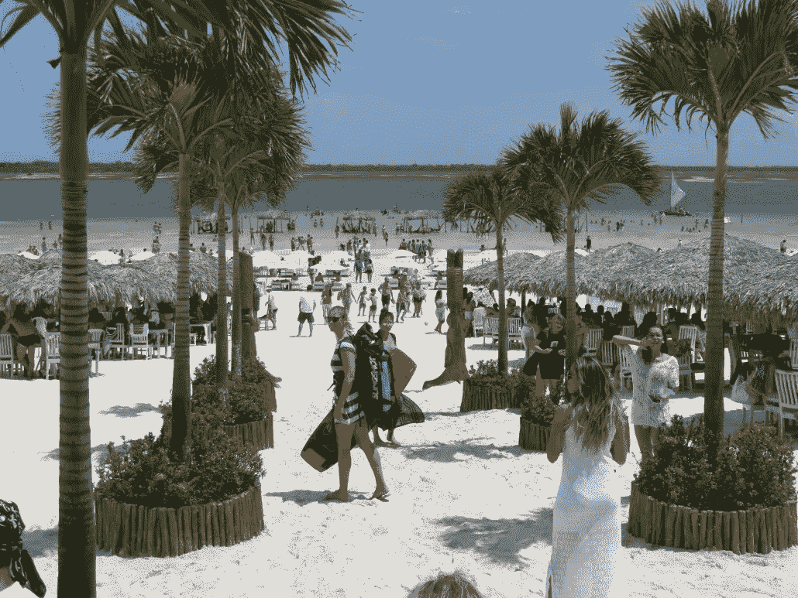

# 什么时候去

Jericoacoara 全年都很棒，这取决于你在寻找什么。从七月到二月，天气晴朗、温暖、多风。这使得它非常适合风筝和帆板运动。风让巴西北部炎热的气温也变得宜人。

在冬天，或者说在雨季(三月到七月)，天气仍然很暖和，但是会有一些云，偶尔会有热带雨。它们不会持续很久，所以即使在冬天，也是一个很好的去处。

最繁忙的季节是从 12 月到 2 月，当来自南方的当地巴西人北上享受他们美丽的海滩时。如果你打算在这段时间来，最好提前预订，因为 Jeri 的住宿会很快爆满。你可能不喜欢睡在沙滩上😉

气候 Jericoacoara

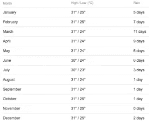

*温度*

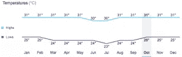

*降雨*

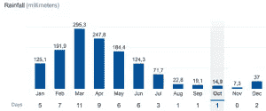

# 去哪里

Jericoacoara 是一个非常小的城镇，这意味着你可以在一瞬间从一边走到另一边。中心附近和靠近海滩的任何地方都很棒，这就是一切发生的地方。

你不能自己在 Jeri 开车，有专门的 4×4 出租车可以把你送到城外，但你要做好自己步行的准备。街道，甚至一些商店的地板都是由沙子制成的，所以在 Jericoacoara 散步是一项不错的运动。

Jeri 没有很多街道名称，建议熟悉一些经常提到的地标、商店或餐馆名称。

# Wifi 和互联网连接

最近在 Jeri 的光纤安装大拇指。它从 5mb 提高到 30mb，如果你考虑到这个地方在沙漠中心，这是不可思议的。当然，这也取决于用户数量。但如果你是为数不多的用户之一，视频通话就不是问题了。不是每个酒店或餐厅都使用光纤连接，所以在你安顿下来之前进行一次速度测试是值得推荐的。

这里没有共同工作的空间，但有很多可以上网工作的咖啡馆和风筝中心。海滩上典型的数字游牧工作图片实际上可以在 Jeri 拍摄！

当你想得到一张 3 甚至 4G 的 sim 卡时，Vivo 或者 TIM 是你最好的选择！Jeri 甚至在主街上有一个互联网中心(体育馆对面)。他们将 SIM 卡切割成 nano，处理电话和笔记本维修，并拥有一个连接良好的小型网吧。

# 生活费用

总的来说，在巴西，越往北走，东西越便宜。但也有例外，在福塔莱萨之后，你越往北走，价格就越贵。这只是因为它离基本上所有的东西都很远。

在 Jeri 的淡季，这一切都很实惠，但是在 12 月旺季真正到来时，请准备好支付体面的住宿价格。

我在 Jeri 最大的花费就是往返于一个漂亮的 kitespot。在杰里放风筝很棒，但是你不能直接在沙滩上放风筝。风向不好，因此你需要每天租一辆 4×4 的小车去 Prea 或 Jeri 附近的一个泻湖放风筝。

# 夜生活

一想到 Jericoacoara，脑海里首先弹出的就是沙丘上著名的日落，还有晚上的彩皮街鸡尾酒摊。当你在那里的时候一定要检查一下。

Jeri 是关于食物、饮料和现场音乐的。这里有丰富的夜生活，每天你都会找到自己喜欢的东西。通往海滩的主要街道每天傍晚都会变成一条街，那里有卖各种鸡尾酒的小摊，尤其是 caipirinhas。开始你夜晚外出的最佳地点是彩皮街。

你读得很好:开始你的夜晚。巴西人知道如何狂欢，他们会永远狂欢下去。补觉不是你来杰瑞的原因。也许出门前小睡一会儿并不是个坏主意。我们都会稍微变老，我们需要美容觉😉

如果你想体验真正的巴西，别忘了跳巴西舞。有人说比萨尔萨更激烈更性感更火辣。

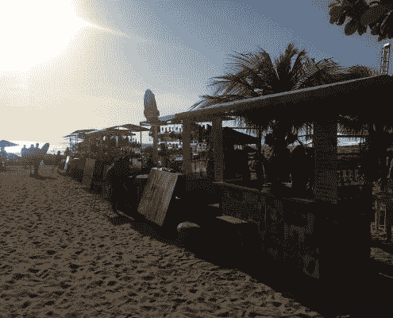

> 如果风筝冲浪是你的最爱，那么 Jericoacoara 就是你应该去的地方！

# 贝洛奥里藏特为数字游牧民服务

贝洛奥里藏特有大城市的舒适，没有里约或圣保罗的疯狂。它拥有大量的程序员和软件企业家，是许多科技跨国公司的总部所在地，如谷歌。贝洛奥里藏特，也被称为圣佩德罗山谷的启动场景，希望将贝洛奥里藏特作为巴西的硅谷放在地图上。

Belo Horizonte 为您提供高效工作和真正的巴西休闲生活方式的完美平衡。这一点，加上低生活成本，使其成为数字游牧民的绝佳去处。

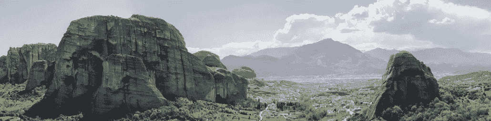

# 什么时候去

在贝洛奥里藏特，夏季(12 月至 3 月)也是湿度最高的潮湿季节，因此不是最佳的旅游时间。贝洛奥里藏特的最佳时间是四月到九月，那时天气凉爽，湿度较低。

在四月和五月有很多庆祝活动，所以这个时期，连同狂欢节是最繁忙和最昂贵的，但也是这里最好的时期。

贝洛奥里藏特气候

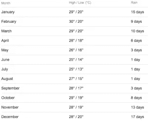

*温度*

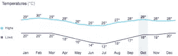

*降雨*

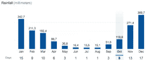

# 去哪里

如果你想去最好的数字游牧区，那里夜生活丰富，有很多商业和合作场所，那就去 Savassi/Funcionarios/Lourdes 吧。不是最便宜的地区，但在我看来是最好的。

如果你不介意通勤，你可以去古铁雷斯，圣特雷萨或弗洛雷斯塔。稍微更上层阶级与体面的房价和当地的氛围。

我不会建议你去 Centro。那里便宜很多，但是有很多无家可归的人，而且我不会觉得在晚上独自行走是一个值得拯救的地方。我想我已经习惯了..

# Wifi 和互联网连接

不幸的是，贝洛奥里藏特没有在咖啡店或餐厅工作的文化。最简单的方法是和当地的初创公司交朋友，那里有多余的桌子可以出租。

# 生活费用

生活在贝洛奥里藏特比列表中的其他地方要便宜得多。你每月至少要花 250€在一个更好的地区买一套像样的公寓，但这仍然比世界上大多数地方要少得多。当然，你可以买到更实惠的衣服，但你不想穿背带裙。在巴西，这在任何地方都不值得推荐。在我看来，在贝洛奥里藏特，一个月 1000€左右，你可以过得很舒适。

# 夜生活

贝洛奥里藏特是全国酒吧之都，大约有 14000(！)酒吧散布在城市里。你会发现任何一种你喜欢的酒吧，包括咖啡馆、餐馆、户外酒吧、啤酒馆、橄榄音乐俱乐部、运动酒吧和一年中每晚都营业的酒馆。在贝洛奥里藏特，去酒吧是必经之路。

如果你想在外度过一个美好的夜晚，贝洛奥里藏特有几个地方你应该去看看。萨瓦西是购物和娱乐之夜的最佳去处。它有各种预算的可能性。如果你想去夜总会，巴罗普雷托将是一个好去处，因为大多数夜总会都位于这个地区。

去参加四月份的 Comida di Buteco 比赛，在那里有超过 40 家酒吧争夺最好的“tira-gosto”(一种由传统原料制成的原始酒吧开胃菜)。如果你正在寻找贝洛奥里藏特的其他活动，可以看看这个网站:[阿桂 BH](http://www.guiabh.com.br/)

> 如果你喜欢在酒吧喝酒，贝洛奥里藏特就是你应该去的地方！

# 里约热内卢为数字游牧民服务

你不能去巴西却不去里约。当你想到巴西，谈论巴西，梦想巴西，首先想到的是里约。还是我错了？里约热内卢是世界上游客最多的城市之一，有太多的事情要做，要看，要探索。你永远不会感到无聊！

在里约会给你留下难忘的经历，也是开始数字游牧生活的好地方。里约有众多的合作空间、配有无线网络的咖啡店和一个庞大的国际社区。因为旅游业，当地人习惯了外国人，你会发现说英语的人。如果你还不会说葡萄牙语，那就更好了。

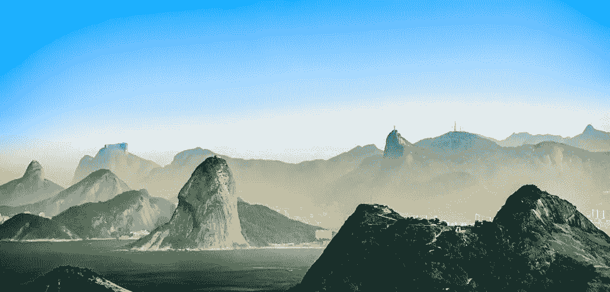

# 什么时候去

无论何时，无论如何，里约都是伟大的。旺季是从 12 月到 3 月。巴西的夏天，也是大多数节日发生的时候。新年，狂欢节，等等。天气很好，但在一年中的这个时候，里约的物价可能会很高。尤其是当节日来临的时候。

当您计划短暂停留时，不要错过这些活动。但是当你打算多呆一段时间，想要逃离里约热内卢的疯狂和随之而来的极端价格时。虽然天气有点不可预测，但是五月到九月对你来说是个更好的选择。

里约热内卢的气候

*温度*

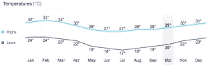

*降雨*

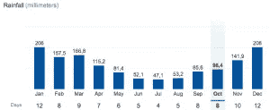

# 去哪里

我去里约的时候在很多不同的地方呆过，这取决于你想找什么。我喜欢住在科帕卡巴纳和伊帕内马的海滩上。靠近海滩，到处都是很棒的餐厅和酒吧。这里的价格比这个都会区的其他地方稍贵，但也很棒。

博塔弗戈和帕拉的夜生活丰富多彩，有很多餐馆、酒吧和夜总会。它不靠近海滩，但如果你来里约度过美好的夜晚，博塔弗戈或帕拉地区是你的去处。

如果你预算有限，住在贫民窟也是一个选择。在里约市内和周围有很多贫民窟，尽管这个名字名声不好，但并不是每个贫民窟都不好。看看维迪加尔贫民窟的一些地方，晚上你可能会比帕拉或科帕卡巴纳更安全。

里约有几个企业家之家，如果你正在寻找一个作为数字游牧者的地方，并希望与其他数字游牧者一起生活，那么它们是很好的选择。看看 theentrepreneurhouse.com 的[和 http://startuphouserio.com 的](http://disq.us/url?url=http%3A%2F%2Ftheentrepreneurhouse.com%3AweK0l_PVHR7IeBxXOjSymCqBfog&cuid=2082065)和。

里约的基础设施很差，所以如果你住的地方不对，你会花很多时间等公交车。

# Wifi 和互联网连接

巴西的互联网在过去几年里有所改善，但它仍然不是你所希望看到的数字游牧民族。你可能不想把昂贵的 Macbook 带到城市的每个角落，但在共同工作的地方上网往往是最好的。当然，你可以随时向你的房东要求更好的网络，以换取额外的租金。并确保你有一个本地的 sim 卡作为备份。

# 生活费用

你将为天堂付出代价。里约是一个很棒的地方，但要为它付费。如果你想住在里约的一个更好的地区，你最终会支付与大多数欧洲租房一样多的费用。€750 / €1000 左右的公寓月租也不例外。当然，你可以住得更便宜，但如果你想去中部的某个地方，你最终会更北，单程通勤时间为 2 到 4 个小时。如果你在这个不可思议的城市只是暂时的，那就不理想了。

出去吃东西或喝饮料的价格也可能和欧洲一样，因此甚至比许多美国地方还要贵。汇率经常对我们有利，但这也波动很大。

生活费用完全取决于你如何花钱，但如果你想生活舒适，偶尔打车，出去吃饭等等，我认为你一个月需要 1500€左右。如果你要待在里约，准备好花比预算更多的钱。当你想生活在天堂时要付出的代价😉

不要因为被当成外国人而感到被冒犯，你是在南美洲..

# 夜生活

里约拥有一切。Gávea 和 Barra 为上层阶级提供的高端俱乐部，博塔弗戈和帕拉的巴西夜生活丰富多彩，各色人等云集。巴西有很棒的夜生活文化。巴西的夜生活往往持续到凌晨 4 / 5 或 6 点。

里约晚上有很棒的当地海滩派对，人们在派对上比赛并展示他们的舞蹈技巧，而其他人则站成一圈观看。你自己去看看吧。

不管你去哪里，不要担心着装要求，你是在巴西。短裤运动鞋都可以。他们可能只在泳衣上画底线。虽然他们在某些地方对人字拖很挑剔。对男人来说，建议去一个有女人在身边的地方，这会让事情稍微容易些。

> 你喜欢什么并不重要，里约热内卢是你必须去的地方！

# 圣保罗的数字游牧民

如果你是喜欢大城市基础设施的数字游牧者，那就是圣保罗。它是商业之都，南美洲的经济中心。你会发现一个强大的本地创业社区和许多跨国公司，他们的南美总部设在圣保罗。找到一个工作的地方不会是一个问题。这座拥有 2000 万人口的城市有着极高的职业道德，这使得这座城市比我的祖国荷兰还要大。

在荷兰，我需要花两个小时穿越边境到另一个国家，而圣保罗只需要两个小时就可以从这个城市的一个地方到另一个地方。它拥有与任何其他拉丁美洲机场最好的航班连接，一旦你熟悉周围的路，你就不会再感到不知所措，你会开始欣赏圣保罗的一切。商机、精彩的夜生活、画廊、剧院、博物馆和美味的食物。

最后但并非最不重要的一点是，你将能够在圣保罗用英语四处走动，这对我们大多数数字游民来说很重要。

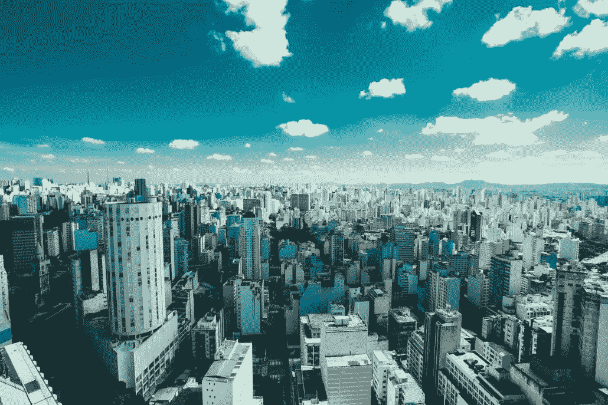

# 什么时候去

参观圣保罗的最佳时间是九月。就在夏天开始之前。足够温暖，可以去海滩，但没有繁忙和高价的旺季。

旺季是在巴西的夏季，从九月到三月。三月之后，雨季(冬季)开始，气温在 15 摄氏度左右，预计会有大量降雨。

圣保罗的气候

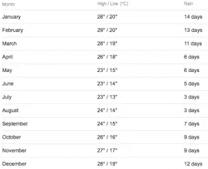

*温度*

*降雨量*

# 去哪里

圣保罗有几个地方我会推荐去。Vila Madelena 是最值得推荐的，但 Centro、Itaim Bibi、Vila Olímpia、Jardims 和 Parque Ibirapuera 也是很好的照片。所有这些都位于市中心，有一些最好的酒吧和餐馆，但没有 24/7 的疯狂。它们有点像旅游景点，但却是值得一去的好地方。

圣保罗很大，所以当你不在正确的地方时，可能需要几个小时才能到达你要去的地方。交通很差，真的很差。不要计划在高峰时间去任何地方。圣保罗的公共交通安排得很好，所以如果你想四处走走，公共交通是你最好的选择。

维拉·马德莱娜是我的最爱。这是一个更另类的街区，有很多很棒的酒吧、咖啡馆、酒店和招待所。这个艺术区值得一去。它对游客非常友好，比其他地区安全一点。最好的在市中心，尽可能在市中心，坚持阿达共和报，你会没事的。

尽量避免更便宜的地区，贝伦，穆卡，帕拉达英格尔萨，北部和东部。这可能不是最安全的，也不是你想去的任何地方的长途旅行。

# Wifi 和互联网连接

每个数字流浪者所寻找的，就是你在圣保罗能找到的，高速互联网！在餐馆、酒吧和咖啡馆找到互联网不会有问题。你的新办公室在街道的每个角落。圣保罗甚至在全市都有免费的公共 wifi 点。

# 生活费用

欢迎来到南美洲最昂贵的城市！如果你想在圣保罗生活舒适，计算一下大概€1500 / €2000 一个月。如果你找到一个没有 Airbnb 或 Booking.com 的好地方出租，如果你不去喝咖啡和吃大餐，你可以便宜一点。

当地食品，超市和街头食品相对便宜。住宿和外出使它变得昂贵。

Ps，优步比普通出租车便宜多了，所以如果想省钱，就去优步吧！

# 夜生活

欢迎来到阿姆斯特丹、纽约或悉尼。出门时带足够的钱，它会掏空你的口袋。在圣保罗外出是昂贵的。

维拉马达莱娜不仅是一个住宿的好地方，如果你正在寻找一个不错的屋顶酒吧喝酒，它也是一个很好的地方。特别是 Baixo Augusta，如果你想与潮人、艺术家和中上阶层人士交往，伊泰姆比比的皮涅罗斯鲁阿马里奥费拉兹是你想去的地方。

如果你真的想去夜总会，去 Vila Olímpia 和 Barra Funda/Baixo Augusta 地区。在圣保罗，午夜后开始外出。俱乐部会在凌晨 1 点前关门，但会一直开到凌晨，可能会有很多派对。

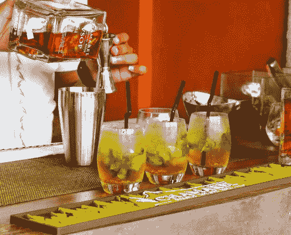

> 如果核心业务是你喜欢的，那么圣保罗就是你应该去的地方！

# 作为一名数字流浪者，你想去巴西的什么地方？

去巴西是数字游牧者的好去处吗？这由你决定。巴西大有可为，但也伴随着挑战。我会再次回到巴西。通过积极工作，我们有一周的时间探索巴西东北部，为各种远程工作者、企业家和数字游牧者提供令人难以置信的风筝冲浪工作。如果你想和我们一起探索巴西的这片土地，请点击这里查看我们的[作品](https://activeworkation.com/active-workation-kitesurfing-cumbuco-jeri-2018/)。