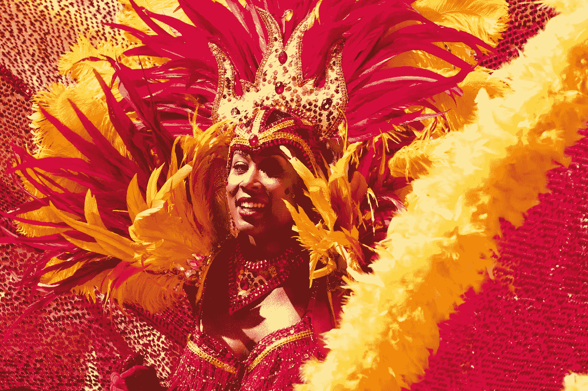
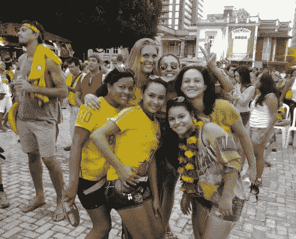
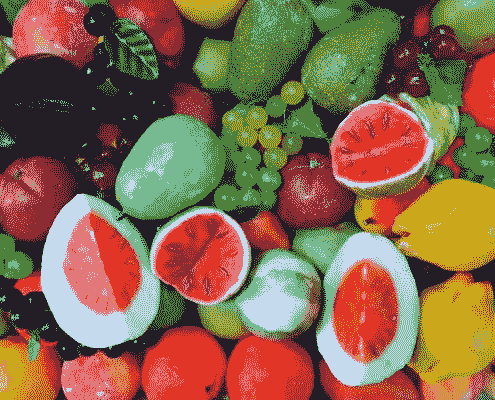
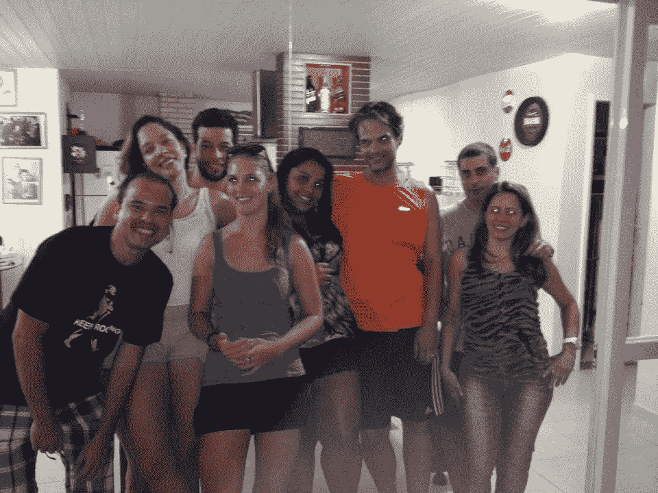

# 面向数字游牧者和远程工作者的巴西。我们喜欢的东西，我们不太喜欢的东西

> 原文：<https://medium.datadriveninvestor.com/brazil-for-digital-nomads-and-remote-workers-the-things-we-love-the-things-we-love-a-little-less-5b30e8a969ad?source=collection_archive---------9----------------------->

我和巴西有超过 15 年的历史。那是我第一次独自去的国家，那时我才 17 岁。我仍然很惊讶我的父母让我。在那个年龄，没有我现在拥有的知识和经验，我震惊了！

十年后的今天，我已经回来过很多次了。为了狂欢节，为了足球世界杯，为了风筝冲浪，仅仅因为我认为巴西是一个伟大的国家，我相信你去过之后会同意我的观点。巴西可以是一个成功或失败，讨厌它或喜欢它，一个梦想成真或你最糟糕的噩梦。我认为这完全取决于你的期望和你的容忍程度。

作为任何类型的远程工作者、数字流浪者、自由职业者、位置独立的企业家，你都在寻找与普通度假者不同的东西。这时候你的容忍度必须更高。

做好准备，在巴西，没有良好的互联网，许多官僚机构，更高的生活成本和众所周知的犯罪。如果这让你害怕，也许巴西不适合你。但是为什么不试一试呢？到目前为止，还没有什么坏事发生在我身上。(我只是敲敲木头，以防万一😉)但是你要小心。如果你知道你将要面对的是什么，并且你能够处理好它，你会像我一样热爱巴西，那里有很多东西值得你去爱！

# 我们喜欢巴西的地方

巴西有太多值得爱的地方，比我描述的还要多，比你可能在那里度过的短暂时间里了解的还要多。让我们快速浏览一下我和其他人喜欢巴西的地方。

# 超级友好的人

热情、欢迎、快乐和友好是描述巴西人民的最佳词汇。巴西人口是一个大熔炉，由来自世界各地的伦理和文化遗产组成。你会发现在萨尔瓦多地区有更多的非洲裔巴西人，中部有土著血统，南部各州有欧洲裔巴西人。他们共同努力成为这个伟大的巴西国家。

对他们来说，你将是一个外国佬，一个不是来自南美的人。但是巴西人会让你有宾至如归的感觉，你会很快感到自己是他们社会的一部分。你在巴西交朋友不会有任何困难。

巴西人喜欢享受美好时光。他们喜欢愉快的谈话，美味的食物，你会发现很多音乐。他们会喂养你，让你改变看待他们的方式。他们确保你一次又一次地想要回到巴西。

# 美丽的大自然和令人惊叹的海滩

巴西很大，也很美丽。你会发现巴西的多样性。它拥有世界上最好的海滩(根据 Tripadvisor ),位于巴西海岸线 1000 个岛屿中的一个岛上。令人难以置信的森林、河流和许多野生动物。

如果你打算去巴西，就不能错过海滩时光。它有 2000 多个海滩，排名第一的海滩是巴亚·多桑丘海滩，您可以在费尔南多·迪诺罗尼亚岛上找到它。最神奇的岛屿，因此我的第一推荐去看看。

巴西拥有世界上最大的瀑布之一和 62 个国家公园。最有趣的探险区域是亚马逊河。乘坐几天的船，尽可能多地看看令人惊叹的亚马逊！看到这样的日落，我惊呆了。

# 食物和水果！我们不都喜欢食物和水果吗？

我迫不及待地想回到巴西，并最终再次得到一些适当的巴西莓。我会预订航班，只为了吃一些这种超级水果。除了巴西莓，你还会发现许多在世界其他地方找不到的其他水果。巴西是世界上水果种类最多的国家，所以你会大吃一惊的。得到一种你可能从未听说过的水果。糖苹果、杨桃、西印度樱桃和腰果，让所有不同的味道在你的嘴里尽情享受。

如果你是一个肉食爱好者，你会在巴西的天堂。巴西烤肉是我第一次到巴西时最先开发的东西之一。当你在一家“吃到饱”的餐馆里受到一种典型的南美牛仔——gau chos——的服务时，你就能体会到这种感觉。或者在沙滩上吃点烤肉。

在我的下一篇文章中阅读更多关于我最喜欢的巴西食物。

# 城市的多样性

你喜欢做什么并不重要。在巴西，你会找到满足你需求的地方。如果你喜欢海滩，你可以沿着海岸线找到你的最佳地点。如果你是一个登山爱好者，你可以想象自己在一座大山中徒步旅行。例如在巴伊亚，这张照片就是在那里拍摄的。

如果你喜欢大城市的生活，巴西有些城市的居民比一些国家还多。很棒的基础设施，美味的食物和令人惊叹的夜生活。里约热内卢和圣保罗只是其中的几个。查看 [**我的文章**](https://activeworkation.com/brazil-for-digital-nomads-and-remote-workers-my-top-5-digital-nomad-spots-in-brazil/) 以及我自己对巴西一些地方的推荐，让自己成为一名数字流浪者。

如果你是一个热爱风筝冲浪或者想学习风筝冲浪的数字流浪者，你并不孤单！在 Jericoacoara 或 [**找到许多其他的数字游牧民，加入我们即将到来的**](https://activeworkation.com/active-workation-kitesurfing-cumbuco-jeri-2018/) 从 Cumbuco 到 Jericoacoara 的多地点 kitesurf 工作。专为喜欢风筝冲浪的本地独立企业家、远程工作者和数字游民设计的工作。

*加入我们在巴西北部的 kitesurf 工作，体验不同地点的独特体验。*

# 适应的容易程度

如果你想在巴西定居更长时间，适应他们的文化不会像在其他国家那样困难。巴西的人口是文化和移民的大熔炉，你会发现各种各样的种族。欧洲人、非洲人、亚洲人和美国人。巴西有来自世界各个角落的移民潮。当你开始用非母语葡萄牙语喃喃自语时，你只会被认为是一个外国佬。

# 文化经历和事件

我去了巴西两次，因为那里有重大赛事。嘉年华是最有名的，但绝对不是唯一的。去看看你能在网上找到的任何一种活动日历，看看当你打算去那里的时候日程上有什么。Semana Santa、Festas Juninas、费斯塔-迪维诺、圣维托节和 Reveillon(巴西新年)只是其中几个节日，和狂欢节一样有趣。

巴西有丰富的体育文化。街道的每个角落、每个海滩和每个公园都有很棒的健身房。你会惊讶地看到人们在每条人行道上跑步，尤其是在里约这样的城市。武术有柔术和卡波伊拉，足球是最重要的。每个人都想成为下一个贝利或罗纳尔迪尼奥。

# 我们在巴西不太喜欢的东西

不幸的是，巴西不仅有我们喜欢的东西，还有一些东西让我们在这个不可思议的国家不太方便。

# 语言障碍

如果你不会说任何葡萄牙语，作为一个外国佬，你可能首先会遇到语言障碍。你不会发现很多巴西人会说英语甚至西班牙语。巴西人很可爱，他们会尽力帮助你。手势语言可以带你走得很远，但不会让你在巴西的生活变得轻松。建议在你来巴西之前学习一些基本的短语，这会给你很大的帮助！

# Wifi /互联网或缺乏它

如果你想以数字流浪者的身份来到巴西，这可能会成为你的一个障碍。总的来说，巴西好的互联网是不存在的，要么就是狗屎。wifi 和 4G 都不靠谱。找到好的或像样的互联网并非不可能，但这是你必须寻找的东西。即使是在大城市。越往北走，东西越不发达，互联网就越差。如果你去南方，事情会变得更安全，互联网也会变得更好。

如果你是一名游客，这不会是一个问题，但如果你需要完成工作，这肯定是一个问题。作为一名数字流浪者，你很可能需要完成工作。所以，互联网将是你最大的挑战。不要指望在你到达后能完成很多工作。这将需要一段时间来获得一个常规，熟悉并找到合适的工作地点。

你最好的选择是好的酒店、合作空间、大学或在家工作，并向房东支付更好的网络升级费用。

# 巴西的安全

根据新闻，你的父母，你的家人和朋友，巴西是一个危险的国家。他们都有强奸、谋杀和抢劫的故事。就像在埃及、印度、哥伦比亚和几乎世界上其他地方一样，那些有好建议的人从来没有去过的地方。巴西人甚至会同意。

是的，巴西可能不像欧洲或美国那样安全，但巴西也不像人们说的那样危险。大多数暴力只发生在某些街区，而且往往与毒品有关。所以当你远离它，暴力的变化也会变小。

确保你意识到你周围的环境，乘坐出租车，四处走动，就像你知道这个地方，不要让人们知道你是一个游客。如果你做了所有这些，你在巴西时成为犯罪受害者的可能性很小。

# 距离

巴西是一个幅员辽阔的国家。它比欧洲还大，从南方飞到北方需要 5 个小时。如果你预算有限，想坐公共汽车，那要花好几天时间。在巴西，城市跳跃并不是一件真正的事。

# 生活费用

谈到生活成本，南美有很多不同之处。当你在南美时，巴西是生活成本较高的国家之一。根据美世公司的生活成本排名，圣保罗和里约热内卢都位列全球外籍人士生活成本最高城市的前 12 名。

如果你挣的外币比巴西雷亚尔多，你可能是幸运的，也可能是不幸的。都取决于你什么时候去。在过去的几年里，汇率波动很大。几年前，巴西的物价比现在高 100%,这都是汇率的原因。

巴西有很高的进出口税，这使得某些商品非常昂贵。你在欧洲用€2.000 英镑买的 Macbook 在巴西的价值将是它的两倍。所以在出发前确保你有你需要的一切。

# 你会以数字流浪者的身份来到巴西吗？

如果你觉得你会喜欢巴西，那绝对值得去看看。在我看来，利远大于弊。如果你知道如何应对，你会爱上巴西。当然，有些事情会让我们恼火，但是你会得到很多回报。在你去过之后，你会继续回来，就像我一样。

如果你不想第一次独自去巴西， [**加入我们活跃在巴西北部的风筝冲浪活动。**](https://activeworkation.com/active-workation-kitesurfing-cumbuco-jeri-2018/)