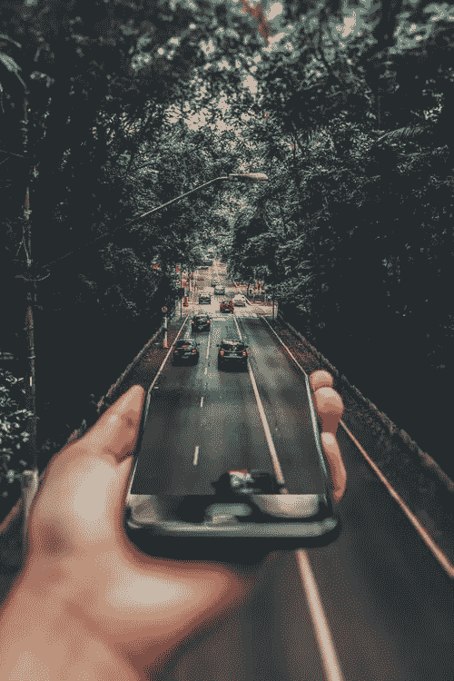

# 打破现实世界和数字世界之间的鸿沟

> 原文：<https://medium.datadriveninvestor.com/breaching-the-gap-between-the-physical-and-the-digital-world-77f03a027089?source=collection_archive---------26----------------------->

所以我刚刚意识到人工智能有社会责任

是的…我知道那至少是一种轻描淡写。

有一天，我在开车的时候，想到了我所有的同事，他们对与“大公司”分享信息感到不舒服，但即便如此，他们在使用 Gmail、google photos、Hotmail、Siri、Amazon 和 Waze 时却感到非常自在。这是我真正开始思考的地方，不仅仅是现在使用 Waze，而是在将来 ***每个人*** 都使用 Waze。想象一分钟的场景。**大家 采用 Waze。**

现在，让我们把它放到一个稍微不同的环境中，每个人使用 Waze 的方式都与他们现在使用它的方式略有不同。因为现在，Waze *建议*你去哪里。现在，想象一个真正自动化的汽车和乘客做完全不同的事情来驾驶的世界。这意味着，他们甚至不会用正在运行的应用程序来查看那一分钟的 GPS/手机屏幕。见鬼。也许 Waze 正在一辆 100%自动驾驶的汽车中独自行驶。

这一刻是让我思考的想法。好了，现在，如果 Waze 控制了 100%人口的流量，会发生什么？它可以做一些没有人想到的新事情，例如将所有流量单向发送，这样一些“少数人”就可以走更快的路线(额外付费订阅模式，有人知道吗？).我想到的另一个想法是，想象一下软件工程师想要尝试一些新的算法？还有什么比让用户在试运行时给出大量反馈更好的方式呢，“因为我们知道，如果这样的算法比通常更好地工作，Tod 肯定会给我们反馈”。

当然，不要让我开始做威胁生命的决定，谁的生命获胜取决于“如果和几个特殊的 ELSES”(例如，每个主题给社会带来的价值)，但我们都想到了这一点，因为这总是出现在我们喜欢阅读的新闻类型中，因为它有很大的影响。

我想说的是，由于现实世界和数字世界之间的差距正在缩小，现在世界上肯定有更多微妙的变化正在发生，我们甚至不会看到它们的到来，直到它们自己全部解开。

激动人心的时刻在等着我们。