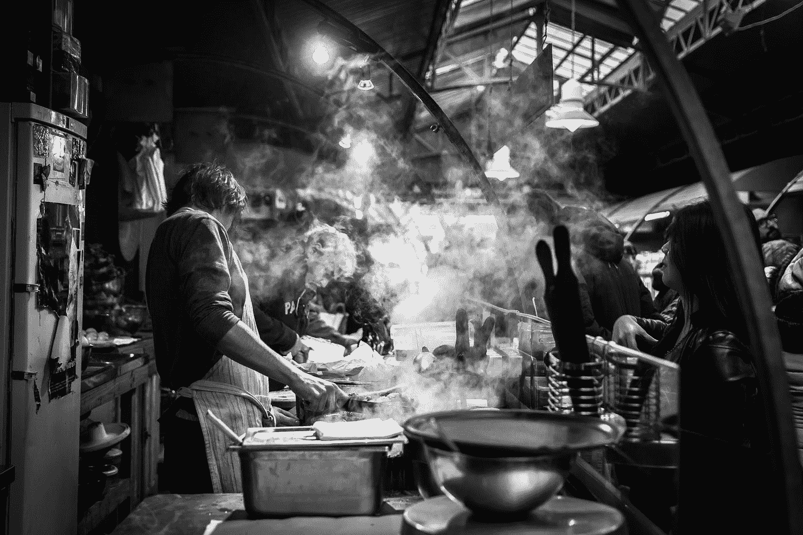
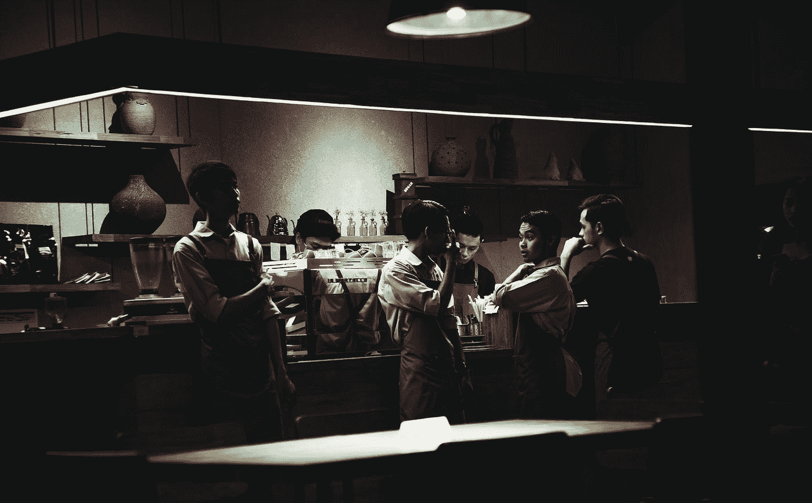

# 面包屑:烹饪到编码

> 原文：<https://medium.datadriveninvestor.com/breadcrumbs-cooking-to-coding-489c5b157c91?source=collection_archive---------2----------------------->

“Chefs in a steamy kitchen preparing food” by [John Legrand](https://unsplash.com/@johnny_legrand?utm_source=medium&utm_medium=referral) on [Unsplash](https://unsplash.com?utm_source=medium&utm_medium=referral)

> 当我离开烹饪的世界，坠入数据和编码的神话般的深渊时，在我前进的道路上撒一些面包屑似乎是个好主意。
> 
> 无论你是否选择跟随我的足迹，我想我真的要离开它们，这样我就能找到回去的路，完全意识到我真的要用这些面包屑做的很有可能是养肥一些饥饿的鸟…
> 
> 我对此没有意见。

做饭？专业做饭很牛逼。这是你听到的一切，和你听到的完全不同。又脏，又热，又恶心，还出汗。对体力要求很高。有些厨房确实充满了性、毒品和摇滚明星的个性，但大多数时候，厨房里都是努力工作的家庭成员(是的，伙计们。这一部分仍然经常是正确的)，通常来自不同的国家，而不是你工作的国家，他们低下头，努力工作，然后去他们的下一份工作，从头再来。再一次。如果你在一个地方呆的时间够长，这些人就会成为你的家人。你肮脏的叔叔，你疯狂的表弟，你忠诚的哥哥。家庭。当你找到你的家人，当你找到那群可以和你一起流汗、一起打呼噜的人，和他们一起你可以做不可能的事情，这些事情不应该发生，而且没有人可能理解或相信，那是一种世界上没有其他事情可以替代的感觉。

“Staff socialize around the bar at a dimly-lit restaurant” by [Ali Yahya](https://unsplash.com/@ayahya09?utm_source=medium&utm_medium=referral) on [Unsplash](https://unsplash.com?utm_source=medium&utm_medium=referral)

我会错过吗？

你最好相信它。

Photo by [Caroline Hernandez](https://unsplash.com/@carolinehdz?utm_source=medium&utm_medium=referral) on [Unsplash](https://unsplash.com?utm_source=medium&utm_medium=referral)

然而！就在一年前，我有了这个孩子，他是这个地球上有史以来最酷最不可思议的小家伙。(当然，你可以不同意我的观点。我很确定这就是互联网的用途！)

她太棒了！我以为有了她后我会重新开始烹饪。当然，不会一样，但我还是会回去。

至少我是这样认为的…

我想让她拥有一切！我想让她有时间陪我，我想让她拥有一些很酷的东西(但不要太多)，有一天我想和她一起去旅行！我想在假期见到她，我想和她一起度假。

猜猜你在厨房里不能做什么？任何那些东西！你在假期工作！你没有真正的假期！此外，晚上 7 点以后就没有托儿服务了，我大部分时间都是在午夜后回家。因为我和我的搭档都是餐馆的人，所以会有很多个晚上，这个孩子会在没有我们的情况下去睡觉，然后在午夜左右被抱起来，移动，放回她自己的床上。很难想象我们能请得起一个每天晚上都在我们家的人把这个小家伙塞到她自己的安全床上。

如果我只想工作几天，那么很难找到任何类型的管理职位，而且仅靠厨师的工资，你根本负担不起照看孩子的费用。人们让它工作吗？他们当然知道！有些人甚至有家人或密友可以照看他们的孩子，这太棒了！我们没有那个。我们所拥有的是难以置信的特权，我可以一周五天都和爱丽丝呆在家里。我对此感激不尽，我知道这是很多很多人力所不及的。(也就是说，非常明确地说，这种“特权”特指这样一个事实，即作为一名厨师，我每小时挣的钱比我们的托儿服务提供商少得多，这意味着我去上班实际上会花掉我们一大笔钱。多么系统啊！)

当我的伴侣在家时，我确实继续在餐馆工作了一周两天。当然是为了钱，还因为这是我喜欢的！后来我工作的餐厅被卖了，关门了。突然，我失业了，没有真正的计划！

幸运的是，我知道这整个改变生活的事情就像一列货运列车向我袭来，我已经开始把我的事情安排得井井有条。烹饪将被证明是不可持续的。我已经知道了。我姐姐的男朋友彻底改变了他的生活，改变了一切，开始写代码(嗨，克里斯托弗！)，所以我已经在认真地研究技术方面的东西了。我从 HTML 和 CSS 开始(嗯，我想这不完全正确。我已经用 Wordpress 做了很多来建立和运行我的食物博客。我就是那个人。)并在那里玩了不少。然后我对 JavaScript 有点兴趣，花了一些时间玩 Bootstrap 和 GitHub，它们非常酷，我完全可以理解为什么人们喜欢所有这些东西，但后来我发现了 Python，然后我发现了数据分析，我被迷住了！！！我绝对恋爱了！我一直是一个信息和研究迷，现在我突然觉得每次我学到新东西的时候我都在表演魔术！

Photo by [louis amal](https://unsplash.com/@louissamal?utm_source=medium&utm_medium=referral) on [Unsplash](https://unsplash.com?utm_source=medium&utm_medium=referral)

在过去的几个月里，我一直在阅读 Python 教程和课程，我已经学习了足够多的 git 和 GitHub，可以相对舒适地四处走动，我现在正在学习 Anaconda 和 Jupyter 笔记本中的甜蜜魔法。我申请了 [Udacity 贝塔斯曼数据科学奖学金课程](https://www.udacity.com/bertelsmann-data-scholarships)并被录取(上周完成！！！！几乎提前了一个月！)，现在我报名参加了[100 万女性科技之夏](https://1millionwomentotech.com/summerofcode1/)。我刚刚为 DIY 曲目成立了一个[完全非官方的脸书团体(如果你喜欢就加入我们吧！越多越开心！我绝对不会检查你是否注册了代码之夏。我不认为我可以检查，如果我想！)，而且我玩得非常开心。](https://www.facebook.com/groups/1MillionWomenToTechDIYers/)

所以，餐馆关门了。我们得到了两周的通知，但由于假期突然关闭(7 月 4 日快乐，对吗？)，对我来说，这意味着正好两班倒，突然间我失业了。令人震惊。我失去了我疯狂的工作家庭，我可能永远也不会回到我已经喂养了十多年的激情中去。当然，生活是一件有趣的事情:一切都可以在一瞬间改变。我只是试着跳进水流中，享受这地狱般旅程。

不管怎样，我全押了。我正在让这一职业转变发生，我将开始记录这一过程，以防其他人需要自己的疯狂之旅。

向后靠，放松，如果你敢的话，跟随我的技术精湛的、自制的、手工的、有机的、本地来源的、无麸质的面包屑。

Photo by [Ashim D’Silva](https://unsplash.com/@randomlies?utm_source=medium&utm_medium=referral) on [Unsplash](https://unsplash.com?utm_source=medium&utm_medium=referral)