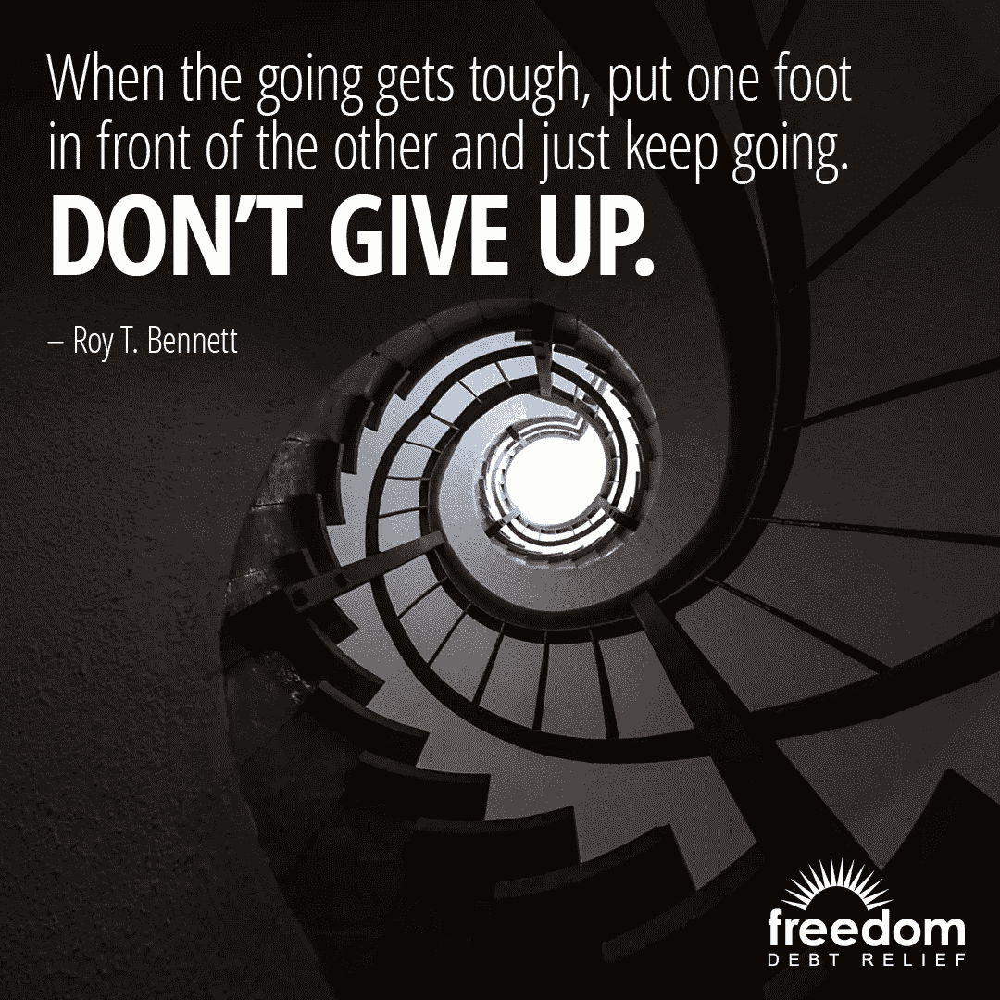

# 为财务自由而脱离

> 原文：<https://medium.datadriveninvestor.com/break-away-for-financial-freedom-3603667cde59?source=collection_archive---------3----------------------->

## 从小处着手，积累你战胜债务的成果

对许多人来说，财务自由是一个遥不可及的梦想。大量工人领着薪水过日子，几乎没有希望得到救济。

来自[Experian](https://twitter.com/Experian)——一家提供数据和分析工具的全球信息服务公司——的专家们一致认为，财务自由的定义因人而异。这取决于他们的财务状况。

总的来说，财务自由就是不用担心债务或支付账单，内心平静。

 [## 光明的未来等待着金融自由的宣言

### 你现在可以采取的宣布财务自由的步骤

medium.com](https://medium.com/financial-strategy/bright-futures-await-declarations-of-financial-freedom-78c3d40e935b) 

[自由债务减免](https://twitter.com/FreedomDebt)专家补充道，“如果你在信用卡债务中挣扎，你永远不会体验到真正的财务自由。”

他们公司宣传自己是“债务减免行业的领导者”它有一个项目帮助人们减少他们的债务，更快地摆脱债务。

“财务自由可能意味着还清债务，实现退休储蓄目标，有足够的应急储蓄，这样你就不会为钱而感到压力，或者只是有按照自己的方式生活的自由，”益百利团队说。

他们指着一篇关于财务自由的文章。

# 从小处着手

为了帮助实现财务自由，优先考虑债务——最好先还清小件物品——以腾出资金来购买大件物品。

Experian 团队表示:“监控你财务健康状况的一个好方法是定期查看你的信用报告。”

 [## 恢复您的信用从一小步一小步开始

### 获得高分不会一蹴而就

medium.com](https://medium.com/financial-strategy/restoring-your-credit-starts-with-baby-steps-251ec10bbb43) 

任何人都可以每 12 个月在网上向这三个机构索取信用报告的免费副本。

[金钱至关重要男人](https://twitter.com/MoneyMattersMan/)还有一篇文章详细介绍了[实现财务独立的六个步骤](https://www.listenmoneymatters.com/financial-independence/)

对金钱的信念会阻止你实现财务自由。要战胜它，评估你的需求。如果你把他们搞混了，你可能会把钱投错地方，并在首先支付必需品时伤害自己。

关于这个话题，《福布斯》发表了一篇文章，“ [*你的金钱信仰在拖你的后腿吗？*](https://www.forbes.com/sites/financialfinesse/2018/01/14/are-your-money-beliefs-holding-you-back/#684cc98079bd)

“阻碍实现财务自由的第一信念是你必须靠自己，”债务减免专家说。“你能做的最好的事情就是[寻求专业帮助](https://www.freedomdebtrelief.com/why-were-better/)，获得你实现目标所需的支持。”

# 专家帮助

那些感觉完全无法控制自己财务的人可以走上财务自由的道路。

让一个公正的外部专家——注册会计师或财务顾问——分析你的支出。你可能会惊讶于自己浪费了多少钱。

 [## 找到唾手可得的财富

### 金融专家、应用程序、播客和网站都有答案

medium.com](https://medium.com/financial-strategy/find-money-treasures-right-at-your-fingertips-f367fe61658a) 

“先打电话给我们，获得免费咨询，”债务专家说。“我们的注册债务顾问将与您讨论您的情况，并帮助您找到正确的解决方案。”

由于预算“是管理财务的重要工具”，Experian 团队通过 [Ask Experian](https://www.experian.com/blogs/ask-experian/how-to-make-a-budget/?pc=soe_exp_twitter&cc=soe_exp_twitter___20180704_1644803794_expn&ref=soe_) 提供了有用的建议。

他们还有另一篇博文，“ [*如何规划你的个人财务自由之路*](https://plantingmoneyseeds.com/plan-path-personal-financial-freedom/) ”

那些靠薪水生活的人仍然可以实现财务自由。

开始时，从每份薪水中拿出一小部分作为应急基金。甚至 2%的工资也是很少有人会忽略的一笔钱。如果以后能增加，那太好了。挑战在于不去想那笔钱，这样你就不会碰它，直到真正紧急的时候。

# 资源

《福布斯》发表了一篇文章，“ [*9 种停止靠薪水过日子的方法*](https://www.forbes.com/sites/kateashford/2017/08/30/paycheck/#5522bbcf4b54) ”问问益百利有个故事，“ [*每月 10 个简单省钱的方法*](https://www.experian.com/blogs/ask-experian/10-easy-ways-to-save-money-every-month/?pc=soe_exp_twitter&cc=soe_exp_twitter___20180704_1644807081_expn&ref=soe_) ”最后，Kiplinger 有一个故事，“停止靠薪水生活”

“看看你的预算，”债务减免专家说。“看看你能否削减成本。找份兼职赚点外快。”

 [## 收入流始于滴滴

### 兼职和自由职业可以减轻你的经济负担

medium.com](https://medium.com/datadriveninvestor/income-streams-start-from-drips-7ec21e042a59) 

他们还有一篇关于债务减免选择的博客文章。

你的信用报告和分数决定了你获得贷款的资格和你支付的利率。今天保持账单的流通可以在未来几年里节省高达几十万美元的利息。

“你的信用报告反映了你的财务历史，”益百利团队说。“如果你试图控制你的财务，你的信用报告可以帮助你清楚地了解你的债务。

“重要的事实:检查你自己的信用报告不会对你的信用评分产生负面影响，”他们说。

有了金融知识，你就会明白钱是如何运作的。如果你知道并实践良好的财务管理的基本原则，就没有什么大的奥秘。

“了解你的财务状况是实现你的财务目标的第一步，不管它们是什么，”债务专家说。“如果你有信用卡债务，了解你有哪些选择来摆脱债务是很重要的。”

# 通过知识获得力量

知识带来力量。

Experian 团队表示:“财务知识可以给你工具，让你做出明智的财务决策，推动你更接近财务目标。”

一篇 [Investopedia](https://twitter.com/Investopedia/) 的文章阐述了“ [*为什么金融知识如此重要*](https://www.investopedia.com/articles/investing/100615/why-financial-literacy-and-education-so-important.asp) ”

向金融专家寻求建议，这不包括那些自认为比你更了解的朋友和亲戚。你最好听那些知情人的话，而不是听那些来自小道消息的老妇人的故事。

 [## 目标设定听起来很简单

### 弄清楚你想要什么，并制定计划去实现它

medium.com](https://medium.com/datadriveninvestor/goal-setting-as-simple-as-it-sounds-d6d7ac7e4911) 

“不要害怕谈论实现财务自由的目标，”益百利团队说。"一个好的支持系统会帮助你保持在正确的轨道上，并激励你去实现这些目标."

你的第一个经济来源是为你报税的人。如果你自己申请，找一个注册会计师，安排一次谈话。一个不知道所有答案的好会计会知道去哪里寻求帮助。

Experian 通过 Ask Experian 和 Twitter 上的每周#CreditChat 提供广泛的信用教育。

自由债务减免博客也是一个金融资源，里面有很多关于如何摆脱债务、省钱和更快实现财务自由的信息。

对于那些正在走向财务自由的人来说，跋涉从今天开始。延期的代价很高，而且会像贷款利息一样复利。远离债务始于第一步。

Experian 团队说:“要清楚财务自由对你意味着什么。”“不要让自己被别人的期望分散注意力。这是你的旅程。”

**关于作者**

吉姆·卡扎曼是[拉戈金融服务公司](http://largofinancialservices.com)的经理，曾在空军和联邦政府的公共事务部门工作。你可以在[推特](https://twitter.com/JKatzaman)、[脸书](https://www.facebook.com/jim.katzaman)和 [LinkedIn](https://www.linkedin.com/in/jim-katzaman-33641b21/) 上和他联系。