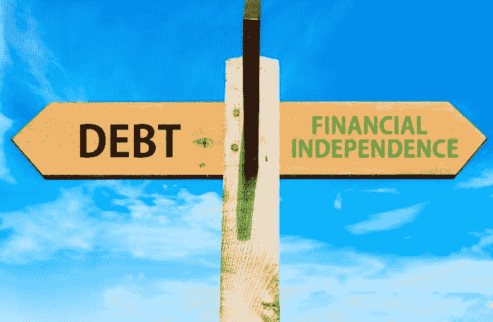
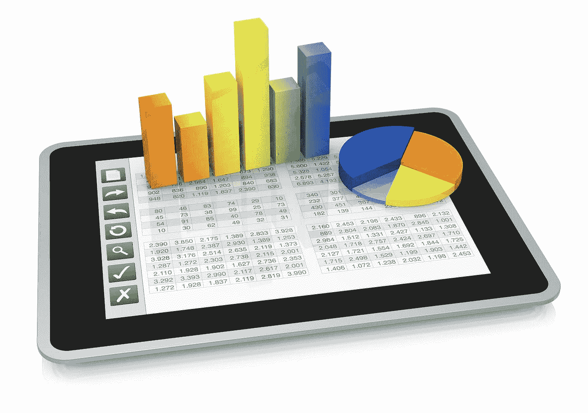

# 打破债务的束缚

> 原文：<https://medium.datadriveninvestor.com/break-the-stranglehold-of-debt-de1f2046fdbd?source=collection_archive---------43----------------------->

## 从情感悬崖上跳下后，财务问题就开始了

“我们非常厌恶风险，直到我们不再厌恶为止。没有任何理由，我们只是跳起来反对我们更好的判断。”

[Iva Ignjatovic](https://twitter.com/IvaIgnjatovic)

[Ivana Taylor](https://diymarketers.com/about/)

这就是今天的消费者心态。正如 Iva Ignjatovic 总结的那样，人们对消费持怀疑态度，直到他们跳下情感悬崖。于是，债务开始了。

Ignjatovic 是一名营销、战略、领导力和商业顾问，他与[的伊万娜·泰勒](https://diymarketers.com/about/)密切合作，伊万娜·泰勒拥有[DIY markets](https://diymarketers.com/)，这是一家“致力于帮助小企业主摆脱困境”的公司

Ignjatovic 和 Taylor 一起思考了为什么人们会有大量的个人或商业债务，以及如何解决这个问题。

个人和企业家一样，有时眼睛比钱包大。他们被诱惑去花超出他们能力范围的钱。他们还可能混淆自己的需求——明亮、闪亮的物体的催眠作用更是雪上加霜。

泰勒说:“人们认为，不管他们的收入水平如何，他们都应该或应该拥有某些物质上的东西。”

Ignjatovic 表示同意。

“有些人就是没有足够的自律来否定自己，”她说。

部分原因可能在于大多数家庭不记录支出。一项 Debt.com 民意调查显示“美国人认为预算是至关重要的，大多数人都在尝试——但不是很好。”

正如债务不可能一夜之间积累起来一样，解决方案也不会立竿见影。你没有人帮助你陷入债务，但现在是时候向金融专家咨询了，他可以帮助你制定一个复苏计划，并让你承担责任。

[Jackie Beck](https://twitter.com/realJackieBeck)

个人理财专家杰基·贝克提供了关于摆脱债务的艰难的个人建议。

泰勒回忆起自己很久以前面对金融怪兽时的痛苦。

“大学债务，愚蠢的债务，”她说。"我通过找一个室友来削减我的生活费用，购物很经济，不再出门."

最基本的预算技巧是接受你的需求和愿望之间的差异。如果你不知道必需品是什么，你就不会知道你是否有足够的钱购买它们。这将让你更好地了解你能负担得起什么，你能节省什么。

“我不擅长做预算，”泰勒说。“我控制着自己的‘需求’,为我知道我会想要或需要的东西——电脑、手机等——存钱。”

Ignjatovic 将这一过程归结为跟踪和控制支出，并寻找增加收入的方法。

Twitter 网站 [Make 柠檬水](https://twitter.com/yesmakelemonade)引用了[福布斯](https://twitter.com/Forbes)的一篇文章，该文章发现仅在美国就有超过 4400 万借款人总共欠下 1.5 万亿美元的[学生贷款债务](https://medium.com/datadriveninvestor/student-loan-payments-are-not-a-career-choice-7b84214acd7e)。2016 届学生的平均助学贷款为 37172 美元。

# 改变想法

摆脱债务始于心态的改变。不要接受债务是一种生活方式，也不要继续让你陷入债务的消费习惯。抱有希望，制定一个债务回收计划并坚持下去。

泰勒说:“挣脱束缚的方法是停止认为你需要人们试图卖给你的每一件小东西。”对此，Ignjatovic 补充道，“不要入不敷出。”

 [## 收入流始于滴滴

### 兼职和自由职业可以减轻你的经济负担

medium.datadriveninvestor.com](/income-streams-start-from-drips-7ec21e042a59) 

有两种方法可以存更多的钱:花更少的钱或者通过第二职业或副业增加收入。如果没有额外的收入，是时候认真审视一下消费习惯了。你是否被欲望而不是需求所吸引？

“重新定义你必须拥有的东西，”泰勒说。“你必须做出重大改变，缩减开支，削减成本。”

在这样做的同时，Ignjatovic 建议使用自动存款让储蓄自动运行。

这些步骤中的任何一个都可能有助于控制开支，这是令人清醒和复杂的。

根据[余额](https://twitter.com/thebalance)，2018 年 8 月，美国[消费者债务增长](https://www.federalreserve.gov/releases/g19/current/)6.2%，至 3.935 万亿美元。这超过了前一个月 3.915 万亿美元的记录。

其中，2.894 万亿美元为非循环债务，增长 6.4%。大多数非循环债务是教育和汽车贷款。2018 年 6 月，学校债务总计 1.53 万亿美元，汽车贷款 1.13 万亿美元。

信用卡债务总额为 1.042 万亿美元，增长了 5.6%。它超过了 2008 年创下的 1.02 万亿美元的纪录。但是信用卡债务只占总债务的 26.5%。2008 年这一比例为 38%。

# 调整有回报

即使是购买、消费或储蓄行为的微小变化也会对你的财务状况产生巨大影响。

例如，支付超过信用卡最低还款额。否则，这些支出可能会延续几十年。如果你不能全面支付更多，那就集中在一个小的余额上，先付清。这将释放资金，用于你下一个最小的账户，以此类推。

“我拒绝冲动购物，”泰勒说。“如果我想要什么，我会强迫自己至少等几天。你能相信我经常忘记这件事吗？”

如果有疑问，尝试电子表格。

Ignjatovic 说:“跟踪我所有的钱去了哪里真的帮助我做出更好的选择。”

首先列出你买了什么，花了多少钱，存了多少钱。这将有助于你对自己的习惯有一个真实的了解。因为行为取决于心态，这可能是你最小、最重要和最难实现的改变。

Taylor 认可 QuickBooks 用于合并费用报告。

对开支有了很好的把握，消费者将有更好的机会为应急基金留出资金，而全国范围内的应急基金也严重不足。

[市场观察](https://twitter.com/MarketWatch)各州的金融冲击可能如此具有破坏性，因为相对而言[很少有人有足够的现金储备](https://www.marketwatch.com/story/3-ways-to-protect-yourself-from-financial-shocks-2018-01-03)。Bankrate 的一项调查发现，63%的美国人没有足够的存款来轻松应付 500 美元的汽车修理费或 1000 美元的急诊室账单——包括收入 75000 美元或以上的人的近一半。

# 如释重负

变得无债一身轻可以消除忧虑。大多数家庭争吵都是为了钱。清除债务能让你享受生活中美好的事物，享受心灵的宁静。

“当我们还清了房子的贷款后，就像是获得了大幅加薪，”泰勒说。"我们无法相信会有这么多额外的钱。"

伊尼亚托维奇证明了无账单的超强实力。

“没有债务会给你力量和自由，”她说。“你选择去哪里，做什么。”

 [## 挑战扼杀你退休生活的神话

### 你百分之百确定你会有一个美好的退休生活吗？

medium.datadriveninvestor.com](/defy-the-myths-that-kill-your-retirement-340b6fe80170) 

拥有良好的财务心态也意味着抛弃常见的税收神话。

例如，克服抵押贷款扣除。如果你给了某人 100 美元作为 20 美元的回报，这听起来像是一笔好交易吗？然而，人们就是这么做的:付给贷款人 100 美元，只是为了节省 20 美元。为什么不把这 100 美元留给自己呢？

在相关新闻中，减税和就业法案也将个人税收抵免提高到如此之高，以至于大多数人都不会支付足够的抵押贷款利息来申请扣除。这是 30 至 40 年内不背负抵押贷款负担的另一个原因。

“拥有一个家是一个神话，”泰勒说。“你必须评估你的个人情况，看看这是不是一个好决定。”

Ignjatovic 反驳了另一个神话:你必须富有才能投资。

尽快摆脱债务是一个有价值的财务目标。虽然债务提取不是一个快速的过程，但如果你今天不开始这个过程，你永远也不会成功。

“把钱花在快乐的事情上，”泰勒说，同时牢记 Ignjatovic 的目标:现在就建立我的应急基金。

[泰勒的播客](http://bit.ly/2yfhek)讲述了债务以及个人和企业如何重新获得稳固的财务基础。

**关于作者**

吉姆·卡扎曼是拉戈金融服务公司的经理，曾在空军和联邦政府的公共事务部门工作。你可以在[推特](https://twitter.com/JKatzaman)、[脸书](https://www.facebook.com/jim.katzaman)和 [LinkedIn](https://www.linkedin.com/in/jim-katzaman-33641b21/) 上和他联系。

*原载于 2018 年 10 月 22 日*[*www.datadriveninvestor.com*](http://bit.ly/2AooY5B)*。*