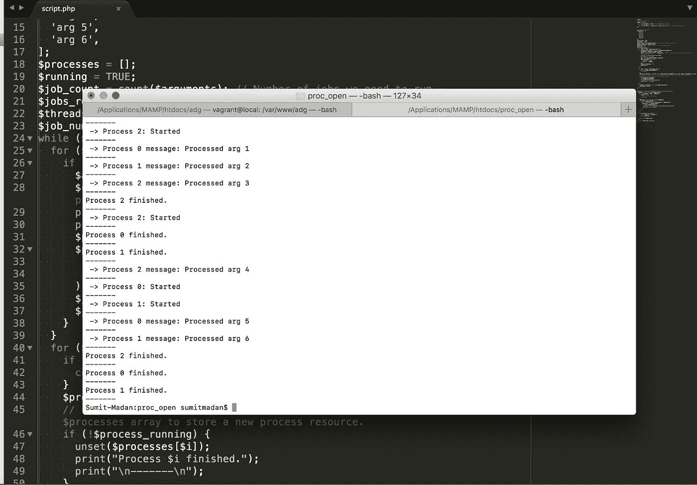

# 在 PHP 中将繁重的脚本分解成多个进程

> 原文：<https://medium.datadriveninvestor.com/break-your-heavy-script-into-multiple-processes-in-php-c2142b993947?source=collection_archive---------3----------------------->



很多时候我们不得不编写一些繁重的长时间运行的自动化脚本。当你的代码运行时，它作为一个单独的进程执行。一个进程可以消耗大量内存来完成。有时我们甚至不确定这个脚本会占用我们多少内存。我们的进程也可能由于“内存不足”问题而终止。所以问题是在这种情况下我们有什么选择？

如果我们能把我们的脚本分成多个进程会怎么样？幸运的是，PHP 为我们提供了在一个脚本中创建 N 个进程的方法。最棒的是，每个进程都会消耗自己的内存。PHP 有一个函数 [proc_open](http://php.net/manual/en/function.proc-open.php) ，它作为一个单独的进程执行一个命令。唯一的问题是，它只在 CLI(命令行界面)环境下有用。

让我们以一个非常简单的任务为例。

```
$arguments = [
  'arg 1',
  'arg 2',
  'arg 3',
  'arg 4',
  'arg 5',
  'arg 6',
];
foreach ($arguments as $arg) {
  echo 'Processed ' . $arg;  
}
```

在上面的例子中，如果你看到我们正在处理一个$arguments 的数组并打印它的值。 **$arguments** 是一个动态数组，其中元素的数量可以是数百或数千。显然，我们不仅仅要打印值，我们将使用每个参数执行一个特定的任务。任务可以是任何事情，比如更新数据库或发送时事通讯。现在它是一个单一的脚本和单一的过程。

让我们把这个例子分成多个过程。我们将创建两个文件，一个是 child.php 的**，它将需要一个参数并进行实际处理，另一个是 script.php 的**，它有创建进程的代码。****

******child.php******

```
**echo 'Processed ' . $argv[1];**
```

******script.php******

```
**// descriptor array
$desc = array(
  0 => array('pipe', 'r'), // 0 is STDIN for process
  1 => array('pipe', 'w'), // 1 is STDOUT for process
  2 => array('file', '/tmp/error-output.txt', 'a') // 2 is STDERR for process
);// List of arguments
$arguments = [
  'arg 1',
  'arg 2',
  'arg 3',
  'arg 4',
  'arg 5',
  'arg 6',
];
$processes = [];
$running = TRUE;
$job_count = count($arguments); // Number of jobs we need to run.
$jobs_remaining = $job_count;
$threads = 3; // Number of jobs to run simultaneously.
$job_num = 0;
while ($running) {
  for ($i = 0; $i < $threads; $i++) {
    if ($jobs_remaining > 0 && !isset($processes[$i])) {
      $argument = $arguments[$job_num];
      $cmd = 'php child.php "' . $argument . '"'; // Pass $argument to child.php so it can process on it.
      print(" -> Process $i: Started");
      print("\n-------\n");
      $p = proc_open($cmd, $desc, $pipes);
      $processes[$i] = array(
        'process' => $p,
        'pipes' => $pipes,
      );
      $jobs_remaining -= 1;
      $job_num++;
    }
  }
  for ($i = 0; $i < $threads; $i++) {
    if (!isset($processes[$i])) {
      continue;
    }
    $process_running = _monitor_process($i, $processes[$i]['process'], $processes[$i]['pipes']);
    // Check if a process is in running state or not. If not then unset the prcess from $processes array to store a new process resource.
    if (!$process_running) {
      unset($processes[$i]);
      print("Process $i finished.");
      print("\n-------\n");
    }
  }
  if ($jobs_remaining < 1 && empty($processes)) {
    $running = FALSE;
  }
}function _monitor_process($thread_id, $process, $pipes) {
  $status = proc_get_status($process);
  foreach ($pipes as $id => $pipe) {
    if ($id == 0) {
      // Don't read from stdin!
      continue;
    }
    $messages = stream_get_contents($pipe);
    if (!empty($messages)) {
      foreach (explode("\n", $messages) as $message) {
        $message = trim($message);
        if (!empty($message)) {
          print(" -> Process $thread_id message: $message");
          print("\n-------\n");
        }
      }
    }
  }
  if (!$status['running']) {
    foreach ($pipes as $pipe) {
      fclose($pipe);
    }
    proc_close($process);
  }
  return $status['running'];
}**
```

****让我简单解释一下代码:****

```
**// descriptor array
$desc = array(
  0 => array('pipe', 'r'), // 0 is STDIN for process
  1 => array('pipe', 'w'), // 1 is STDOUT for process
  2 => array('file', '/tmp/error-output.txt', 'a') // 2 is STDERR for process
);**
```

****它作为进程间的输入/输出流工作。因此，我们可以将一个流程的输出作为另一个流程的输入。这里的“管道”意味着它是匿名的，只要进程在运行，它就会包含数据。“文件”是一个命名管道，除非我们手动删除该文件，否则它将永远存在。****

```
**// List of arguments
$arguments = [
  'arg 1',
  'arg 2',
  'arg 3',
  'arg 4',
  'arg 5',
  'arg 6',
];**
```

****proc_open 用于执行命令，因此我们可以使用现有的命令，也可以创建自定义命令，这些命令将带参数来执行一些特定的任务。我们将把这些参数一个接一个地传递给我们的子脚本，它将完成特定的任务。****

```
**$job_count = count($arguments); // Number of jobs we need to run.**
```

****在上面的例子中，$arguments 有 N 个元素需要处理。所以 N 个参数意味着 N 个作业。****

```
**$threads = 3; // Number of jobs to run simultaneously.**
```

****在一个站点中，可能有大量的内容需要处理，所以我们不知道会有多少工作。由于 CPU/服务器的限制，我们无法同时运行所有进程。因此，我们在这里设置一次打开的进程数量。****

```
**for ($i = 0; $i < $threads; $i++) {
  if ($jobs_remaining > 0 && !isset($processes[$i])) {
    $argument = $arguments[$job_num];
    $cmd = 'php child.php "' . $argument . '"'; // Pass $argument to child.php so it can process on it.
    print(" -> Process $i: Started");
    print("\n-------\n");
    $p = proc_open($cmd, $desc, $pipes);
    $processes[$i] = array(
      'process' => $p,
      'pipes' => $pipes,
    );
    $jobs_remaining -= 1;
    $job_num++;
  }
}**
```

****我们正在设置一个$processes 数组，用于存储每个进程返回的资源和在进程中创建的文件指针($pipes)(在描述符数组中指定)。****

```
**$messages = stream_get_contents($pipe);**
```

****我们从进程运行时写入的管道中读取数据。我们可以将它作为另一个过程的输入。****

```
**fclose($pipe);
proc_close($process);**
```

****我们需要首先关闭在进程中创建的管道，然后我们需要关闭进程资源。****

******死锁情况:**在例子中，我们做了一个非常基本的任务。显然，在我们的过程中，我们需要访问数据库。多个进程写入同一个数据库会导致死锁情况。在这种情况下，解决方案只是在 my.cnf 文件中将变量“innodb_locks_unsafe_for_binlog”设置为 1。****

******仅此而已！******

******参考文献:******

1.  ****[Proc_Open:与外界通信](https://www.sitepoint.com/proc-open-communicate-with-the-outside-world/)****
2.  ****[PHP 中的异步处理或多任务处理](https://www.mullie.eu/parallel-processing-multi-tasking-php/)****
3.  ****[多处理第 1 部分:如何让德鲁斯狂奔](https://www.deeson.co.uk/labs/multi-processing-part-1-how-make-drush-rush)****