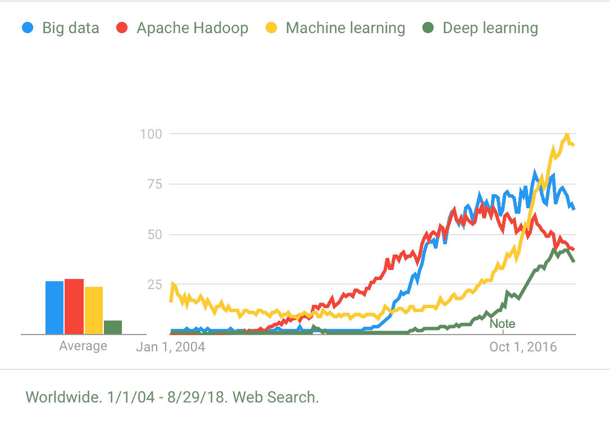

# 打破大数据的空洞概念

> 原文：<https://medium.datadriveninvestor.com/breaking-down-the-vacuous-vs-of-big-data-7fae8911b403?source=collection_archive---------19----------------------->

“three persons in front of table” by [rawpixel](https://unsplash.com/@rawpixel?utm_source=medium&utm_medium=referral) on [Unsplash](https://unsplash.com?utm_source=medium&utm_medium=referral)

到目前为止，您可能已经听说过大数据的三个经常被重复使用的方面——数量、速度和多样性。甚至迟至 2018 年 5 月，[关于它的文章还在写](https://www.forbes.com/sites/bernardmarr/2018/05/21/how-much-data-do-we-create-every-day-the-mind-blowing-stats-everyone-should-read/#371c952860ba)；我最近参加了一个会议，会上主持人不仅把 V 作为事实重复了一遍，还加上了第四或第五个 V。

具有讽刺意味的是，对于一个信奉洞察力的领域，人们仍然在那些空洞的 Vs 的痛苦中挣扎，并且未能说出那些 Vs 是如何符合一个经典的逻辑谬误的；也就是一种生态谬误——把整体错当成部分。

这种谬论的起源可以追溯到 2012 年 4 月 Apache Hadoop 的最初发布，技术供应商需要一种方式来销售平台堆栈并使其变得性感(但对 C-suite 的 FOMO 来说足够可怕)，因此“大数据”诞生了。你可以在下面的谷歌趋势图中看到，人们对*大数据*没有搜索兴趣，但在 *Hadoop 的【beta 版发布时，搜索兴趣突然上升(尽管自 2006 年开始开发以来，人们对 Hadoop 的兴趣稳步增长)；而对*机器学习*兴趣的回潮，与*深度学习*的发展相关。*

这种工作方式围绕着引用一大堆数字(“分享的大量照片，无数的帖子”等等)。)让它看起来像是公司错过的或未开发的机会(但大多数情况下是一堆空洞的承诺)。

# 真空速度

Visa 和 MasterCard 每年处理大约 620 亿笔交易。某些行业例外(如广告技术、物联网监控等。)，很少有企业有可能接近这个极限。

由于不加选择的共享，每秒钟可能会在全球范围内产生大量数据，但在任何组织中，数据速度都会受到客户行为的制约。例如，在线和离线零售中，不太可能需要处理过量的数据(假设当前系统未满负荷)，除非企业能够显著扩大客户流量。

# 空虚的种类

在传统的 SQL/数据库上存储和检索除了高度结构化的数字和文本之外的任何内容都是一件痛苦的事情。能够处理非结构化数据、图像、视频等的新平台的出现。更有效地扩展了组织可以收集和分析的内容。

同样，除了某些行业例外，这在很大程度上是没有实际意义的，因为大多数客户生成的数据往往范围有限。例如，一家金融机构将根据客户的交易模式优先考虑欺诈检测算法，而不是依靠分析他们的自拍照片。

这种多样性指的是数据的格式，而不是数据的内容，这将我们带到下一个 V:

# 真空体积

收集 100 倍以上的数据并不能带来更好的见解。许多“大数据”数据集非常稀疏(例如，行数比列数多，许多变量几乎为空等。)这限制了分析的种类和潜在的应用。数量没有纠正数据缺陷。

例如(真实故事)如果一个人有万亿字节的数据，只有姓氏、时间戳和交易金额，则没有分析或算法或“深度学习”可以找出如何推动客户保留和追加销售。数据集中缺少确定或优化问题所需的变量(即使只是代理)。

# 将技术车放在分析马之前

投资 Hadoop 集群、大数据堆栈等。对于不需要的业务，不会自动使它变得更好；类似于将电子表格从桌面传输到网络驱动器，它并不会使数据变得更好，也不会实现更好的分析。一个注定失败的方法是认为所需要的只是投资最新的技术堆栈和数据科学独角兽，你的业务将会神奇地转变。

我从 Y2K 开始就从事数据迁移工作(并且在数据湖流行之前就创建了数据湖)，我可以保证除了实现之外还会有许多隐藏的成本；在很大程度上，唯一获得直接价值的人是供应商的先令平台。相反，应该根据最适合所需的分析(和算法)类型来做出架构决策，因为数据的结构化和检索方式对不同分析(和算法)的速度、准确性和成本有着最大的影响。数据架构必须围绕分析需求(基于明确的业务目标和用例)，而不是光鲜的宣传册承诺。