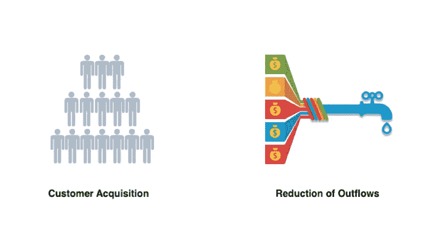
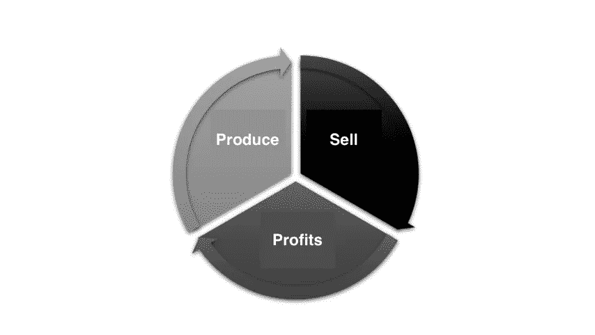
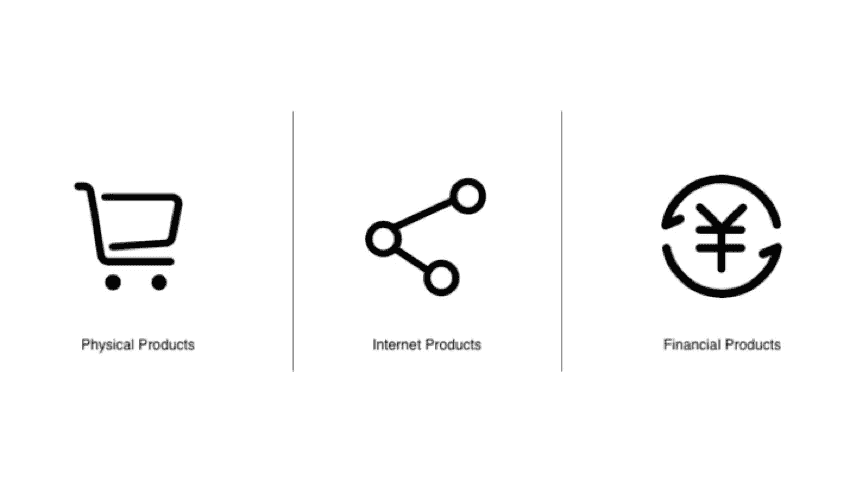
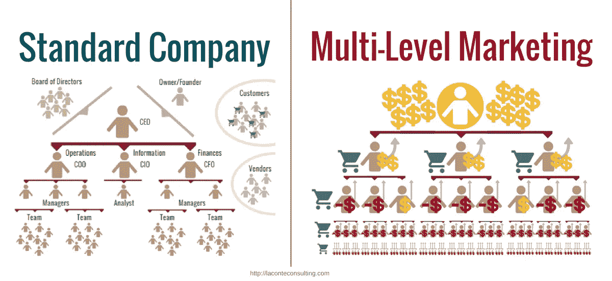
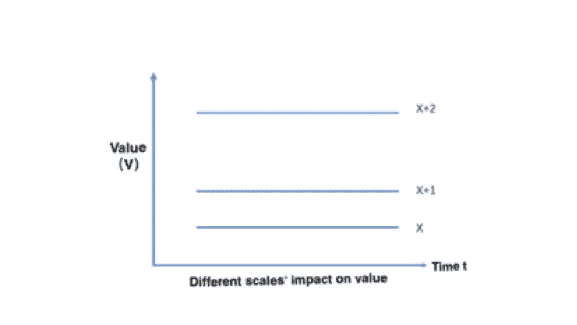
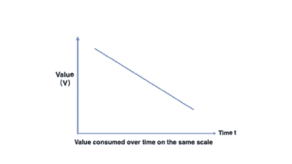
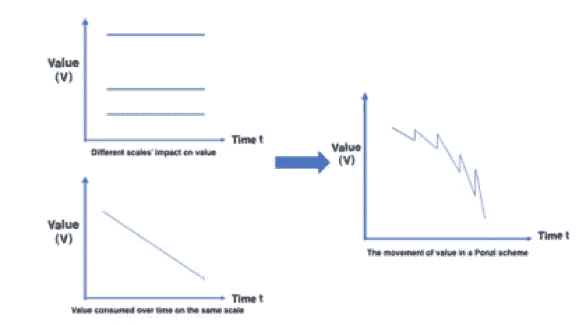
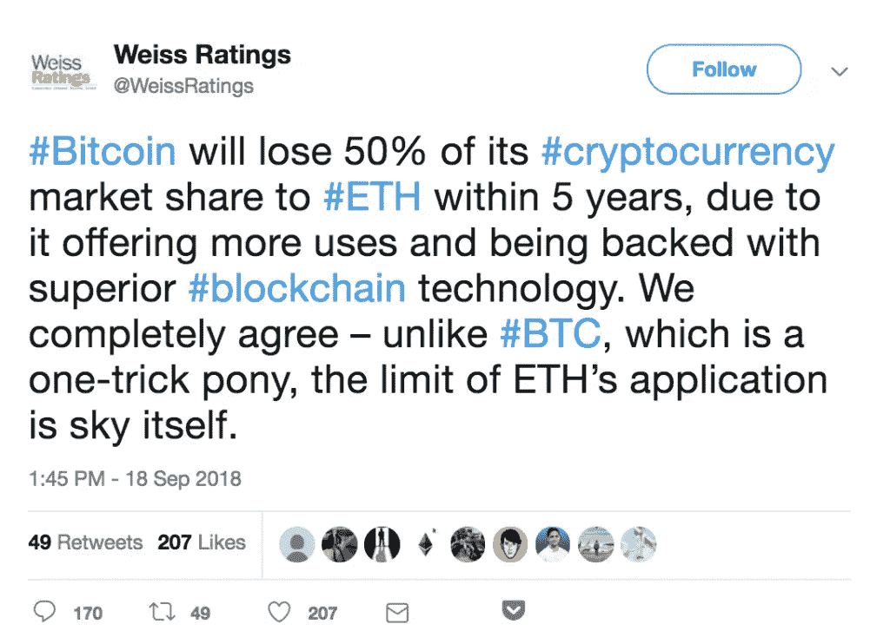

# 冲破庞氏骗局的迷雾，寻找价值的曙光，第一部分

> 原文：<https://medium.datadriveninvestor.com/breaking-through-the-mist-of-ponzi-to-find-the-dawn-of-value-part-1-990dac8520df?source=collection_archive---------9----------------------->

## *我们将进一步分析庞氏骗局如何通过获取客户来扩大收入来源，讨论推广和传播的价值。我们还介绍了注定崩溃的 MLM 模型和区块链行业的推广概念。*

*由创新研究机构 X-Order 的研究员 Robin Gu 撰写，该机构试图结合分布式计算、计算博弈论、人工智能和密码学等跨学科领域来发现未来的扩展订单。它的创始人是托尼·陶，他也是 NGC 风险投资公司的合伙人。*

“在庞氏骗局的迷雾下，不仅是痛苦和磨难，还有价值的曙光……”

 [## 2019 年成为主流的 7 大区块链挑战及更多...数据驱动的投资者

### 教训是永远不要停止学习和成长。关于技术、金融、工作场所、生产力和…

www.datadriveninvestor.com](https://www.datadriveninvestor.com/2019/03/25/top-7-blockchain-challenges-to-go-mainstream-in-2019-more/) 

历史上最长的庞氏骗局是伯尼·麦道夫的对冲基金，持续了 20 多年。这种持久的骗局一般在以下两个方面做得比较好:

1.**获客:**保持源源不断的资金流入庞氏骗局；

2.**减少流出:**最大限度减少投资者的撤资频率和金额。

简而言之，它们可以概括为拓宽收入来源和减少外流。

事实上，以上两个特征并不是庞氏骗局所独有的，公司甚至经济也是如此。从经济的角度来看，庞氏骗局的目的和传统公司的目的是一样的——尽可能长久地生存下去。

> 而庞氏却采取了以毒解渴的手段。

# **拓宽收入来源:通过传统营销获得客户与 MLM**

一般来说，一个经济体通过销售其生产的产品来获取利润，从而促进其发展。

然而，庞氏骗局的发展模式是不同的。它不涉及**组织的任何努力**(除了他们为 MLM 编造的故事)，而是通过直接的推广和传播来促进组织的进步。

促销和宣传是任何产品在销售过程中面临的问题，也是每个企业在销售产品时必须考虑的问题。

## **推广和传播的价值**

在进入正题之前，我们先思考以下问题:

> 对于某一类产品(实物、互联网或金融)，它的价值会因为推广和传播而发生变化吗？

这个答案是肯定的。推广一定会带来价值增长。

通过分析实物、网络和金融产品，我们可以得出以下结论:

**实物产品**

它们的价值**相对恒定**，不太可能因为推广和传播而改变价值。然而，随着互联网的兴起，许多实物产品的价值逐渐受到网络效应的影响，这种影响最能体现在工业产品的标准化上。一个产品标准化后的推广会带来更多的用户，反过来又会强化标准。

> 假设价值很大程度上受客户需求的影响，实物产品的价值会随着用户数量的增加而增加。

**互联网产品**

> 互联网产品的价值变化可以用*梅特卡夫定律*来解释。

即时通讯软件、视频网站等需要通过互联网接入的产品，其价值随着用户数量的增加而增加。每个新用户都在为产品增加价值。

**理财产品**

> 很多金融产品也有网络效应。

当你需要借贷服务时，你倾向于选择用户较多的借贷平台，这样你的资金需求更快得到匹配。在选择交易所时也是如此。人们倾向于选择流动性更好的交易所，以快速满足自己的交易需求。更好的流动性意味着更多的人在平台上交易，因此平台的**价值增加。**

## **注定崩溃的 MLM 模型**

由于任何产品的推广和传播都会在某些方面增加价值，有些人可能会说这正是庞氏骗局的优点，或者更准确地说，MLM(多层次营销)组织。他们可以**通过包装、吹嘘、释放高息诱惑等咄咄逼人的促销方式**获得足够的资金支持。

(The Economic Secretariat)

那么，如果他们能增加他们的价值，为什么他们没有持续很长时间，而是最终消失了呢？那是因为一个关键因素导致**价值随着时间的推移而磨损**正如我们之前的文章所描述的——“*货币革命:集商品、证券、货币于一身:“超级航母”币安加密货币(BNB)，部分*[*1*](https://medium.com/datadriveninvestor/currency-revolution-combining-commodities-securities-and-currency-in-one-super-carrier-4d11bcef7db2)*&*[*2*](https://medium.com/datadriveninvestor/part-2-of-2-currency-revolution-combining-commodities-securities-and-currency-in-one-super-97753e1bfbe3)*。*特别是*，这些产品的用户*如果没有满足他们需求的，就不会加入。

庞氏骗局以咄咄逼人的方式扩张。

> 价值的增加远远不足以补偿未来所消耗的价值，从而导致不可避免的崩溃。

这里我们可以简单的从这两个维度来**模拟一下。扩张带来的价值增加通常用*梅特卡夫定律*的公式来说明。**

The Scales’ Impact on Value

上图显示了不同尺度下价值与时间的关系。

> 在梅特卡夫定律中，只考虑规模和价值的关系。

我们可以看到，在同样的尺度上，价值随时间的**变化是固定的。**然而，当标度从 X 变为 X+1，X+2 时，该值在垂直维度上增加，根据*梅特卡夫定律*的**公式 V=CX2，该值随着标度的扩大而非线性增长。**

Value Consumed Over Time on the Same Scale

这样的消耗是线性的，速率与规模成正比。也就是说，如果用户数为 x，那么在∏t 的时间内要支付的利息为 r1x (r1 为承诺利率)。这里我们没有考虑复利和资本退出。因此，**值随时间下降。**

The Movement of Value in a Ponzi Scheme

> 把这些都放在一起，你可以看到，如果一个庞氏骗局的规模不扩大，它的价值将以一个损失率被消耗。规模的扩大会带来价值的暴涨，每一次价值的增长都会超过上一次。但同时，每一次规模的扩大也会加速价值的消耗，最终，停止价值的增长。

因此，庞氏骗局每次扩大规模都必须**增加其价值，以减缓价值的消耗。**然而，对于影响价值的两大因素——“尺度”总是有上限的，而“时间”可以持续多久，这样的方案必然以崩盘告终。

## **区块链行业的推广模式**

> 在区块链行业，有许多项目由于缺乏价值提升而停止扩张。

一个好的项目也需要好的营销和宣传。质量好的项目最终被迫关闭，因为创始团队把大部分时间花在开发上**而没有推广获得资金和生存**。这种情况不仅在区块链行业很常见，在传统的初创企业中也很常见。

(news.bitcoin)

相比之下，许多模型化的代币，或其他类似庞氏骗局的项目，基本上没有透露任何关于开发进度或商业实践的信息。他们唯一做的就是吹嘘参与者如何从他们的项目中直接赚取巨额利润。

虽然更常见的是，一些项目不是庞氏骗局，但有实际的业务和发展。然而，由于他们如此擅长说大话，很少有人会关心落后的实际实施。

> 结果，它透支了项目的价值，尽管它吸引了大量的资金。

# 下一步是什么？

*在* [*第二部分*](https://medium.com/@xorder/breaking-through-the-mist-of-ponzi-to-find-the-dawn-of-value-part-2-9c67d3eb2bab) *中，我们将进一步分析庞氏骗局是如何通过软硬兼施的留存模型来减少资金外流的，引用“超级富豪”这个游戏来介绍强制锁定政策、软政策和预期管理。最后，我们对文章进行了总结。*

> *在我们的*[*Linkedin*](http://linkedin.com/company/xorderglobal)*上与我们连线！*
> 
> ***由*** *(通过我们的微信账号)****:****Transladom*
> 
> ***编辑:*** *谭*