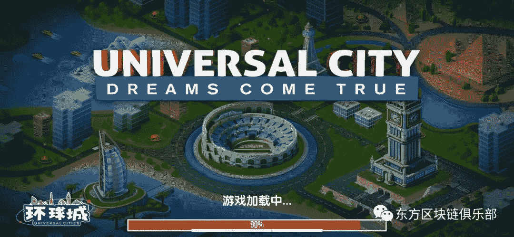
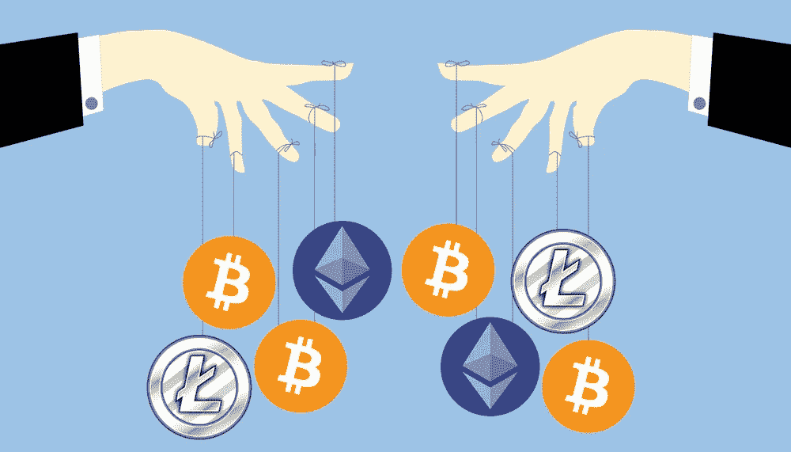

# 冲破庞氏骗局的迷雾，寻找价值的曙光，第二部分

> 原文：<https://medium.datadriveninvestor.com/breaking-through-the-mist-of-ponzi-to-find-the-dawn-of-value-part-2-9c67d3eb2bab?source=collection_archive---------7----------------------->

## *我们进一步分析庞氏骗局如何通过胡萝卜加大棒的留存模型来减少资金外流，引用“超级富豪”游戏来引入强制锁定政策、软政策和预期管理。最后，我们对文章进行了总结。*

*由创新研究机构 X-Order 的研究员 Robin Gu 撰写，该机构试图结合分布式计算、计算博弈论、人工智能和密码学等跨学科领域来发现未来的扩展订单。它的创始人是托尼·陶，他也是 NGC 风险投资公司的合伙人。*

# **减少资金外流:胡萝卜加大棒的留住人才模式**

用户留存的概念并不是庞氏骗局独有的。传统经济体也见证了留存模式的逐渐演变。

 [## 2019 年成为主流的 7 大区块链挑战及更多...数据驱动的投资者

### 教训是永远不要停止学习和成长。关于技术、金融、工作场所、生产力和…

www.datadriveninvestor.com](https://www.datadriveninvestor.com/2019/03/25/top-7-blockchain-challenges-to-go-mainstream-in-2019-more/) 

最初，没有规则。然后我们有一些激励和惩罚。比如，熟客可以获得折扣，而提前支取定期存款则会导致所有利息的损失。此外，我们还有一些强制性政策，例如延长基金赎回的锁定期。

对于传统经济体来说，用户留存差就像慢性毒药，可以逐渐腐蚀他们的成果，直到最后；对于一个庞氏骗局来说，用户(资金)的留存基本上就是它的命根子。一旦发生挤兑，导致用户和大量资金迅速流失，庞氏骗局就会崩溃。

(Program-Ace)

相应的，我们可以看到生命周期更长的**庞氏骗局**往往会相当注重**资金的留存**并采用一些**难以置信的精细化管理模式**。简单来说，他们经常利用胡萝卜加大棒的原则来最大限度地保留用户资金。用拜尔链的案例可以更好的理解。

## **强制锁定政策—限制参与者的行为**

“Super Rich” of Baer Chain

“超级富豪”游戏只为 ETH 提供了一个单向通道，这意味着购买 ETH 的玩家只能以**新生成的 BRC**的形式**取回自己的钱**。与传统庞氏骗局相比，该游戏不承诺任何 ETH 的回报。所有 eth 都被强制锁定在系统中。

继《超级富豪》之后，拜尔连锁(BRC)推出新游戏:**环球城**。目的是吸引玩家存入 BRC 以获取更多利润。

(card.shangjieqq)

> 因此，本质上，它要求玩家锁定他们从先前游戏中获得的 BRC。

Masternodes 奖励类似于所有其他区块链项目，为锁定系统中的资金提供节点奖励。

**消耗 BRC =永久锁**:拜尔链还推出了一款名为超级战士的迷你游戏，其真实目的就是消耗 BRC。然而，它未能达到预期目标，因此该项目推出了环球城市。《超级士兵》本身也可以被视为倡导强制禁售政策的概念。

Hayek

哈耶克的哲学是，仅靠**控制和干预**，是不可能成功管理一个经济体的，而**市场秩序**必须以“由内而外”的方式自发形成**。**用禁售政策强制圈钱的骗局，在成熟的那一刻必然面临崩溃的高压。

> 因此，也需要运用一些软政策。如果强制性政策是为了控制一个人的行为，那么软性政策是为了降低一个人的行为意愿，这在某种程度上可以看作是一个与预期管理相关的问题。

## **BRC 的软政策——影响参与者的意愿**

强大的营销团队——通过传销策略在参与者中形成所谓的“信仰”。

**价格操纵**——某种程度上**证实了参与者的【信念】**。通过影响 BRC 的价格，团队形成正反馈循环，让更多人相信 BRC 的价格会稳步上升。这增强了他们持有 BRC 而不是出售的意愿。

(NullTX)

值得一提的是，许多参与者都**充分意识到风险**，无论是传统融资、庞氏骗局还是销售加密货币。然而，屈服于高额利润的诱惑，他们盲目地参加这些活动。

对于这群人来说，**洗脑式的预期管理**是行不通的。唯一能改变他们预期的是二级市场上的**价格变动**。

> 职业玩家会试图提前捕捉到崩溃的信号，而推广者要反向利用信号，打破这些玩家的预期。

但由于发起人在二级市场拥有**更强的控制权，定价博弈很容易变成**零和博弈。****

## **期望管理**

预期管理是金融领域的一个关键因素，尤其是在二级市场。所有二级市场参与者的唯一目标是**预测交易对手的预期，以便采取适当的行动。**

(The Startup Medium)

价格操纵的传统行为也可以概括为:通过价格操纵影响参与者的预期，以**为制造者的下一步行动**铺路。

在庞氏骗局中，发起人通常更了解参与者，也更容易影响他们的预期。

> 所以在二级市场，给你带来最终成功的不是你对市场的理解，而是你对交易对手的理解。

## 结论

通过科学地研究庞氏骗局的具体操作，我们可以从中吸取更多的教训，而不是简单地远离这些骗局。

> 任何项目的成功都离不开适当的宣传和推广。但是做推广的时候，重要的是平衡价值提升和价值损失。否则，从长远来看，不平衡的促销活动往往会适得其反。

此外，还需要注意对参与者的**强制政策**以及**预期管理。**

> 这就是代币经济设计的意义。

# 下一步是什么？

我们将在接下来的文章中进一步讨论期望管理的主题。

> *在我们的*[*Linkedin*](http://linkedin.com/company/xorderglobal)*上与我们连线！*
> 
> ***由*** *(通过我们的微信账号)****:****Transladom*
> 
> ***编辑:*** *谭*