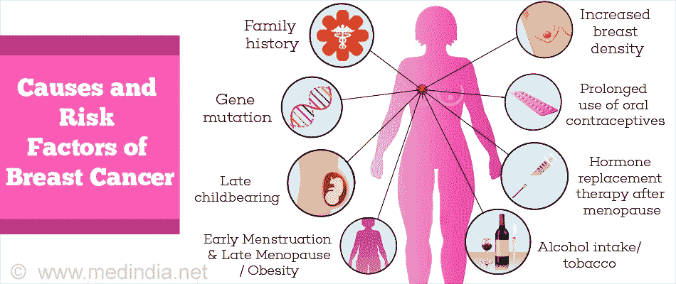
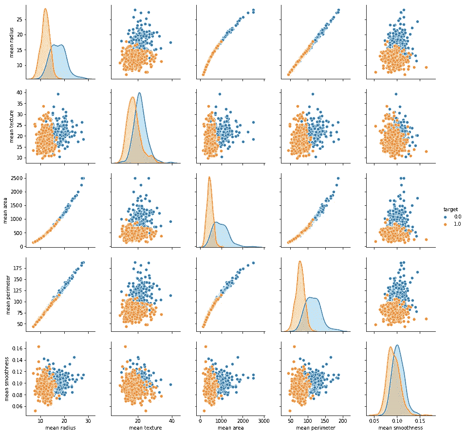
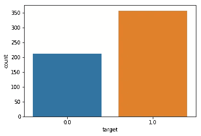
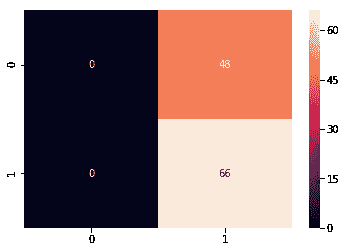
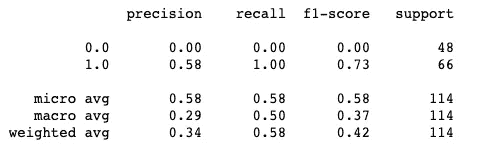
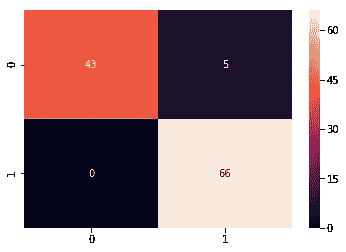
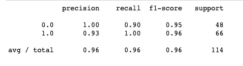

# 使用机器学习的乳腺癌检测

> 原文：<https://medium.datadriveninvestor.com/breast-cancer-detection-using-machine-learning-475d3b63e18e?source=collection_archive---------0----------------------->

[](http://www.track.datadriveninvestor.com/1B9E)

> 乳腺癌是全球女性中最常见的癌症，占所有癌症病例的 25%，在 2015 年影响了 210 万人。早期诊断大大增加了存活的机会。
> 癌症检测中的关键挑战是如何将肿瘤分为恶性或良性，机器学习技术可以极大地提高诊断的准确性

研究表明，大多数有经验的医生可以以 79%的准确率诊断癌症，而 91%的正确诊断是使用机器学习技术实现的。


word cloud

*在本案例研究中，我们的任务是使用来自多个细胞图像的疼痛特征将肿瘤分类为恶性或良性肿瘤。*

让我们来看看癌症诊断和分类流程。
因此，癌症诊断过程的第一步是进行我们称之为最终针吸或任何简单地从肿瘤中提取一些细胞的过程。在那个阶段，我们不知道那个人是恶性的还是良性的。你们可以看到，当你说恶性或良性时，这是良性肿瘤的图像，这是恶性肿瘤。当我们说良性的时候，这意味着肿瘤不会扩散到患者体内，这是安全的。如果是恶性的，那就意味着是癌性的。



这意味着我们需要干预并实际阻止癌症的生长
我们在机器学习方面所做的事情，所以现在我们提取了所有这些图像，我们希望指定这些图像中的癌症是恶性还是良性，这就是整个想法。
因此，我们从这些图像中提取一些特征，当我们看到的特征意味着图像中的一些特征时，例如半径，例如纹理周长区域平滑度等细胞。然后我们将所有这些特征输入到我们的机器学习模型中，在某种程度上，这是一种大脑。

我们的想法是教会机器如何对图像或数据进行分类，并告诉我们它是恶性的还是良性的，例如在这种情况下，无需任何人工干预，这将改变模型。一旦模型经过训练，我们就可以在实践中使用它来对新图像进行分类。这就是癌症诊断的整个过程。

# 第一步:问题陈述

*   基于若干观察/特征预测癌症诊断是良性还是恶性
*   使用了 30 个特征，例如:
*   `- radius (mean of distances from center to points on the perimeter)`
*   `- texture (standard deviation of gray-scale values) - perimeter`
*   `- area - smoothness (local variation in radius lengths)`
*   `- compactness (perimeter^2 / area - 1.0)`
*   `- concavity (severity of concave portions of the contour)`
*   `- concave points (number of concave portions of the contour)`
*   `- symmetry`
*   `- fractal dimension ("coastline approximation" - 1)`
*   使用所有 30 个输入要素，数据集是可线性分离的
*   实例数量:569
*   类别分布:恶性 212 例，良性 357 例
*   目标类别:
*   `- Malignant - Benign`

# 步骤 2:导入数据

```
# import libraries 
import pandas as pd # Import Pandas for data manipulation using dataframes
import numpy as np # Import Numpy for data statistical analysis 
import matplotlib.pyplot as plt # Import matplotlib for data visualisation
import seaborn as sns # Statistical data visualization
# %matplotlib inline 
```

导入数据集

```
# Import Cancer data drom the Sklearn library
from sklearn.datasets import load_breast_cancer
cancer = load_breast_cancer()
```

# 步骤 3:可视化数据

```
sns.pairplot(df_cancer, hue = 'target', vars = ['mean radius', 'mean texture', 'mean area', 'mean perimeter', 'mean smoothness'] )
```



```
sns.countplot(df_cancer['target'], label = "Count")
```



热图

```
# Let's check the correlation between the variables 
# Strong correlation between the mean radius and mean perimeter, mean area and mean primeter
plt.figure(figsize=(20,10)) 
sns.heatmap(df_cancer.corr(), annot=True)
```


Heatmap of datset

# 第四步:模型训练

```
# Let's drop the target label coloumns
X = df_cancer.drop(['target'],axis=1)from sklearn.model_selection import train_test_splitX_train, X_test, y_train, y_test = train_test_split(X, y, test_size = 0.20, random_state=5)
```

# 步骤 5:评估模型

```
y_predict = svc_model.predict(X_test)
cm = confusion_matrix(y_test, y_predict)sns.heatmap(cm, annot=True)
```



```
print(classification_report(y_test, y_predict))
```



# 步骤 6:改进模型

```
min_train = X_train.min()range_train = (X_train - min_train).max()X_train_scaled = (X_train - min_train)/range_trainsns.scatterplot(x = X_train['mean area'], y = X_train['mean smoothness'], hue = y_train)from sklearn.svm import SVC 
from sklearn.metrics import classification_report, confusion_matrixsvc_model = SVC()
svc_model.fit(X_train_scaled, y_train)y_predict = svc_model.predict(X_test_scaled)
cm = confusion_matrix(y_test, y_predict)sns.heatmap(cm,annot=True,fmt="d")
```



```
print(classification_report(y_test,y_predict))
```



图片:[https://goo.gl/m812UK](https://goo.gl/m812UK)，[www.medindia.net](http://www.medindia.net)

## 来自 DDI 的相关故事: