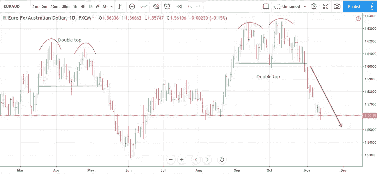
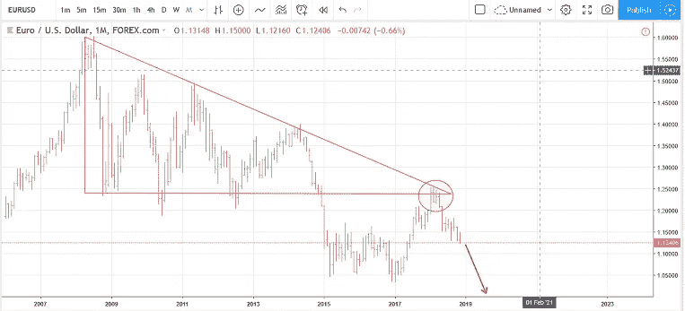

# 英国退出欧盟和意大利离开了……但是欧元的下一步是什么？

> 原文：<https://medium.datadriveninvestor.com/brexit-italeave-but-whats-next-for-the-euro-a585c8476bfa?source=collection_archive---------40----------------------->

在我的上一份市场报告中，我分享了一个通过欧元做空欧元的机会，当时多个时间框架都在排队并指向下方。从那以后，这对组合崩溃的速度甚至超过了我的预期:

在突破支撑线后，这对组合就无法停止下跌，我可以获得很大的利润。支撑颈线是一条线，上面显示为绿色，连接买家高度集中的区域。

# 欧元的下一步是什么？

尽管欧元大幅走低，但我认为欧元最糟糕的时候还没有到来。

有时，市场的持续波动会让人迷失方向，分散我们对全局的注意力。这就是我喜欢看长期图表的原因，就像我喜欢看欧元的近期交易一样。以下是欧元兑美元的长期月度图表:

三角形是一种图表模式，称为下降三角形。它是熊市，意味着它表明价格可能会突破三角形向下。这是 2015 年初发生的事情，但随后价格在 1.05-1.15 左右盘整，并在 2017 年初开始回升至三角形。

如果没有这种宏观视角的好处，这可能会被视为欧元的新一轮牛市，预计未来几年价格将会上涨。

但是从上面可以清楚地看到，三角形仍然对市场有影响，因为价格正好在预计的阻力点下跌。此外，这个三角形的大小和高度表明，很可能会有更多的下跌空间。

对于图表形态来说，这种在最初突破后的回撤实际上是非常普遍和正常的。既然阻力区域的重新测试已经完成，最小阻力路径对这一对来说要低得多。我预计价格至少会跌至 1.05 的前期支撑位，但最有可能在明年左右回到平价(1.00)以下。

## 基本面呢？什么时候？而这对黄金会有什么影响？

> [点击这里继续阅读我博客上的这篇文章](https://mangrovetrading.com/brexit-italeave/)

## 关于迈克尔

我是一名职业交易员，从 2013 年开始做交易。我想通过培养一群有决心、有奉献精神的人，来分享交易给我的机会和自由。[通过这个详细的免费培训视频学习我的简单技术。](https://mangrovetrading.com/training)

本文最初发表于 mangrovetrading.com/brexit-italeave

