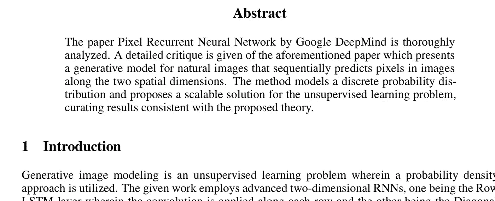
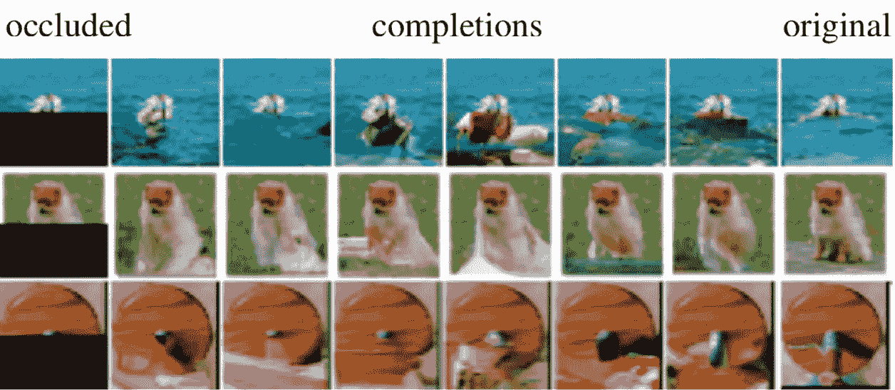
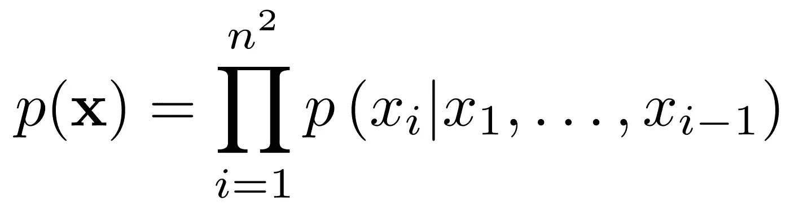
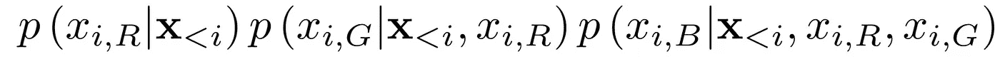
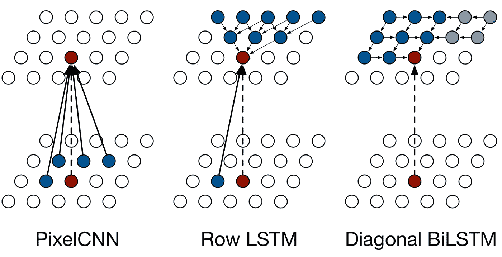

# 对“像素递归神经网络”一文的简要总结和详细评论

> 原文：<https://medium.datadriveninvestor.com/brief-summary-and-detailed-critique-on-the-paper-pixel-recurrent-neural-networks-93dc8a030fd7?source=collection_archive---------4----------------------->

# 介绍

生成图像建模是一个无监督的学习问题，其中利用了概率密度方法。给定的工作采用先进的二维 RNNs，一个是行 LSTM 层，其中沿着每行应用卷积，另一个是对角 BiLSTM 层，其中沿着对角线应用卷积。

还提出了第二种简化的 PixelCNN 结构，具有固定的相关性范围，使用掩蔽卷积。PixelCNN 在所有图层中保持输入的空间分辨率，并在每个位置输出条件分布。

 [## 2019 年深度学习的终极学习路径及更多...数据驱动的投资者

### 又一个美好的一周，一些好的教育内容将会到来。我最喜欢的&最受欢迎的帖子之一…

www.datadriveninvestor.com](https://www.datadriveninvestor.com/2019/01/07/the-ultimate-learning-path-for-deep-learning-in-2019-more/) 

使用 softmax 实现的多项式分布将像素建模为离散值为模型提供了代表性和训练优势。

# 概观

纸张像素 RNN 的目的是估计自然图像上的分布，这可以很容易地用于计算图像沿着可管理的线的可行性以及生成更新的图像。提出的网络通过一次扫描每个像素并从中收集信息来预测条件分布。

对于像素生成过程，提出了二维 LSTM 网络，该网络以串行方式获取所有像素输入。

# 逐像素生成图像

概率函数 p(x)定义为:

其中 x1，.。。，xn2 是图像像素，在给定所有先前像素的情况下，第*个像素 xi 的概率由 p (xi|x1，.。。，Xi 1)*

每个像素 xi 依次由三个 RGB 颜色通道确定，因此分布 p (xi|x

**

*对像素值的训练是并行计算的，而图像像素生成是顺序的。*

**

# *像素递归神经网络*

## *划船 LSTM*

*这里使用一维卷积来执行卷积，一次计算整行的特征。该层在所考虑的像素上方大致捕获一个三角形上下文。*

*尽管行 LSTM 在计算上不太密集，但它在训练时不考虑完整的上下文。*

## *对角线长度*

*它被设计成对角地进行计算，从而将整个上下文与过程并行化。*

## *剩余连接*

*这项工作包括训练高达 12 层深度的像素神经网络。因此，为了便于训练和优化，使用了剩余连接。*

## *像素 CNN*

*PixelCNN 使用多个卷积层来保持空间分辨率，而遮罩用于适当的调节和避免使用未来的上下文。*

## *多尺度像素神经网络*

*条件网络类似于标准 PixelRNN，但它的每一层都有一个小 s × s 镜像的上采样版本。*

*它由一个单一的无条件像素网络和几个条件像素网络组成。无条件网络产生一个较小的 s × s 镜像，然后馈入有条件网络，后者产生一个较大的 n × n 镜像。*

***上采样过程:**构造大小为 c × n × n 的放大特征图，其中 c 为输出图中的特征。*

***偏置过程:**对于条件 PixelRNN 中的每一层，使用 c × n × n 到 4h × n × n 的 1 × 1 无屏蔽卷积的简单映射被添加到相应层的输入-状态映射。*

# *掩蔽卷积*

*掩蔽是一种方法，通过这种方法，我们可以防止来自未来像素的信息流进入我们将要预测的像素。为了实现这一点，我们只需要将这些权重清零，因此，这些信息永远不会被考虑在内。*

# *实验*

## *估价*

*所有模型都根据离散分布的对数似然损失函数进行评估。对于 MNIST 来说，在 *nats* 报道了负对数似然。对于 CIFAR-10 和 ImageNet，在每个维度的*位*中报告了相同的情况。根据图像的维数进行离散归一化*

## *培养*

*使用 GPU 上的 torch 工具箱训练模型。RMSprop 被证明是最好的优化器。对于 MNIST 和 CIFAR-10 的较小数据集，16 幅图像的批量大小被证明是最佳的，而对于 ImageNet 数据，选择的批量大小为 64(32×32，64 × 64 为 32)。*

## *剩余连接*

*使用剩余连接与使用跳过连接一样有效，并且两者都使用加强了优势。行 LSTM 的性能随着网络深度的增加而增加。*

## *结果*

*   *在没有数据增强的 CIFAR-10 数据集上，对角线 BiLSTM 给出了最好的性能，其次是 Row LSTM 和 PixelCNN。*
*   *这可以从以下事实中推断出来:对角线 LSTM 具有所考虑的最高上下文，其次是 LSTM 行和像素 CNN。行 LSTM 具有部分遮挡的视图，而 PixelCNN 具有最少的考虑中的像素。*
*   *这也表明拥有更大的上下文窗口是很重要的。因此，我们可以说结果与提出的想法是一致的。*
*   *这项工作是 ImageNet 数据集上唯一的一项工作，因此提供了新的基准。*

# *优点*

*   *这项工作改进了作为自然图像生成模型的深度 RNNs。*
*   *提出了两种新颖的二维层:行 LSTM 和对角双面透射隧道显微镜。*
*   *以前的方法使用像素值的连续分布，而这项工作为每个条件分布提供了离散分布 p(x)。然后，使用 softmax 层对分布进行建模，这提供了多模态的优势。实验上，发现这种分布容易学习，并且与连续分布相比产生更好的性能。*
*   *掩蔽卷积允许颜色通道之间的完全依赖性。*
*   *与包括使用门控和 RNN 深度的先前方法相比，剩余连接是有利的，因为它不需要额外的门控。*
*   *鉴于模型的可伸缩性，更大的数据将显著改善结果。*
*   *PixelCNN 被证明是最快的架构。*

# *缺点和未来展望*

*   *作者输出超过 256 种颜色的 softmax。然而，这样的选择将忽略各种输出值之间的关系(颜色 255 和 254 应该具有相似的概率，因为它们在本质上是相似的)，但是当前的架构没有考虑到这一点。*
*   *类似地，pixel-CNN 实际上足够好，可以捕获大部分上下文(类似于 row-LSTM 的上下文),同时还具有更快的训练时间。然而，可以修改 pixel-CNN 来捕捉图像的整个上下文。*
*   *因此，这些提出的修改可以被结合以灌输用于训练大的连续视觉数据和从视频中提取时空信息的最佳管道。*
*   *所提出的模型还可以扩展到实时分类问题，其中我们可以获得动态优化的结果。*

# *参考书目:*

*[1] A Oord，N Kalchbrenner，K Kavukcuoglu，[像素递归神经网络](https://arxiv.org/abs/1601.06759) (2016)，arXiv 预印本 arXiv:1601.06759*