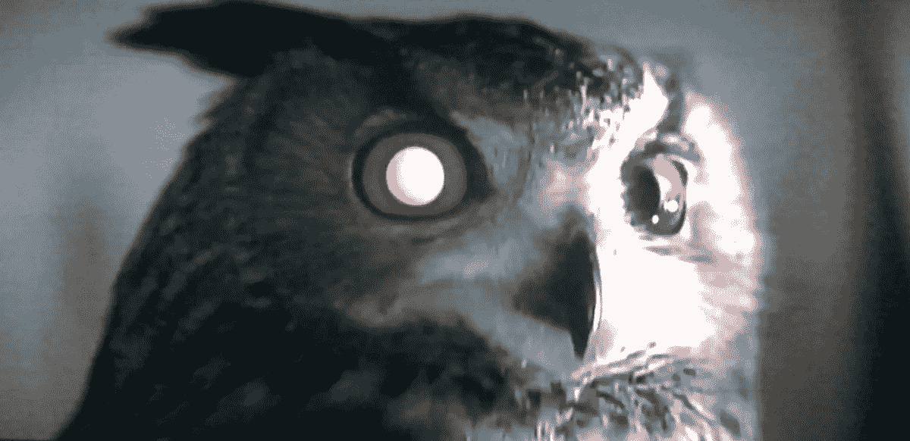
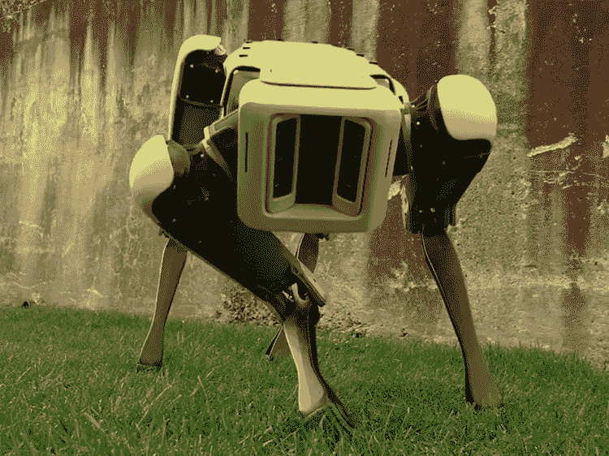

# 随时带着你的机器宠物去工作

> 原文：<https://medium.datadriveninvestor.com/bring-your-robot-pet-to-work-any-day-19f90c76951a?source=collection_archive---------51----------------------->

栩栩如生的机器人宠物将要求人力资源专业人员重新思考办公室宠物法规

想一想人力资源部传达的关于你能不能带去工作的最后一条规则。过去被认为是好的，现在可能被解释为性别歧视，或种族歧视，或与枪支暴力有关。不可避免，我们都必须适应变化的时代。我相信随着时间的推移，随着栩栩如生的机器人宠物的发展，一套规则将变得不那么严格。

在思考人力资源的未来时，我问自己，对于栩栩如生的机器人办公室宠物，人力资源政策会是什么样的？

随着先进的人工智能机器学习软件的出现，我不怀疑在 10 年内，像亚马逊和苹果这样的公司将拥有超现实的宠物，准备好娱乐、安慰和保护你免受入侵者的伤害，就像今天一只可靠的狗一样。不仅仅是软件，波士顿机器人公司已经以惊人的速度提升了它的机器人能力。

会计部的杰克有一条新的长着鲜红色眼睛的机器蟒蛇，它让办公室里的每个人都在饮水机旁开怀大笑。杰克喜欢他的新蛇，他从来不需要喂它，从来不需要闻它，而且它还提供了一些有趣的附带好处。Python 1000 上最有趣的附加功能是桌面安全功能。Python 1000 会对任何试图从你桌子上偷东西的人发出嘶嘶声并吐口水。第二天早上，杰克检查了他的蛇摄像头，避免了一个尴尬的放屁坐垫恶作剧，这个恶作剧来自在几个立方体豆荚外工作的克里斯蒂。不用说，克里斯蒂非常迷恋杰克。

对于那些在创业公司或在你家外面工作的人来说，你知道宠物在办公室里会是一件多么混乱的事情。有了栩栩如生的机器人宠物，你可以得到所有的好处，而不是一片混乱。更何况大多数宠物的寿命都是有限的。享受老狗的甜蜜呢？嗯，所有这些都可能是高级升级。宠物能做的事情，没有什么是 AI 不能复制甚至进阶的。想象你的猫接了你的电话。那该有多恐怖多有趣。当你的另一半被暹罗猫 1000 低声耳语时，你如何认真对待他们。

我知道经理会在会议期间介入并要求诺拉将她的 Tweety Bird 1000 留在她的办公桌上，因为这种鸟被编程为检测谎言和非理性的谈话。每次吉姆开始撒谎说他已经完成了 TPS 报告，Tweety 就开始不停地撒谎。

随着技术呈指数级变化，像技术龙卷风一样围绕着我们旋转，我们对股东负有信托责任，要为我们脚下的土地瞬间发生变化做好准备。栩栩如生的机器人宠物是这类事件的象征，这些事件可能会在没有警告的情况下出现。如何应对取决于您的核心基础设施的灵活性。摩天大楼建在巨大的弹簧上，在地震时会弯曲。