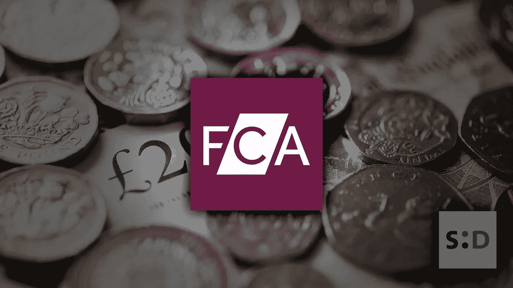

# 英国 FCA 去年警告了 2700 万起货币和“加密资产”诈骗

> 原文：<https://medium.datadriveninvestor.com/british-fca-warn-of-27m-of-scams-in-currencies-and-crypto-assets-last-year-15551000c9dd?source=collection_archive---------17----------------------->

昨天，2019 年 5 月 21 日，英国 FCA [发布了一份声明](https://www.fca.org.uk/news/press-releases/over-27-million-reported-lost-crypto-and-forex-investment-scams)，其中包含与货币和*‘加密资产’*骗局相关的数字。

它指出，通过上述骗局损失的资金总额高达 2700 万英镑，平均每个受影响的人损失超过 14，000 英镑。

 [## Azbit 旨在连接传统金融和加密货币-数据驱动的投资者

### Azbit 是下一个提供交易平台的加密项目，该平台提供保证金和算法交易。一样多…

www.datadriveninvestor.com](https://www.datadriveninvestor.com/2019/03/20/azbit-aims-to-connect-traditional-finance-and-cryptocurrency/) 

该报告强调了以*【快速致富】*为主题的在线交易平台是罪魁祸首。它还指出，上述计划经常使用虚假的名人代言，以使他们的品牌在消费者眼中合法化。

*“欺诈者经常利用社交媒体推广他们的‘快速致富’在线交易平台。帖子经常使用虚假的名人代言和奢侈品图片，如昂贵的手表和汽车。然后，这些网站会链接到看起来很专业的网站，在那里消费者会被说服进行投资。*

它接着指出，当人们投资时，他们会被骗以为自己“赚了钱”，然后被说服再投资和/或介绍朋友/家人。

最终，受害者在平台上的账户被关闭，骗子继续前进。

## 一些安全建议

没有人想被骗，所以我想我会给任何在加密空间的新人一些安全提示。很多这些会和其他基本信息如“天空是蓝色的”一样，在你们大多数人的脑海中根深蒂固。

然而，如果你不知道你的*热钱包*和你的*热口袋*这是给你的。

*   *规则#1:* **永远不要分享你的钥匙！加密的第一条规则非常简单，但却是最重要的。不要与任何人共享您的私钥。你的私人钥匙是你在隐密世界中存在的隐喻钥匙。没有一个合法的网站会因此而要求你的私钥。一条可靠的规则是:如果一个网站要求你的私人密钥，那它就不是你想访问的网站。你唯一应该分享你的钥匙的人，是那些你会给他们你的银行账户的人。**
*   规则 2: **投资你愿意失去的东西** 尽管这条规则可能是老生常谈，但却是重要的一条。不要投资超过你可能损失的钱。如果你的投资是用你需要的钱来付房租，那就付房租。
    加密货币行业的不稳定性意味着即使是合法的项目也很有可能让你血本无归。虽然该行业仍在摸索中，但很难准确预测未来的价格。
    如果你看一下[比特币](https://somethingdecent.co.uk/tag/bitcoin/)的图表，你会发现价格会在几个小时内变化数百美元。这种摇摆有能力削弱新投资者。这就引出了我的下一个观点…
*   *规则#3:* **没人能保证盈利** 如果一个项目保证你会盈利，那就避开它。这很可能是一个骗局，会拿走你的钱。我们都曾在秘密空间有过糟糕的经历，让我们的贪婪蒙蔽了我们头脑的判断。这一课很难学，但却很重要。你听说过这样一句谚语:事情好得不像真的。同样的规则也适用于此。如果有什么东西能保证你的投资获利，那就赶紧逃之夭夭吧。
*   *规则四:* **自己做研究** 再说一遍，这是一条非常基本但仍然重要的规则。在各行各业，人们都把随机的网络人物看得太重了。不要对你的投资做同样的事情。拥有百万粉丝的著名网络博主鲍勃说某样东西是值得投资的好项目，并不意味着它就是好项目。很多时候，著名的网络博主/视频博主因推销产品而获得报酬。同样，crypto 也不例外。除此之外，你还需要考虑网络人物试图引起人们对他们想要扔掉的硬币的关注的可能性。
*   规则五:如果你正处于困境，请放弃。这是我在各行各业都尝试采用的一条规则。如果你对投资一个项目的前景没有 100%的把握，那就不要。作为人类，当我们处于隐喻的绳索上时，我们倾向于做出可能会后悔的鲁莽决定。这就是为什么我会建议当你不确定的时候总是倾向于谨慎。安全总比后悔好。

爱，和平和幸福。

原文：<https://somethingdecent.co.uk/news/cryptocurrency/british-fca-warn-of-27m-scams-in-currencies-and-crypto-assets-last-year/>