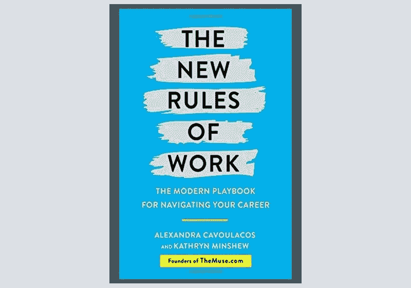

# 一次一章地拓宽你的视野

> 原文：<https://medium.datadriveninvestor.com/broaden-your-horizons-one-chapter-at-a-time-a84982bf9d07?source=collection_archive---------5----------------------->

## 公司读书俱乐部更加重视阅读

The New Rules of Work was an HR Book Club selection.

“需要精神上的休息。”她想多读书，最后以一种“完全自私”的方式创建了一个读书俱乐部。

Ruettimann 是前人力资源主管，后来成为作家、演说家和企业家。她以常识性的风格和处理工作中问题的直率方式而闻名。她关于领导力和企业家精神的主题演讲在世界各地都有需求。

她繁忙的日程也开始让她感到厌烦。

"我想知道外面还有谁在读书，他们在读什么？"鲁蒂曼说。"我突然想到，我可以对我的读者进行民意调查，并策划一份阅读清单。"

她确信每个领导者都需要多读书。她与 [Meghan M. Biro](https://talentculture.com/meet-meghan/) 谈论了阅读、交流的重要性以及为什么 Ruettimann 成立了一个读书俱乐部。比罗是福布斯分析师、品牌战略家和天才文化首席执行官。

“当人们说他们没有时间阅读时，他们实际上只是对如何利用时间做出了不同的选择，”Ruettimann 说。

“我们从取消有线电视开始，”她说。“所以，就在那里，我看电视少了。我开始对如何度过时间做出不同的选择。”

她也减少了——如果不是完全戒掉的话——她的手机使用。

“我试着在晚上把手机收起来，”Ruettimann 说。“我正在移除技术。我只是想更好地意识到和关注我的时间。”

# **偷偷一读**

虽然没有一心多用，但她利用一切机会阅读。

“当我在商店排队时，我的手机上有我的 Kindle 应用程序，”Ruettimann 说。“我的 Kindle 设备和 Kindle 应用程序同步。我总是在我离开的地方。我在读书，而不是去脸书看那些看着我的人。”

她认为阅读改善了她的世界观。

“我喜欢变得更聪明，挑战我对世界的认知，”Ruettimann 说。"我以不同的方式做事，以不同的方式安排时间。"

这让她创建了人力资源读书俱乐部，每个月都会推荐几本书。

“为了成为一名读者，你必须提高技能，”Ruettimann 说。“你不能就这样跳进*战争与和平*。你必须从小处着手。找一本 100 页，150 页的书。一晚上看 10 页。这就是我们鼓励俱乐部每年至少阅读 12 本书的方式。”

# **三重威胁**

该俱乐部有一个人力资源书籍[网站](https://hrbooks.com/)、[脸书页面](https://www.facebook.com/besthrbooks/)和[推特账户](https://twitter.com/BestHRBooks)。

“我们希望分享，”Ruettimann 说。“我想鼓励思想领导。我相信那些最接近问题的人最有能力解决这个问题。

她说:“我们希望让人力资源专业人士看到不同的观点，并从不同的角度了解职业、激情和意义。”“然后，当工作中出现他们从未见过的问题时，我们希望他们能够回想起他们读过的故事或读过的书，并获得信息，或者至少做出有根据的猜测。”

阅读各种书籍会带来许多其他的好处。

“我们阅读不同种类的内容和听到不同的声音越多，我们就越习惯于不同的观点，”Ruettimann 说。“然后，我们才能真正向前迈进，在我们的组织内实现真正的多元化和真正的包容性。

“这些故事是普遍的，”她说。“伟大的著作在讲述普遍理解的真理的同时，也在对个别读者说话。不管是女人、男人、粉头发的人、癌症老兵——我都不在乎。我想了解身份以及人们如何讲述自己的故事。”

# **超过 HR**

对 Ruettimann 来说，一本好书不一定是关于人力资源的。

“一个讲得好的好故事会在人力资源读书会中胜出，”她说。

从某种意义上来说，俱乐部与读者的关系和他们所读的内容一样密切。

“这是一群人聚在一起提高自己，”Ruettimann 说。“我们都在做自我完善的集体工作。我们中的许多人会变得更好，并一起拥有美好的经历。

“我们正在利用技术拉近人们的距离，”她说。

比罗提到了几本她最喜欢的商业书籍。

她说:“《12 周一年》是一份很棒的读物，它彻底改变了我对自己的目标和待办事项的看法。”。“当然，*如何赢得朋友，影响人*是经典，也是我每隔几年重读一遍的东西。

“另一个经典:*你的降落伞*是什么颜色，”比罗说。“这是有史以来最畅销的职业书籍。”

Ruettimann 更坚持自己的偏好。

她说:“我读过的最好的商业书籍是《找错了对象》。“它挑战了一大堆关于成功、幸福和你愚蠢工作的假设。

“我还认为‘商业书籍’可以是谈论行为、激情、目的、意义、职业、身份、金钱、权力甚至性的任何东西，”鲁帝曼说。"每件事的背后都有一个商业活动."

# **读取负载**

Biro 和 Ruettimann 有不同的方法来挤进阅读。

“当我离开家的时候，我总是试图随身携带阅读材料，”比罗说。“你永远不知道一天中什么时候会有空闲时间去读点书。

“我通常一次读多本书，这样我就可以把我的阅读时间间隔开，”她说。

有了这样的野心，她也倾向于让自己超负荷。

“我很难买到或者借到比我能读的更多的书，”比罗说。"我总是在家里堆些书，它可以提醒我多读书。"

Ruettimann 认为她的时间管理有问题。

“我浪费了太多时间，”她说。“我经常在网上看别人看我。我只是做的少一点，读的多一点。而是做出更好的选择，养成更健康的习惯。

“我讨厌那些说‘时间是终极货币’的人，因为他们没有创意，而且听起来很老套，”Ruettimann 说。“但他们没有错。”

在未来的一年里，Biro 希望了解更多关于在人工智能面前保持人类的知识。

“数据安全总是相关的，”她说。

Ruettimann 开门见山地说:“我想学习如何清晰地交流。我用的词太多了。”

**关于作者**

吉姆·卡扎曼是[拉戈金融服务公司](http://largofinancialservices.com)的经理，曾在空军和联邦政府的公共事务部门工作。你可以在[推特](https://twitter.com/JKatzaman)、[脸书](https://www.facebook.com/jim.katzaman)和 [LinkedIn](https://www.linkedin.com/in/jim-katzaman-33641b21/) 上和他联系。