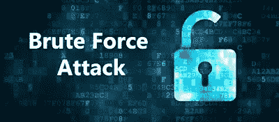

# 暴力攻击—解释

> 原文：<https://medium.datadriveninvestor.com/brute-force-attack-explained-1b74ddac3378?source=collection_archive---------19----------------------->

Photo by [Jordan](https://unsplash.com/@suspected?utm_source=medium&utm_medium=referral) on [Unsplash](https://unsplash.com?utm_source=medium&utm_medium=referral)

在黑客的世界里，暴力攻击被定义为反复连续尝试各种密码来闯入网站。这种攻击将由黑客通过登录网站来完成。黑客使用机器人来自动化这一过程。该机器人将被安装在各种计算机上的恶意方式，它将被用于攻击，使它在一个有效的方式。

# 这种攻击是如何进行的？

互联网世界的密码长度大多是“8”。字母表里总共有 26 个字符。所以大写和小写相加 26+26 = 52 个字符。将数值相加后，该值将为 52 + 10 = 62。要尝试的字符。

对于 8 个字符组合

62 的 8 次方= 2.1834011*10 的 14 次方可能的组合。

尝试这些组合需要 3.6 万亿分钟。

因此，用普通的计算机不可能做到这一点。因此，需要超级计算机来进行这种攻击。

但是这种技术是普通人无法获得的。但是密码攻击攻击者不是普通人。他们将从不同来源收集计算机资源，如开发强大的计算引擎等..

# 如何防止这种攻击？

*   有复杂的密码
*   密码长度
*   使用验证码
*   限制登录尝试
*   双因素身份验证。

# 重要事项:

这篇文章给你一个简单的术语暴力攻击的解释。订阅我们的博客了解更多信息。

请随意评论你的观点。

[点击这里加入我们的脸书小组](https://www.facebook.com/groups/bugtech/)

[点击这里进入我们的脸书页面](https://www.facebook.com/Bug-Tech-380548266042438/?modal=admin_todo_tour)