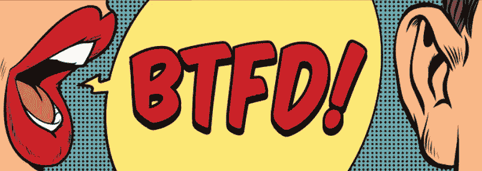
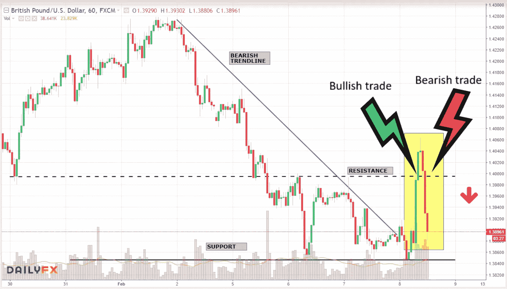
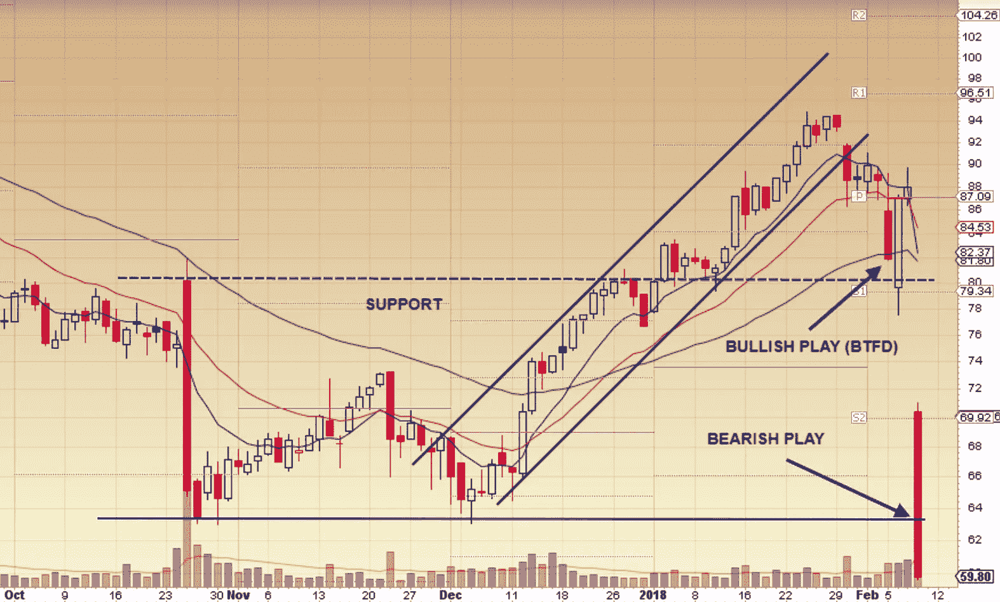

# BTFD:牛市的制胜策略，但 STFR 呢？

> 原文：<https://medium.datadriveninvestor.com/btfd-a-winning-strategy-for-a-bull-market-but-what-about-stfr-e55c39554ed8?source=collection_archive---------0----------------------->

我不得不说，当我第一次听到 BTFD 这个词时，我有点困惑，如果不是彻底的困惑的话，因为我长期从事外汇交易，我们遵循“**低买&高卖**”的范式。所以基本上，正如你们大多数人所知，在股票市场上，你要么是多头，要么是空头，这取决于你更喜欢交易的哪一方。当市场上涨时，多头喜欢卖空。

在长达 9 年的时间里，我们一直看好美国股票市场，在市场每一次下跌时买入股票都是有利可图的，而且还会继续上涨。作为一名技术交易者，我知道市场是循环运行的&没有什么是永恒的。我会等待技术形态出现后再交易——这意味着从技术指标中得到确认。

每个人都知道这个最长的牛市走得太远了，它被过度拉伸了，等等。等等。但多头只是不想屈服。在经历了这么长时间的牛市之后，我真的不怪那些刚刚买入 BTFD 股票的交易者！

然后“*不可思议的*发生了，市场终于崩溃了&在 3 天内损失了 2300 点——真正的损失不是早该进行的调整，而是我们的许多交易者同伴被烧伤了，因为他们太习惯于买入低点。因此，每天下跌时，他们都会建立新的头寸，认为这只是另一个买入的机会。

在主要美元市场交易外汇市场总是有美元多头和空头，但有趣的是，你很可能有一天是美元多头，另一天是美元空头，但仍然赚钱，但我发现股票市场交易者遵循不同的前提，你要么是多头，要么是空头——我的问题是，为什么多头必须等待市场上涨才能坚定地交易，或者为什么空头必须确认市场下跌才能尝试？

你所要做的就是让这些模式发挥出来，根据技术指标进行交易——即使这意味着需要几天的休息时间来搞清楚——有时袖手旁观，等待合适的机会出现也是好的。完全没有理由匆忙进行基于情绪而不是合理技术的交易。如果你这样做了，你就是在为失败做准备。

**好了，说得够多了……让我借助一些图表来详细说明这一点。**

这是最近的英镑(英镑/美元)交易，其中 1.4000 作为阻力，最初穿透该阻力提供了约 60 个点的看涨交易机会，但市场条件在同一天逆转&成为上行支撑的同一阻力水平再次被打破，成为下行支撑，提供了约 100 个点的看跌交易机会。

我知道你肯定会说外汇市场比股票市场更不稳定，但请记住，技术水平在两者中都是一样的。看一个最近股票大幅波动的例子。

*图表由 StockCharts.com 提供*

这笔交易花了大约 3-4 天时间，市场从峰值开始走低，股票也下跌到支撑区& 200 均线，在混乱的熊市周之间有一天的缓解反弹，股票从支撑区开始大幅反弹。作为一个多头交易者，反弹提供了一个遵循 BTFD 法则的绝佳机会&技术层面也提供了支持。

如果你在反弹，但获利了结，这没什么，因为接下来发生的事情，在如此动荡的条件下，不要持仓。第二天，市场再次大幅下跌，加上这只股票的糟糕收益，形成了一个巨大的缺口&在这个过程中，最近这波牛市开始的地方出现了一个强有力的支撑区域。

这里的技术交易者会在支撑位被打破时做空股票，但看涨的交易者要么错过机会，要么试图通过做多来迫使亏损的交易。让我们假设你已经错过了这个机会——你实际上应该等待这只股票的反弹，并在股票反转时卖出——换句话说，卖出 f***g Rip (#STFR)。事实上，对于等待时间比多头长得多的空头来说，情况也是如此。

无论市场向哪个方向发展，总会有大量的交易机会。**成功的交易者能够适应市场环境，等待正确的时机，运用恰当的风险管理。**所以我的交易伙伴——牛市中的 BTFD&熊市中的 STFR。 ***快乐交易！***

如果您喜欢接收股票、外汇和密码方面的交易思路和技术分析，您可以在[**Twitter**](https://twitter.com/trade_nut)&[**Stocktwits**](https://stocktwits.com/trade_nut)as trade _ nut 或[**【fakd**](http://twitter.com/fakd)**上关注我的[**trade like**](http://www.tradealike.com/)app 进行实时提醒。**

***结束……***

***原载于 2018 年 2 月 9 日*[*medium.com*](https://medium.com/@tradealike/btfd-a-winning-strategy-for-a-bull-market-but-what-about-stfr-36c3e3db9d16)*。***