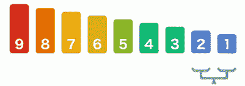

# JavaScript 中的冒泡排序

> 原文：<https://medium.datadriveninvestor.com/bubble-sort-in-javascript-298375020b29?source=collection_archive---------4----------------------->



在求解算法时，有几种不同的排序方法可供您使用，每种排序方法都有各自的优缺点。根据需要的内容，由您来决定哪一个最适合该解决方案。今天我要讲其中的一个，冒泡排序。

页面顶部的 GIF 在视觉方面做得很好。假设给定一个数字数组，按照从最小到最大的顺序排列这些数字。

[](https://www.datadriveninvestor.com/2019/03/22/the-seductive-business-logic-of-algorithms/) [## 算法诱人的商业逻辑|数据驱动的投资者

### 某些机器行为总是让我感到惊讶。我对他们从自己的成就中学习的能力感到惊讶…

www.datadriveninvestor.com](https://www.datadriveninvestor.com/2019/03/22/the-seductive-business-logic-of-algorithms/) 

```
array = [4,2,5,6,1,3]
```

冒泡排序背后的想法是，你要取数组 4 中的第一个数字，并将其与数组 2 中的下一个数字进行比较。我们知道 4 大于 2，所以我们要换一下:

```
array = [2,4,5,6,1,3]
```

现在我们重复同样的逻辑。我们拿 4 和下一个数字 5 比较。这一次，5 是一个较大的数字，所以 4 暂时保持不变。现在我们拿 5 和它相邻的数字 6 比较。6 比 5 大，所以 5 保持不变，现在我们用 6。我们将 6 与下一个数字 1 进行比较。6 大于 1，所以我们交换它们的位置。

```
array = [2,4,5,1,6,3]
```

您可以猜到，接下来将比较 6 和 3，6 是较大的数字，将取代 3 的位置:

```
array = [2,4,5,1,3,6]
```

现在我们再次循环！从头开始同样的过程。2 和 4，2 留下，现在我们用更大的数字 4。我们在循环中“冒泡”较大的数字，最终将数组保持有序。

正如你所看到的，这对于一个包含 100 个数字，甚至 500 个数字的数组来说是非常慢的。就时间复杂度而言，冒泡排序并不是理想的选择。现在我们已经理解了冒泡排序的概念，让我们把它变成代码。

让我们用同一个数组写一个名为“bubble”的函数。

```
const array = [4,2,5,6,1,3]function bubble(arr){}
```

我们知道我们在循环和比较数组中的元素，所以从一开始就暗示我们需要一个嵌套循环。让我们来设置一下:

```
const array = [4,2,5,6,1,3]function bubble(arr){
    for(let i = 0; i < arr.length; i++){
        for(let j = 0; j <arr.length; j++){ } }}
```

现在我们已经建立了 for 循环，让我们开始比较的逻辑。我们将通过创建一个条件来比较一个元素和下一个元素，在这个逻辑中，如果第一个元素大于第二个元素，我们将交换它们的位置。

```
const array = [4,2,5,6,1,3]function bubble(arr){
    for(let i = 0; i < arr.length; i++){
        for(let j = 0; j <arr.length; j++){
           if(array[j] > array[j+1]){
               let temp = arr[j]
               arr[j] = array[j+1]
               arr[j+1] = temp } } }}
```

这种逻辑似乎有点难以理解，所以让我们更深入一点。

```
// here we're saying if the first element is larger than the second, //let's execute some code to swap their positionsif(array[j] > array[j+1]){//in this line we're storing the value of the first element into a //temporary variable             let temp = arr[j]// Now in this line we're simply moving our first element(the larger // number)in the position of the following element (the smaller
// number) arr[j] = array[j+1]// and our missing piece is setting the second element (the smaller number into the previous element's position in the array. We stored this value in the variable "temp" for this reason, as the value is now different because of our previous line. arr[j+1] = temp
```

一旦执行完毕，我们最大的数字就会冒泡到数组的末尾。它将执行外部循环来重复这个过程，直到我们的数组被排序。

我们知道些什么？由于需要嵌套循环的原因，时间复杂度的冒泡排序似乎不是很有效，这给了我们一个很大的 O(n)。优点是它没有创建新的数据结构，所以就空间复杂性而言，它是有利的。

我希望这能澄清到底什么是冒泡排序以及如何使用它。它不是算法中最受欢迎的一种，但是每一种都有它的用途。了解它们将有助于你在解决未来算法时做出更好的选择。