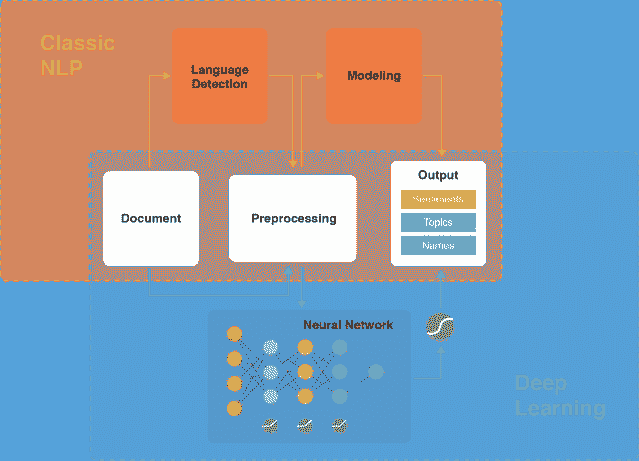
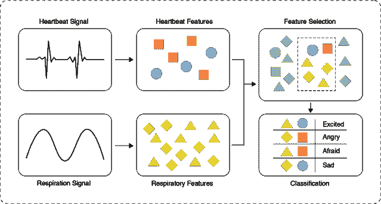
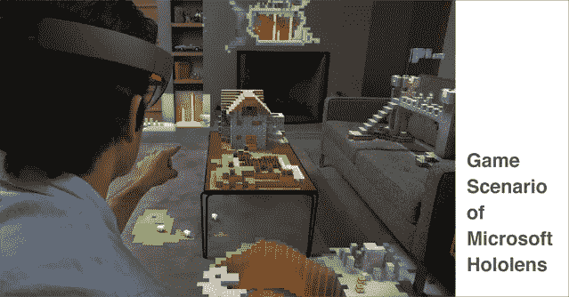
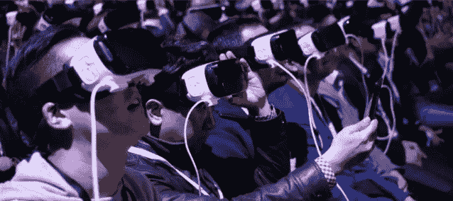
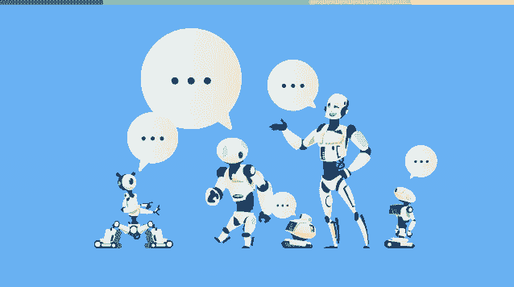

# 好友聊天机器人和未来的用户体验

> 原文：<https://medium.datadriveninvestor.com/buddy-chatbots-and-the-user-experience-of-tomorrow-884b19df460e?source=collection_archive---------1----------------------->

一段经历越丰富，释放到我们大脑中的多巴胺就越多，与之相关的互动也就越深刻。任何产品、平台或服务的感觉良好因素或用户体验(UX)是在客户心目中传递品牌长期和明确形象的关键要素。但是，当我们迈向明天的 UX 时，我们如何在用户的脑海中留下不可磨灭的印记，或者什么样的技术进步会增强这种效果，无疑需要我们的关注。人工智能能带领聊天机器人成为改变 UX 未来的伙伴吗？

首先，让我带大家了解一下过去和现在的 UX 范式的核心是什么，是什么使昨天和今天的 UX 取得了成功，以及在实现这一点时采用了哪些技术。

洞穴绘画、挂毯，甚至是书面手稿提供了一个 UX，在那里说书人、神谕和诗人将他们的信息“硬编码”。这些技术在历史上有自己的生命，抽象的内容通过反思和思考吸引观众的想象力。无论是雕刻、绘画还是书写，它的目的都是传达一种预期的自然含义，即使事后看来是人为的。

# UX 的进步

随着 20 世纪现代计算技术的出现，工程师们试图对计算机进行“硬编码”以与用户进行交互。以今天的标准来看，它是有限的和原始的，但它是新的东西！甚至当投射到一个虚构的未来时，太空漫游中的 HAL 9000，最初的机械战警，以及星际迷航的 LCARS 语音接口都被故意设计成听起来感觉机械化。他们想向 60 年代到 90 年代的观众传达一种人为的感觉，这是有原因的。人机界面单纯凭借新奇抓住了那个时代观众的眼球；它需要从人与人的互动中分离出来。

 [## 对话式营销是文字数据驱动的投资者

### 在购买之前，先谈一谈。这样做的营销人员将走在游戏的前面。这是保罗·因斯的前提…

www.datadriveninvestor.com](https://www.datadriveninvestor.com/2019/01/31/conversational-marketing-is-the-word/) 

然而，随着时代的变化，今天“人工智能”一词已不再是理所当然的了。我们一直在期待人工智能能够做些什么。因此，今天的聊天机器人和交互式语音应答系统并不意味着听起来或感觉起来机械化和无聊。他们通过听起来更“人性化”来积极吸引用户。在不久的将来，它会变得更加有趣。那将是本体论最真实的时代，智能系统将主动驱动用户，而不是相反！

我们很快就要进入进化聊天机器人客户体验的时代，这将同时跨越多种模式——不仅仅是文本。它将依赖于语音交互、混合现实图形、手势和控制论界面，所有这些都由人工智能同时执行语言和行为分析。毫无疑问，这将是一个真正丰富和沉浸式的用户体验，知道如何随意抓住用户的注意力。

# 多模式用户交互的时代

现在我们正稳步步入本体时代，智能系统驱动用户做出决定，是时候审查和学习某些现有的内容呈现技术如何经受住时间的考验了。人工智能(AI)和增强/混合现实(AR/MR)的进步将在利用其真正潜力方面发挥作用。

人类语言，在文本化的时候，只是一种交流方式。自然语言处理(NLP)在这种模式下取得了长足的进步。有监督的机器学习技术，例如支持向量机(SVMs ),现在可以从文本中提取相关信息，如果对给定的一组上下文(领域)进行训练的话。)

通过引入神经网络和深度学习技术，NLP 系统甚至可以更全面地对意图进行分类——并且以有限的方式也可以很容易地揭示文本化内容背后的潜在情感。

肢体语言、语调和选择性的声音强调仍然是需要考虑的额外的交流方式。这些增加的模态可以为语言表达背后的意图和意义提供更多线索。最近，来自新加坡南洋理工大学、美国卡内基梅隆大学和墨西哥国立理工学院的两个团队独立发表了研究论文，通过添加来自视频和音频内容的信息以及已建立的 NLP 技术，验证了多模态情感分析(MSA)的[方法](http://sentic.net/multiple-attentions-for-multimodal-sentiment-analysis.pdf)和实际功效。作者认为，MSA 将在聊天机器人中的实际应用中获得相当大的吸引力。

此外，将生理生物特征融入这种分析(例如，非侵入式[或使用可穿戴设备)可以使机器学习系统更加有效和高效。例如，添加心率、声音波动和姿势可以提供关于用户意图的大量信息。添加这些微妙的模态可以推动交互式人工智能更接近实现真正的本体；不只是做用户表面上要求的，而是做用户实际上想要或需要的。](http://eqradio.csail.mit.edu/files/eqradio-paper.pdf)

# 按需混合现实的时代

即使在当今时代，人们也倾向于拥有一个以上的设备，并且可以在完成任务的过程中在它们之间切换。研究表明，多达四分之一的用户可以从智能手机转向平板电脑，超过一半的用户在任何特定活动中途转向笔记本电脑。随着新的和更具创造性的工具的出现，有理由期待全渠道 UX 在多设备用例时代将需要绝对的一致性。

因此，UX 将不会局限于简单的“平面 2D 屏幕”交互，而是涉及 AR/MR，就像微软的 Hololens 等设备一样。AR/MR 计算平台将需要包括它们在运行时识别并与之互操作的任何给定设备。因此，这种平台将能够在进入房间时识别并连接到环境传感器，或者在运行时识别智能户外摄像机并与之交互，以增强用户的感知体验。单个应用程序不需要重新实现任何底层接口，并将为用户带来良好的无缝交互。

*图片由*[微软](https://www.flickr.com/photos/microsoftsweden/15716942894) */* [*CC 由 2.0*](https://creativecommons.org/licenses/by/2.0/)

然而，仅仅让用户沉浸在丰富的图形和详细的上下文内容中可能不足以让他们长期保持兴趣。你能很快回忆起 60-90 年代虚构的人工智能的机械化声音吗？没错，以今天的标准来看，它们听起来很无聊——但在它们各自的时代却是新颖而“时髦”的。一旦“新奇蜜月期”结束，AR/MR 的最终后果可能也是如此。为了确保用户真正受益并保持参与，人性化的数字体验在未来和现在都是必要的。

人类最初对神话和讲故事艺术的实验虽然是合成的，但事实上是已知的通过类比分享经验的最古老的技术。这种技术是人性化数字体验的核心。随着网络上内容的丰富，与众不同将继续是至关重要的。围绕给定的产品创造一个故事，并邀请用户成为其中的一部分，可能是吸引他们的最简单的方法。或许，在 MR/AR 时代，这种讲故事的方式对于让用户[沉浸在体验中](https://readwrite.com/2016/04/14/microsoft-hololens-ar-digital-storytelling-dl4/)——从而保持参与是至关重要的。

对话式界面在吸引用户直观地访问内容和帮助决策方面也证明是无价的。目前，这种界面虽然有效，但仅限于基于文本或语音的聊天机器人。然而，由于在任意 3D 空间内呈现丰富的内容，AR/MR 的对话交互将从根本上不同。摆脱了 2D“平地”的束缚，未来的 UX 将要求数字内容比目前通过网络获得的更多。UX 的设计师和工程师都需要为人工智能准备语言，以及与用户互动的线索；不只是通过显示听觉或视觉内容，而是通过进化故事板引入关键的微观互动，触发用户的积极思维过程。

将对话模式和按需讲故事结合起来将需要大量的信息处理能力和存储容量，无论是在 AR/MR 设备上还是分布在设备和电器的网络上。当然，除了现有的预处理和原始数据之外，还需要在运行时生成大量内容。未来企业和社交网络的关键需求将是如何重组和优化其内容，以便通过 AR/MR 接口随时提供服务。它不会仅仅是一个网站上的平面 UI、图像和文本；但是作为讲故事体验的一部分，可以在增强体素空间内以虚拟对象的形式按需呈现不同的内容和元数据。

# 人工智能人格化

让我们仔细看看通过各种人工智能技术提供的内容和数据将如何改变设计师、新兴技术企业家以及成熟技术专业人士对 UX 及其未来的理解。我们已经见证了聊天机器人和智能机器在市场上的爆炸，因为它们在实现对话式人工智能方面具有多种应用。[应用疲劳](http://fortune.com/2016/08/16/app-fatigue-is-taking-a-toll-on-smartphone-owners/)可能会进一步推动聊天机器人助手的发展——以便根据用户特定个性、需求和习惯的效用来筛选应用和内容。支持聊天机器人的其他驱动因素是顶级[品牌](https://chatbotslife.com/7-brands-already-using-chatbots-29bae20363cd)，他们将聊天机器人直接整合到他们的[客户体验](https://perspectives.mobilelive.ca/blog/customer-experience-in-the-digital-economy)渠道，从直接营销开始，通过客户服务和支持，到直接销售——从而提高效率。

商业和社交网站也集体发布他们的常见问题。然而，它们还包括聊天机器人，用于从内容管理系统(CMS)内的单一按需结构化数据存储库中获取底层内容。然而，这种硬编码的内容可能不一定以自然对话的方式与用户联系起来。在这个时代，我们正在迅速向对话式商业迈进，企业和个人都需要确保在吸引受众方面领先一步。只有当它们能够重新利用抽象信息，从原始数据中产生回应时，才能实现这一点——不是说人工智能聊天机器人创造了自己的语言——而是它们能够与观众对话，在个人层面上建立联系。

然而，这种聊天机器人——可能总是会被认为对它们旨在创造的业务有偏见。未来的用户将不再屈从于机器人的业务，而是要求独立的聚合器助理机器人不与单一平台相关联，而是能够自动分析用户的需求、所有可用的产品和服务、它们的价格和价值，并充当不带供应商偏见的顾问助理。这种“不受束缚”的好友聊天机器人的开发和产品化是当今初创企业和企业的下一个重大机遇。

如果在用户交互中包括额外的模态，则所得 UX 的增强可以是指数级的。考虑到 UX 即将到来趋势指向在不久的将来 AR/MR 的扩散。

# 把所有的放在一起

在追求进步的过程中，我们有时会忘记是什么真正推动了技术的发展。作为社会人，我们并不是真的为了技术而拥抱技术。我们这样做是为了丰富我们的互动，增强我们的体验。因此，众所周知，UX 越有针对性，越能提升情绪，人脑对它的感知就越有益。只有这样，它才能抓住用户的注意力和想象力——不管技术如何。

在未来几年，将“人”的元素纳入产品和 UX 设计师将变得更加重要。在未来几年，对话是 UX 和用户交互的下一层。当前状态下的聊天机器人可能无法处理因当今用户的期望而产生的必要的复杂性。机器学习的进步无疑提高了当前聊天机器人的适应性。但是，严重依赖于上下文细微差别和创造力的讲故事艺术仍然远远超出了当前技术的范围。在对话式商务时代，考虑自然对话的动态性和呈现信息的公正性以真正吸引用户的注意力将变得至关重要。

UX 的未来对我们这些目睹其全面发展的人来说确实非常有趣。随着丰富的沉浸式内容和定制体验的按需提供，以及人机界面的进一步发展，以[将人脑](https://www.wired.com/2017/03/elon-musks-neural-lace-really-look-like/)直接连接到信息访问外围设备，这样的交互最终可以成为用户积极思维过程的一部分。但是，直到有一段时间，人类实际上变成了半机器人，“无束缚”的好友聊天机器人在 AR/MR 环境中被渲染为类似人类的向导，可能会充当用户的“内心声音”，以便通过对话和微交互来帮助决策。也许采取用户自己的“镜像”的形式来看起来和听起来熟悉，或者用户偶像的形式来更有说服力，这种人工智能的拟人化可能是明天 UX 的关键。

*原创发布:*[*https://perspectives . mobile live . ca/blog/chatbots-user-experience*](https://perspectives.mobilelive.ca/blog/chatbots-user-experience)