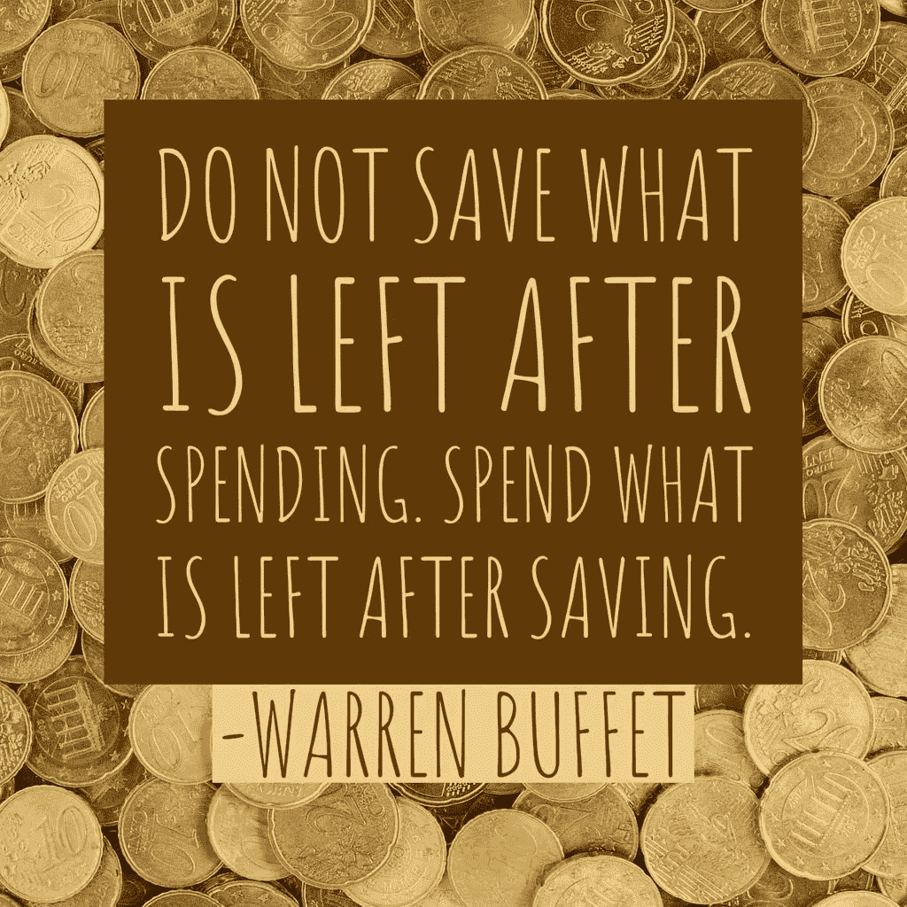
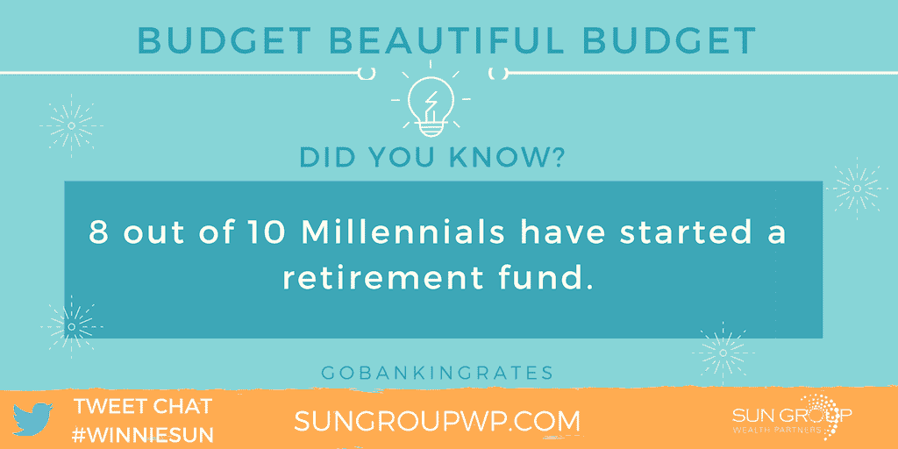
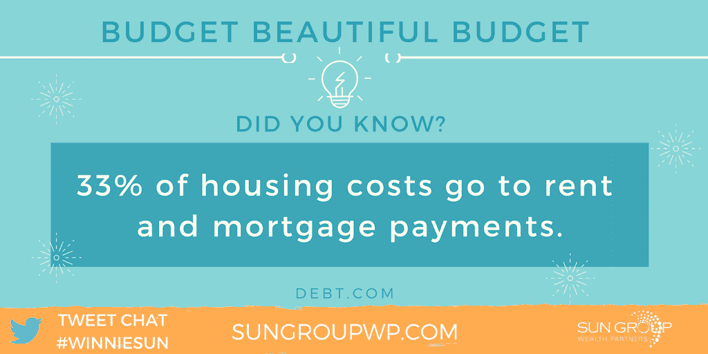
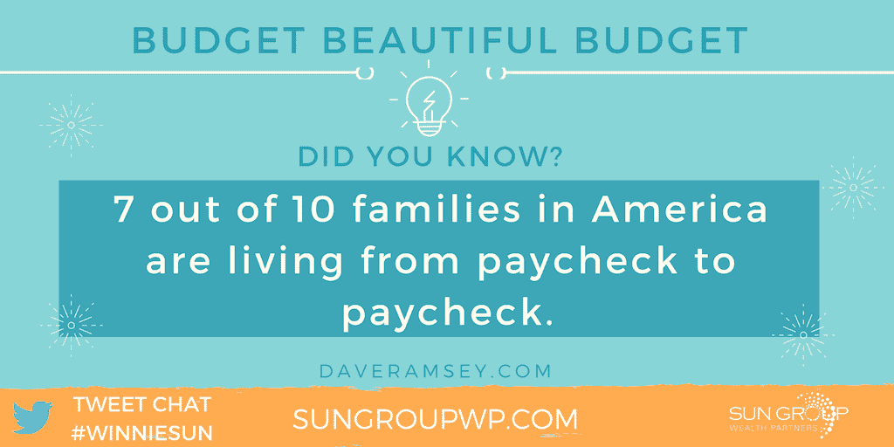

# 更好的预算来建造更大的

> 原文：<https://medium.datadriveninvestor.com/budget-better-to-build-bigger-1e26e7fdf60e?source=collection_archive---------32----------------------->

## 在分配你的钱时，总有改进的余地

即使专家们承认他们并不完美。在 1 到 10 分的预算范围内，[安东尼·科波曼](https://twitter.com/AnthonyCopeman)和[德尔·肖恩·海耶斯](https://twitter.com/delshawnhayes)都只给了自己 8 分。

“我是人类，”海斯说。"我给自己打了个 8 分，因为我有很多年的尝试和错误可以借鉴."

科曼同样希望做得更好。

“总有改进的空间和更好分配的方法，”他说。“诚实是最好的策略。出去吃饭是我的恶习。”

考虑到这一点，两位金融专家都会提供服务，这样其他人也能从科曼和海耶斯辛苦学到的经验中受益。

 [## 光明的未来等待着金融自由的宣言

### 你现在可以采取的宣布财务自由的步骤

medium.com](https://medium.com/financial-strategy/bright-futures-await-declarations-of-financial-freedom-78c3d40e935b) 

Copeman 创造了 Financial Lituation，帮助千禧一代“重新发明他们的财务，重新想象他们的自由，这样他们就可以过上他们本来应该过的生活。”

海斯掌门人[海斯财务教练](http://www.hayesfinancialcoaching.com/)。她的公司“为个人、夫妇和家庭提供工具，帮助他们实现财务目标，积累财富，实现完全的金钱控制。”

# 精明的资金平衡

他们一起与金融行业最受欢迎的专业人士之一温妮·孙进行了交谈。

“作为一名财务顾问，我得说我在预算方面可能远远超出平均水平，”孙说。

她也认为自己在金融方面很有头脑。

“在你的圈子里找到一个善于理财的人真的很好，”孙说。“我们很早就学会了花钱的习惯。如果我们知道可以向谁咨询问题，这有助于我们更快地培养财务知识。”

科普曼说，合伙人强化财务智慧。

“和与你目标一致的人在一起，并理解他们，”他说。“同行压力可以有力量，但你说了算。”

海斯利用了她在财务方面的敏锐直觉:“我可以走进一个房间，开始计算美元。”

保持预算从最早的教训中就已经根深蒂固了。

“从小学开始，我就一直在做预算，”孙说。“我的父母很早就教导我把东西放好，为未来储蓄的重要性，但仍然给我机会做出重要的财务决定。现在我把这句话翻译给我自己的孩子听。

她说:“把预算写在纸上很有力量，这样你就可以知道它有多少。”“在我们的网站上，我们为所有的事情[准备了免费的预算工作表，供客户使用。他们超级受欢迎。”](https://sungroupwp.com/)

 [## 预算友好的方式保持活跃，保护你的理智和财务健康

### 专家建议在预算内保持活跃和健康

medium.com](https://medium.com/financial-strategy/win-the-race-to-the-top-for-health-and-wealth-7ca8eb651514) 

海斯也欣赏视觉教具。

“我是守旧派，”她说。“我喜欢老式的好笔。我故意先把钱写在纸上，但我也有电子表格和应用程序可供选择。”

# 小心№1

在他的书面预算中，科曼把他最重要的优先事项记在心里。

“我确保首先支付自己，这样我的钱才能为我工作，”他说。“然而，我也使用像[个人资本](mailto:personalcapital)这样的应用程序来跟踪每周的现金流。”

尽管有这样一个方便的帮助，预算需要承诺。

“在预算内最困难的事情是继续在预算内，”孙说。“通常，我会有几个月致力于这个过程的客户。他们觉得很有成就感，想通过突破预算来庆祝。这是一个危险的习惯。”

如果可能的话，让预算成为你社交生活的一部分。

“这是很难承诺的预算日期之夜，并有那些钱检查会议，”海耶斯说。“现在我迫不及待地想和巴德约会——也就是预算——并给每一块钱分配任务。”

你和你的预算必须有一个良好的相互关系。

“关于预算最困难的事情是不能让它为你所用，”Copeman 说。“你的支出计划不该欺负你。它应该会给你的生活带来平衡。”

专家们对帮助理财的理想应用程序提出了几个建议。

“完美的应用程序将跟踪我每天拥有和保存的所有东西，并智能、直观地标记和消费这些东西，”孙说。"有些接近了，但每个季度仍有大量的会计工作要做."

 [## 财务成功:有这方面的应用

### 拥有更便捷的网上银行，有身份保护

medium.com](https://medium.com/datadriveninvestor/financial-success-there-are-apps-for-that-17addbd69a7c) 

心态平和是一大考量。

“我会为财务压力开发一个应用程序，”Hayes 说。“你登录后，它会显示你的财务压力水平。它会像月亮环一样变色。它会引导你获得经济上的帮助。”

# 有形资产和无形资产

Copeman 的应用程序将非常通用。

“这个应用程序不仅会记录我的投资和流动资产，还会记录无形资产，”他说。“一个平台上的每一项资产和支出都将令人惊叹。”

在大多数家庭中，谈钱不是一个自然的话题，这阻碍了金融知识的普及。

“很难谈论钱，因为对我们大多数人来说，这不是我们通常会做的事情，”孙说。“我们缺乏经验和实践。

“如果我们在生命早期就开始这些公开的讨论——在学校，和我们的朋友——事情会变得容易得多，”她说。"我们需要达到一个我们不会感到财务真实不安全的点."

如果你已经有现金困难，困难就会增加。

“当你没有钱或者陷入财务困境时，就很难谈钱，”海斯说。“当我们开始原谅自己过去在金钱上的错误时，我们可以开始讨论个人理财，让它变得不那么忌讳。我们无法解决我们不面对的问题。”

科普曼还提到了财务上的耻辱。

“许多人很难谈论金钱，因为他们可能对管理现金流和金钱决策没有信心，”他说。“找到能让你放心谈论金钱而不加评判的空间非常重要。”

试图“与邻居攀比”会使预算变得支离破碎。

"我一点也不担心与邻居攀比，"孙说。“随着你对自己越来越放心，把人看得比东西更重要，这就变得容易多了。爱人，不爱物。”

 [## 偿还债务的同时为退休储蓄

### 记住首要的指示:首先支付你自己

medium.com](https://medium.com/financial-strategy/save-for-retirement-as-you-pay-down-debt-3eb45580f148) 

海耶斯拒绝通过“停止在社交媒体上关注邻居”来与他们攀比。

“我唯一关注的是道琼斯工业平均指数，”科普曼说。“我喜欢记录我的投资和我投资的品牌。

“然而，我们应该一直保持我们的目标，”他说。“那些是我的琼斯。”

# 追踪珍贵积分

抛开愿望不谈，如今的应用程序可以让预算和财务规划变得更容易。

“我是 Intuit、QuickBooks、QuickBooks、T5 的忠实粉丝，因为它们可以帮助我记录我的业务支出，”孙说我也喜欢更好的信用卡应用程序，它可以记录你的费用、积分，甚至你的信用评分。非常高效。"

海耶斯更喜欢任何有助于简化她个人和商业生活的应用程序。这包括用于预算的 Mint 和用于商业的 QuickBooks。

“我喜欢个人资本，它能让我了解自己的支出、储蓄和开销，”科曼说。“它非常容易使用和理解。”

像大多数人一样，抵押贷款或住房支出占据了金融专家预算的最大一块。这增加了创造更多现金流的支出。

“不管你是租房还是买房，这些钱每个月都会花出去，”孙说。“我更愿意把精力放在赚更多的钱上，而不是在已经非常拮据的预算上精打细算。”

海斯的抵押贷款也是她关注的焦点。

“每个工资周期，我都会在账单账户中留出一半的抵押贷款，”她说。"然后我可以有更多的现金流来支付其他费用，直到下一个工资周期."

科曼有各种各样的项目要处理。

他说:“我最大的支出是投资于我自己、商业和个人理财动画系列。"我把账单压得很低，这样我就能造更多了."

**关于作者**

吉姆·卡扎曼是[拉戈金融服务公司](http://largofinancialservices.com)的经理，曾在空军和联邦政府的公共事务部门工作。你可以在[推特](https://twitter.com/JKatzaman)、[脸书](https://www.facebook.com/jim.katzaman)和 [LinkedIn](https://www.linkedin.com/in/jim-katzaman-33641b21/) 上和他联系。

*原载于 2018 年 11 月 8 日*[*www.datadriveninvestor.com*](http://bit.ly/2zEW2oa)*。*