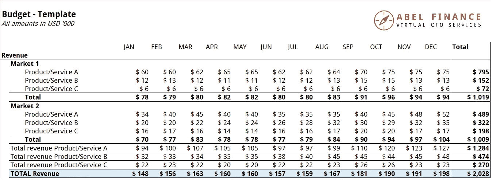

# 为 7 位数的企业主编制预算

> 原文：<https://medium.datadriveninvestor.com/budgeting-for-7-figure-business-owners-94973593a39?source=collection_archive---------54----------------------->

对于大多数企业家来说，预算并不是最重要的。这要么是一件苦差事，要么是事后的想法。

很有可能，你没有上过商学院，在那里他们学习如何构建精美的数据透视表，并制定预算和财务预测。

记住这一点，当你为你的生意做预算的时候，很自然会觉得力不从心。然而，预算只是你必须解决的棘手问题之一——你不能忽视它。

好消息是什么？你不需要有商科学位，或者对数字很精通，就能学会如何为企业做预算。在这篇文章中，我们将带你通过一个简单的一步一步的过程，你可以用它来创建你的业务预算。

# 预算对企业的重要性

如果你觉得预算对你的生意不重要，你并不孤单。根据我们的经验，大多数企业主认为预算是一个不必要的步骤。他们要么认为市场需求太难预测(因此制定预算毫无意义)，要么认为他们已经想好了一切，不需要把数字写在纸上。

也就是说，做好预算是关键也是必要的；这可以让你为你的公司打下良好的基础。首先也是最重要的一点，当你合理地构建了预算，这给了你一个很好的框架，你可以用它来为你的公司和员工设定[关键绩效指标(KPI)](https://en.wikipedia.org/wiki/Performance_indicator)。最重要的是，一旦你有了预算，你就有了一个基准来衡量你的表现，并确定业务是否进展顺利。

最后，有一个预算也可以帮助你在花钱和投资时感觉更舒服。没有一个合适的预算，你可能会在花钱上更加保守，或者花费过多——仅仅是因为你不确定自己的立场。一旦你有了预算，你就会准确地知道你有多少现金和储备，这将增加你对自己投资和/或以其他方式花钱的能力的信心。

当然，不同的公司会以不同的方式利用和受益于他们的预算。如果你在电子商务行业，现金流肯定会是你的优先事项；手头没有足够的现金，你就无法订购存货。对于那些经营 SaaS 公司的人来说，为你的客户获取成本和流失做预算是关键。最后，如果你经营一家咨询公司，你的目标可能是找出如何优化你的收费率，降低你的管理费用。

# 谁应该为企业制定预算？

如果你的公司仍然很小(我们说的是不超过几个员工)，那么就由你来为你的企业设定预算。不要担心，这不是一个艰难或复杂的过程——我们在下面列出了一个分步指南，你可以遵循。

如果你的公司比这大，那么你应该让你的首席财务官和财务团队承担预算的任务。当然，你仍然需要和你的团队一起工作，尤其是在设定目标的时候，但是你可以让他们负责并领导这个过程。如果你的工资单上没有首席财务官，考虑将你的预算设置外包给一个虚拟首席财务官！

# 如何为企业做预算:5 个简单的步骤

刚接触预算领域？这里有一个简单的 5 步指南，将教你如何为企业做预算。

# 第一步:设定你的目标

这个过程的第一步是确定你的商业目标。这里有几个问题可以作为提示:你想在下一年创造多少收入？你想要多少顾客？你想创造多少利润？

一旦你有了自己的目标，确定与每个目标相关的 KPI。例如，如果你的目标是增加 X%的收入，或者将收入增加到$XYZ，相关的 KPI 包括月销售额增长、平均利润率和平均订单价值。

# 第二步:提出收入预测

收入预测听起来很复杂，但本质上，它们只是对不同客户群、产品或渠道的收入构成的预测。

你如何估计来年你将获得多少收入？简单——看看历史趋势，考虑任何可能影响你未来成长的因素。思考产品发布和市场扩张、当前市场趋势以及您即将开展的营销和销售活动。

# 第三步:想出一个成本预测

除了收入，你还需要预测你的成本，以便更全面地了解你的业务在未来一年的表现。确保你考虑到你的销售成本，以及销售，一般和管理费用(SG&A)的成本。

这是大多数企业家过于乐观的地方，所以挑战自己，变得更加现实——你会产生什么成本，你需要多少员工才能达到你的目标？你真的可以用这些营销和销售支出赢得这么多新客户吗？
睁大眼睛，留意企业家往往也会忽略的杂项费用，包括银行费用、营业执照费用、专业费用和你最终可能会注销的坏账。

# 第四步:评估和调整

既然您的预算已经完成，是时候与团队的其他成员一起回顾和讨论了。在这一步，确保你的计划是一致的和现实的，并询问你团队的关键成员他们的反馈和意见。

一定要考虑到所有部门的角度，包括营销、销售和运营。在每个人都满意并接受他们那部分的所有权之前，你可能不得不调整你的预算几次。

# 第五步:进行月度回顾

一旦你进入新的一年，每月回顾一下你的预算，找出你的预算和实际数字之间的差距。如果你发现你偏离了很多，找出问题的根源，并采取纠正措施。

# 关于如何为企业做预算的最后一句话

现在您已经阅读完了本指南，您已经完全掌握了为企业制定预算所需的知识。这一年很快就要结束了，所以你应该尽快制定下一年的预算！

如果你的团队中没有首席财务官，也没有能力为你的企业制定预算，考虑雇佣一名虚拟首席财务官。在 ABEL，我们可以为您提供一位经验丰富的首席财务官，他可以帮助您计算出您的数字，并让您的公司走上成功之路！

[预约免费咨询](https://calendly.com/abel-finance/30-min-call)

*原载于 2018 年 11 月 19 日*[*【abel-finance.com】*](https://abel-finance.com/how-to-budget-for-business/)*。*

