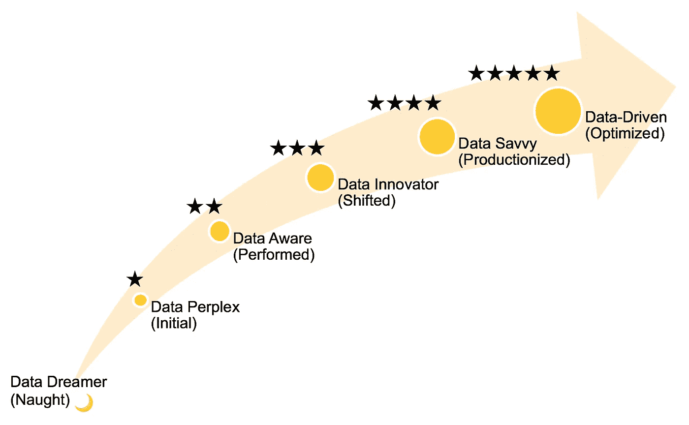

# 为您的公司构建数据成熟度网格

> 原文：<https://medium.datadriveninvestor.com/build-a-data-maturity-grid-for-your-company-788a6794cfa9?source=collection_archive---------4----------------------->

## 25 个问题中的数据驱动决策之路。

您希望您的组织在数据方面真正取得成功吗？最成功的数据驱动型组织是以消费者为中心的科技公司，如谷歌、亚马逊、脸书、优步或 AirBnb。这是毫无疑问的。但在现实中，成为数据驱动不仅限于互联网。数据正在改变每个企业与世界互动的方式。

Photo by [Franki Chamaki](https://unsplash.com/@franki?utm_source=medium&utm_medium=referral) on [Unsplash](https://unsplash.com?utm_source=medium&utm_medium=referral)

为了在 21 世纪发展大规模业务，您的公司应该专注于建立一种强大的数据文化，这种文化能够很好地理解如何成为数据驱动型企业。

> “数据驱动型组织及时获取、处理和利用数据，以创造效率、迭代和开发新产品，并在竞争格局中导航。”
> 
> ――Dj Patil，美国前首席数据科学家。

对于试图用数据解决多种业务问题的大中型企业来说，在公司内创建一个**数据成熟度网格**是当务之急！

我想在这里讨论一下这个工具可能是什么样子，以及如何在指导您组织的分析战略的过程中利用它。

# 定义数据成熟度网格

大家要明白，大数据不仅仅是一种技术。它是关于回答商业问题和传递价值。

如果您只对数据管理方面感兴趣，您可能会因为限制性地关注治理、质量和基础设施而失败。

> 在我看来，我们需要一个数据成熟度网格**来描述大规模数据驱动决策的过程*。***

在阅读了[这篇关于戴尔如何定义其数据成熟度模型的文章](https://www.cio.com/article/3077871/the-four-stages-of-the-data-maturity-model.html)后，我想提出一个适应方案，它应该有助于我们跨国制造公司的数据计划和项目取得进展。

您使用数据成熟度网格的方式将定义其格式，但精神应该是相同的:

*   **IT 和业务成熟度的混合** 为了从数据中提取价值，IT 和业务应合作构建可解决特定业务问题的运营模型。
*   **前进的轨迹**
    在成熟网格的每一步，你都要知道自己已经到了哪里，要去哪里。
*   **简单性** 数据成熟度网格应该组织成少量的步骤，以便于每个人理解和使用。

**您可以通过将每个项目或业务流程限定为以下 5 个级别之一来衡量其成熟度！每个项目都应该在五星“数据驱动”徽章之后运行。**

要覆盖所有场景，让它发挥作用，我们实际上会从 0 级开始，“数据梦想家”，希望每一个梦想都能实现。

对于每一个业务问题，你都需要明白自己到底处于哪一步，同时记住前进的轨迹。不同的成熟度级别按以下顺序相互建立:

> *0 级—数据梦想家(无)
> 1 级—数据困扰(初始)
> 2 级—数据感知(执行)
> 3 级—数据创新者(转变)
> 4 级—数据悟性(生产化)
> 5 级—数据驱动(优化)*

## 做个调查！

构建数据成熟度网格的最佳方式是在公司内部进行调查。您需要准备一个问题列表，您将与每个项目的产品所有者和产品经理一起回答这些问题。重要的是，它看起来不像一次审计，而是一次对成就的谦卑评估和对下一步措施的确定。您可以想象，如果您创建一个跨越所有具有这些成熟度级别的项目的企业级表格，您将了解您的公司所处的位置以及需要做些什么来解决常见问题。你会惊讶于你会发现什么！

接下来，我将提供每个数据成熟度级别的描述，以及您可以按顺序提出的问题。每个级别都有自己的问题，只有答案都是“是”，数据分析项目才能进入下一个级别。

# 0 级—数据梦想家(零)

您的公司正在运行一项服务，您有一些业务目标，但仍然没有收集任何数据，这种情况非常罕见。如果您还没有定义任何数据策略，这可能意味着您所做的每个决定都是基于纯粹的假设。

你应该知道数据是新的石油，所以确保你没有睡觉，开始挖掘吧！

Photo by [Taylor Durrer](https://unsplash.com/@insrtclevrname00?utm_source=medium&utm_medium=referral) on [Unsplash](https://unsplash.com?utm_source=medium&utm_medium=referral)

# 第 1 级—数据困惑(初始)

要开始实现远大目标，请向您的业务部门提出以下问题:

> **问题 1** 你有没有对应你业务问题的数据？
> 
> **问题 2** 如果有些数据是存在的，可以收集的，你有什么想法为什么以及如何使用这些数据？

您的数据可能缺乏历史化，分析策略可能不明确。决策是基于假设做出的，但至少你开始收集数据并建立心态。如果前两个问题的答案都是“是”，那么你配得上你的**1 星！**

Photo by [Egorov Artem](https://www.shutterstock.com/fr/g/EgorovArtem) on [*Shutterstock*](https://www.shutterstock.com/fr/)

# 级别 2—数据感知(已执行)

项目可能处于初始状态，业务团队需要开始使用数据来执行。如果你想去了解，许多问题必须现在回答！

> **问题 3**
> 你的数据是否被组装归档到数据仓库中？
> (数据源被检测和组合以表示不同的业务对象。)
> 
> **问题 4**
> 你是否定义了分析策略？
> (规定了从数据中提取有用信息的方法。)
> 
> **问题 5**
> 是否有任何业务分析师致力于定义信息的关键方面？
> (业务分析师正在判断什么是重要的，并基于数据开发第一个假设。)
> 
> **问题 6**
> 您是否定义了与您的业务问题或解决方案相关的任何指标？
> (有效的 KPI 是简单、相关且可操作的 KPI。)
> 
> **问题 7**
> 是否有任何报告甚至是手动编制的，以分享信息或决策的各个方面？(清晰的报告传达调查结果并帮助规划行动。)
> 
> **问题 8**
> 描述性统计对决策有帮助吗？
> (如果所有决策都是基于人的假设，请回答“否”。)

问题 3 到 8 的任何“否”的回答都意味着你的数据项目仍然没有意识到，可能会让你停留在初始状态。确保您正确回答了所有这些问题，您的项目将被视为正在执行。在这个阶段，报告需要时间，而且不完全可信，决策过程仍然缓慢。但是，数据素养的升级将让你至少获得 **2 颗星！**

Photo by [Carlos Muza](https://unsplash.com/@kmuza?utm_source=medium&utm_medium=referral) on [Unsplash](https://unsplash.com?utm_source=medium&utm_medium=referral)

# 第 3 级—数据创新者(转移)

你在验证之前的所有标准吗？干得好！你在以分析师的身份思考，并且已经在进行基本的数据分析。如果你的最终目标是创造更多价值，你的分析策略需要开始转变。这就是为什么你必须关注以下几个方面:

> **问题 9** (问题变得具体、合理、有趣且可回答。)
> 
> **问题 10**
> 数据是否适合并足以解决这些业务问题？
> (数据分析师参与进行探索性数据分析，并与业务专家进行讨论。)
> 
> **问题 11**
> 你会检查你的数据质量吗？
> (数据质量测试旨在使数据分析免受垃圾输入、垃圾输出的影响！)
> 
> **问题 12**
> (推理统计学应用于从随机样本中归纳结论，机器学习用于生成预测或发现隐藏模式。)
> 
> **问题 13**
> 在有代表性的数据环境下，有没有得到什么经过验证的结果？
> (数据分析方法在代表性的延期测试集上进行评估。)
> 
> **问题 14**
> 你能估算出在你的业务流程中使用数据的价值吗？
> (您的算法的评估指标被转换为对业务影响的评估，例如财务收益或节约。)
> 
> **问题 15**
> 你是否记录并解释了任何利用数据创造的新流程？
> (人们了解他们应该如何与结果互动，结果应该如何帮助决策，以及做出改变需要什么。)

在这个阶段，您应该跳出思维定势，尝试高级分析解决方案来解决具体和特定的业务问题。尽管价值是可以估计的，但是你可能缺少管理层的支持，并且仍然没有生产你的系统。如果你没有足够的数据科学技能，许多项目都会失败。如果你的项目使用机器学习，拥有一个具有 ML/AI 文化的产品经理对于解决正确的挑战和避免幻灭也是至关重要的。

如果你把前面的步骤都钉上了，说明你一直在努力创新。您的创造性贡献将奖励您 **3 颗星！**

Photo by [Patrick Amoy](https://unsplash.com/@napzphoto?utm_source=medium&utm_medium=referral) on [Unsplash](https://unsplash.com?utm_source=medium&utm_medium=referral)

# 第 4 级—精通数据(生产化)

您的项目数据文化正在成长，您对自己的目标、数据质量、新的分析方法和潜在影响有了更好的理解。它变得非常令人兴奋，你可以感觉到它！
然而，如果您不将您的系统生产化，您将无法与做出更快决策的竞争对手保持同步。必须尽可能快地获取和使用数据。洞察生成可以自动化，在优化复杂流程时，您必须考虑生产化的数据管道。

> **问题 16**
> 数据集成是自动化的吗？
> (数据工程师正在优化持续的数据接收和转换。)
> 
> **问题 17**
> (数据科学家和 Devops 团队紧密合作，构建端到端分析渠道，并将其部署到生产中。)
> 
> **问题 18**
> 你的分析渠道是专门针对业务目标设计的吗？
> (你的流水线适应新的到来的数据，如果性能下降就抛出警报，必要时触发机器学习模型再训练。)
> 
> **问题 19**
> 你的应用是完全集成的吗？
> (用户在 web apps 上消费数据，平台通过 API 相互对话。)
> 
> **问题 20**
> 终端用户是否与自动化数据结果进行交互？
> (用户策划不健康的数据行为。他们还提供宝贵的反馈来不断改进系统。)
> 
> **问题 21**
> 您能衡量一下您的分析方法在运营业务环境中的表现吗？
> (你清楚地知道你的系统产生的真正价值。如果你不能衡量它，你就不能信任它！)
> 
> **问题 22**
> 你确定了最佳的业务目标了吗？
> (您已经在数据战略上投入了大量资金，并且正在观察最初的成果。现在，你比以往任何时候都更需要知道你想要达到的最终目标。)

如果你的项目完成了上面的所有步骤，那是因为你有明确的目标，并配备了一个出色的团队，他们做得很好！你不仅在高技术标准上冲浪，而且在正确的方向上成长你的业务成熟度。所有这些努力都让您的项目获得了“数据通”的称号。享受当之无愧的 **4 星！**

Photo by [Quinten de Graaf](https://unsplash.com/@quinten149?utm_source=medium&utm_medium=referral) on [Unsplash](https://unsplash.com?utm_source=medium&utm_medium=referral)

# 级别 5—数据驱动(优化)

您已成功部署您的分析管道。它使您能够快速处理数据、提取信息并增强稳健的决策。你完全满意吗？请记住，您的目标是实现最佳业务目标，帮助您的公司可持续发展。

你可以问几个重要的问题:

> **问题 23**
> (您正在迭代新的算法或数据集成思想，以提高系统性能并达到预期结果。)
> 
> **问题 24**
> 您能证明您的分析系统的性能符合这些最佳目标吗？
> (您所衡量的绩效足以达到预期的投资回报率。)
> 
> **问题 25**所有的决策都是数据驱动的吗？
> (听起来可能是这样的:“没有数据，没有决策！”)

恭喜你进入了最后阶段！您的项目获得了完整的 **5 颗星！你现在需要做的就是维护分析基础设施，进行必要的更新，并不断提高你的业务目标。**

*Photo by* [*Nico El Nino*](https://www.shutterstock.com/fr/g/NicoElNino) *on* [*Shutterstock*](https://www.shutterstock.com/fr/)

# **总结**

数据驱动战略正成为竞争差异化的一个重要方面，而数据成熟度网格是主要的构建模块之一。数据成熟度网格应该有助于管理人员了解全局，并将他们的努力放在痛点上(例如，询问正确的业务问题、获取数据、雇佣正确的技能、改变文化)。

我与你分享了 25 个重要的问题，这些问题可以用来给你的项目打分，从 1 星到 5 星。

**问题 1-2** 数据困扰(初)

**问题 3–8**数据感知(已执行)

**问题 9–15**数据创新者(已转移)

**问题 16–22**数据理解(生产化)

**问题 23–25**数据驱动(优化)

如果您还没有为您的公司构建数据成熟度网格，我希望这些问题可以帮助您开始。

把你所有的项目放在这个尺度上，找出常见的问题并解决它们！

> **参考文献**
> 
> DJ 帕蒂尔，希拉里·梅森(2015)。数据驱动。
> 奥赖利媒体公司
> [https://www . oreilly . com/library/view/data-driven/9781491925454/ch01 . html](https://www.oreilly.com/library/view/data-driven/9781491925454/)
> 
> 特蕾莎·德奥尼斯(2016)。数据成熟度模型的四个阶段。IDG 通信有限公司
> [https://www . CIO . com/article/3077871/the-four-stages-of-the-the-the-data-maturity-model . html](https://www.cio.com/article/3077871/the-four-stages-of-the-data-maturity-model.html#)