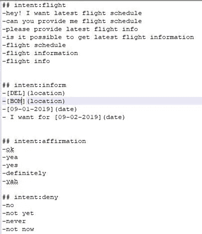
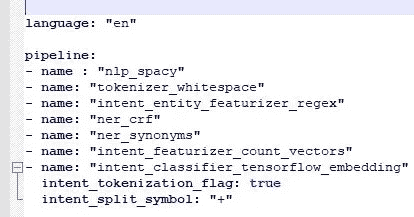
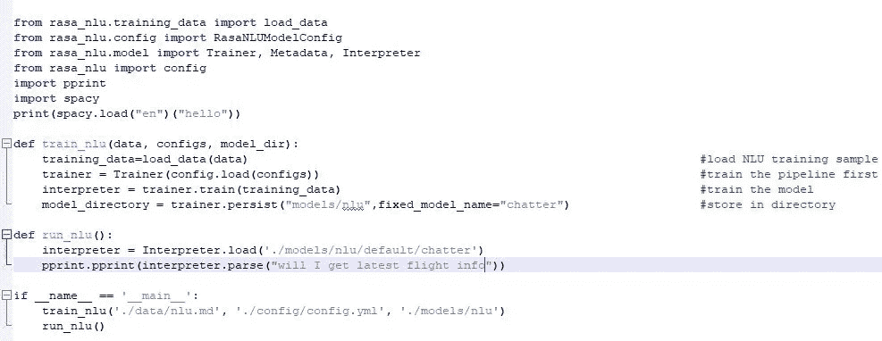
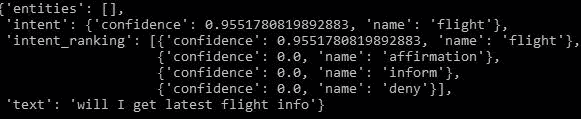

# 使用 RASA 从头开始构建一个航班搜索聊天机器人-第 1 部分

> 原文：<https://medium.datadriveninvestor.com/build-a-flight-search-chatbot-from-scratch-using-rasa-part-1-47370cf1e53b?source=collection_archive---------2----------------------->

在本文中，我们将使用 RASA 框架从头构建一个聊天机器人，RASA 框架是 RASA technologies GmbH 的开源框架。有许多关于建立聊天机器人的技术文档，然而，在这里，我将试着使它变得简单和不费力。

注意-我正在使用 Make My Trip(MMT)航班预订网站获取国内航班信息。

# 为什么是拉莎？

RASA 与 Dialogflow、chatterbot 或任何其他软件包的区别是什么？第一点是，它需要一些技术/编码技能，所以我们，开发人员，不会死于失业:)。玩笑归玩笑，与其他聊天机器人软件相比，这些技术让我们可以很容易地定制我们的聊天机器人。GitHub 资源库中提供了源代码。还有像 jupyter 或 notepad++这样的笔记本中的老派 python 编码，感觉就像是你自己亲手创造的东西。

让我们现在开始吧！

# 定义

Rasa NLU-自然语言理解；意图分类和实体提取

Rasa 核心对话管理模型，根据 NLU 和对话故事预测对话中接下来会发生什么

让我们长话短说，开始构建聊天机器人。我希望你已经安装了最新版本的拉沙核心和拉沙 NLU。

# 添加自然语言理解

**第一步:创建一个定义意图的数据文件:**

创建项目文件夹 MMT。在 MMT 下，创建两个子文件夹“data”和“config”。“数据”包含带有示例的意图，“配置”包含。yml 配置文件。

我在“数据”下创建了一个. md 文件。也可以在中创建。json 格式。我给出了四个意图(逃跑、通知、肯定、否认)。我们将根据用户输入来确定意图。我们必须通过为每个意图提供一些例子来训练 NLU 模型。

此外，我还标记了一些用户输入的实体，比如位置和日期。(例如，[DEL](位置)“DEL”是值，而“location”是实体)。

**第二步:创建配置文件(。yml 或者。yaml)**

配置文件定义了我们正在使用的管道。传入的消息由一系列组件处理。这些组件在所谓的处理流水线中一个接一个地执行。有用于实体提取、意图分类、预处理等的组件。每个组件处理输入并创建输出。管道中该组件之后的任何组件都可以使用该输出。

我们将在接下来的章节中讨论内置管道和自定义管道。

**第三步:训练 NLU 模型**

使用 NLU 数据和配置管道训练模型。模型保存在 models/nlu 中。

为了评估，我分析了这个问题(“我会得到最新的航班信息吗？”)，结果 intent: flight 的置信度为 95%。这意味着，我们的模型训练有素。

现在，我将在下一节中训练 RASA 核心或对话管理模型，并尝试在我的本地机器上运行 bot。

**第二部分**

[https://medium . com/@ ashumountain/build-a-flight-search-chatbot-from-scratch-using-rasa-part-2-4 e 99 Abe E4 e 88](https://medium.com/@ashumountain/build-a-flight-search-chatbot-from-scratch-using-rasa-part-2-4e99abee4e88)

**项目 Github 回购:**

[https://github . com/ashukrishna 100/MMTchatbot/tree/master/MMT/MMT](https://github.com/ashukrishna100/MMTchatbot/tree/master/MMT/MMT)