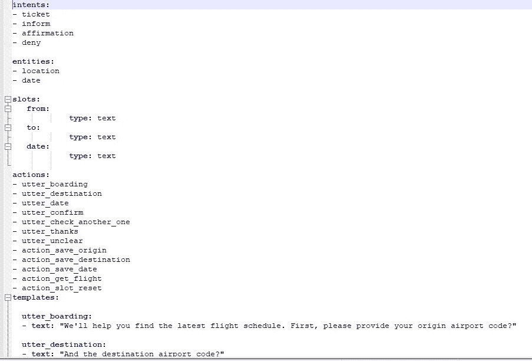
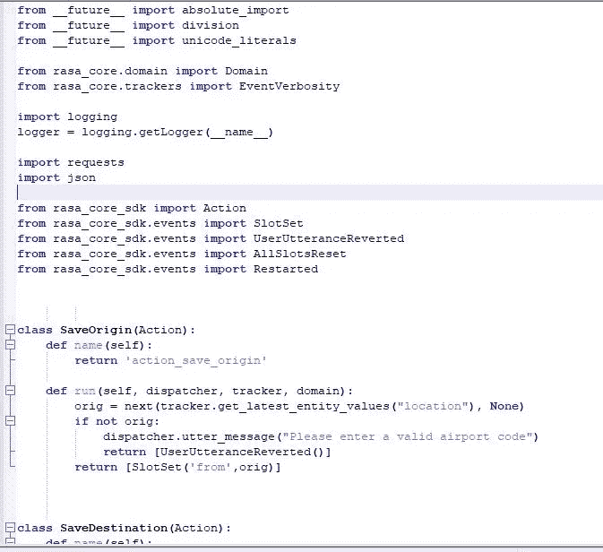
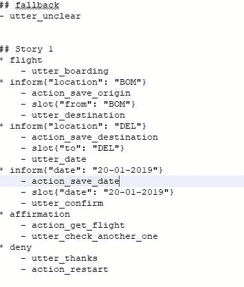
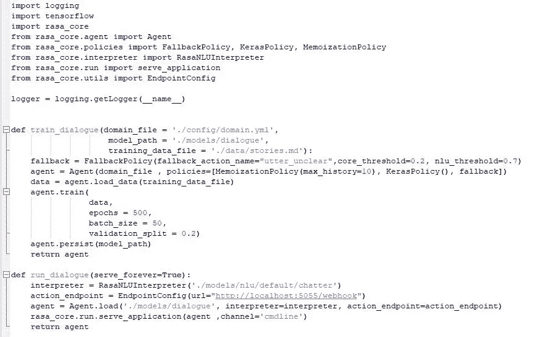
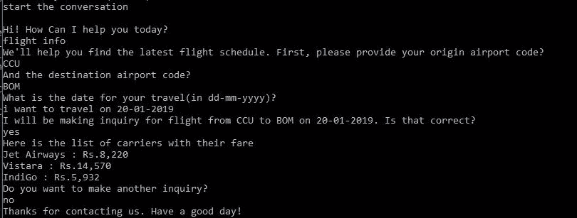

# 使用 RASA 从头开始构建一个航班搜索聊天机器人-第 2 部分

> 原文：<https://medium.datadriveninvestor.com/build-a-flight-search-chatbot-from-scratch-using-rasa-part-2-4e99abee4e88?source=collection_archive---------5----------------------->

在这一部分，我将写对话管理模型(即处理对话——根据用户输入预测下一步行动)

# **增加对话能力**

**第一步:创建域文件(。yml)**

在 MMT/config 下创建一个文件“domain.yml”。

“域”定义了你的机器人运行的世界。它指定了你的机器人应该知道的*意图、实体、插槽和动作*。它还包含了你的机器人可以说的东西的模板。

我们从 NLU 模型中得到意图和实体。*槽点*是我们在对话中想要跟踪的东西。*动作*是你的 bot 实际可以做的事情(比如响应用户、进行外部 API 调用、查询数据库、设置插槽和许多其他事情)。话语模板( *utter_* )是机器人将发送回用户的消息。当有回退条件时，ut _ unclear 触发，我们将在核心部分的培训中讨论这一点。花括号{}获取将在机器人话语中使用的槽值。

**第二步:创建动作文件(actions.py)**

动作是机器人为响应用户输入而运行的东西。有一些默认操作，如 action_restart、action_default_fallback 和 action_listen。但在这里，我们使用自定义操作来保存插槽，连接到 MMT 网站，并获得航班状态。

*pip 安装 rasa_core_sdk*

*   调度程序用于向用户发回消息
*   跟踪器存储并维护与用户对话的状态
*   域是机器人的域

__future__ 有助于习惯不兼容的更改或引入新关键字的更改。(例如用于`print(8/7) # prints 1.1428571428571428
print(8//7) # prints 1`)。用`from __future__ import division`这两个东西都会打印 1

日志记录帮助我们更好地理解程序的流程。日志为开发人员提供了一双额外的眼睛，时刻关注着应用程序正在经历的流程。它们可以存储信息，比如哪个用户或 IP 访问了应用程序。如果发生错误，它们可以告诉您程序在到达发生错误的代码行之前的状态，从而提供比堆栈跟踪更多的信息

我们需要 MMT 网站上的航班信息，所以，我使用 BeautifulSoup 进行网络搜索。( *pip 安装 beautifulsoup4*

重要-在域文件中添加这些新创建的操作及其各自的名称。

**步骤 3-创建故事(stories.md 文件)**

Rasa 核心对话系统的一个训练例子叫做**故事。故事告诉模型对话的可能流程。**

**步骤 4-训练核心模型**

Rasa Core 的工作原理是从故事中创建训练数据，并根据该数据训练模型。

**回退-** 有时候你想回退一个回退动作，比如说“对不起，我不明白”。为此，将`FallbackPolicy`添加到您的策略集合中。如果意图识别的置信度低于`nlu_threshold`，或者如果没有对话策略预测置信度高于`core_threshold`的动作，将执行回退动作。

**代理-** 代理允许你训练一个模型，加载，并使用它。这是一个简单的 API，允许您访问 Rasa Core 的大部分功能。(培训、处理消息、加载对话模型、获取下一个动作和处理通道)

Rasa Core 将通过随机地把你的故事文件中的故事粘在一起来创建更长的故事。默认增大系数为 50。我们可以通过将 augementation _ factor 参数传递给 *Agent.load_data* 方法来改变这一点。

**记忆策略-** 它会记忆你训练数据中的对话。如果在训练数据中存在这个精确的对话，它就有把握地预测下一个动作`1.0`，否则它就有把握地预测`None``0.0`。

**Keras policy-**It**是一个递归神经网络(LSTM)，它接受一系列特征来预测下一个可能的行动。特征是意图、实体、槽和先前动作的向量表示，其被馈送到预测下一个动作的神经网络。因此，如果对话流与故事中提到的不同，keras 策略将决定下一步的行动。(使用*labeltokenizersinglestatefaturizer 和 binarysinglestatefaturizer*创建向量，这两个工具*分别实现了标记化*和*一个热编码*)。**

****max_history-** 这控制了模型查看多少对话历史来决定下一步采取什么行动。默认值为 5，最小值为 3。max_history 值越大，训练时间就越长。例如，记忆策略中的 max_history 为 10 时，将在追踪器中回顾 10 步以确定下一步。在 keras 策略中，如果我们增加 max_history，就会增加特征向量。**

****持久化-** 一旦你训练了你的模型，它就被持久化到你选择的文件系统或云存储中**

****历元-** 历元基本上指的是你应该训练模型多长时间以获得更好的准确性。400 个时期意味着模型查看数据 400 次**

****批量大小-** 批量大小是指网络一次接受训练的样本数量。批量大小为 50 意味着模型同时看到 50 个示例。**

****Validation _ split-**Validation split 是为了测试模型而搁置的例子的百分比(0 到 1 之间，包括两端)。被搁置的例子的百分比将不用于训练。相反，在培训过程中，我们偶尔会对这些示例评估模型的性能。**

****

****第 5 步——运行机器人****

**NLU 模型和核心模型被加载到代理中，通过代理我们传递查询并得到响应。**

**运行这个文件并与机器人聊天。**

****

****第 6 步——通过互动学习创造更多故事****

**在互动学习模式中，你在和机器人说话的同时向它提供反馈。这是探索你的机器人能做什么的一种强有力的方法，也是修复它犯的任何错误的最简单的方法。基于机器学习的对话的一个优势是，当你的机器人还不知道如何做某事时，你可以教它！**

> **python-m rasa _ core . train-online-d config/domain . yml-s data/stories . MD-o models/dialogue-u models/nlu/default/chatter-epochs 250-endpoints endpoints . yml**

**我将在接下来的部分中讨论高级部分，如保存对话、服务器、网络频道。**

## **第一部分**

**[https://medium . com/@ ashumountain/build-a-flight-search-chatbot-from-scratch-using-rasa-part-1-47370 cf1e 53 b](https://medium.com/@ashumountain/build-a-flight-search-chatbot-from-scratch-using-rasa-part-1-47370cf1e53b)**

## **项目的 Github repo**

**[https://github . com/ashukrishna 100/MMTchatbot/tree/master/MMT/MMT](https://github.com/ashukrishna100/MMTchatbot/tree/master/MMT/MMT)**

# **参考资料:**

** [## 使用我们的开源对话式人工智能框架构建上下文聊天机器人和人工智能助手

### 没有人

rasa.com](https://rasa.com/docs/)  [## [已解决]预测的行动不符合故事情节

### 我有两个故事分享了一些意图。这两个故事都没有执行动作。故事是…

forum.rasa.com](https://forum.rasa.com/t/solved-predicted-action-not-following-the-story/3364/8)  [## 上下文对话引擎 Rasa 核心方法—第 1 部分

### 在过去的 10 个月左右的时间里，我一直活跃在 Rasa 社区，并且尝试了很多…

medium.com](https://medium.com/@souvikghosh_archidev/contextual-conversational-engine-the-rasa-core-approach-part-1-1acf95b3d237)**