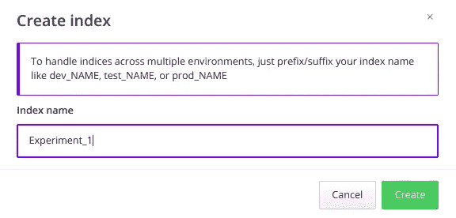
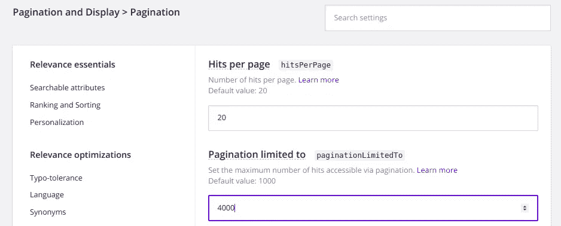
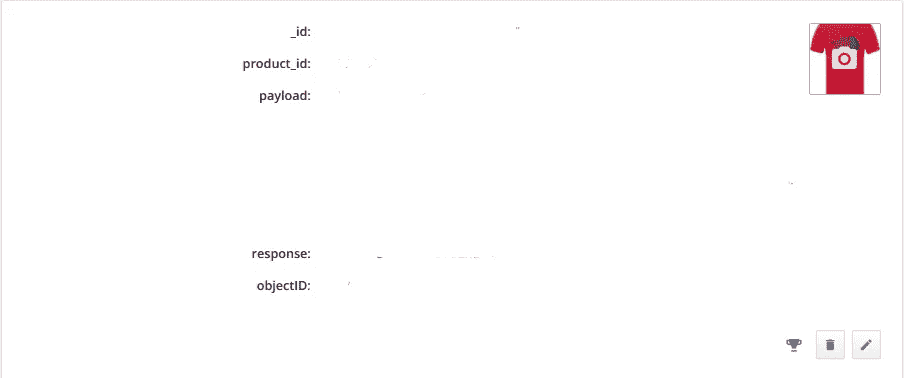

# 使用 Algolia & MongoDB 构建产品级搜索体验。(不需要网络服务器)

> 原文：<https://medium.datadriveninvestor.com/build-a-production-grade-search-experience-using-algolia-mongodb-no-webserver-required-6ff0661bf228?source=collection_archive---------0----------------------->


获得闪电般的快速搜索结果是任何动态网站的梦想成真。这个博客旨在建立产品级的搜索能力 ***“甚至不需要建立一个网络服务器！”*** 。没错，我将带你通过简单的步骤，使用 ***Algolia 使你的网站能够以闪电般的速度在你的前端网站上显示你的 MongoDB 数据库的内容。***

## 首先我们应该了解 Algolia 到底是什么？


Algolia Official Logo

Algolia 是一家向其客户提供 ***【搜索即服务】****的公司，通过使用外部托管的搜索引擎提供搜索客户网站的 api，提供闪电般快速的结果！*

# *那么我们要怎么做呢？*

*对于这个基础教程，我将使用 ***NoSQL MongoDB*** 数据库，普通的 javascript，没有任何网络服务器。一般来说，如果我们添加一个使用 ***NodeJS、RubyOnRails*** 等构建的 web 服务器。在我们的 algolia 索引和前端堆栈之间，优化水平可以提高一个档次，但建立一个组织良好的后端网络服务器需要一些时间，至少对于初学者来说，我将在我接下来的博客中介绍在前端和 algolia 索引之间合并一个网络服务器。这个博客专注于在几分钟内生成结果，所以我们需要的只是我们的 ***前端堆栈、algolia 索引和 MongoDB*** 数据库。*

**

*Algolia Integration Official Integration pic*

> ***第一步**:创建一个 algolia 账户，然后进入**仪表盘**。转到索引部分，然后选择**创建索引**选项。让我们把我们的第一个索引命名为“实验 _1”。*

**

*Creating an algolia Index*

*现在有一个小问题，你可能会面临，而点击搜索查询你的 algolia 指数。Algolia 对索引搜索结果的建议是 50 页的分页以获得最佳结果，但我们可以在索引的**配置选项卡**中更改分页限制和每页的点击数。*

> ***第二步**:在>分页配置中更改分页限制，显示>分页标签。在本例中，我将分页限制从默认的 1000 设置为 4000。默认配置提供大约 50 页，每页 20 次点击。保存并更新更改。*

**

*Setting hits per page and pagination limit from algolia dashboard*

> ***步骤 3** :将 MongoDB 数据库的内容转移到 algolia 索引中。为此，我写了一个简单的 python 脚本，没什么特别的。*

***你可以从我的 github** 获取上面的代码:【[https://gist . github . com/Arne esh/b 8 F5 DD 3d 0 bfe CAC 6256 af 712 a 1c 6 cafd](https://gist.github.com/arneesh/b8f5dd3d0bfecac6256af712a1c6cafd)*

*只需将代码中的“Your_Application_ID”、“Your_API_Key”、“Your_MongoDB_Connection_String”、“Your_MongoDB_Database”和“Your_MongoDB_Collection”替换为这些变量各自的值。*

> ***第四步**:是时候设置我们的前端 javascript 文件了。在本教程中，我将创建三个基本文件**index.html，styles.css & script.js** 。*

*index.html 和 styles.css 文件可以按照你的意愿设计，我将在本教程中介绍 index.html 文件的搜索框和点击容器组件。你需要从 algolia 文档中导入 algolia javascript 的基本头文件。以下是链接:*

```
*[https://www.algolia.com/doc/guides/getting-started/quick-start/tutorials/quick-start-with-the-api-client/javascript/](https://www.algolia.com/doc/guides/getting-started/quick-start/tutorials/quick-start-with-the-api-client/javascript/)*
```

*有两种方法可以将 algolia 整合到你的前端堆栈中，要么使用 CDN 头文件，要么使用 npm，使用 npm 和 CDN 头文件的安装可以在上面的官方链接和 algolia javascript 示例中找到。所有这些都是非常基本的东西，所以我不会在这里讨论。*

*[](https://www.datadriveninvestor.com/2020/02/26/surviving-in-a-digital-age-of-instability/) [## 在不稳定的数字时代生存|数据驱动的投资者

### 如果你是一名计算机科学家，你可能已经注意到新的框架不断出现。编程…

www.datadriveninvestor.com](https://www.datadriveninvestor.com/2020/02/26/surviving-in-a-digital-age-of-instability/) 

导入所有必需的头文件或使用 npm 服务器安装后。在 index.html 文件中构建基本的 header & body 组件，并为**搜索**和**点击创建两个 div。**我将在本教程的步骤 5 中添加分页和索引切换 index.html div 以及它们的小部件解释。

```
<div class="searchbox-container" id="searchbox"></div><div id="hits"></div>
```

您可以在您的 html 文件中添加大量您想要的元素，algolia 提供了各种现成的模板/小部件来改进网站的功能。

> **步骤 5** :让我们转到 script.js 文件。这是一个真正神奇的文件，algolia 为我们提供了一个 api 密钥和应用程序 id，通过访问它，我们可以在几分钟内建立起闪电快速搜索的客户群。

```
var search = instantsearch({
  indexName: 'Experiment_1',
  searchClient: algoliasearch('Your_Application_ID', 'Your_API_Key'),
  routing: true,
});
```

Algolia 已经准备好为各种网站组件使用小部件，如 searchbox、pagination 等，我们将在这里使用其中一些。

**搜索框小工具**

```
search.addWidget(
  instantsearch.widgets.searchBox({
    container: '#searchbox',
    showReset: false,
    cssClasses: {
      root: 'root',
      form: 'form',
      input: 'input form-control',
      submit: 'btn btn-default',
      reset: 'btn btn-default',
    },
  })
);
```

**分页小工具**

```
search.addWidget(
  instantsearch.widgets.pagination({
    container: '#pagination',
    cssClasses: {
      root: 'root',
      list: 'pagination',
      disabledItem: 'disabledItem',
      selectedItem: 'selectedItem',
    },
  })
);
```

一个成熟的搜索体验的一个重要组成部分是在索引之间切换的能力。我们可以通过稍微调整一下 **sort-by** 小部件来满足我们的需求；)

**按部件排序(用于在指数之间切换)**

```
search.addWidget(
  instantsearch.widgets.sortBy({
    container: '#sort-by',
    items: [
      { value: 'Experiment_1', label: 'Experiment_1' },
      { value: 'Experiment_2', label: 'Experiment_2' },
      { value: 'Experiment_3', label: 'Experiment_3' },],
    label: 'sort by',
  })
);
```

在你的**index.html**文件中创建一个简单的 div 来切换索引，这个文件连接到上面的 javascript 代码库。

```
<div class="sort-by"><div id="sort-by"></div></div>
```

整个过程中最重要的小部件是**点击小部件和点击模板。**

**点击 Widget &配置它**

```
search.addWidget(
  instantsearch.widgets.hits({
    container: '#hits',
    hitsPerPage: 20,
    templates: {
      empty: noResultsTemplate,
      item: hitTemplate,
    },
    transformItems: function(items) {
      return items.map(function(item) {
        item.stars = [];for (var i = 1; i <= 5; ++i) {
          item.stars.push(i <= item.rating);
        }return item;
      });
    },
    cssClasses: {
      list: 'list',
    },
  })
);
```

**注意**:虽然你可以在这里定义你的 hits 部件的一些配置，但是其中一些不能从你的 script.js 文件中被覆盖。例如 **"hitsPerPage"** ，无论您在此处设置每页的点击数是多少，它都不会给出结果，因为这些基本组件 algolia 将始终使用您在仪表板中设置的设置，因此在索引仪表板本身中设置适当的**分页**和 **hitsPerPage** 值。还有另一种方法来覆盖它，但你需要一个后端网络服务器，它只有几行代码，我会在这里添加代码，但不会涵盖本教程的网络服务器部分。所以现在从仪表板本身设置 **hitsPerPage 和分页**，正如我在本教程的步骤 2 中所解释的。

NodeJS 服务器—(不是本教程的一部分)

```
index.search({
  query: 'query',
  hitsPerPage: 20
}).then(res => {
});
```

如果您想创建一个 web 服务器，修改“**hitsPerPage”**就像上面的代码片段一样简单。

**点击模板—(根据您的需要创建)**

模板的每个组件都需要用单引号( ' )括起来，每一行都以一个到下一行的连接符结束，即(+)符号。下面提供了一个示例。

```
var hitTemplate =
  '<div class="hit media">' +
 '<div class="product_name"><h4><b>Name: {{Your_Json_Path_to_Required_Component}}</b></h4></div>'+
  '<hr/>'+
  '<div class="product_name"><h4 style="color:red;text-shadow: 2px 2px 4px #ffg;">Target Image</h4></div>'+
  '</div>';
```

json 路径下的遍历示例:

```
{{response.query_item._source.name}}
```

您只需要提供想要从 algolia 索引中提取其值的对象的路径。Algolia 索引具有 json 形式的值。您可以从 json 对象中提取所需的值。我在下面附上了一个样本。这可以在你的 algolia 索引中找到。单击 Edit 按钮(右下角的小铅笔图标)，如果您的 json 对象很长，您可以从那里查看 json。



A sample json object inside an algolia index contaning key values pairs ( erased keys from this image )

这是它，你完成了你的基本的，闪电般的速度和开发时间友好的搜索栈。

```
Thank You !
My LinkedIn : [Visit Me on LinkedIn](https://www.linkedin.com/in/arneesh-aima-49b516116/)
```

**获取专家观点—** [**订阅 DDI 英特尔**](https://datadriveninvestor.com/ddi-intel)*