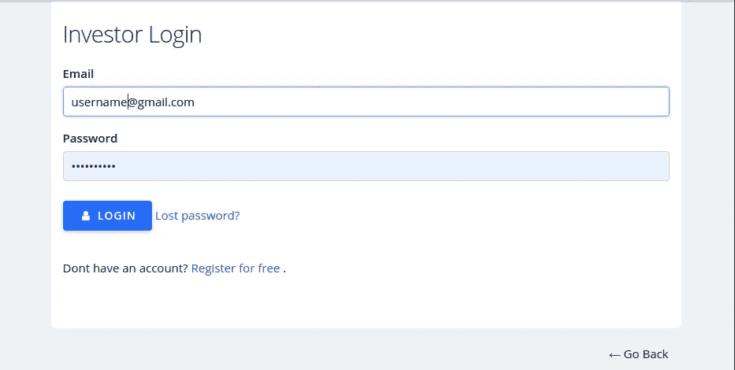
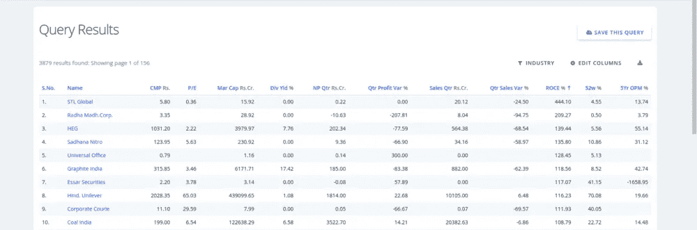
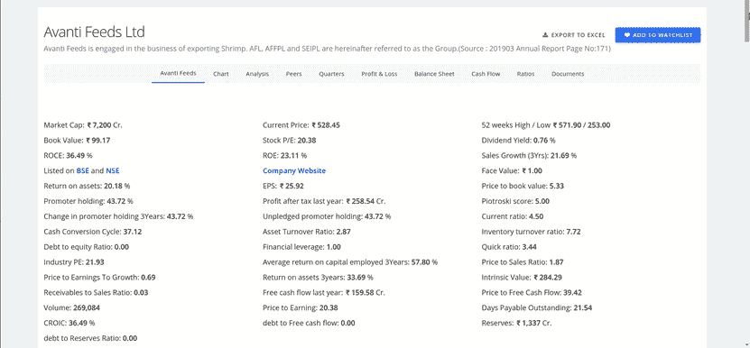
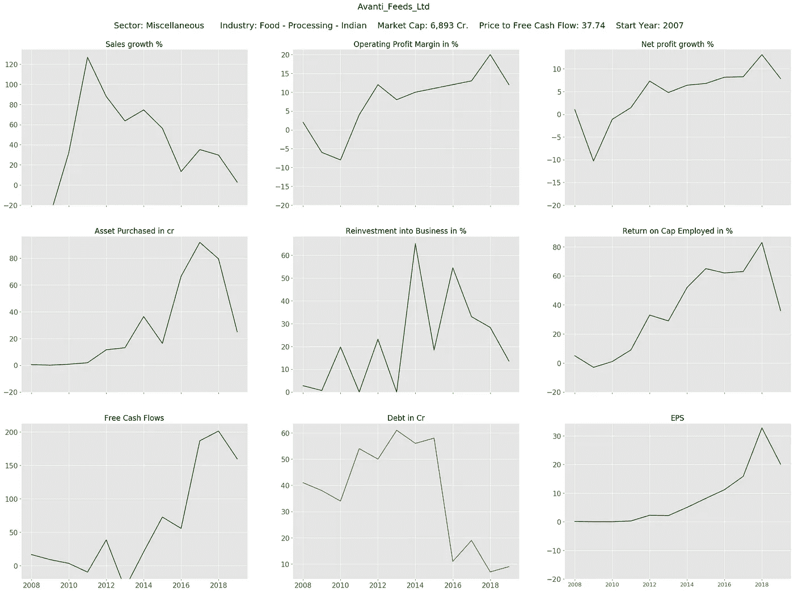
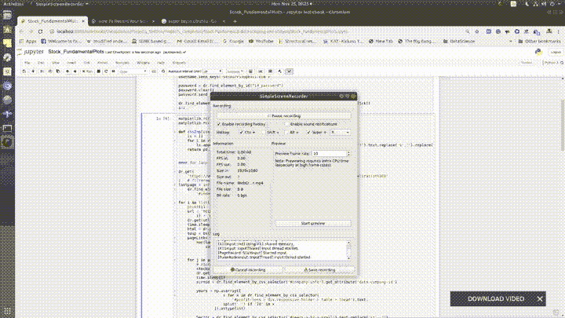

# 用 python 构建一个抓取股票基本面的网络爬虫

> 原文：<https://medium.datadriveninvestor.com/build-a-web-crawler-that-scrapes-stock-fundamentals-in-python-e2d4af56398?source=collection_archive---------0----------------------->

## 收集股票的基本面，一气呵成地回顾它们的表现

Photo by [Markus Spiske](https://unsplash.com/@markusspiske?utm_source=medium&utm_medium=referral) on [Unsplash](https://unsplash.com?utm_source=medium&utm_medium=referral)

与其他保守的投资工具相比，股票投资如果操作得当，从长远来看会产生更好的回报。成功来自于从数以千计的股票中选择基本面坚实的股票。然而，找到这些股票就像找到一只独角兽一样困难。挑选基本面良好的股票包括从不同角度调查股票，如评估基本面比率、公司管理分析、产品在消费市场的影响、竞争对手等。在决定我们要投资的股票时，每一步都至关重要，而且每一步都需要大量的时间。因此，对上市的每只股票都执行这些步骤并不是一个好主意。我们必须根据某些标准只选择少数几只潜力股，这些标准通常是根据盈利能力指标的表现制定的。仅回顾当年的股票基本面并不能揭示太多信息，有时还可能产生误导，因为出于某种原因，该财政年度的情况可能有所不同。相反，我们需要看一看过去几年的业绩指标，以清楚地了解公司的业绩。

 [## 创建折衷书架的程序员指南|数据驱动的投资者

### 每个开发者都应该有一个书架。他的内阁中可能的文本集合是无数的，但不是每一个集合…

www.datadriveninvestor.com](https://www.datadriveninvestor.com/2019/03/25/a-programmers-guide-to-creating-an-eclectic-bookshelf/) 

我接手这个项目是为了进行最初的股票筛选过程和最重要的方面，即审查印度公司业绩指标的趋势。审查公司基本面包括通过查看年度数据和趋势来了解公司在过去几年中的表现。同样，手动操作是一项繁忙的工作，因为它涉及收集符合我们标准的股票列表，检查筛选列表上的每个股票页面，获取业绩指标的历史数据，并绘制它们以了解趋势。我决定用 python 开发一个“网络爬虫”，一次性完成所有这些任务。总之，这个项目的目标是在基于标准筛选的股票中选择最有价值的股票，并回顾这些股票的历史表现。

这种方法包括以下步骤:

1.  登录到数据提供者服务器。
2.  提交一个查询，过滤符合我们标准的股票
3.  从第一页开始收集股票链接并存储在列表中(如果结果多于一页)。
4.  循环浏览股票链接页面并获取所需数据，同时为每只股票生成图表。
5.  移到下一页，重复步骤 3-4，直到最后一页。

**使用的工具:**

1.  Python:网络爬虫是用 Python 构建的
2.  Selenium:一个在后端与 web 服务器交互的工具
3.  BeautifulSoup:一个帮助你从 HTML 文档中获取数据的包
4.  Numpy:文本格式的原始数据被转换并存储为数字数组格式
5.  Matplotlib:绘图生成

**方法:**

我们首先初始化 selenium web 驱动程序，并使用它通过提交我们的凭证来登录 web 服务器。Screener.in 是数据来源，下面提供了登录链接。https://www.screener.in/login/

login page

一旦我们成功进入服务器，现在我们就可以访问数据了。让我们提交我们的查询来过滤通过所需标准的股票。我设置了一个简单的查询“市值> 0”。运行该查询后，它列出了所有市值大于零的公司。下面是结果页面的截图。

查询链接:【https://www.screener.in/screen/raw/?sort=】T4&source =&order =&page = 1&查询=市值+资本化%3E0

请注意，3879 个结果通过了我们设定的标准，它们存储在 156 页中。我们需要在嵌入在“&page=1&”处的查询链接中插入页码，以便在第 1–156 页中爬行，从而获得所有产生的股票链接。我们在第 1 页，让我们收集所有的股票页面链接，并将它们存储在列表中。可以通过使用“bs4”包提取与股票链接相关联的“href”标签来抓取链接。我们需要访问每个股票页面，从中获取数据。这是通过创建 page 的 beautifulsoup 对象，然后定位对应于我们感兴趣的数据的标签，并将数据存储为数组格式来实现的。滚动示例以浏览网页。

该页面包含几个指标的历史数据表，这些数据描述了公司过去的业绩和财务状况。然而，我只根据我的直觉考虑了几个指标，这些指标最能描述一家公司在长期竞争环境中的稳定性和盈利能力。您将在下面生成的图中看到选定的指标。

仅仅收集数字并不能说明什么，因为仅仅看数字是很难解释的。我们可以在飞行中创造视觉情节，讲述公司的故事，并可能给出公司未来发展方向的提示。下面我为两代情饲料有限公司添加了一个绩效指标趋势图作为案例。该公司主要从事水产饲料制造业务，同时生产虾的附加值产品。

我已经提出了我对其管理的看法。让我们检查一下。

1.  销售增长——该公司积极扩大销售额(> 50%)。但近年来的下降表明该公司已接近市场饱和，但仍在大多数财政年度保持在 25 %以上。
2.  营业利润率—公司的整体营业利润率呈上升趋势。它标志着销售收入和产品制造增长之间的差异。请注意，2017 年的大幅上涨可能归因于原材料价格的下降。此外，本年度利润的下降可归因于原材料价格超出正常范围的上涨。
3.  净利润增长——这个和上面的故事一样。该公司近年来的净利润率接近 8-9%，这是一个相当不错的数字。公司利润呈现积极趋势是一个好迹象。
4.  购买的资产—资产购买可能与业务扩展或改进相关联，例如替换现有资产、进入新的细分市场或新业务。显著的正值表明公司正在增长。
5.  对企业的再投资——对企业的再投资与前一项几乎相同，但以销售收入的百分比表示。这将更好地描述公司的发展。假设有两家市值 100 cr 和 1000 cr 的公司 A 和 B。两家公司向企业再投资 10 cr 是不一样的。甲的业务增长了 10%,而乙只增长了 1%。与 b 相比，a 更具侵略性。两代情饲料多年来一直保持在 10%以上，这对这种规模的公司来说是一个很好的数字。
6.  资本回报率——一般来说，投资的资本应该产生更高的回报率，否则公司就没有充分利用其资源。这不需要认真对待，因为今年投入的资本可能不会在当年转化为回报。然而，从长远来看，它可能会产生良好的回报。因此，投资者应该关注长期趋势，而不仅仅是数字。
7.  自由现金流——是从收益中扣除已付税款、资本支出和网络资本后，公司剩余的现金。这是所有者、股东和贷款人可用的实际现金。因此，就业务回报而言，这比净利润更有意义，它构成了股票价格评估的基本输入。两代情饲料已显示出增长趋势，但实际数字也很重要。
8.  债务——债务是决定公司稳定性的因素之一，如果不加以控制，可能会导致公司在经济疲软时垮台。越来越多的趋势表明，该公司正在努力满足其财务需求。这家公司几乎没有债务，这很好。
9.  每股收益是股东每股获得的利润。从 2011 年开始，每股收益值单调增加，直到 2018 年，这意味着投资者对公司持积极态度。2019 财年的销售增长和利润率下降似乎可能对每股收益产生了负面影响。

这些见解只是触及了表面，还有更多，比如理解指标之间的相互作用，从而提供更好的见解。阅读情节和发展一个故事是一门艺术，可以通过实践和经验来掌握。建议查阅过去几年的财务报告，找出在图表中观察到的变化背后的实际原因。

我们在第一页上搜集了第一家公司的数据。对于第一页上的所有股票链接，必须重复这个练习，然后继续到第二页，依此类推。

让我们的网络爬虫开始行动吧。出于演示的目的，我让 crawler 登录到源代码，访问前三个页面，在每个页面中，它对前三个股票页面执行抓取，然后从源代码中注销。下面是它的一个片段。

感谢您的阅读。任何想法将不胜感激。

我的 GitHub 上的全部代码 [repo](https://github.com/Skumarr53/Stock-Fundamental-data-scraping-and-analysis)

投资愉快。