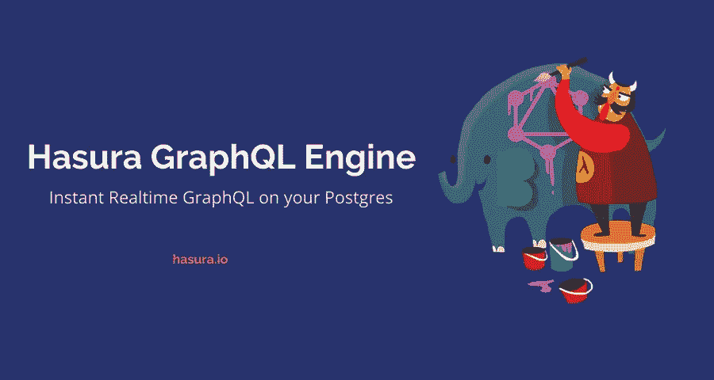

# 使用 GraphQl API 构建应用程序

> 原文：<https://medium.datadriveninvestor.com/build-an-app-using-graphql-api-15d4c8f70fe7?source=collection_archive---------46----------------------->

[](http://www.track.datadriveninvestor.com/DDIBeta11-21)

在第 1 部分中，我们学习了如何从 Postgres 数据库中读写数据。你可以在这里找到零件 1。今天，我们要学习更新和删除操作。

**删除！**

要执行删除操作，请在 append 函数本身中添加按钮(在时，从表中检索用户爱好并将其追加到文档中)。

```
$("div").append(i +'&nbsp;&nbsp;&nbsp;&nbsp;&nbsp;&nbsp;&nbsp;&nbsp;&nbsp;&nbsp;&nbsp;&nbsp;&nbsp;'+myJson.data.users_hobby[i].name+'&nbsp;&nbsp;&nbsp;&nbsp;&nbsp;&nbsp;&nbsp;'+myJson.data.users_hobby[i].hobby+' **<button onclick=userDel(\"'+myJson.data.users_hobby[i].name+'\")><i class="fa fa-trash"></i></button>**'+'<br><br>');
```

这里，Click 函数是为删除按钮编写的。所以当按钮被点击时，用户名将被传递到 userDel(name)参数中。在 userDel(name)中，编写删除操作的查询。

看看下面的代码，

1.  _eq: name —用于检查表中的名称和变量中存储的名称是否相等。

2.两次查看查询。

**更新！**

进行更新操作就像 CRD 操作一样简单，

```
mutation update_users_hobby {
  update_users_hobby(
    where: {id: {_eq: "maxi"}},
    _set: {hobby: "tennis"}
  ) {
    affected_rows
  }
}
```

看看上面的查询，放在更新函数里。体验一下。

app 在这里运行[这里运行](https://raspy-hippopotamus.glitch.me)。

就是这样！我们学习了如何使用 Hasura GraphQL 引擎进行 CRUD 操作。

> GraphQL！？没什么大不了的…要扩散了！

**有用的链接！**

1.  [Hasura 文档](https://docs.hasura.io/1.0/graphql/manual/index.html)
2.  [查询 github 数据库](https://developer.github.com/v4/explorer/)
3.  [更多关于 GraphQL 的信息](https://medium.freecodecamp.org/so-whats-this-graphql-thing-i-keep-hearing-about-baf4d36c20cf)作者 [Sacha Greif](https://medium.com/u/156e844b0e31?source=post_page-----15d4c8f70fe7--------------------------------)

**感谢的时候到了！**

> 哈苏拉，感谢你将它作为开源项目，并在一定程度上免费提供。

👏永远！

D ay 14。这是我的博客，明天见！