# 在本地运行用 Kotlin 编写的 Azure 函数

> 原文：<https://medium.datadriveninvestor.com/build-and-test-azure-functions-written-in-kotlin-locally-33522f1fa29a?source=collection_archive---------3----------------------->

[](http://www.track.datadriveninvestor.com/1B9E)

在本文中，我将演示如何在本地构建和测试使用 Kotlin 编写的 Azure 函数。

本文是上一篇文章的后续，上一篇文章可以在下面的链接中找到:

[](https://www.datadriveninvestor.com/2019/02/21/best-coding-languages-to-learn-in-2019/) [## 2019 年最值得学习的编码语言|数据驱动的投资者

### 在我读大学的那几年，我跳过了很多次夜游去学习 Java，希望有一天它能帮助我在…

www.datadriveninvestor.com](https://www.datadriveninvestor.com/2019/02/21/best-coding-languages-to-learn-in-2019/) 

*   [使用 Kotlin 的全栈开发](https://medium.com/@juliuscanute/fullstack-development-using-kotlin-on-android-and-azure-functions-121571587163)

# 快速回顾

> 我们使用 Swagger 为字典应用程序设计了一个 API 规范。

# 项目设置

我在开发过程中使用了 IntelliJ IDEA，如果你想从头开始设置项目，你可以在这里找到设置说明[，或者如果你想获得完整的设置，可以在这个](https://docs.microsoft.com/en-us/azure/azure-functions/functions-create-maven-intellij)[链接](https://github.com/juliuscanute/azure-function-kotlin)中找到。

如果您从完整的安装程序开始，请确保您的计算机上安装了以下先决条件。

## 先决条件

*   [阿帕奇 Maven](https://maven.apache.org/)
*   [Azure CLI](https://docs.microsoft.com/cli/azure)
*   [Azure Functions 核心工具，第二版](https://docs.microsoft.com/en-us/azure/azure-functions/functions-run-local#v2)

# 概观

该图代表了根据项目组织的高级设计。

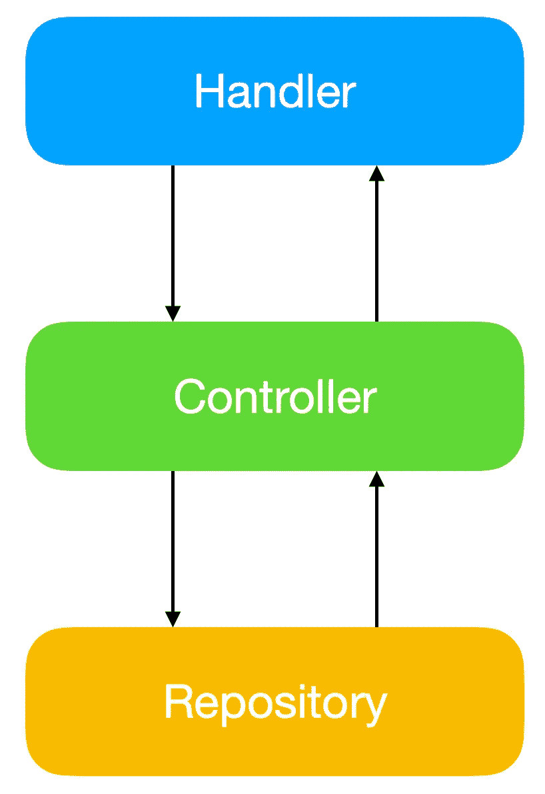

HLD

## 处理者

处理程序是 Azure 函数的入口点，它负责将传入的 HTTP 请求转换为函数中相应的变量，使其适合处理。

## 控制器

控制器是所有处理程序的入口点，它接收来自处理程序的输入，并对存储库进行相应的调用。

## 贮藏室ˌ仓库

存储库与我们选择的数据存储库进行交互，它或者获取或者更新底层数据源中的数据。

## 依赖注入

我们不是将创建所需依赖项的责任委托给一个类，而是构造所需的对象并将这些依赖项传递给需要它们的类，在这个项目中，这允许快速切换依赖项的可能性。我们使用这个方面来编写我们的单元测试。

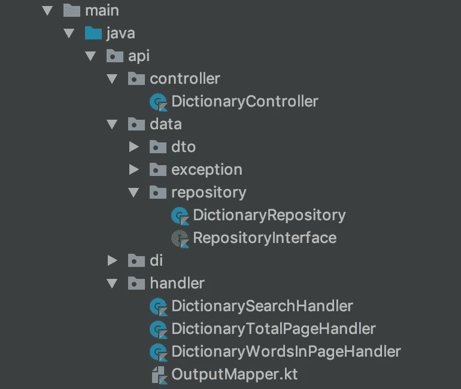

Project Structure

## 数据传输对象

我们希望业务逻辑独立于细节。DTO 帮助我们在跨越边界时来回绘制数据。

# 项目相关性

确保将以下依赖项添加到“pom.xml”中

## 科特林群岛

以下依赖项支持使用 Kotlin。

```
<properties>
  <kotlin.version>1.3.40</kotlin.version>
</properties><dependencies>
  <dependency>
      <groupId>org.jetbrains.kotlin</groupId>
      <artifactId>kotlin-stdlib-jdk8</artifactId>
      <version>${kotlin.version}</version>
  </dependency>
<!-- Test -->
  <dependency>
      <groupId>org.jetbrains.kotlin</groupId>
      <artifactId>kotlin-test</artifactId>
      <version>${kotlin.version}</version>
      <scope>test</scope>
  </dependency>
<dependencies>
```

## Koin 依赖项

下面的依赖项支持使用 Koin，我们将它用于依赖项注入。

```
<dependencies>
  <dependency>
      <groupId>org.koin</groupId>
      <artifactId>koin-core</artifactId>
      <version>2.0.1</version>
  </dependency>
  <dependency>
      <groupId>org.koin</groupId>
      <artifactId>koin-core-ext</artifactId>
      <version>2.0.1</version>
  </dependency>
  <dependency>
      <groupId>org.koin</groupId>
      <artifactId>koin-java</artifactId>
      <version>2.0.1</version>
  </dependency>
</dependencies>
```

## 宇宙和 Gson 依赖关系

我们使用 Azure Cosmos DB 作为后端存储库，使用 GSON 发送 JSON 响应。

```
<dependencies>
  <dependency>
      <groupId>com.microsoft.azure</groupId>
      <artifactId>azure-documentdb</artifactId>
      <version>1.9.1</version>
  </dependency>
  <dependency>
      <groupId>com.google.code.gson</groupId>
      <artifactId>gson</artifactId>
      <version>2.8.5</version>
  </dependency>
</dependencies>
```

# API 实现

我将演示其中一个 API 的实现，您可以使用它作为参考来研究完成我们的应用程序所需的其他两个 API 的实现。有关该实现的更多信息，请参考[上一篇文章](https://medium.com/@juliuscanute/fullstack-development-using-kotlin-on-android-and-azure-functions-121571587163)中的 API 设计。

## 获取词典的总页数

当我们在路由“v1/dictionary/pages”上收到“HTTP GET”请求时，run 中的函数体开始执行。

Get total pages in a Dictionary

变量 **Startup** 指的是 singleton 对象，它启动 Koin 并注入 Azure 函数所需的依赖项。因为启动对象是单例的，所以只要函数所在的容器是活动的，我们就可以重用与底层存储库建立的连接。

Dependency Injection

控制器联系底层储存库以获取数据。

Dictionary Controller

在对存储库做出任何具体决定之前，我们将对数据流进行单元测试，以确保处理程序接收到的数据能够到达存储库，并且在将数据转发到处理程序之前，存储库可能抛出的任何错误都会在控制器中得到正确处理。

Dictionary Handler Test

单元测试可以直接从 IDE 启动，如图所示。


Start Test

下图显示了测试结果。

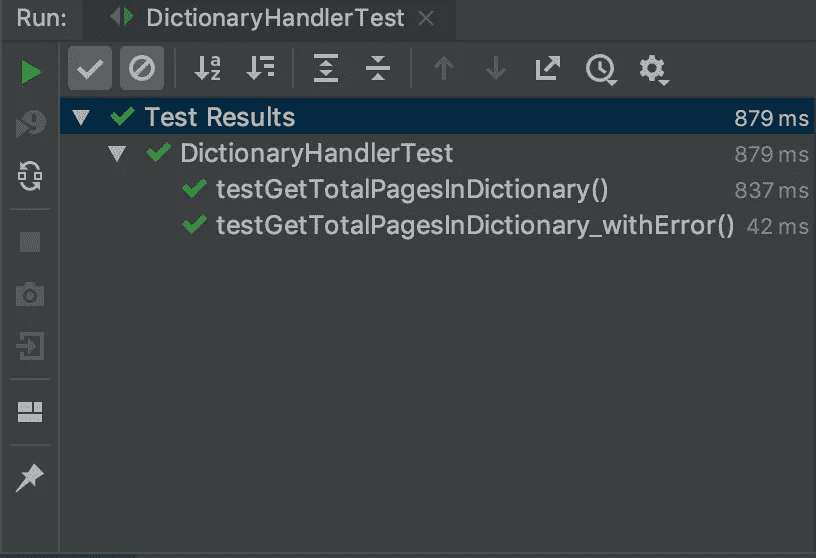

Test Results

# 知识库实现

对于这个项目，我选择 Azure Cosmos DB 作为我们数据的后端存储。在我们的例子中，它允许我们将数据分组，并提供水平可伸缩性。

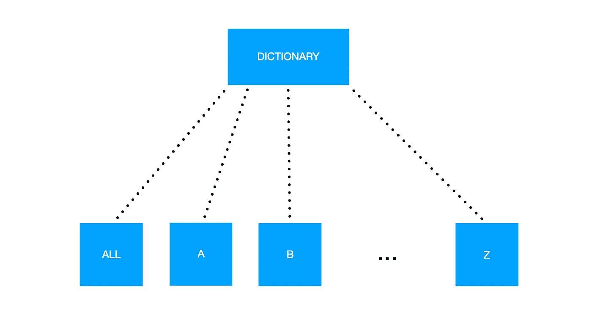

Data Partition

在 Azure Cosmos DB 中，创建数据库之前必须做出的最初决定之一是选择一个分区键。选择正确的分区键可以使数据库性能更好。在我们的例子中，我把以相同字母开头的单词分割在一起。

我在这里提供了预处理数据集的链接。您必须考虑的重要列是分区列。其中一个文件包含所有单词的相同分区键。第二个文件包含按单词的起始字母分组的分区键。

*   [全部](https://github.com/juliuscanute/azure-function-kotlin/blob/master/dictionary/dictionaryTotal.csv)
*   [一..Z](https://github.com/juliuscanute/azure-function-kotlin/blob/master/dictionary/dictionarySearch.csv)

## 好消息和坏消息

好消息
你可以将你的 Azure 函数连接到运行在模拟器中的 Cosmos DB。请点击下面的[链接](https://docs.microsoft.com/en-us/azure/cosmos-db/local-emulator)下载并安装 Cosmos DB 模拟器。

**坏消息**
在撰写本文时，Cosmos DB 模拟器还不能用于 Linux 或 Mac 因此，你必须依赖 VirtualBox、Parallels 或者将一台 Windows 机器连接到你的本地网络。

## 将数据导入 Cosmos DB 模拟器

打开仿真器，记下“**主连接字符串。**“我们使用这个导入数据到 Cosmos DB 模拟器中。

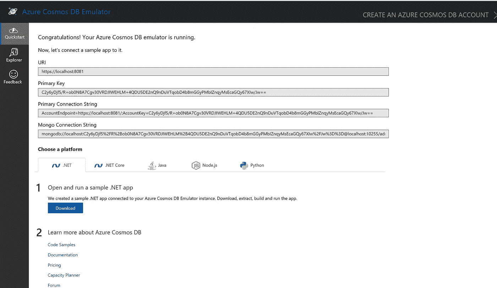

Emulator — Primary Connection String

通过切换到 Explorer 选项卡，查找创建新数据库的选项，并使用下面的设置配置数据库。我必须强调的是，由于我是在本地测试吞吐量，所以我是不计后果的，但是一旦我们将它部署到云中，我们就需要根据我们的应用程序需求进行调整。

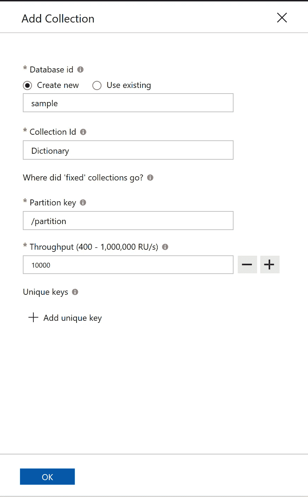

Emulator — Create New Database And Collection

## 数据迁移工具

1.  使用位于以下[链接](https://docs.microsoft.com/en-us/azure/cosmos-db/import-data)的数据迁移助手将 CSV 文件导入 Cosmos DB Emulator。

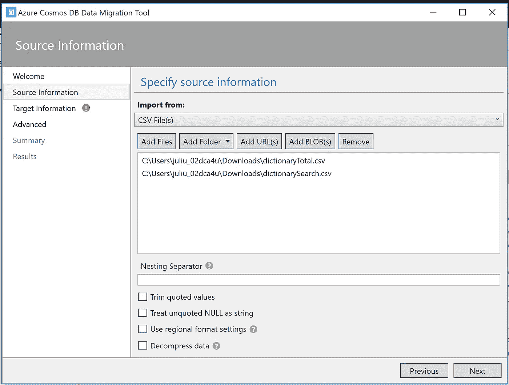

DBDMT- Load CSV files

2.使用您之前记下的连接字符串，让数据迁移工具连接到模拟器。

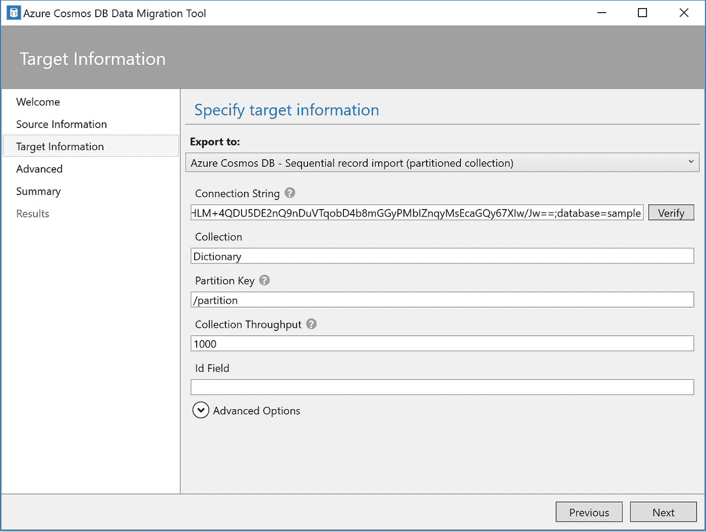

DBDMT-Connection Information

确保连接字符串采用以下形式，并通过单击“验证”按钮来验证是否可以建立连接。

```
AccountEndpoint=<Endpoint>;AccountKey=<Key>;database=<DatabaseName>
```

3.开始迁移过程并坚持下去。我注意到这个迁移助手的一个问题是，如果在将任何记录插入数据库时出现故障，它没有提供重新尝试失败记录的简单方法。


DBDMT-Migrating Data

## 获得集合 URI

我没有找到任何明显的方法从模拟器中获取这些信息，因此，我依赖于 [Azure Storage Explorer](https://azure.microsoft.com/en-gb/features/storage-explorer/) 来获取这些信息。

您可以使用提供给数据迁移工具的相同连接信息。Azure Explorer 连接到模拟器后，从浏览器获取 URI。

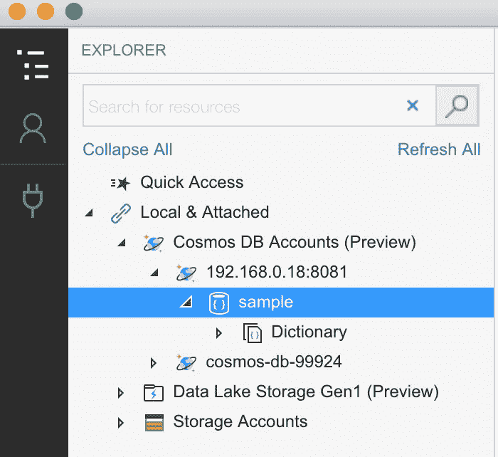

Azure Storage Explorer — Local Connection

记下 URI 的收藏。

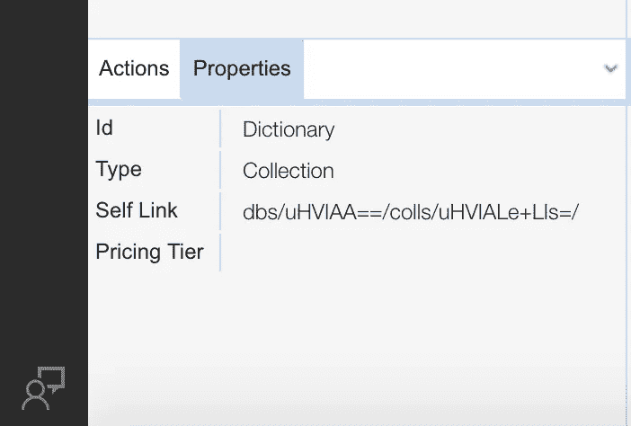

Azure Storage Explorer — Collections URI

## **环境变量**

在本地测试函数时，“local.settings.json”中提供的信息会在调用时传递给 Azure 函数。

```
{
  "IsEncrypted": false,
  "Values": {
    "AzureWebJobsStorage": "",
    "FUNCTIONS_WORKER_RUNTIME": "java",
    "HOST": "<HOST>",
    "MASTER_KEY": "<MASTERKEY>",
    "COLLECTION_URI": "<COLLECTION_URI>"
  }
}
```

从“local.settings.json”传递的信息可以从环境变量中获得，如下所示。

Obtain Environment Variables during Startup

## 字典库实现

下面的代码片段展示了从字典中获取总页数的实现。在该实现中，每页的记录数量是固定的。Koin 注入字典存储库中引用的 DocumentClient。

Dictionary Repository Implementation

我避免在每次触发存储库中的上述方法时执行记录计数，因为使用上述查询需要 1670 个 RUs。考虑到您已经为您的 Cosmos DB 数据库提供了 400RUs，您很快就会发现自己受到了限制。有关 RU 的更多信息，请点击此处的链接。

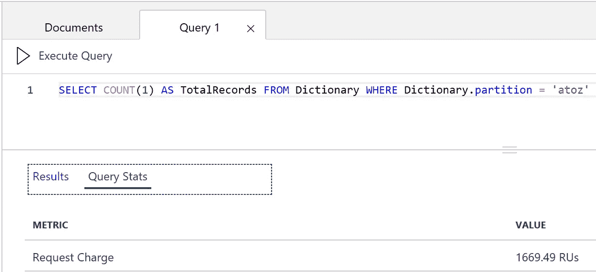

Query Cost

在我们的用例中，我们预加载的数据不会经常改变。所以我决定预先计算这个值，并作为一个项目存储在集合中。

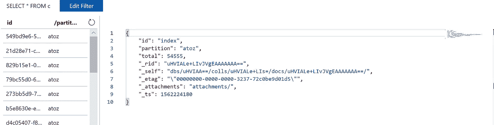

Precomputed Value

预计算后，您可以看到查询所消耗的 ru。


Precomputed Performance

## 自己试试

就 RUs 而言，在字典中搜索一个单词的实现代价很高。我可以想到的方法是将它分成两个独立的 API，一个用于获取匹配的总数，另一个用于获取与匹配相对应的单词。任何对实现它感兴趣的人都可以提出公关，或者如果你有更好的想法，你也可以提出公关。

Optimisation — Exercise

# 构建和执行

我们将广泛使用以下命令，所以我将它放在这里以便快速参考。

## 建设

下面的命令生成构建工件。

```
mvn clean package...[INFO] --- maven-resources-plugin:3.1.0:copy-resources (copy-resources) @ dictionary ---
[INFO] Using 'UTF-8' encoding to copy filtered resources.
[INFO] Copying 2 resources
[INFO] -------------------------------------------------------------
[INFO] BUILD SUCCESS
[INFO] -------------------------------------------------------------
[INFO] Total time:  24.135 s
[INFO] Finished at: 2019-07-04T17:25:11+10:00
[INFO] -------------------------------------------------------------
```

## 执行

以下命令使您能够在本地启动和测试 Azure 功能。

```
mvn azure-functions:run
```

一旦您的函数所在的容器启动，您应该能够看到这个欢迎页面。

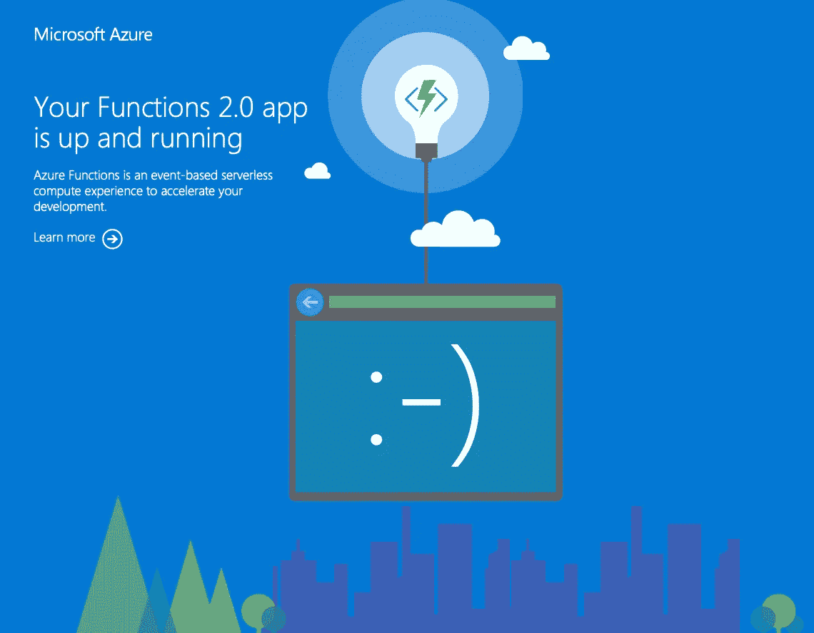

Welcome Page

# 验证端点

您可以使用我们之前[创建的 Swagger 规范来验证我们的功能。如果您是命令行人员，您还可以看到等效的 curl 命令来验证这些函数。](https://medium.com/@juliuscanute/fullstack-development-using-kotlin-on-android-and-azure-functions-121571587163)

## 获取词典中可用的页面

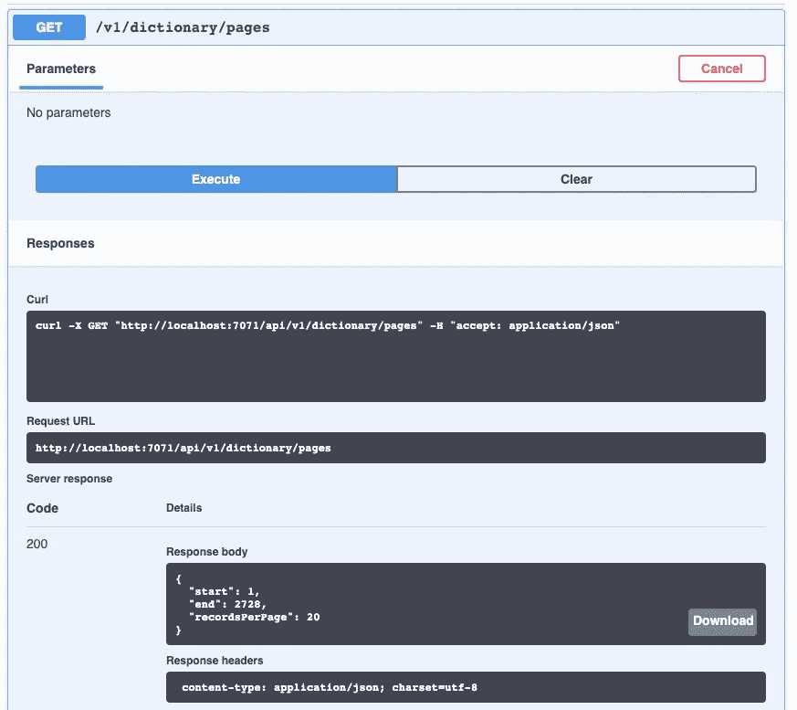

/api/v1/dictionary

## 获取词典特定页面上的单词

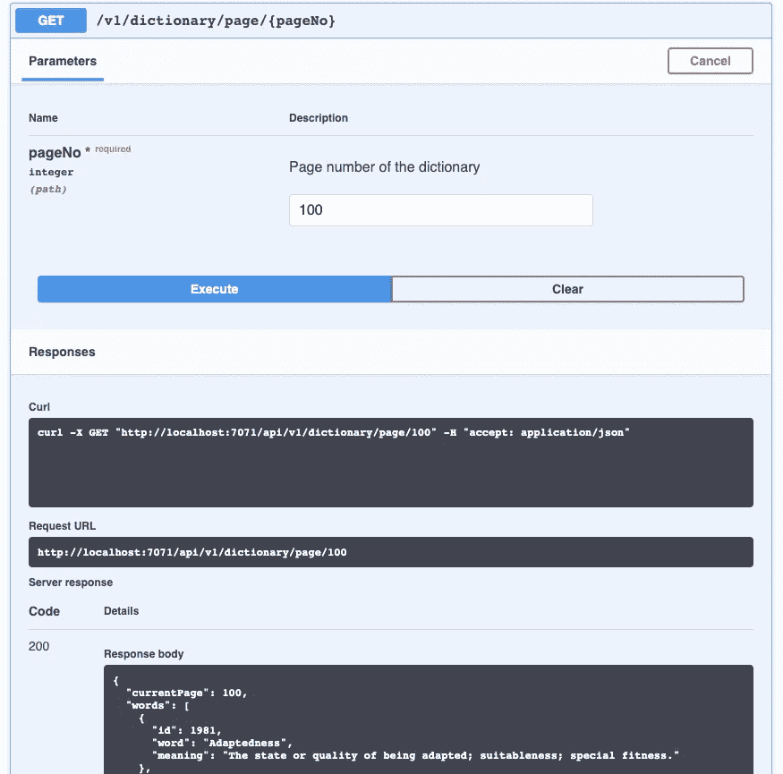

/api/v1/dictionary/page/{pageNo}

## 在字典中搜索单词


/api/v1/dictionary/pages

我喜欢 Azure Functions 的一点是，它允许我在将功能部署到基础设施之前，在本地灵活地使用这些功能，并且它可以在开发过程中削减成本。

在下一篇文章中，我将展示如何将这些功能部署到 Azure 基础设施中。

# 信用

为了让这个例子更真实一点，我从下面的[链接](https://github.com/manassharma07/English-Dictionary-CSV)中获得了预处理过的词典数据，我要感谢这个人和古腾堡计划让我的工作变得简单了一点。

# 链接

*   [https://maven.apache.org](https://maven.apache.org)
*   [https://docs . Microsoft . com/en-us/CLI/azure/install-azure-CLI？view = azure-CLI-最新](https://docs.microsoft.com/en-us/cli/azure/install-azure-cli?view=azure-cli-latest)
*   [https://docs . Microsoft . com/en-us/azure/azure-functions/functions-run-local](https://docs.microsoft.com/en-us/azure/azure-functions/functions-run-local)
*   [https://azure . Microsoft . com/en-au/features/storage-explorer/](https://azure.microsoft.com/en-au/features/storage-explorer/)
*   [https://docs . Microsoft . com/en-us/azure/cosmos-db/import-data](https://docs.microsoft.com/en-us/azure/cosmos-db/import-data)
*   [https://docs . Microsoft . com/en-us/azure/cosmos-db/request-units](https://docs.microsoft.com/en-us/azure/cosmos-db/request-units)