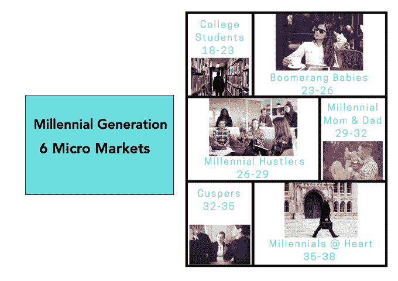
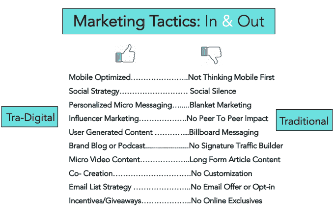
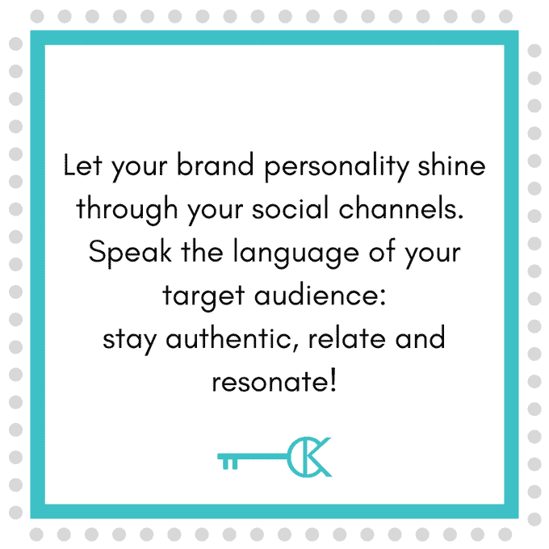
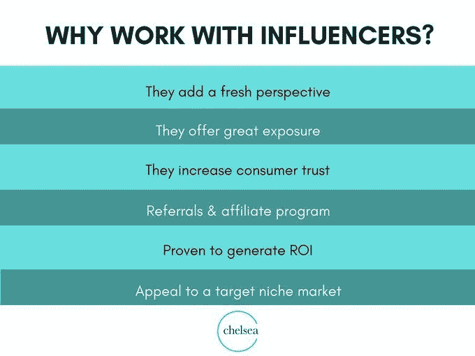

# 为时代打造品牌

> 原文：<https://medium.datadriveninvestor.com/build-branding-for-the-ages-c5e3b8de5e3?source=collection_archive---------18----------------------->

## 人生的阶段决定了你对其他世代的看法

无论是千禧一代还是另一代，成功的营销人员都必须意识到年龄组之间的差异、数字营销的转变、吸引目标受众并知道如何与有影响力的人合作。

对于[切尔西·克罗斯特](https://twitter.com/ChelseaKrost)、[歌迪·陈](https://twitter.com/GoldieChan)和[杰夫·巴雷特](https://twitter.com/BarrettAll)来说，这一切不过是办公室里的又一天。他们每个人都将双方视为营销者和影响者，带来不同的专业知识来服务他们的客户。

Krost 是前 20 名千禧一代营销策略师、教练、LinkedIn 讲师和全球演讲者。她是许多知名品牌的品牌大使和代言人。

能量旋风，成龙实践“有目的的社交媒体”她是 Adobe 内部人士 LinkedIn 上视频的顶级代言人，并在福布斯上撰写关于个人品牌和讲故事的文章。

 [## 社交媒体收听让您随时了解|数据驱动型投资者

### 虽然社交媒体倾听是一种顶级趋势，但它应该是每个现代营销策略的一部分。保持和谐…

www.datadriveninvestor.com](https://www.datadriveninvestor.com/2019/02/26/social-media-listening-keeps-you-plugged-in/) 

巴雷特是与其同名的公共关系机构的首席执行官，Adobe 顾问，福布斯 50 强成员，Shorty Awards 社交媒体奖获得者和企业家专栏作家。

他们谈到了几代人之间的最大区别:婴儿潮:出生于 1946 年至 1964 年；GenX:1961–1981 年；千禧一代:1981–1996 年；GenZ: 1996 年到 2000 年中期。

“的确，最大的区别是，千禧一代是在互联网的环境下长大的，这在技术语言、整合和创新方面产生了差距，”克罗斯特说。“一般来说，婴儿潮一代使用脸书和 LinkedIn。GenX 更喜欢脸书和 LinkedIn。千禧一代使用 Instagram、Twitter、脸书和 Snapchat。GenZ 与 Instagram 和 Snapchat 配合得最好。”

成龙看着不同的感觉。

“GenZ 希望品牌诚实，”她说。“他们想成为前沿和中心。千禧一代希望获得满足感。一个 GenXer 想要更多的稳定性。

“GenZ 现在正以[抖音](https://twitter.com/tiktok_us)和一切数字优先为数字设定趋势，”Chan 说。

巴雷特欣然接受。

“几代人之间没有区别，”他说。“你所处的人生阶段决定了你的认知。我们应该记住，作为营销人员。总有一天，我会老了，对着云大喊大叫。这是生命的循环。

巴雷特说:“我希望我们这一代人在重蹈覆辙、开始给 GenZ 贴标签之前，能有更好的视角。”。“我们在文化上发生了转变，但每一代当权者都倾向于抛弃下一代。就我而言，我欢迎根茨。”

# **知情**

抛开差异不谈，千禧一代消费者已经改变了今天的数字营销。

“千禧一代的消费者比他们的前辈更加精明，”陈说。“他们想知道他们买的是什么，价格和价值是否合适。

“千禧一代的消费者也是在传统广告和数字广告的混合中长大的，”她说。"他们喜欢能追溯到前数字时代的怀旧情绪。"

 [## 购买有影响力的产品时，买家要小心

### 他们待人接物的方式反映了影响者的真实影响力

medium.com](https://medium.com/datadriveninvestor/shopping-for-influencers-buyer-beware-632ad1b6b2fe) 

千禧一代的利与弊给那些作为一个整体与他们打交道的人带来了挑战。

“千禧一代已经改变了营销人员的思考和联系方式，因为这一代人是由强迫性多重任务者组成的，”克罗斯特说。"他们联系紧密，注意力持续时间短，非常多样化，懂得打折."

他们通常也非常依赖手机联系。

"问问你自己:你的网站移动优化了吗？"克罗斯特说。“你在投资内容营销吗？你的消费之旅是什么样子的？

“我们不可能将市场覆盖到年龄跨度如此之大的一代人，”她说。“21 岁的大学生的价值观、优先事项和需求肯定不同于 31 岁的千禧一代母亲。”

巴雷特告诫人们不要对千禧年抱有成见。

“有很多陈词滥调，比如更人性化，”他说。“那是显而易见的。经历很重要。但是便利是最大的转变。千禧一代会为适当的便利支付过高的价格，无论是食物、交通还是更大的物品。”

专家们提供了他们在吸引和接触目标受众时的关键要点。

“通过清楚地定义吸引你的观众:他们住在哪里，他们在哪里购物，他们以什么为生，”成龙说。“他们生活中的大问题是什么？你如何帮助解决这些问题？

"你如何为你的目标受众创建社区？"她说。“你能在他们之间展开对话吗？”

克罗斯特重视价值。

“为了吸引任何观众，你的品牌、产品、服务和会员必须提供*价值*，”她说。"通过个性化的品牌信息内容和体验进行娱乐、教育和参与."

# **消费者在哪里**

这给社交媒体平台带来了更大的重要性。

“重要的是要记住，每个社交平台吸引不同的人群，他们以不同的方式参与和消费内容，”Krost 说。“不要试图无处不在。专注于你的听众所在的地方。”

巴雷特首先考虑的是倾听。

“你不听就不知道该怎么办。”他说。“搞笑吧。如果你不风趣，找一个风趣的人。只要有共鸣就好。参与到你的观众当中，帮助他们做一些生活中重要的事情。”

当企业家在几代人之间增强他们的营销影响力时，影响者可以发挥作用。

“与几代人一起工作比你想象的要容易，”陈说。“首先关注他们共同的受众群体。

她说:“让一个有影响力的人影响几代人，就像找到一个更大、更广泛、许多代人都会欣赏的共同主题一样简单。”"这可能是一个家庭、企业或其他团体."

这是对旧职业的新诠释。

“有影响力的人是我们的现代数字公关，”克罗斯特说。“用它们来宣传你的品牌，扩大你的信息传递，让消费者了解你的产品或服务。”

她强调，要确保利用与目标市场一致的社交追随者来挖掘有影响力的人。

“影响者参与很简单，”巴雷特说。“不要把注意力放在赠品或特殊座位上。影响者想要有助于他们职业发展的东西。这样做，他们会为你移山。给他们一个水瓶，结果还可以。”

 [## 不管准备好了没有，千禧一代正大批到来

### 企业瞄准年轻专业人士来吸引顶尖人才

medium.com](https://medium.com/datadriveninvestor/ready-or-not-millennials-arrive-in-force-26b7d4473359) 

每家公司、组织、分会或协会都应该专注于吸引千禧一代。

“坐下来和那些已经在你的关系网中的人谈谈，”陈说。“他们在哪里购物？他们喜欢什么。他们的目标是什么？

“千禧一代很可能使用手机或移动设备，”她说。“与他们交谈并创造最佳的移动体验很有帮助。对许多千禧一代来说，人际关系比呆在一个工作场所更重要。他们想知道自己被欣赏，被倾听。”

# **毫无疑问的消息**

Krost 有吸引千禧一代的简明步骤:

*   要真实。
*   投入时间与新会员和消费者进行对话。
*   建立话语权。定义你的品牌或组织是否有一张面孔。让你的信息清晰。

意识是好的。然而，联系来自积极的参与。

“当我觉得自己和一个品牌之间有真正的对话或反复发生时，我想积极参与，”陈说。“当我被圈内的人——我信任的人——带入某件事时，我更有可能参与其中。”

巴雷特强调关系，同时承认金钱是一种动力。

“更大的吸引力是能够帮助我网络中的其他人，帮助他们成长，”他说。“反过来，那会帮助你成长。它需要一千段关系，而不是一千个小时。”

 [## 你从你的个人网络中获得了多少意义？

### 在帮助他人的同时提升你的影响力

medium.com](https://medium.com/an-idea/how-much-meaning-do-you-gain-from-your-personal-network-c431e8ba21e2) 

对 Krost 来说，参与就是体验。

“我想参与那些能给我提供学习、成长和社交机会的事情，”她说。

克罗斯特说:“当一件事有一点有趣的元素时，它总是一个额外的奖励。”。“没有人想无聊。品牌、公司和组织[必须在如何添加互动协作元素方面发挥创意](https://www.datadriveninvestor.com/2019/02/25/no-fooling-marketing-goes-for-laughs/)

特殊的因素促使 Chan 和 Krost 加入一个新的组织或事业。

“如果我已经听说过他们，并且他们有很好的声誉，我可能会加入一个新的会员或分会，”陈说。“品牌知名度*和*有关系吗？

她说:“如果我认为某个分会或组织对我所在的社区有直接和积极的影响，我也更有可能加入，比如学生支持团体 826 LA 或社区中的芝麻街。

Krost 从与工作相关的会员资格中寻求最大利益。

“我总是问自己，这会拓展我的见识和灵感吗？”她说。“这对我的职业发展有帮助吗？这是一个好的网络平台吗？我能提高我的知名度吗？这会增加我的品牌权威吗？”

**关于作者**

吉姆·卡扎曼是拉戈金融服务公司的经理，曾在空军和联邦政府的公共事务部门工作。你可以在[推特](https://twitter.com/JKatzaman?source=post_page---------------------------)、[脸书](https://www.facebook.com/jim.katzaman?source=post_page---------------------------)和 [LinkedIn](https://www.linkedin.com/in/jim-katzaman-33641b21/?source=post_page---------------------------) 上和他联系。

*原载于 2019 年 8 月 28 日 https://www.datadriveninvestor.com**的* [*。*](https://www.datadriveninvestor.com/2019/08/28/build-branding-for-the-ages/)