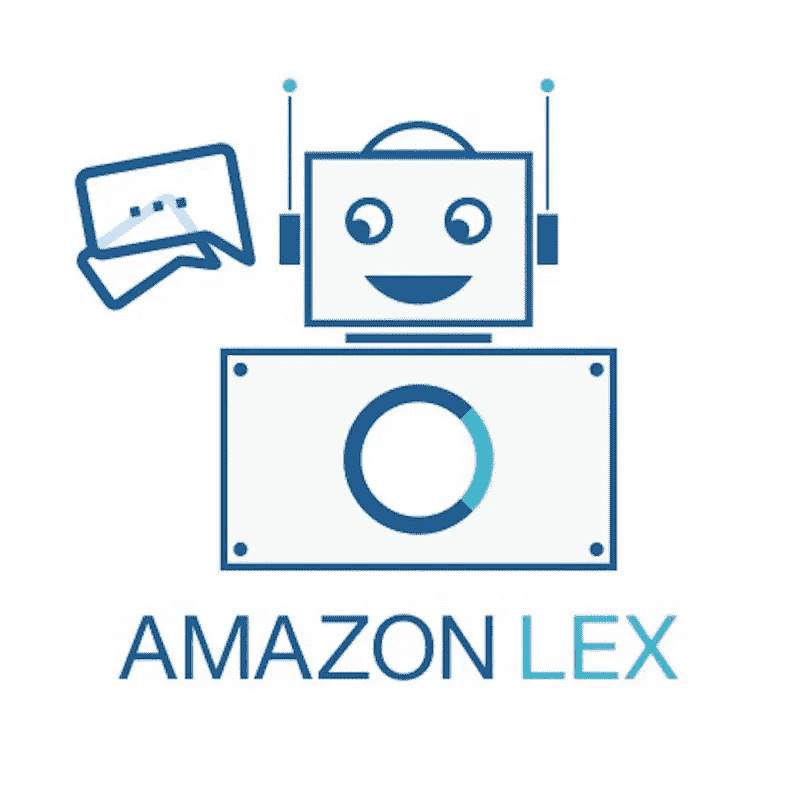
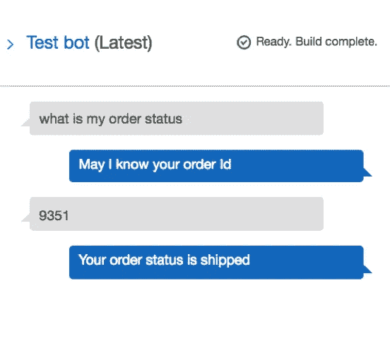
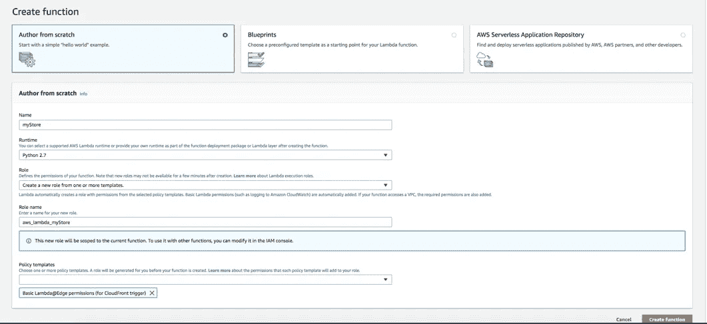
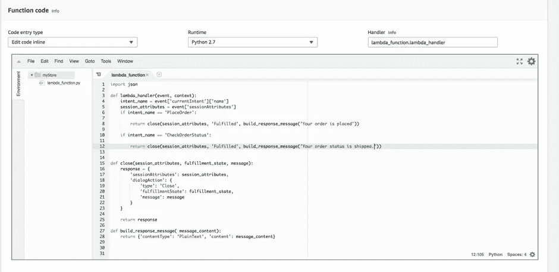
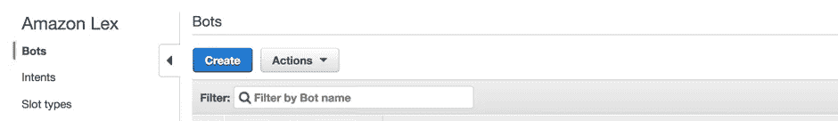
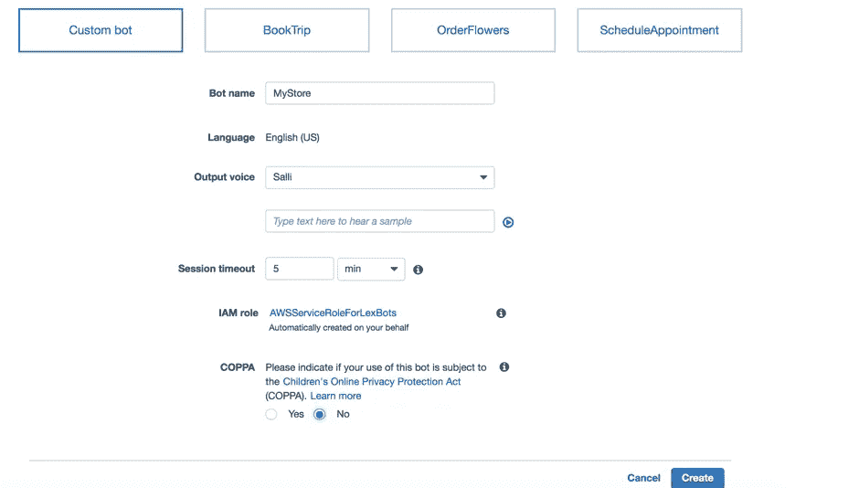
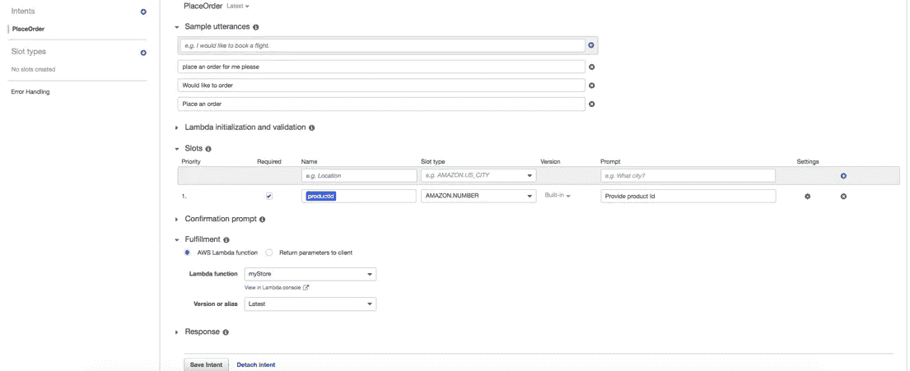
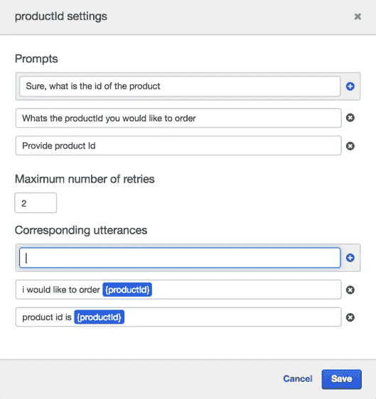
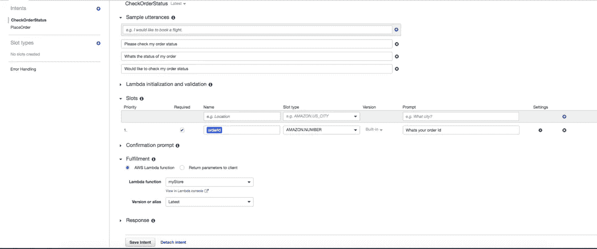
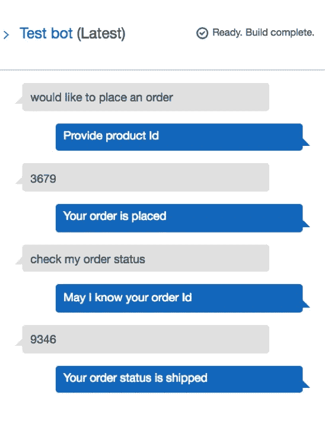

# 使用 Amazon Lex 构建聊天机器人

> 原文：<https://medium.datadriveninvestor.com/build-chatbot-using-amazon-lex-ed3db80b27d0?source=collection_archive---------5----------------------->

亚马逊发布了 Lex，这是一项 AWS 服务，用于使用语音和文本构建对话界面，也称为聊天机器人。Lex 是驱动亚马逊 Alexa 的相同对话引擎，现在可供开发人员构建聊天机器人。用 Lex 创建聊天机器人简单快捷，不需要深度学习专业知识。

在开始构建聊天机器人之前，让我们先熟悉一些 Lex 的概念。

**意图:**意图表示用户想要执行的动作。一个机器人会有一个或多个相关的意图。例如，一个电子商务机器人将有意向下订单，并检查订单状态。每个意向都有描述性名称，如 PlaceOrder、CheckOrderStatus 等。

**话语:**话语是用户通常用来传达意图的示例短语。例如，用户可能会说“检查我的订单状态”或“我的订单状态是什么”等。意图可以有一个或多个与之相关联的话语。与意图相关的话语数量越多越好。

当用户说出任何与意图或类似短语相关的话语时，Lex 理解用户的意图。在上面的例子中，当用户说，“请告诉我我的订单的状态”，Lex 可以理解用户的意图，尽管用户使用的短语不是配置的准确表达。理解相似的短语是聊天机器人的魅力所在，而它的 NLU 功能是 Lex 的核心。

**Slot:** Slot 是与意图相关联的参数，其被要求满足用户的请求。一个意向可以有零个或多个插槽。在 CheckOrderStatus 意图中，orderId 将是其中一个槽。在运行时，Lex 提示用户输入特定的槽值。插槽可以根据需要或可选进行配置。用户必须在完成意图之前为所有必需的槽提供值。话语也用 slot 配置，slot 是用户用来提供 slot 值的短语。

**插槽类型:**每个插槽都有一个类型。可以使用内置的插槽类型，或者根据需要创建自定义插槽类型。亚马逊。编号内置插槽类型可用于 orderId 插槽。创建自定义插槽类型时，必须枚举插槽的值列表。

**Prompt:** Prompt 是 Lex 在运行时使用的短语，用于获取 intent 的槽值。每个插槽可以有一个或多个与之相关联的提示。莱克斯随机拿起其中一个。orderId 槽可以有类似“请提供您的订单 Id”、“您的订单 Id 是什么”等提示。

以上是 CheckOrderStatusIntent 的用户和机器人之间的示例对话流。用户以这样一句话开始对话——“嗨，我的订单情况如何？”。基于与意图相关的话语，Lex 识别用户的意图并提示用户输入订单 Id。“OrderId 是此目的必需的槽字段，”“我可以知道你的订单 id 吗”是与订单 Id 槽相关联的提示之一，而“我的订单 Id 是{订单 Id}”是与槽相关联的话语之一。

**Lambda 初始化、验证、实现:**虽然 NLU 和对话流由 Lex 负责，但我们需要 Lambda 函数来处理业务逻辑。Lex 提供了与 Lambda 的预构建集成。Lambda 函数可用于初始化、验证和实现。相同的功能可以用于两种功能，也可以根据复杂性具有不同的功能。

**创建聊天机器人的步骤:**

让我们看看如何从 AWS 管理控制台创建聊天机器人。也可以从 AWS CLI 创建 Bot。关于如何从 CLI 创建 bot，请参考 Lex 指南。AWS 帐户是使用 Lex 创建 Bot 的先决条件。如果您没有帐户，请创建一个帐户。

让我们首先创建一个 Lambda 函数。

登录到 AWS 管理控制台，并打开位于 https://console.aws.amazon.com/lambda/.的 AWS Lambda 控制台，选择“创建函数”,并在“创建函数”页面上从头开始选择“作者”,因为我们正在构建自定义 Lambda 函数。

为函数提供一个唯一的名称，并选择运行时。我选择了 Python。对于角色，从模板创建新角色，并输入新角色名称。根据其他 AWS 服务，lambda 函数必须访问、选择一个或多个策略模板。

在函数页面上，在函数代码部分选择“内联编辑代码”,并编写 python 代码来处理来自 Lex 的请求并保存它。查看 Lex 指南中的请求和响应格式。在上面的例子中，为了简单起见，没有验证逻辑，它只是用履行消息来响应，而没有实际改变系统的任何后端状态。

下一步是创建 Lex 聊天机器人。

登录 AWS 管理控制台，进入机器学习下的亚马逊 Lex。在亚马逊 Lex 页面默认情况下，机器人将被选中。单击“创建”开始创建机器人。

Lex 提供了一些预构建的 bot 模板。在本指南中，让我们创建一个自定义机器人。填写自定义机器人所需的所有详细信息，然后选择“创建”。

我提供的机器人名称为“我的商店”。通过语音与聊天机器人交互时，将使用输出语音。会话超时是指当 bot 处于空闲状态时会话持续的时间。默认情况下将创建 IAM 角色。我为 COPPA 选择了 No。

下一步是创造意图。点击创建意图。为意图指定一个唯一的名称，然后单击添加。

我已经给出了 PlaceOrder 作为我的意向名称，并提供了一些话语。关联 productId 作为内置 AMAZON 的必需插槽。编号插槽类型。并且 productId 槽有一个提示消息——“提供产品 Id”。提供 Lambda 函数，它是我在上一节创建的，作为实现代码挂钩。通过单击插槽的设置图标，可以配置插槽的其他提示。

我又创建了一个检查订单状态的意图。

下一步是构建和测试聊天机器人。点击右上角的构建按钮构建聊天机器人。一旦构建成功，就可以进行测试了。可以通过单击右窗格中的“测试机器人”部分从控制台测试机器人。

上面的截图显示了用户和我们的机器人之间的对话流是如何发生的。请参考 Lex 文档，了解如何将 bot 发布和部署到其中一个消息传递通道。