# 使用 NodeJS、ExpressJS 和 MongoDB 构建 RESTful API

> 原文：<https://medium.datadriveninvestor.com/build-restful-api-using-nodejs-expressjs-and-mongodb-df99e18666f6?source=collection_archive---------0----------------------->

## REST API 是 web 应用程序不可或缺的组成部分。你不需要成为一个专业的后端开发者来开发你自己的。在本教程中，我们将介绍使用 Node.js、Express 和 MongoDB 创建自己的 REST API 的基本构建块。

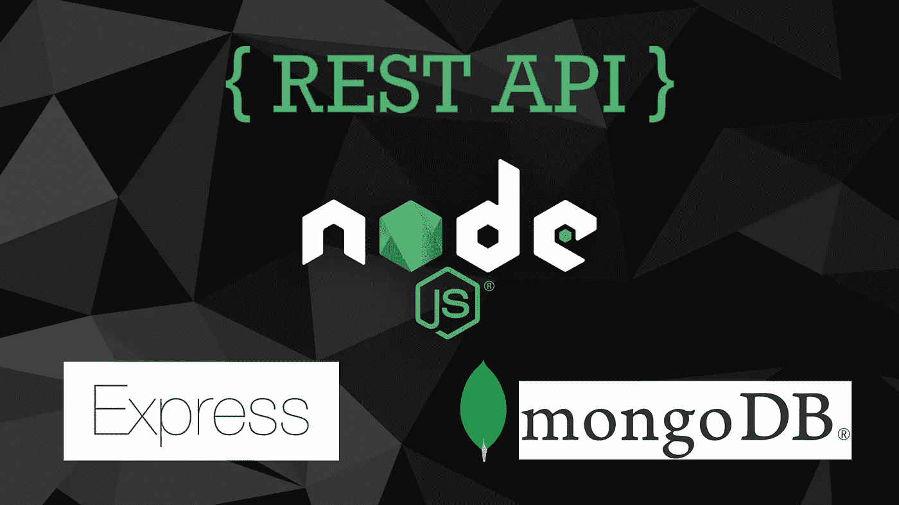

# 应用编程接口

基本上，API 只是允许应用程序相互通信。

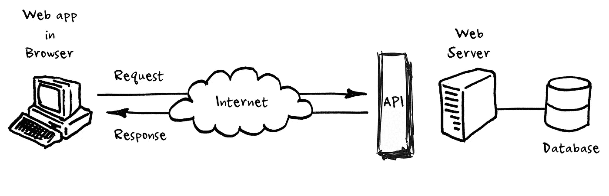

An API is not a database. It is an access point to an app that can access a database.

# 表征状态转移(REST)

REST 是 API 的一种架构风格或设计模式。

RESTful web 应用程序以其资源信息的形式公开关于自身的信息。它还使客户端能够对这些资源采取行动，例如创建新资源(即创建新帖子)或更改现有资源(即编辑帖子)。

> 当一个 RESTful API 被调用时，服务器将向客户机传输所请求资源的状态表示。

状态最常见的表示形式是 JSON(**J**ava**S**script**O**object**N**rotation)格式，这也是我们今天将要使用的格式。

## 环境设置(要求)

*   IDE(相对于代码、Atom 等。)
*   NodeJS
*   MongoDB
*   REST 客户端(Postman) —用于 API 测试

首先，我们应该验证我们的系统上是否安装了 NodeJS 和 MongoDB。为此，请打开命令提示符并运行:

```
node -v
```

这将验证是否安装了 NodeJS。运行:

```
mongo --version
```

这将验证您的系统上是否安装了 MongoDB。

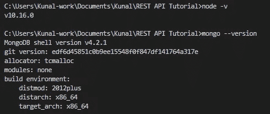

如果您的计算机上没有安装 NodeJS 或 MongoDB，您应该下载一个与您的系统兼容的版本[这里(对于 Node)](https://nodejs.org/en/download/) 和[这里(fr Mongo)](https://www.mongodb.com/download-center/community) ，并在继续之前安装它们。

[](https://www.datadriveninvestor.com/2019/02/25/6-alternatives-to-the-yahoo-finance-api/) [## 雅虎财经 API |数据驱动投资者的 6 种替代方案

### 长期以来，雅虎金融 API 一直是许多数据驱动型投资者的可靠工具。许多人依赖于他们的…

www.datadriveninvestor.com](https://www.datadriveninvestor.com/2019/02/25/6-alternatives-to-the-yahoo-finance-api/) 

现在，导航到您喜欢的目录，并为我们的 REST API 项目创建一个新目录:

```
// Create a new directory for your project
mkdir restApiTutorial// Navigate into the new directory
cd restApiTutorial
```

在这个目录中，通过`npm init`初始化 NodeJS 项目，并按照向导完成设置。

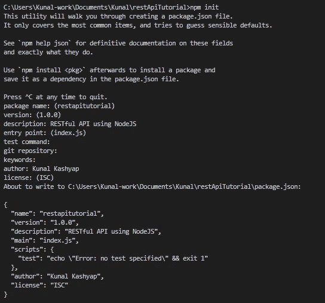

Leave all the fields unchanged except, add a description(optional) and your name as “author”.

在此之后，您将能够看到一个新文件 ***package.json*** 已经在您的目录中创建。

在您的首选 IDE 中打开您的项目目录(我的是 VS 代码)，并创建一个新文件— `index.js`

让我们安装 Express 并使用它来运行我们的 NodeJS 服务器。如果你不熟悉 ExpressJS，请前往[官方网站](https://expressjs.com/)了解更多信息。我们将使用`npm`来安装 express 和其他依赖项。

```
npm install express --save
```

安装完成后，您可以打开`package.json`文件，并在 dependencies 下看到我们刚刚安装的 express。

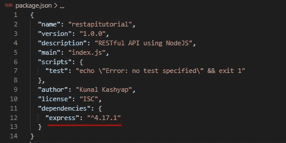

接下来，我们将切换到`index.js`并添加以下代码:

```
// Importing express
let express = require('express');// Initializing the app
let app = express();// Define server port
const PORT = process.env.port || 3000;// Send message for default route
app.get('/', function(req, res){
    res.send("Express is running successfully!");
});// Listen to specified port(always keep this at bottom of the file)
app.listen(PORT, function () {
    console.log("Server has started on port " + PORT);
});
```

保存文件并在命令提示符下运行`node index`，您应该会看到:

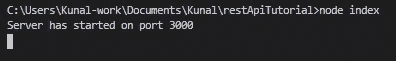

打开你的浏览器，前往 [http://localhost:3000/](http://localhost:3000/)

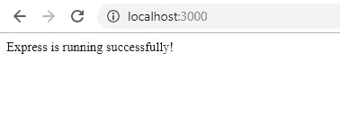

恭喜你！我们已经成功设置了我们的 express 服务器。

虽然我们在`index.js`文件中定义了“/”路径，但是我们会以这样一种方式构建我们的项目，即所有的 api 路径都将在一个单独的文件中定义。为此，我们将在项目的根目录下创建一个文件`routes.js`,并向其中添加以下代码:

```
// Import express router
let Router = require('express').Router();// Set default API response
Router.get('/', function (req, res){
    res.json({
        status: 'WORKING',
        message: 'This is the /api/ route!'
    });
});// Export API routes
module.exports = Router;
```

现在，在您的`index.js`中添加以下代码，使这条路线可访问:

```
// Import routes
let apiRoutes = require("./routes")// Use Api routes in the App
app.use('/api', apiRoutes)
```

然后通过使用`ctrl+c`或`cmd+c`结束终端上的过程来重启应用服务器，并使用`node index`重新开始。

在上面的代码中，我们导入了`routes`文件，并指示我们的应用程序在用户访问`yourdomain.com/api`或`[http://localhost:8080/api](http://localhost:8080/api)`时使用这些路线。通过访问 [http://localhost:8080/api 来测试它是否工作，](http://localhost:8080/api,)您应该会看到这个屏幕:

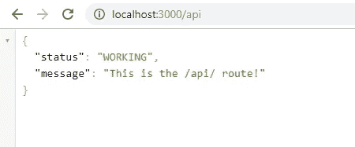

成功了！我们在这里取得了一些真正的进展，让我们继续教程。

## 设置 MongoDB

首先我们将安装 Mongoose 和 body-parser。Mongoose 是一个对象数据映射器，它基本上允许我们在应用程序中定义一个模型，并将其存储在数据库中。你可以在这里了解更多[。](http://mongoosejs.com/)

在项目根终端中运行以下命令:

```
npm install mongoose body-parser --save
```

Body-parser 使您的应用程序能够解析来自传入请求的数据，比如通过 urlencode 解析表单数据。我们需要将它导入我们的应用程序并使用它们。

我将向您展示导入 mongoose 和 body-parser 后我们的整个`index.js`应该是什么样子。

```
let express    = require('express'),
    mongoose   = require('mongoose'),
    bodyParser = require('body-parser');// Import routes
let apiRoutes = require("./routes")// Initializing the app
let app = express();// Configure bodyparser to handle post requests
app.use(bodyParser.urlencoded({extended: true}));
app.use(bodyParser.json());// Connect to Mongoose and set connection variable
mongoose.connect("mongodb://localhost:27017/restApiDB", {useNewUrlParser: true, useUnifiedTopology: true});var db = mongoose.connection;// Define server port
const PORT = process.env.port || 3000;// Send message for default route
app.get('/', function(req, res){
    res.send("Express is running successfully!");
});// Use Api routes in the App
app.use('/api', apiRoutes);// Listen to specified port(always keep this at bottom of the file)
app.listen(PORT, function () {
    console.log("Server has started on port " + PORT);
});
```

看起来不错！

现在要启动 MongoDB，打开另一个终端并运行命令`mongod`来启动 MongoDB 服务器。您将得到如下输出:

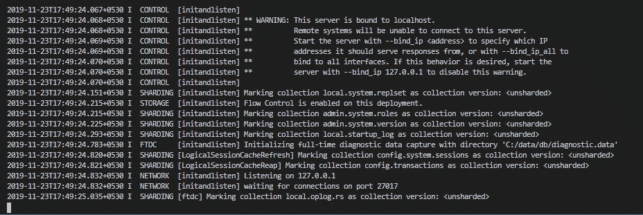

To run mongod command from anywhere, you will have to add the path to the bin folder of mongodb (in Program Files) in your PATH environment variables.

保持此窗口在后台打开，以便使用 MongoDB。

现在是时候设置我们的控制器来处理 API 请求和从数据库中保存/检索数据的模型了。我们将实现一个简单的数据模型，用以下细节存储一本书的信息:

*   标题
*   作者
*   类型

我们将实现以下端点

*   列出所有书籍
*   `POST /api/books`添加新书
*   `GET /api/books/{id}`检索单本书的信息
*   `PUT /api/books/{id}`更新单本书的信息
*   `DELETE /api/books/{id}`删除单本书

我们需要两个新文件——`bookController.js`和`bookModel.js`——来实现上述端点并定义我们的模型。

将以下代码粘贴到您的`bookController.js`文件中:

```
// Import book model
Book = require('./bookModel');// Handle index actions
exports.index = function (req, res) {
    Book.get(function (err, books) {
       if (err) {
           res.json({
               status: "error",
               message: err,
           });
       }
       res.json({
           status: "success",
           message: "Books retrieved successfully",
           data: books
       });
    });
};// Handle create book actions
exports.new = function (req, res) {
    var book = new Book();
    book.title = req.body.title ? req.body.title : book.title;
    book.author = req.body.author;
    book.genre = req.body.genre; // save the book and check for errors
    book.save(function (err) {
       if (err)
           res.json(err);
       res.json({
           message: 'New book created!',
           data: book
       });
    });
};// Handle view book info
exports.view = function (req, res) {
    Book.findById(req.params.book_id, function (err, book) {
       if (err)
           res.send(err);
       res.json({
           message: '1 book found!',
           data: book
       });
    });
};// Handle update book info
exports.update = function (req, res) {
    Book.findById(req.params.book_id, function (err, book) {
       if (err)
           res.send(err); book.title = req.body.title ? req.body.title : book.title;
       book.author = req.body.author;
       book.genre = req.body.genre; // save the book and check for errors
       book.save(function (err) {
          if (err)
              res.json(err);
          res.json({
              message: 'Book Info updated',
              data: book
          });
       });
    });
};// Handle delete book
exports.delete = function (req, res) {
    Book.deleteOne({
       _id: req.params.book_id
    }, function (err, book) {
        if (err)
            res.send(err);
        res.json({
            status: "success",
            message: 'Book deleted'
        });
    });
};
```

控制器定义了处理来自不同 API 端点的*请求和响应*的方法(函数)。我们首先导入`book Model`并使用它的实例来处理 API 的 **CRUD** ( **C** reate， **R** etrieve， **U** pdate 和 **D** elete)函数。以下是`bookModel.js`的代码:

```
var mongoose = require('mongoose');// Setup schema
var bookSchema = mongoose.Schema({
    title: {
        type: String,
        required: true
    },
    author: {
        type: String,
        required: true
    },
    genre: String,
    add_date: {
        type: Date,
        default: Date.now
    }
});// Export Book model
var Book = module.exports = mongoose.model('book', bookSchema);module.exports.get = function (callback, limit) {
    Book.find(callback).limit(limit);
}
```

在该模型中，我们导入`mongoose,`为书籍创建数据库模式，并导出该模块以使其可访问。最后一步是将预订路线添加到我们的 api 端点。下面是你的`routes.js`最终的样子:

```
// Import express router
let Router = require('express').Router();// Set default API response
Router.get('/', function (req, res){
    res.json({
        status: 'WORKING',
        message: 'This is the /api/ route!'
    });
});// Import book controller
var bookController = require('./bookController');// Book routes
Router.route('/books')
    .get(bookController.index)
    .post(bookController.new);Router.route('/books/:book_id')
    .get(bookController.view)
    .patch(bookController.update)
    .put(bookController.update)
    .delete(bookController.delete);// Export API routes
module.exports = Router;
```

就是这样！唷！我们已经编写了所有的代码，现在是时候测试我们的 API 端点了。

让我们用浏览器试试。访问`[http://localhost:8080/api/books](http://localhost:8080/api/books)`您应该会看到这个屏幕:

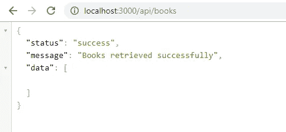

We don’t have any books in the database as yet. We’ll add some books using the POST request on Postman.

Postman 是一个测试 API 的应用程序，通过向 web 服务器发送请求并获得响应。它允许用户设置 API 期望的所有头和 cookies，并检查响应。

你可以在这里下载邮递员原生应用。

邮差很好用。它提供了 API 调用的集合，人们必须遵循 API 调用的集合来测试应用程序的 API。

用户可以从给定的下拉列表中选择 API 调用方法，根据 API 调用设置授权、标题和主体信息。
Postman 中可用的 API 调用方法:

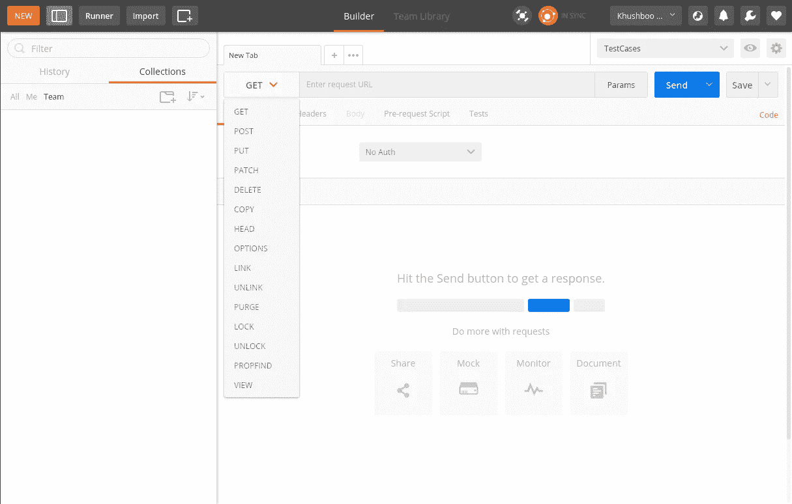

要添加新书，从下拉菜单中选择`POST`方法，选择`Body`选项卡，在“正文”选项卡下的`key:value`输入框中输入值，完成后单击“发送”。请参见下面的示例:

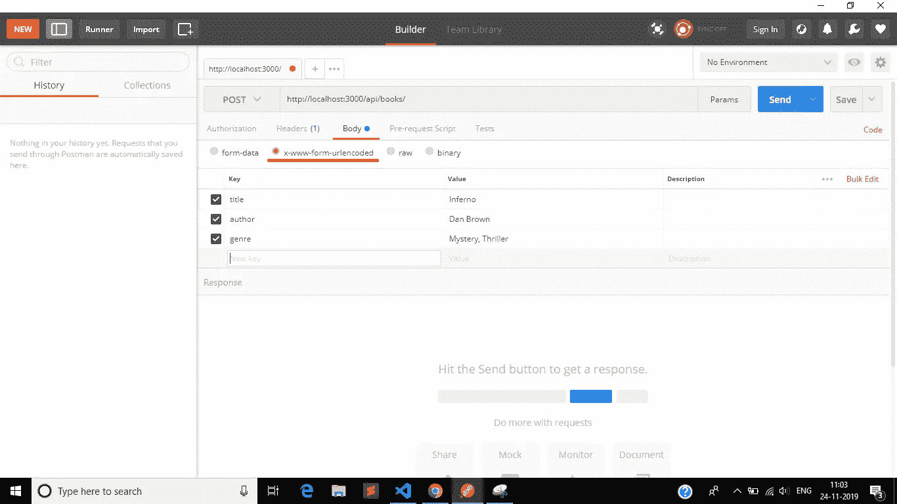

点击 send 后，您应该会得到如下响应:

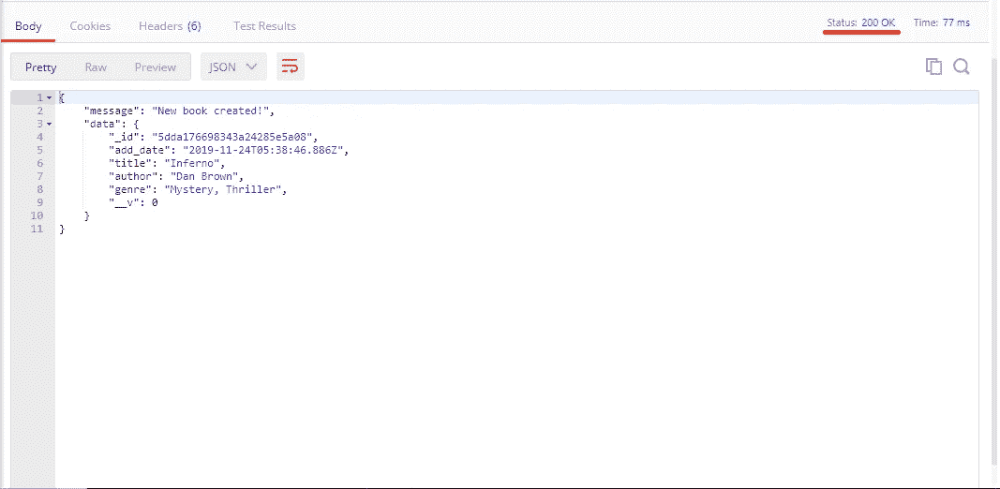

**200** (OK) Response code indicates that the REST **API** successfully carried out whatever action the client requested.

现在更改值，再添加几本书。然后发出`GET`请求，像这样查看所有书籍:

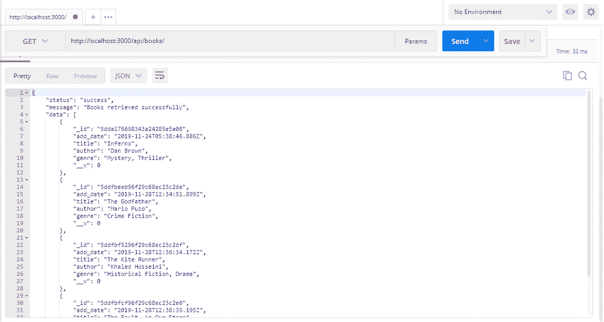

我们也可以在浏览器上测试这一点:

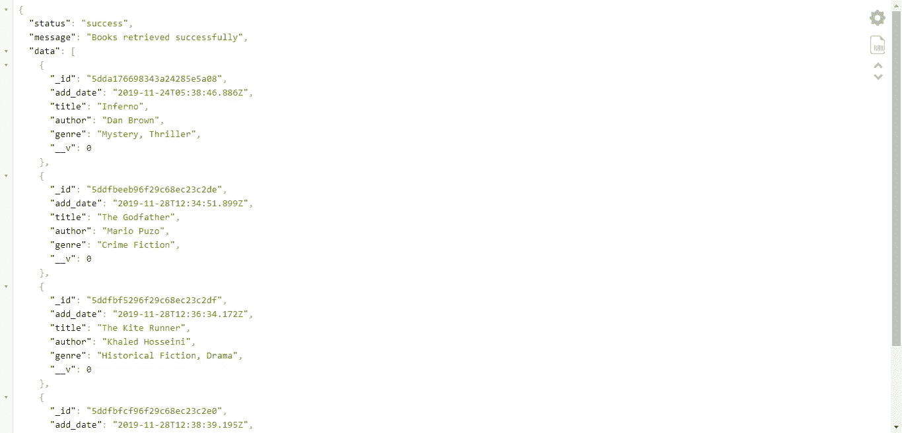

我们已经成功地检索了添加到数据库中的所有书籍。您现在可以继续测试`UPDATE`和`DELETE`请求了。对于这两个请求，您都需要想要更新或删除的对象(这里是 book)的`id`。对于`UPDATE` API 请求，不要忘记发送主体数据，就像我们在`POST`请求中所做的那样。

仅此而已。恭喜你使用 NodeJS、Express 和 MongoDB 创建了自己的 RESTAPIs。

GITHUB:[https://github.com/kunalkashyap855/restapitutorial](https://github.com/kunalkashyap855/restapitutorial)

感谢阅读💻

如果你喜欢这篇文章，请帮助我👏