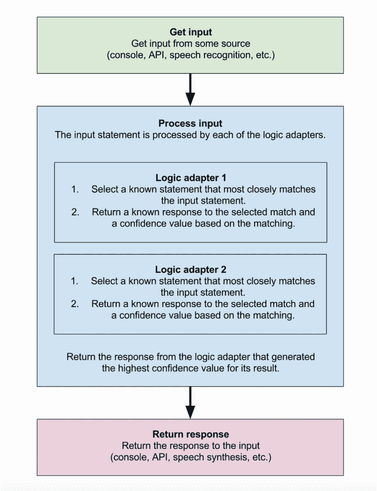

# 用 10 行代码构建你的第一个聊天机器人。

> 原文：<https://medium.datadriveninvestor.com/build-your-first-chatbot-in-10-lines-of-code-88c4f15e39c9?source=collection_archive---------2----------------------->


我在互联网上搜索*“如何建立一个聊天机器人？”*我发现了 [ChatterBot](https://chatterbot.readthedocs.io/en/stable/) 这是一个用于创建聊天机器人的机器学习、对话引擎

# 聊天机器人如何工作



*Image source:* [*ChatterBot*](https://chatterbot.readthedocs.io/en/stable/#process-flow-diagram)

在这篇文章中，我们将看到如何用 10 行代码构建一个聊天机器人。

## 我们开始吧

首先[安装聊天机器人](https://pypi.org/project/ChatterBot/)

```
pip install ChatterBot
```

创建文件`chat.py`

```
#import ChatBot
from chatterbot import ChatBot
```

用你选择的名字创建一个新的聊天机器人(我用的是“Candice”)。

```
bot = ChatBot('Candice')
```

你的机器人已经创建好了，但是在这一点上你的机器人没有任何知识，为此你必须用一些数据来训练它。
`Also, by default the ChatterBot library will create a sqlite database to build up statements of the chats.`

# 训练你的机器人

```
#import ListTrainer
from chatterbot.trainers import ListTrainerbot.set_trainer(ListTrainer)
# Training 
bot.train(['What is your name?', 'My name is Candice'])
bot.train(['Who are you?', 'I am a bot, created by you' ])
```

你的机器人现在接受了两种陈述的训练。当你问你的机器人“你叫什么名字”时，它会回答“我叫坎迪斯”。

你也可以用多种语句来训练它，比如

```
bot.train(['Do you know me?', 'Yes, you created me', 'No', 'Sahil?', 'No idea'])
```

正如你所看到的，很难在每一条语句上训练机器人。因此，我们将使用`ChatterBotCorpusTrainer`在大数据集上训练我们的机器人。

```
from chatterbot.trainers import ChatterBotCorpusTrainer
# Create a new trainer for the chatbot
trainer = ChatterBotCorpusTrainer(bot)# Train the chatbot based on the english corpus
trainer.train("chatterbot.corpus.english")# Get a response to an input statement
chatbot.get_response("Hello, how are you today?")
```

或者你可以下载你的语言的[数据集，用你的语言训练你的机器人。](https://github.com/gunthercox/chatterbot-corpus/tree/master/chatterbot_corpus/data)

我下载了英语数据集，我们可以这样训练我们的机器人

```
for files in os.listdir('./english/'):
    data=open('./english/'+files,'r').readlines()
    bot.train(data)
```

`NOTE: Make sure the dataset and the program file is on same folder, otherwise edit the path.`

# 聊天功能

```
# To exit say "Bye"
while True:
        # Input from user
    message=input('\t\t\tYou:')
        #if message is not "Bye"
    if message.strip()!='Bye':
        reply=bot.get_response(message)
        print('Candice:',reply)
        # if message is "Bye"
    if message.strip()=='Bye':
        print('Candice: Bye')
        break
```

要运行它，请转到终端

```
python chat.py
```

它会先训练你的机器人，然后你就可以开始聊天了。

## 源代码

```
#import libraries
from chatterbot import ChatBot
from chatterbot.trainers import ListTrainer
import os#Create a chatbot
bot=ChatBot('Candice')
bot.set_trainer(ListTrainer)#training on english dataset
for files in os.listdir('./english/'):
    data=open('./english/'+files,'r').readlines()
    bot.train(data)#chat feature
while True:
    message=input('\t\t\tYou:')
    if message.strip()!='Bye':
        reply=bot.get_response(message)
        print('Candice:',reply)
    if message.strip()=='Bye':
        print('Candice: Bye')
        break
```