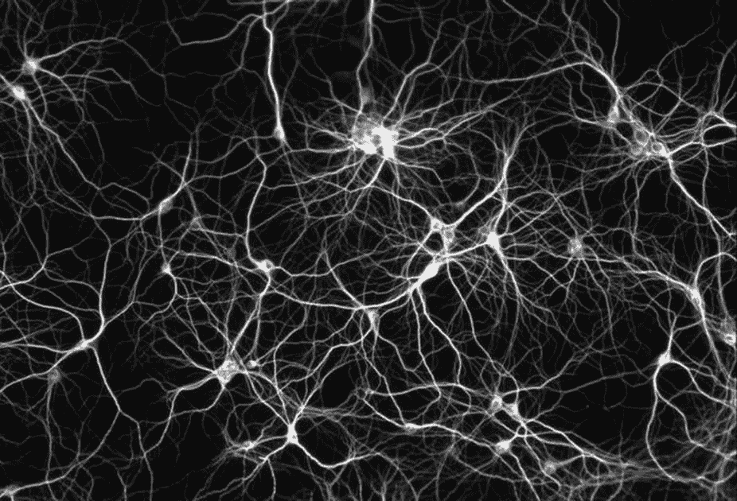
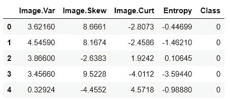
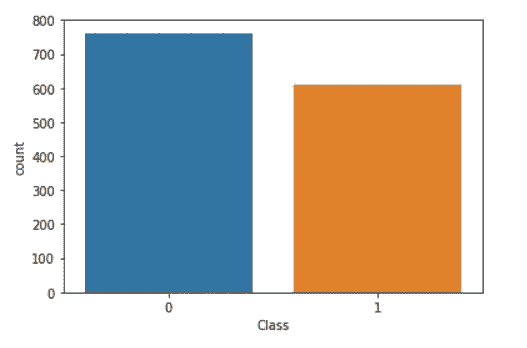
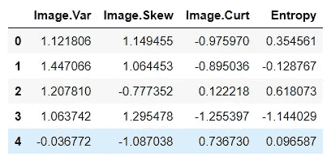
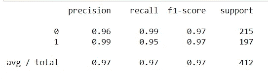

# 5 分钟之内构建自己的人工神经网络！

> 原文：<https://medium.datadriveninvestor.com/build-your-own-artificial-neural-network-under-5-minutes-2467e69731f4?source=collection_archive---------4----------------------->

[](http://www.track.datadriveninvestor.com/1B9E)

# 使用 Tensorflow 的 DNNClassifier 估计器，我们将检查纸币的真实性。



如果你正在搜索一个关于人工神经网络(ANN)的教程，你可能已经知道它们是什么，以及它们能做什么。但是你知道神经网络是深度学习这个令人兴奋的新领域的基础吗？深度学习是正在取得许多最先进进步的机器学习领域，从在[围棋](http://www.sciencemag.org/news/2016/01/huge-leap-forward-computer-mimics-human-brain-beats-professional-game-go)和[扑克](http://www.sciencemag.org/news/2017/03/artificial-intelligence-goes-deep-beat-humans-poker) ( [强化学习](https://adventuresinmachinelearning.com/reinforcement-learning-tutorial-python-keras/))中击败玩家，到加速[药物发现](http://www.nanalyze.com/2016/01/4-companies-using-deep-learning-for-drug-discovery/)和[辅助自动驾驶汽车](http://spectrum.ieee.org/cars-that-think/transportation/self-driving/driveai-brings-deep-learning-to-selfdriving-cars)。

[](https://www.datadriveninvestor.com/2019/03/03/editors-pick-5-machine-learning-books/) [## DDI 编辑推荐:5 本让你从新手变成专家的机器学习书籍|数据驱动…

### 机器学习行业的蓬勃发展重新引起了人们对人工智能的兴趣

www.datadriveninvestor.com](https://www.datadriveninvestor.com/2019/03/03/editors-pick-5-machine-learning-books/) 

如果这些类型的前沿应用让你和我一样兴奋，那么你会有兴趣尽可能多地学习深度学习。然而，这需要你对神经网络的工作原理有相当多的了解。这篇教程文章旨在帮助你尽快熟悉神经网络。

# 到底什么是神经网络？

神经网络是一组算法，大致模仿人脑，用于识别模式。**神经网络是多层神经元网络(下图中的绿色节点)，我们用它来对事物进行分类、做出预测等**。下图是一个简单的神经网络，有两个输入、一个输出和两个隐藏的神经元层。


从左边开始，我们有:

1.  蓝色部分是我们模型的输入层。
2.  我们第一个隐藏的绿色神经元层。
3.  我们隐藏的第二层神经元又变绿了。
4.  我们模型的输出层(也叫预测层)是粉红色的。

连接这些点的箭头显示了所有神经元是如何相互连接的，以及数据是如何从输入层一直传输到输出层的。

# 现在让我们建立自己的神经网络，看看它们实际上是如何工作的。

我们将使用来自 UCI 存储库的[银行认证数据集](https://archive.ics.uci.edu/ml/datasets/banknote+authentication)。

数据由 5 列组成:

*   小波变换图像的方差(连续)
*   小波变换图像的偏斜度(连续)
*   小波变换图像的简化(续)
*   图像的熵(连续)
*   类别(整数)

其中类指示银行票据是否是真实的。

这种任务非常适合神经网络和深度学习！

# 获取数据

用熊猫读入 bank_note_data.csv 文件。

```
import pandas as pd
data = pd.read_csv('bank_note_data.csv')
data.head()
```



# 电子设计自动化(Electronic Design Automation)

我们将快速绘制几幅数据图。

```
import seaborn as sns
%matplotlib inline
sns.countplot(x='Class',data=data)
```



# 数据准备

当使用基于神经网络和深度学习的系统时，标准化您的数据通常是一个好主意，这一步对于我们特定的数据集实际上是不必要的，但让我们通过它来练习！

# 标准缩放

```
from sklearn.preprocessing import StandardScaler
```

创建一个名为 Scaler 的 StandardScaler()对象。

```
scaler = StandardScaler()
```

将定标器安装到特征上。

```
scaler.fit(data.drop('Class',axis=1))
```

使用。transform()方法将要素转换为缩放版本。

```
scaled_features = scaler.fit_transform(data.drop('Class',axis=1))
```

将缩放后的要素转换为数据帧，并检查该数据帧的头部，以确保缩放有效。

```
df_feat = pd.DataFrame(scaled_features,columns=data.columns[:-1])
df_feat.head()
```



# 列车测试分离

创建两个对象 X 和 y，它们分别是缩放后的特征值和标签。

```
X = df_feat
y = data['Class']from sklearn.model_selection import train_test_split
X_train, X_test, y_train, y_test = train_test_split(X, y, test_size=0.3)
```

# 张量流

```
import tensorflow as tf
```

使用 tf.feature.numeric_column()创建功能列对象列表。

```
df_feat.columnsIndex(['Image.Var', 'Image.Skew', 'Image.Curt', 'Entropy'], dtype='object')image_var = tf.feature_column.numeric_column("Image.Var")
image_skew = tf.feature_column.numeric_column('Image.Skew')
image_curt = tf.feature_column.numeric_column('Image.Curt')
entropy =tf.feature_column.numeric_column('Entropy')feat_cols = [image_var,image_skew,image_curt,entropy]
```

创建一个名为 classifier 的对象，它是一个 DNNClassifier。将其设置为具有 2 个类和[10，20，10]隐藏单元层结构，这意味着第一个隐藏层将具有 10 个单元，第二个隐藏层将具有 20 个单元，第三个隐藏层将具有 10 个单元。

```
classifier = tf.estimator.DNNClassifier(hidden_units=[10, 20, 10], n_classes=2,feature_columns=feat_cols)
```

现在创建一个 tf.estimator.pandas_input_fn，它接受您的 X_train、y_train、batch_size 并设置 shuffle=True。如果愿意，您可以随意使用 batch_size 参数，但是让我们先将它设置为 20，因为我们的数据不是很大。

```
input_func = tf.estimator.inputs.pandas_input_fn(x=X_train,y=y_train,batch_size=20,shuffle=True)
```

现在训练输入函数的分类器。使用步长=500。如果你愿意，你可以随意使用这些值！

注意:忽略你得到的任何警告，它们不会影响你的输出。

```
classifier.train(input_fn=input_func,steps=500)
```

# 模型评估

创建另一个 pandas_input_fn，它接收 X 的 X_test 数据。请记住，它不需要任何 y_test 信息，因为我们将使用它来为网络创建自己的预测。设置 shuffle=False，因为我们不需要对预测进行洗牌。

```
pred_fn = tf.estimator.inputs.pandas_input_fn(x=X_test,batch_size=len(X_test),shuffle=False)
```

使用分类器模型中的 predict 方法从 X_test 创建预测。

```
note_predictions = list(classifier.predict(input_fn=pred_fn))
note_predictions[0]{'class_ids': array([0], dtype=int64),
 'classes': array([b'0'], dtype=object),
 'logistic': array([0.00157453], dtype=float32),
 'logits': array([-6.4522204], dtype=float32),
 'probabilities': array([0.9984255 , 0.00157453], dtype=float32)}final_preds  = []
for pred in note_predictions:
    final_preds.append(pred['class_ids'][0])
```

现在创建一个分类报告和一个混淆矩阵。有什么让你印象深刻的吗？

```
from sklearn.metrics import classification_report,confusion_matrix
print(confusion_matrix(y_test,final_preds))[[213   2]
 [ 10 187]]print(classification_report(y_test,final_preds))
```



如果你一路读到这里，那么我对你表示感谢和钦佩(对你的坚持)。

# 神经网络的优势

*   神经网络可以完成线性程序不能完成的任务。
*   当神经网络的一个元素失效时，由于它们的并行性质，它可以继续而没有任何问题。
*   神经网络可以学习，不需要重新编程。
*   它可以在任何应用程序中实现。
*   它可以毫无问题地执行。

# 神经网络的局限性

*   神经网络需要训练才能运作。
*   神经网络的架构不同于微处理器的架构，因此需要进行仿真。
*   大型神经网络需要很长的处理时间。

神经网络是强大的模型，在医学、安全、银行/金融以及政府、农业和国防等许多不同领域具有广泛的应用。