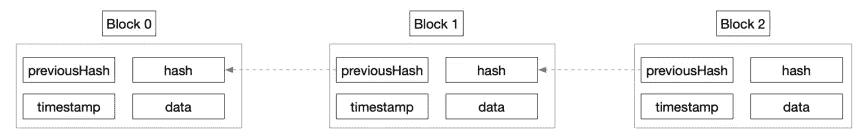

# 用 JavaScript 构建自己的区块链

> 原文：<https://medium.datadriveninvestor.com/build-your-own-blockchain-with-javascript-970e84dd634d?source=collection_archive---------2----------------------->

你可能认为区块链对你来说太复杂了。嗯，实际上，如果你从一个更基本和概念的层面来思考区块链，它并不是那么糟糕。今天，在本文中，我们将介绍一些关于区块链的基础知识，并向您展示如何使用 Javascript 来构建您自己的区块链系统，只需编写几行代码来描述您的区块链，包括底层数据结构、PoW 挖掘和交易流程。当然，你建造自己的区块链的真实场景要比这复杂得多。


# 了解区块链

顾名思义，区块链是一串块，因此区块链的基本数据结构是块。块的内容包括时间戳、数据、哈希和以前的哈希等信息。

[](https://www.datadriveninvestor.com/2019/03/25/top-7-blockchain-challenges-to-go-mainstream-in-2019-more/) [## 2019 年成为主流的 7 大区块链挑战及更多...数据驱动的投资者

### 教训是永远不要停止学习和成长。关于技术、金融、工作场所、生产力和…

www.datadriveninvestor.com](https://www.datadriveninvestor.com/2019/03/25/top-7-blockchain-challenges-to-go-mainstream-in-2019-more/) 

在这些组件中，数据部分自然是用来存储数据的，而 previousHash 用来存储前一个块的哈希值。这是一个基本区块链的示意图:



接下来，正如您可以从下面的代码中看到的，散列存储一般的块信息。散列允许任何长度的信息被映射成固定长度的字符串。在下面的示例中，它映射到 sha256:

```
calculateHash() {
    return SHA256(this.previousHash+ this.timestamp + JSON.stringify(this.data)).toString();
}
```

接下来，块数据的基本结构如下所示:

```
class Block {
    constructor(timestamp, data, previousHash = '') {
        this.timestamp = timestamp;
        this.data = data;
        this.previousHash = previousHash;
        // The calculation of the hash must be at the end so to ensure that all data is assigned correctly before calculation
        this.hash = this.calculateHash(); }calculateHash() {
        return SHA256(this.previousHash + this.timestamp + JSON.stringify(this.data)).toString();
    }
}
```

其次，因为区块链是一串块，所以区块链可以表示为数组或链，如下所示:

```
class BlockChain {
    constructor() {
        this.chain = [];
    }
}
```

接下来是 genesis 块，这是区块链中的第一个块，总是需要手动创建。第一个块的 previousHash 为空:

```
createGenesisBlock() {
    return new Block("2018-11-11 00:00:00", "Genesis block of simple chain", "");
}
```

区块链构造函数方法也应该更改为以下方法:

```
class BlockChain {
    constructor() {
        this.chain = [this.createGenesisBlock()];
    }
}
```

接下来，您可以添加块。请注意，添加的每个块必须连接到原始区块链:

```
class BlockChain {
    getLatestBlock() {
        return this.chain[this.chain.length - 1];
    }

    addBlock(newBlock) {
        // The previous hash value of the new block is the hash value of the last block of the existing blockchain；
        newBlock.previousHash = this.getLatestBlock().hash;
        // Recalculate the hash value of the new block (because the previousHash is specified)；
        newBlock.hash = newBlock.calculateHash(); 
        //Add new blocks to the chain；
        this.chain.push(newBlock); 
    }
    ...
}
```

现在你可以验证区块链了。区块链数据结构的核心是确保正确的链接和防篡改。但是，如果一个块被篡改了，我们如何验证并找到这个块呢？最耗费人力但也是最常用的方法是检查或遍历所有的块，并逐个进行验证:

```
isChainValid() {
    //Traverse all the blocks
    for (let i = 1; i < this.chain.length; i++) {
        const currentBlock = this.chain[i];
        const previousBlock = this.chain[i - 1];
        //Recalculate the has value of the current block. If the hash value is not matched, it indicates that data of the block was changed without permission, and therefore the has value is not recalculated.
        if (currentBlock.hash !== currentBlock.calculateHash()) {
            console.error("hash not equal: " + JSON.stringify(currentBlock));
            return false;
        }
        // Determine whether the previousHash of the current block is equal to the hash of the previous block. If they are not equal to each other, this means that the previous block was changed without permission. Although the hash value is recalculated correctly, the hash value of the subsequent block is not recalculated, resulting the the whole chain breaking.
        if (currentBlock.previousHash !== previousBlock.calculateHash) {
            console.error("previous hash not right: " + JSON.stringify(currentBlock));
            return false;
        }
    }
    return true;
}
```

现在，运行以下代码:

```
let simpleChain = new BlockChain();
simpleChain.addBlock(new Block("2018-11-11 00:00:01", {amount: 10}));
simpleChain.addBlock(new Block("2018-11-11 00:00:02", {amount: 20})); console.log(JSON.stringify(simpleChain, null, 4));console.log("is the chain valid? " + simpleChain.isChainValid());
```

结果如下所示:

```
ali-186590cc4a7f:simple-chain shanyao$ node main_1.js 
{
    "chain": [
        {
            "timestamp": "2018-11-11 00:00:00",
            "data": "Genesis block of simple chain",
            "previousHash": "",
            "hash": "fd56967ff621a4090ff71ce88fdd456547d1c92d2e93766b7e8791f7a5f91f89"
        },
        {
            "timestamp": "2018-11-11 00:00:01",
            "data": {
                "amount": 10
            },
            "previousHash": "fd56967ff621a4090ff71ce88fdd456547d1c92d2e93766b7e8791f7a5f91f89",
            "hash": "150b196268a0152e9f0e719ac131a722472a809f49bd507965029a78c7400529"
        },
        {
            "timestamp": "2018-11-11 00:00:02",
            "data": {
                "amount": 20
            },
            "previousHash": "150b196268a0152e9f0e719ac131a722472a809f49bd507965029a78c7400529",
            "hash": "274a7a13ed20118e8cb745654934a7e24a4d59333ba17dfbf5d4cfe0fa8a6e34"
        }
    ]
}
is the chain valid? true
```

请务必注意`previousHash`和`hash`。你可以看到当前块的`previousHash`实际上是前一块的`hash`。

现在，让我们试着摆弄一下积木。一个常见的说法是区块链是防篡改的。是真的吗？好吧，让我们试着篡改，特别是改变第二块，看看会发生什么:

```
let simpleChain = new BlockChain();
simpleChain.addBlock(new Block("2018-11-11 00:00:01", {amount: 10}));
simpleChain.addBlock(new Block("2018-11-11 00:00:02", {amount: 20}));console.log("is the chain valid? " + simpleChain.isChainValid());// Change the data of the second block from 10 to 15
simpleChain.chain[1].data = {amount: 15};console.log("is the chain still valid? " + simpleChain.isChainValid());
console.log(JSON.stringify(simpleChain, null, 4));
```

结果如下所示:

```
ali-186590cc4a7f:simple-chain shanyao$ node main_1.js 
is the chain valid? true
hash not equal: {"timestamp":"2018-11-11 00:00:01","data":{"amount":15},"previousHash":"fd56967ff621a4090ff71ce88fdd456547d1c92d2e93766b7e8791f7a5f91f89","hash":"150b196268a0152e9f0e719ac131a722472a809f49bd507965029a78c7400529"}
is the chain still valid? false
{
    "chain": [
        {
            "timestamp": "2018-11-11 00:00:00",
            "data": "Genesis block of simple chain",
            "previousHash": "",
            "hash": "fd56967ff621a4090ff71ce88fdd456547d1c92d2e93766b7e8791f7a5f91f89"
        },
        {
            "timestamp": "2018-11-11 00:00:01",
            "data": {
                "amount": 15
            },
            "previousHash": "fd56967ff621a4090ff71ce88fdd456547d1c92d2e93766b7e8791f7a5f91f89",
            "hash": "150b196268a0152e9f0e719ac131a722472a809f49bd507965029a78c7400529"
        },
        {
            "timestamp": "2018-11-11 00:00:02",
            "data": {
                "amount": 20
            },
            "previousHash": "150b196268a0152e9f0e719ac131a722472a809f49bd507965029a78c7400529",
            "hash": "274a7a13ed20118e8cb745654934a7e24a4d59333ba17dfbf5d4cfe0fa8a6e34"
        }
    ]
}
```

从上面的结果中，您可以看到，在数据被篡改之后，哈希值没有被重新计算，导致块具有不匹配的哈希值。

现在，让我们试着篡改另一个块。让我们想想。如果我们用一种聪明的方法，在块被篡改后重新计算哈希值，会怎么样？

```
let simpleChain = new BlockChain();
simpleChain.addBlock(new Block("2018-11-11 00:00:01", {amount: 10}));
simpleChain.addBlock(new Block("2018-11-11 00:00:02", {amount: 20}));console.log("is the chain valid? " + simpleChain.isChainValid());
// Recalculate the hash value after tampering with it
simpleChain.chain[1].data = {amount: 15};
simpleChain.chain[1].hash = simpleChain.chain[1].calculateHash();
console.log("is the chain still valid? " + simpleChain.isChainValid());
console.log(JSON.stringify(simpleChain, null, 4));
```

结果如下所示:

```
ali-186590cc4a7f:simple-chain shanyao$ node main_1.js 
is the chain valid? true
previous hash not right: {"timestamp":"2018-11-11 00:00:02","data":{"amount":20},"previousHash":"150b196268a0152e9f0e719ac131a722472a809f49bd507965029a78c7400529","hash":"274a7a13ed20118e8cb745654934a7e24a4d59333ba17dfbf5d4cfe0fa8a6e34"}
is the chain still valid? false
{
    "chain": [
        {
            "timestamp": "2018-11-11 00:00:00",
            "data": "Genesis block of simple chain",
            "previousHash": "",
            "hash": "fd56967ff621a4090ff71ce88fdd456547d1c92d2e93766b7e8791f7a5f91f89"
        },
        {
            "timestamp": "2018-11-11 00:00:01",
            "data": {
                "amount": 15
            },
            "previousHash": "fd56967ff621a4090ff71ce88fdd456547d1c92d2e93766b7e8791f7a5f91f89",
            "hash": "74d139274fb692495b7c805dd5822faa0c5b5e6058b6beef96e87e18ab83a6b1"
        },
        {
            "timestamp": "2018-11-11 00:00:02",
            "data": {
                "amount": 20
            },
            "previousHash": "150b196268a0152e9f0e719ac131a722472a809f49bd507965029a78c7400529",
            "hash": "274a7a13ed20118e8cb745654934a7e24a4d59333ba17dfbf5d4cfe0fa8a6e34"
        }
    ]
}
```

第三个块的`previousHash`不是第二个散列的散列。

那么，区块链真的经得起考验吗？实际上，区块链并不是完全防篡改的。让我展示给你看。如果我们能聪明得多，重新计算所有后续块的哈希值，会怎么样？它看起来像这样:

```
let simpleChain = new BlockChain();
simpleChain.addBlock(new Block("2018-11-11 00:00:01", {amount: 10}));
simpleChain.addBlock(new Block("2018-11-11 00:00:02", {amount: 20}));console.log("is the chain valid? " + simpleChain.isChainValid());
// Tamper with the second block
simpleChain.chain[1].data = {amount: 15};
simpleChain.chain[1].hash = simpleChain.chain[1].calculateHash();
// Then, recalculate the third block
simpleChain.chain[2].previousHash = simpleChain.chain[1].hash;
simpleChain.chain[2].hash = simpleChain.chain[2].calculateHash();
console.log("is the chain still valid? " + simpleChain.isChainValid());
console.log(JSON.stringify(simpleChain, null, 4));
```

结果如下所示:

```
ali-186590cc4a7f:simple-chain shanyao$ node main_1.js 
is the chain valid? true
is the chain still valid? true
{
    "chain": [
        {
            "timestamp": "2018-11-11 00:00:00",
            "data": "Genesis block of simple chain",
            "previousHash": "",
            "hash": "fd56967ff621a4090ff71ce88fdd456547d1c92d2e93766b7e8791f7a5f91f89"
        },
        {
            "timestamp": "2018-11-11 00:00:01",
            "data": {
                "amount": 15
            },
            "previousHash": "fd56967ff621a4090ff71ce88fdd456547d1c92d2e93766b7e8791f7a5f91f89",
            "hash": "74d139274fb692495b7c805dd5822faa0c5b5e6058b6beef96e87e18ab83a6b1"
        },
        {
            "timestamp": "2018-11-11 00:00:02",
            "data": {
                "amount": 20
            },
            "previousHash": "74d139274fb692495b7c805dd5822faa0c5b5e6058b6beef96e87e18ab83a6b1",
            "hash": "cc294e763c51e9357bf22d96073e643f4d51e07dd0de6e9b15d1d4f6bf6b45a8"
        }
    ]
}
```

现在，整个区块链都被篡改了。事实上，在您篡改一个块之后，您可以通过篡改该块之后的所有块来进一步篡改整个区块链。然而，如果被篡改的块之后的块的数量非常大，为了篡改整个区块链，你需要足够快地篡改随后的块以便不被发现。另外，这种情况下篡改的成本也很高。因此，正如您所看到的，区块链并不是完全防篡改的，但同时，篡改区块链的块通常被设计为具有比区块链篡改的潜在收益更大的篡改成本。在这方面，整个区块链可以被认为是安全的，并且基本上是防篡改的。

# 为什么区块链更安全

正如我们在上一节中所确立的，区块链实际上并不是完全防篡改的，但它们仍然是相当安全的。为了避免我们的区块链被篡改的机会，我们需要增加篡改我们的区块链的潜在成本。但是怎么才能增加这个成本呢？那么，最劳动密集型的方法可能是人为地制造障碍:那么，你想参加区块链会计吗？如果是的话，那我们先来解决这道数学难题，证明你的能力和意愿。这就涉及到一个很简单的概念——PoW。

在进入之前，我们先来解决这道数学题。你可能会问，数学题是什么？这并不复杂，但实际上可能看起来有点傻。确保哈希值的前 10 位数字为 0。你只能靠猜测和碰运气来解决这道数学题。哈希计算具有以下特征:

*   信息可以是任意长度，无论是一句话、一篇文章还是一首歌，它都可以被计算为一个唯一的数字串。
*   这串数字有固定的长度。
*   计算过程是不可逆的。也就是说，你可以很容易地计算出一个文本段落的哈希值，但是你无法知道一个哈希值所对应的原始信息。

如果给你一个文本段落，并允许你在文本末尾添加一个 nonce，你无法找到一种方法来确保文本和 nonce 的前 10 个散列值是 0，除了不断尝试不同的数字，并希望你足够幸运，尽快猜对。

现在，让我们进入所有这些的编码部分。重要的事情先来。让我们给块添加一个随机数。首先，请注意前一个块的哈希值是固定的:

```
calculateHash() {
        return SHA256(this.previousHash + this.timestamp + JSON.stringify(this.data)).toString();
  }
```

该值不能更改。要解决这个数学问题，您需要向块中手动添加一个 nonce:

```
constructor(timestamp, data, previousHash = '') {
    this.timestamp = timestamp;
    this.data = data;
    this.previousHash = previousHash;
    this.nonce = 0;
    this.hash = this.calculateHash();
}
```

nonce 没有任何特殊的含义。添加它是为了改变生成的哈希值，使哈希值满足要求。

散列计算过程需要相应地改变:

```
calculateHash() {
    return SHA256(this.previousHash + this.timestamp + JSON.stringify(this.data) + this.nonce).toString();
}
```

因此，正如我们之前讨论的，数学问题是尝试更改 nonce 以确保哈希的前 10 位数字为 0。为此，对应的代码如下:

```
this.hash.substring(0, 10) === Array(10 + 1).join("0")
```

哈希的前 10 位是 0，这是首选，因为这可以确保前 10 位或前 5 位是 0。嗯，难度根据位数的不同而不同。确保散列的前 10 个数字是 0 而不是前 5 个数字要困难得多。位数可以看做难度。挖掘是尝试不同的随机数以使哈希值符合要求:

```
mineBlock(difficulty) {
    while (this.hash.substring(0, difficulty) !== Array(difficulty + 1).join("0")) {
        this.nonce++;
        this.hash = this.calculateHash();
    }
    console.log("Block mined, nonce: " + this.nonce + ", hash: " + this.hash);
}
```

为了简单起见，难度可以作为区块链中的一个固定参数。注:其实比特币中的难度是动态调整的，保持块生成时间在 10 分钟左右。

```
constructor() {
    this.chain = [this.createGenesisBlock()];
    this.difficulty = 2;
}
```

加块不再是直接加块。相反，现在块添加过程是挖掘:

```
addBlock(newBlock) {
    newBlock.previousHash = this.getLatestBlock().hash;
    newBlock.mineBlock(this.difficulty);
    this.chain.push(newBlock);
}
```

只能添加兼容的块。现在让我们运行下面的代码:

```
let simpleChain = new BlockChain();
console.log("Mining block 1...");
simpleChain.addBlock(new Block("2018-11-11 00:00:01", {amount: 10}));
console.log("Mining block 2...");
simpleChain.addBlock(new Block("2018-11-11 00:00:02", {amount: 20})); console.log(JSON.stringify(simpleChain, null, 4));
```

您会发现块生成要慢得多:

```
ali-186590cc4a7f:simple-chain shanyao$ node main_2.js 
Mining block 1...
Block mined, nonce: 464064, hash: 0000e7e1aae4fae9d245f8d4b8ce030ffe13270218c362511db6840a824a1cdb
Mining block 2...
Block mined, nonce: 4305, hash: 000047b449537483d7f2861a12b53a59c971d3a928b2c0110a5945bff1a82616
{
    "chain": [
        {
            "timestamp": 0,
            "data": "2018-11-11 00:00:00",
            "previousHash": "Genesis block of simple chain",
            "nonce": 0,
            "hash": "8a7b66d194b1b0b795b0c45b3f11b60e8aa97d3668c831f39ec3343c83ae41c0"
        },
        {
            "timestamp": "2018-11-11 00:00:01",
            "data": {
                "amount": 10
            },
            "previousHash": "8a7b66d194b1b0b795b0c45b3f11b60e8aa97d3668c831f39ec3343c83ae41c0",
            "nonce": 464064,
            "hash": "0000e7e1aae4fae9d245f8d4b8ce030ffe13270218c362511db6840a824a1cdb"
        },
        {
            "timestamp": "2018-11-11 00:00:02",
            "data": {
                "amount": 20
            },
            "previousHash": "0000e7e1aae4fae9d245f8d4b8ce030ffe13270218c362511db6840a824a1cdb",
            "nonce": 4305,
            "hash": "000047b449537483d7f2861a12b53a59c971d3a928b2c0110a5945bff1a82616"
        }
    ],
    "difficulty": 4
}
```

在这个例子中，难度是 4。因此，块哈希值的前 4 位是 0。

# 什么是工作证明

以上是工作证明(通常缩写为 PoW)概念的一个例子。虽然这个概念看似简单，但在几个区块链中已经被证明是非常有效和安全的。例如，比特币的 PoW 系统保证了数百万台机器之间的一致性，无需人工干预，并且在 10 年内没有出现过一次错误。人们可以说，这无疑是奇迹。其实更多的是这个简单概念的背后。PoW 的核心是一 cpu 一票制，就是用你的 CPU (power)来表达你的观点和看法。你可能会问，为什么是一 cpu 一票而不是一 ip 一票？嗯，是因为你可以用很低的成本模拟大量的 IP 地址。当时在 PoW 中使用 CPU(2008 年的一个例子)是因为 CPU 资源相当昂贵，可以保证挖掘的难度和公平性(参见中本聪的[比特币白皮书](https://bitcoin.org/bitcoin.pdf))。当然，中本聪当时没有意识到的是，像专用集成电路(ASIC)芯片这样的特定算法芯片的诞生，已经让普通的 CPU 挖矿越来越难以完成。由于篇幅限制，本文不再对此进行进一步描述。

PoW 的基础部分是什么？那就是权力提供了一个支点。即 PoW 在虚拟世界的比特币和物理世界的 CPU 之间实现锚定，并使用物理世界昂贵的资源来保证比特币的安全性。有些人可能会说，比特币挖矿消耗大量电力，是一个浪费的过程。然而，这种观点颇有偏颇。事实上，比特币很可能是世界上最便宜的货币系统。毕竟，世界各地许多货币的流通都得到了行政机构的支持，而这些行政机构已经卷入了保护和维持本国货币价值的大规模昂贵行动。然而，比特币只消耗计算能力和电力并且这种消耗不是完全没有意义的，因为计算能力越大，比特币系统越安全。

事实上，除了 PoW，常见的共识机制还包括 DPOS(委托-利害关系证明)、PBFT(实用拜占庭容错)和 Raft。这些共识机制不在本文的讨论范围之内。

# 利润驱动的区块链发展

我们上面讨论的区块链系统过于简单，存在以下主要问题:

*   每个块只包括一个事务。这导致交易成本很高。事实上，真实场景中区块链的每个块都包含多个事务，这些事务同时打包在一个块中。
*   采矿不提供任何奖励。如果采矿没有奖励，谁会愿意购买采矿机器，支付电费，并验证和包装您的交易？试想，这个世界肯定需要无私的，愿意做出一些牺牲的人，但单靠自我牺牲是无法保持不断进步的，对吗？老实说，世界的进步显然也是由利润驱动的。合理的区块链制度设计和激励制度是区块链稳定的基础。事实上，挖掘是许多基于 PoW 的加密货币使用的唯一方法。例如，总共只有 2100 万个可能的比特币。这些比特币被开采出来后只能在二级市场流通。

下面我们将研究解决这两个主要问题的方案。

首先，您将想要定义事务。交易包含的基本信息是交易金额和交易双方:

```
class Transaction {
    constructor(fromAddress, toAddress, amount) {
        this.fromAddress = fromAddress;
        this.toAddress = toAddress;
        this.amount = amount;
    }
}
```

每个块应该包含多个事务，因此要更新以前的数据以使事务准确:

```
class Block {
    constructor(timestamp, transactions, previousHash = '') {
        this.timestamp = timestamp;
        this.transactions = transactions;
        this.previousHash = previousHash;
        this.nonce = 0;
        this.hash = this.calculateHash();
    }
    ....
}
```

区块链的数据结构也应相应升级。应添加要处理的交易和每个采矿作业的奖励金额:

```
class BlockChain {
    constructor() {
        this.chain = [this.createGenesisBlock()];
        this.difficulty = 3;
        this.pendingTransactions = [];
        this.miningReward = 100;
    }
    ....
}
```

注意结构关系:

*   一条链包含多个块。
*   一个块包含多个事务。

接下来，我们来看看采矿。相应地，以前的`addBlock`方法应改为`minePendingTransactions`，主要区别如下:

*   添加的新块不仅仅是一个普通的块，而是一个包含所有未决事务信息的块。为了简单起见，所有未决事务都打包到一个块中。然而，在真实场景中并非如此。例如，一个原始比特币块太小(1 MB)，无法包含所有未决交易。一个打包操作后的剩余事务必须打包到另一个块中。此外，矿商通常会优先考虑矿商费用较高的交易。
*   支付矿工费用。一般一个矿工开采一个区块后，会生成一批到矿工地址的转移交易，转移交易会打包到下一个区块。

例如:

```
//Incoming miner address
minePendingTransactions(miningRewardAddress) {
    // Pakcage all pending transactions together in the same block
    let block = new Block(Date.now(), this.pendingTransactions);
    // Mining, that is, constantly trying nonce to make the hash Vluw meet the requirements
    block.mineBlock(this.difficulty); console.log('Block successfully mined!');
    this.chain.push(block);

    // Put the miner fee transaction into pendingTransactions for the next processing operation. The miner fee transaction is characterized by the source account being empty.
    this.pendingTransactions = [
        new Transaction(null, miningRewardAddress, this.miningReward)
    ];
}
// Create a transaction, put the transaction into the pending transaction pool.
createTransaction(transaction) {
    this.pendingTransactions.push(transaction);
}
```

接下来，您可以查询余额。除了转账交易之外，有时人们可能想要检查账户的余额。然而，在区块链没有真实的账户。常见的账户模型有比特币的 UTXO 模型和以太坊的账户/余额模型。显然，在我们的例子中，也不存在真正的帐户。在本例中，区块链交易仅记录交易金额和两个交易方。它不记录账户余额。那么，在这种情况下，如何才能知道一个账户的余额呢？最耗费人力的方法是迭代区块链中的所有交易信息，并根据 from、to 和 amount 信息推断帐户的余额:

```
getBalanceOfAddress(address) {
    let balance = 0;
    for (const block of this.chain) {
        for (const transaction of block.transactions) {
            //账户转出，余额减少
            if (transaction.fromAddress === address) {
                balance -= transaction.amount;
            }
            //账户转入，余额增加
            if (transaction.toAddress === address) {
                balance += transaction.amount;
            }
        }
    }
    return balance;
```

那么现在转会交易成功了吗？矿工收到矿工费了吗？好吧，让我们运行代码，看看会发生什么:

```
let simpleCoin = new BlockChain();
// First, create two transactions, one where address1 first transfers 100 to address2 and another where address2 transfers 60 to address1.
simpleCoin.createTransaction(new Transaction('address1', 'address2', 100));
simpleCoin.createTransaction(new Transaction('address2', 'address1', 60));console.log('starting the miner...');
simpleCoin.minePendingTransactions('worker1-address');
// Then, if these actions succeed, this means that address2 will have 40.
console.log('Balance of address2 is: ', simpleCoin.getBalanceOfAddress('address2'));
// How much should a miner account then? For this transaction, the appropriate miner fee is 100.
console.log('Balance of miner is: ', simpleCoin.getBalanceOfAddress('worker1-address'));// Create another transaction where address2 transfers 10 to address1.
simpleCoin.createTransaction(new Transaction('address2', 'address1', 10));console.log('starting the miner again...');
simpleCoin.minePendingTransactions('worker1-address');
// Then, if this transfer was successful, then address2 will have 30.
console.log('Balance of address2 is: ', simpleCoin.getBalanceOfAddress('address2'));
// So now how much should a miner fee be then? Having handled two blocks, it should be set at 200, right?
console.log('Balance of miner is: ', simpleCoin.getBalanceOfAddress('worker1-address'));
```

结果如下所示:

```
ali-186590cc4a7f:simple-chain shanyao$ node main_3.js 
starting the miner...
Block mined, nonce: 2121, hash: 000cd629157ee59494dfc08329d4cf265180c26010935993171b6881f9bae578
Block successfully mined!
Balance of address2 is:  40
Balance of miner is:  0
starting the miner again...
Block mined, nonce: 1196, hash: 000d5f8278ea9bf4f30c9cc05b4cc36aab8831dc5860e42c775360eb85bc238e
Block successfully mined!
Balance of address2 is:  30
Balance of miner is:  100
```

`address2`的余额在意料之中。但是，成功添加区块后，矿工的余额仍然为 0。为什么矿工没有收到费用？这是因为矿工费用被放入下一个区块，当前区块的矿工只能在该区块被添加后收到矿工费用。

# 交易签名和验证

如前所述，似乎任何人都可以开始交易。例如，我可能想开始一笔交易，从中本聪的账户中转账 100 个硬币到我的账户。这可行吗？好吧，如果你用你上面用的模型，看起来确实是任何人都可以开始交易。然而，这并不完全符合现实。到目前为止，我们还没有讨论一件重要的事情，即交易的签名，以确保只有您这个人可以将您的钱转出，同时确保如果您没有其他人的相关凭据，即帐户名和密码，您无法使用他们的帐户执行操作。

那么，让我们进入密码，更重要的是不可恢复的密码。密码在现实世界中很常见——例如，你的信用卡、社交媒体和电子商务网站账户都有密码，你的自动门控制也有密码。您必须保证这些密码的安全。否则，一旦这些密码碰巧被泄露，您可能会遭受资产损失或私人信息被暴露。如果您怀疑您的信用卡密码被盗，您需要立即更改您的密码。如果您忘记了密码，您可以随身携带身份证到银行设置新密码。

然而，在区块链，你不能简单地修改或找回你的密码。此外，区块链世界不存在身份证。相反，密码本身——或私人密钥——在区块链被认为是你的身份证。

现在，我们来谈谈非对称加密。在区块链，唯一的密码叫做私钥。那么，什么是私钥，私钥是如何生成的呢？私钥是通过不对称加密生成的。不对称加密使用不同的密钥进行加密和解密。听起来很复杂。然而，原理很简单:

*   不对称加密算法生成一对密钥。一个是公钥，另一个是私钥。这两个密钥可以加密和解密数据:只有对应的私钥可以解密用公钥加密的数据；只有相应的公钥才能解密用用户私钥签名和加密的数据。
*   私钥不能从相应的公钥推导出来，但公钥可以从相应的私钥推导出来。大多数 Rivest、Shamir 和 Adelman (RSA)密码系统实现都遵循公钥密码标准(PKCS)，这只是意味着可以从私钥推导出公钥，但不能从公钥推导出私钥。
*   公钥用于加密，私钥用于解密:用公钥加密的数据只能用相应的私钥解密。公钥就像电子邮件地址，所有人都知道，任何人都可以向其发送电子邮件。但是，只有电子邮件的所有者有密码，可以登录到电子邮件帐户。
*   私钥用于签名，公钥用于验证。比如 A 收到 B 的信，A 怎么确认这封信真的是 B 写的？嗯，B 用私钥在信上签名。这其实就是加密过程)。当 A 收到这封信时，A 使用 B 公开的公钥解密这封信。如果解密成功，A 可以确认这封信是 b 发的。

让我们生成一对公钥和私钥:

```
const EC = require('elliptic').ec;
const ec = new EC('secp256k1');const key = ec.genKeyPair();
const publicKey = key.getPublic('hex');
const privateKey = key.getPrivate('hex');console.log('Public key', publicKey);
console.log('Private key', privateKey);
```

结果如下:

```
Public key 04f1aa4d934e7f2035a6c2a2ebc9daf0e9ca7d13855c2a0fb8696ab8763e5ee263c803dfa7ac5ae23b25fb98151c99f91c55e89586717965758e6663772ebccd1b
Private key 1c258d67b50bda9377c1badddd33bc815eeac8fcb9aee5d097ad6cedc3d2310c
```

私钥有 32 个字节，是您的唯一密码。公钥似乎更长。然而，为什么比特币地址通常都很短？公钥有 65 个字节，第一个字节是固定的(0x04)。在其他 64 个字节中，前 32 个字节是椭圆曲线的 x 坐标，后 32 个字节是椭圆曲线的 y 坐标。比特币地址之所以更短，是因为在生成类似 1a 1 ZP 1 EP 5 qgefi 2 DMP tft l5 SLM V7 div FNA 这样的 Base58 地址之前，字符串还要经历 SHA256 加密、RIPEMD160 加密、Base58 编码等一系列变换。为了简单起见，本文将不描述地址生成。一般公钥可以认为是你的账户地址，只是在格式上与公钥不同，可以反向转换。

现在你可以签署你的交易。要做到这一点，首先你需要用自己的私钥对交易进行签名，证明交易确实是你发起的:

```
class Transaction {
    // Calculate the hash in order to do the signature. You need to do this because the hash value will be signed instead of the original information directly. 
    calculateHash() {
        return SHA256(this.fromAddress + this.toAddress + this.amount).toString();
    } // Incoming key
    signTransaction(signingKey) {
        // Verify if the source account is the person's address, or more specifically, verify whether the source address is the public key corresponding to the private key.
        if (signingKey.getPublic('hex') !== this.fromAddress) {
            throw new Error('You cannot sign transactions for other wallets!')
        }
        const txHash = this.calculateHash();
        // Sign the transaction hash with the private key.
        const sig = signingKey.sign(txHash, 'base64');
        // Convert the signature to the DER format.
        this.signature = sig.toDER('hex');
        console.log("signature: "+this.signature)
    }
    ...
}
```

接下来，您需要验证交易。当另一交易方收到交易信息时，需要使用源账户的公钥验证该交易是否有效，以确认签名是否正确，并从`fromAddress`:

```
class Transaction {
    isValid() {
        // The miner fee transaction fromAddress is empty, verification cannot be completed.
        if (this.fromAddress === null) return true;
        // Determine if the signature exists
        if (!this.signature || this.signature.length === 0) {
            throw new Error('No signature in this transaction');
        }
        // Transcode fromAddress to get the public key (this process is reversible, as it is just a format conversion process.)
        const publicKey = ec.keyFromPublic(this.fromAddress, 'hex');
        // Use the public key to verify if the signature is correct, or more specifically if the transaction was actually initiated from fromAddress.
        return publicKey.verify(this.calculateHash(), this.signature);
    }
    ...
}
```

前面的示例验证了单个事务的有效性。因为块包含多个事务，所以还需要添加一个方法来验证块中的所有事务:

```
class Block {
    hasValidTransactions() {
        // Traverse all transactions within the block, verifying them one by one
        for (const tx of this.transactions) {
            if (!tx.isValid()) {
                return false;
            }
        }
        return true;
    }
    ...
}
```

相应的，`createTransaction`需要用 addTransaction 替换。也就是说，您不能再直接创建事务。相反，您需要首先验证已签名的事务，然后只提交有效的事务。示例:

```
class BlockChain {
    addTransaction(transaction) {
        if (!transaction.fromAddress || !transaction.toAddress) {
            throw new Error('Transaction must include from and to address');
        }
        // Verify that the transaction is valid and valid before it can be submitted to the trading pool.
        if (!transaction.isValid()) {
            throw new Error('Cannot add invalid transaction to the chain');
        }
        this.pendingTransactions.push(transaction);
    }
    ...
}
```

相应地，应使用区块链的`isChainValid`方法来验证该块中的所有交易:

```
class BlockChain {
    isChainValid() {
        for (let i = 1; i < this.chain.length; i++) {
            const currentBlock = this.chain[i];
            const previousBlock = this.chain[i - 1];
            // Check if all transactions in the block are valid.
            if (!currentBlock.hasValidTransactions()) {
                return false;
            }
            if (currentBlock.hash !== currentBlock.calculateHash()) {
                console.error("hash not equal: " + JSON.stringify(currentBlock));
                return false;
            }
            if (currentBlock.previousHash !== previousBlock.calculateHash()) {
                console.error("previous hash not right: " + JSON.stringify(currentBlock));
                return false;
            }
        }
        return true;
    }
    ...
}
```

现在运行以下代码:

```
const {BlockChain, Transaction} = require('./blockchain');
const EC = require('elliptic').ec;
const ec = new EC('secp256k1');
// Generate a pair of private and public keys with tools.
const myPrivateKey = '1c258d67b50bda9377c1badddd33bc815eeac8fcb9aee5d097ad6cedc3d2310c';
const myPublicKey = '04f1aa4d934e7f2035a6c2a2ebc9daf0e9ca7d13855c2a0fb8696ab8763e5ee263c803dfa7ac5ae23b25fb98151c99f91c55e89586717965758e6663772ebccd1b';const myKey = ec.keyFromPrivate(myPrivateKey);
// Derive the public key from the private key
const myWalletAddress = myKey.getPublic('hex');
// Looking at the output, I did get the public key from the private key.
console.log("is the myWalletAddress from privateKey equals to publicKey?", myWalletAddress === myPublicKey);let simpleCoin = new BlockChain();const alice PublicKey = '047058e794dcd7d9fb0a256349a5e2d4d724b50ab8cfba2258e1759e5bd4c81bb6ac1b0490518287ac48f0f10a58dc00cda03ffd6d03d67158f8923847c8ad4e7d';
// Initiate a transaction and transfer 60 from your own account to Alice's account.
const tx1 = new Transaction(myWalletAddress, alicePublicKey, 60);
// Sign with private key
tx1.signTransaction(myKey);
// Submit a transaction
simpleCoin.addTransaction(tx1);console.log('starting the miner...');
simpleCoin.minePendingTransactions(myWalletAddress);
// If the transfer is successful, the balance of Alice's account will be 60.
console.log('Balance of Alice's account is: ', simpleCoin.getBalanceOfAddress(alicePublicKey));// Initiate a transaction and transfer back to your account from Alice's account
const tx2 = new Transaction(alicePublicKey, myWalletAddress, 20);
// You still sign with your private key, but doing so will cause an error. Because you don't know Alice's key, you cannot operate your account. That is, your key cannot open Alice's account.
tx2.signTransaction(myKey);
simpleCoin.minePendingTransactions(myWalletAddress);
console.log('Balance of Alice's account is: ', simpleCoin.getBalanceOfAddress(alicePublicKey));
```

结果如下所示:

```
ali-186590cc4a7f:simple-chain shanyao$ node main.js 
is the myWalletAddress from privateKey equals to publicKey? true
signature: 3045022100b87a9199c2b3fa31ac4092b27a41a616d99df884732dfd65972dc9eacd12da7702201f7957ef25d42c17cb2f6fb2888e6a0d5c521225d9b8851ba2d228f96d878f85
starting the miner...
Block mined, nonce: 15812, hash: 00081837c2ae46a1310a0873f5e3d6a1b14b072e3d32a538748fac71e0bfd91e
Block successfully mined!
Balance of trump is:  60
/Users/shanyao/front/simple-chain/blockchain.js:22
            throw new Error('You cannot sign transactions for other wallets!')
```

对于第一笔交易，您操作并签署自己的帐户。交易成功，因为你有私钥。对于第二笔未决交易，您操作了对方的账户，由于私钥不正确而未能提交转账交易。私钥是你唯一的密码和通行证。只有拥有私钥，才能拥有相应的资产。也许这才是真正意义上的私有财产不可侵犯。

# 摘要

现在你已经读了这篇文章，你认为区块链有多简单？区块链没有你想象的那么复杂。然而，这也不是很简单。事实上，核心共识机制(或分布式共识)和去中心化的区块链治理并没有在本文中描述。本文仅介绍区块链的基本结构、基本概念和一般交易流程，让您对区块链有一个初步的了解。区块链本身就是一个宽泛的话题，需要更多的研究和探索。

# 原始资料

[](https://www.alibabacloud.com/blog/build-your-own-blockchain-with-javascript_595314?spm=a2c41.13497420.0.0) [## 用 JavaScript 构建自己的区块链

### 维克 2019 年 8 月 30 日 207 你可能认为区块链对你来说太复杂了。嗯，事实上，它…

www.alibabacloud.com](https://www.alibabacloud.com/blog/build-your-own-blockchain-with-javascript_595314?spm=a2c41.13497420.0.0)