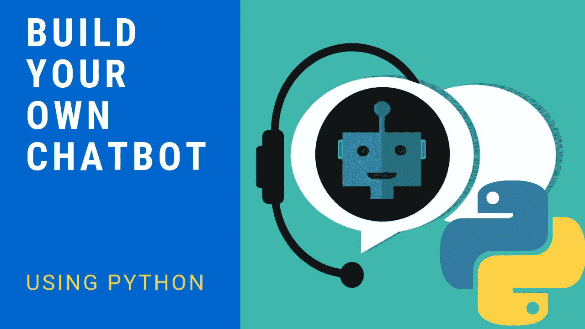
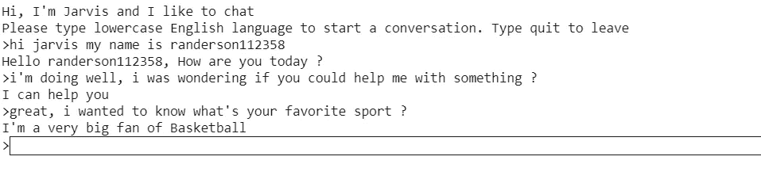
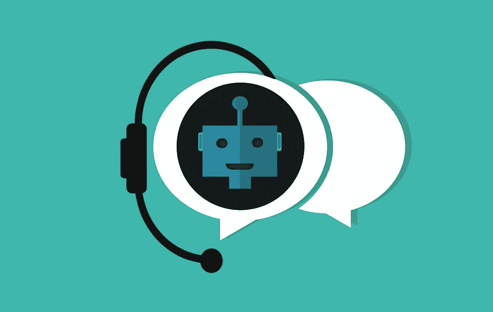

# 使用 Python 构建自己的聊天机器人

> 原文：<https://medium.datadriveninvestor.com/build-your-own-chat-bot-using-python-95fdaaed620f?source=collection_archive---------0----------------------->

[](http://www.track.datadriveninvestor.com/1B9E)

在这篇文章中，我将向你展示如何使用 Python 来构建你自己的聊天机器人！聊天机器人大致有两种变体，基于规则的和自我学习的。基于规则的机器人使用一些规则来训练它，而自学机器人使用一些基于机器学习的方法来聊天。

在本文中，我将向您展示如何使用基于规则的方法用 python 创建一个简单快捷的聊天机器人。

[](https://www.datadriveninvestor.com/2019/02/07/how-the-rise-of-conversational-ai-will-impact-the-world/) [## 对话式人工智能的兴起将如何影响世界|数据驱动的投资者

### 从不同的专业服务，保险，教育，金融，旅游，电信，到建筑，银行，和…

www.datadriveninvestor.com](https://www.datadriveninvestor.com/2019/02/07/how-the-rise-of-conversational-ai-will-impact-the-world/) 

如果你不想读这篇文章，想要一个视频演示，你可以看看下面的 [**YouTube 视频**](https://youtu.be/FFT4p6me2g0) 。它详细介绍了本文中的所有内容，将有助于您轻松开始编写自己的聊天机器人。或者两者都可以作为学习的辅助材料！

# 编程；编排

在编写一行代码之前，我喜欢做的第一件事是在注释中描述代码的作用。这样我可以回顾我的代码，并确切地知道它做了什么。

```
# Description: This is a chatbot program
```

接下来，我们将导入库

```
from nltk.chat.util import Chat, reflections
```

创建可识别模式的聊天机器人列表，这是对这些模式/查询的响应。为此，我们将创建一个名为`pairs`的变量。

```
**#Pairs is a list of patterns and responses.**
pairs = [
    [
        r"(.*)my name is (.*)",
        ["Hello %2, How are you today ?",]
    ],
    [
        r"(.*)help(.*) ",
        ["I can help you ",]
    ],
     [
        r"(.*) your name ?",
        ["My name is J.A.R.V.I.S like in Iron Man, but you can just call me Jarvis and I'm a chatbot .",]
    ],
    [
        r"how are you (.*) ?",
        ["I'm doing very well", "i am great !"]
    ],
    [
        r"sorry (.*)",
        ["Its alright","Its OK, never mind that",]
    ],
    [
        r"i'm (.*) (good|well|okay|ok)",
        ["Nice to hear that","Alright, great !",]
    ],
    [
        r"(hi|hey|hello|hola|holla)(.*)",
        ["Hello", "Hey there",]
    ],
    [
        r"what (.*) want ?",
        ["Make me an offer I can't refuse",]

    ],
    [
        r"(.*)created(.*)",
        ["randerson112358 created me using Python's NLTK library ","top secret ;)",]
    ],
    [
        r"(.*) (location|city) ?",
        ['Tokyo, Japan',]
    ],
    [
        r"(.*)raining in (.*)",
        ["No rain in the past 4 days here in %2","In %2 there is a 50% chance of rain",]
    ],
    [
        r"how (.*) health (.*)",
        ["Health is very important, but I am a computer, so I don't need to worry about my health ",]
    ],
    [
        r"(.*)(sports|game|sport)(.*)",
        ["I'm a very big fan of Basketball",]
    ],
    [
        r"who (.*) (moviestar|actor|actress)?",
        ["Zendaya"]
    ],
    [
        r"quit",
        ["Bye for now. See you soon :) ","It was nice talking to you. See you soon :)"]
    ],
    [
        r"(.*)",
        ['That is nice to hear']
    ],
]
```

好了，现在我们已经完成了模式和响应，让我们来看看叫做**反射**的东西。反射是一个字典文件，包含一组输入值和相应的输出值。

例如，如果字符串输入是" ***我是*** *程序员*，那么输出将是"**你是**程序员"。

```
reflections
```


The reflections dictionary

反射是一个可选的字典，您可以将其用于您的聊天机器人(我们稍后将使用的聊天对象)。然而，如果你想在你的模式中使用正则表达式，就像我们在名为`pairs`的变量中所做的一样，例如`r"**(.*)**my name is **(.*)**`，这是必需的。

我们也可以创建自己的反射字典，格式和上面的反射一样。下面是如何做到这一点的示例:

```
my_dummy_reflections= {
    "go"     : "gone",
    "hello"    : "hey there"
}
```

现在让我们打印一个默认消息，并创建我们的机器人。

```
**#default message at the start of chat**
print("Hi, I'm Jarvis and I like to chat\nPlease type lowercase English language to start a conversation. Type quit to leave ")**#Create Chat Bot**
chat = Chat(pairs, reflections)
```

最后，让我们开始一段对话。

```
**#Start conversation**
chat.converse()
```



# 结论和资源

就这样，你已经创建好了你的聊天机器人程序！感谢阅读这篇文章，我希望它对你们所有人都是有趣的！如果你喜欢这篇文章，并发现它很有帮助，请留下一些掌声，以示感谢。如果你还不是 Medium 的 [**会员，那就考虑成为会员吧，如果不是为了我的文章，也是为了这个网站上所有其他了不起的文章&作者。使用**](https://randerson112358.medium.com/membership) **[**这里的**](https://randerson112358.medium.com/membership) 链接就可以轻松成为 Medium 的一员。继续学习，如果你喜欢金融、计算机科学或编程，请访问并订阅我的 [YouTube](https://www.youtube.com/channel/UCaV_0qp2NZd319K4_K8Z5SQ) 频道([randers 112358](https://www.youtube.com/channel/UCaV_0qp2NZd319K4_K8Z5SQ)&[计算机科学](https://www.youtube.com/channel/UCbmb5IoBtHZTpYZCDBOC1CA))。**

如果你有兴趣阅读关于机器学习的书籍，以立即开始解决问题和例子，我建议你阅读 [*使用 Scikit-Learn 和 TensorFlow 进行机器学习实践:构建智能系统的概念、工具和技术。*](https://www.amazon.com/Hands-Machine-Learning-Scikit-Learn-TensorFlow/dp/1491962291/ref=sr_1_1?crid=10QDWDNMUMCYF&keywords=hands-on%20machine%20learning%20with%20scikit-learn%20and%20tensorflow&qid=1563929293&s=books&sprefix=hands-on%20machine%2Cstripbooks-intl-ship%2C143&sr=1-1&source=post_page---------------------------)

这是一本帮助初学者学习编写机器学习程序和理解机器学习概念的好书。


使用 Scikit-Learn 和 TensorFlow 进行机器实践学习:构建智能系统的概念、工具和技术

感谢您阅读本文，希望对您有所帮助！

