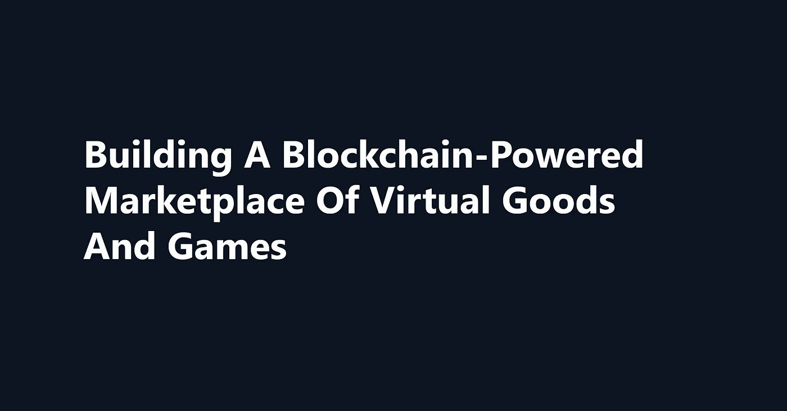
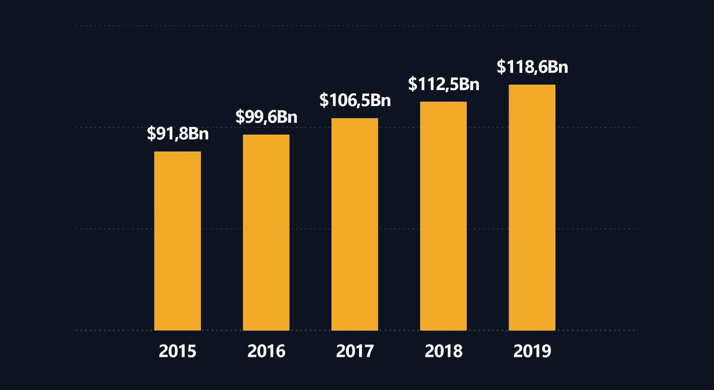
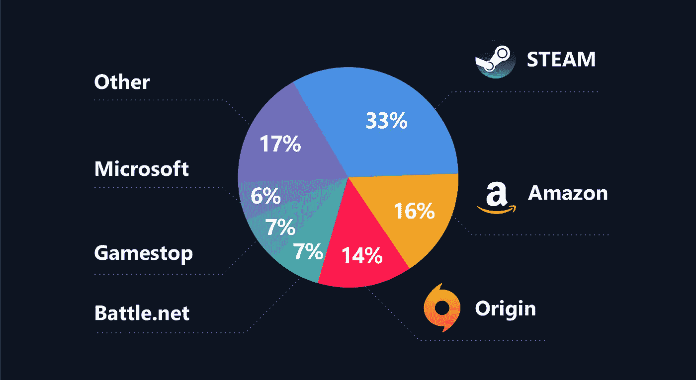
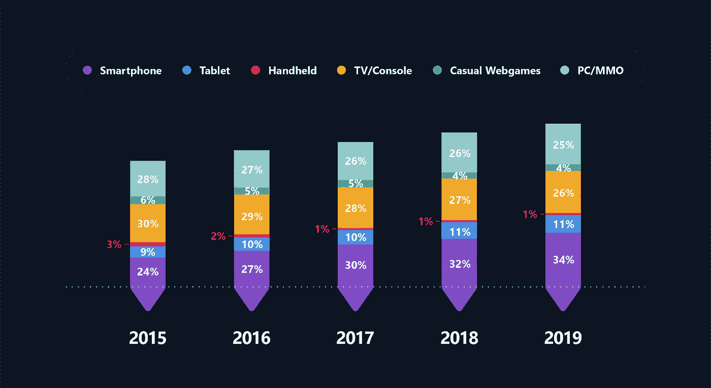
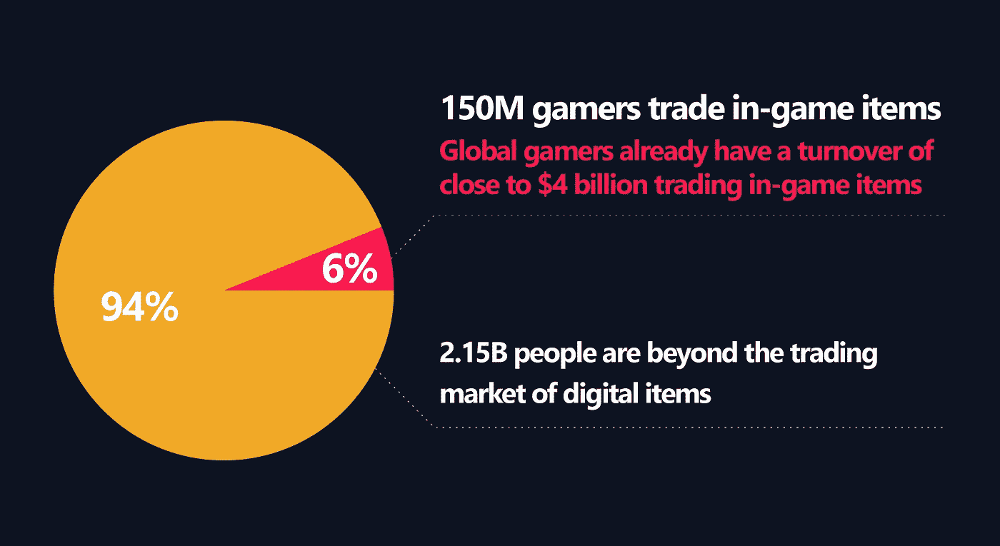
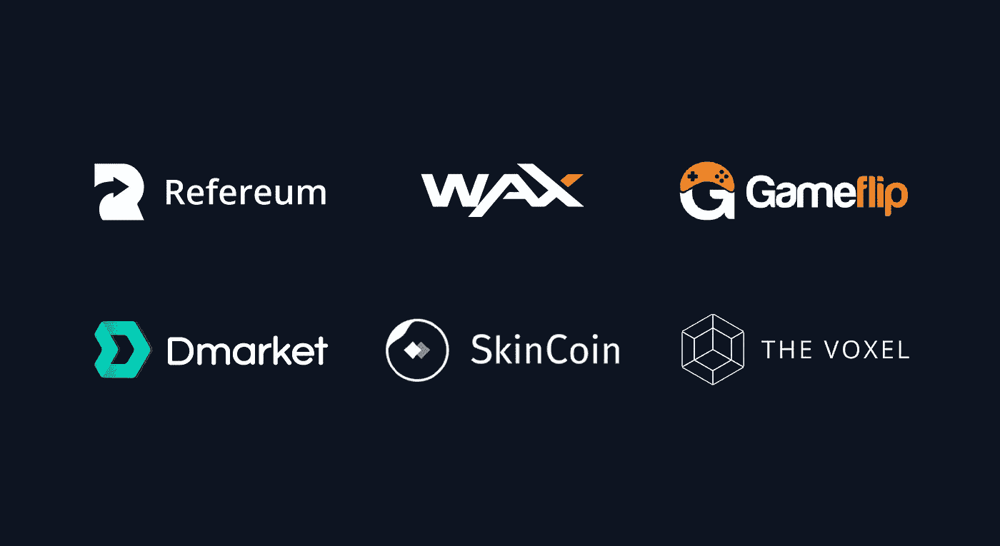
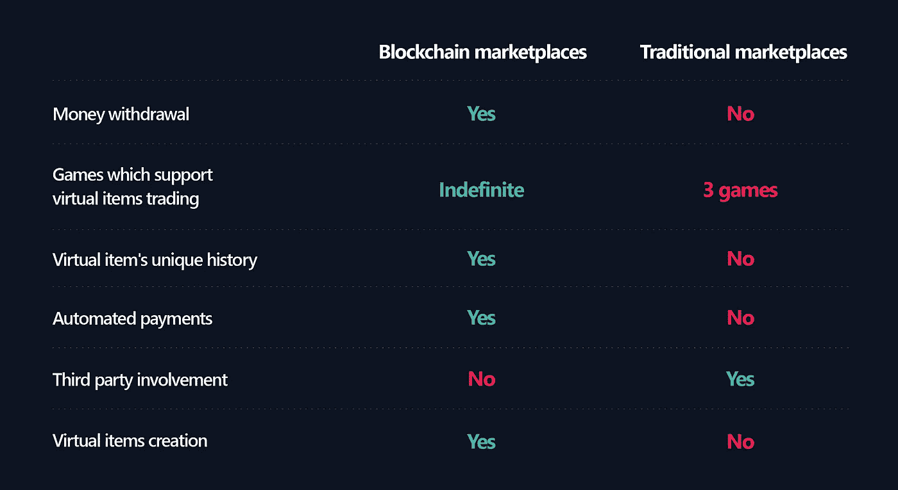
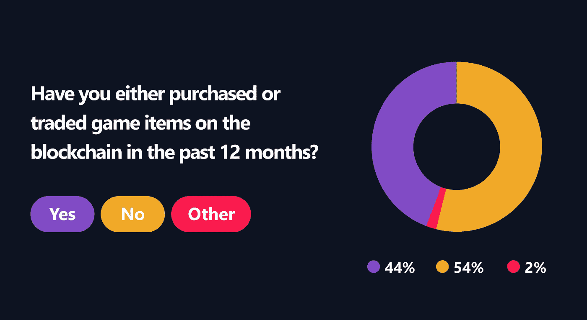
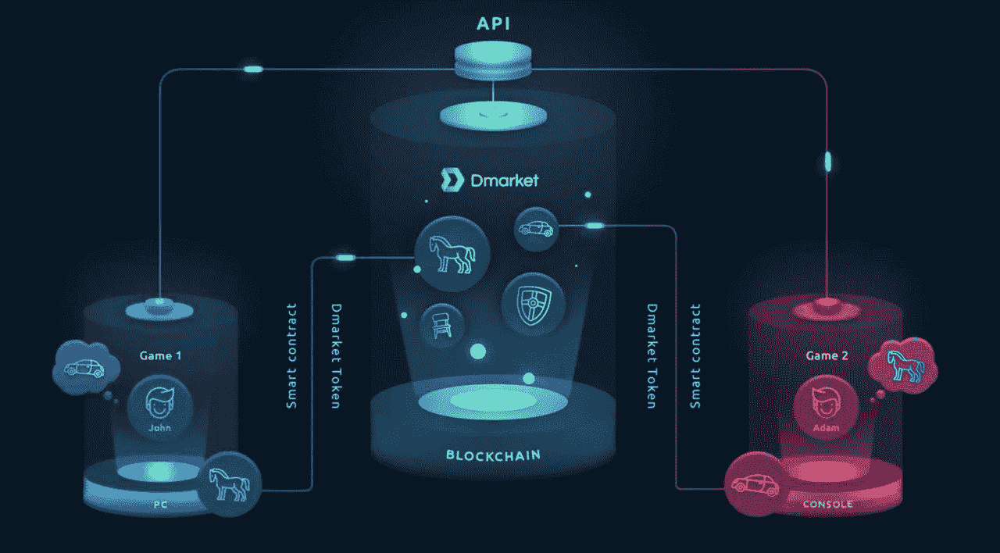

# 建立一个由区块链驱动的虚拟商品和游戏市场

> 原文：<https://medium.datadriveninvestor.com/building-a-blockchain-powered-marketplace-of-virtual-goods-and-games-fb8e12dd2c6e?source=collection_archive---------0----------------------->

有些人沉迷于星球大战电影。有些人沉迷于足球。有些人沉迷于手工艺。今天，我们几乎所有人都有一种特殊的癖好。在这篇文章中，我们谈论一个最令人兴奋和最普遍的上瘾的人。这是虚拟游戏和整个游戏行业，在全球拥有大约 23 亿粉丝。据估计，2017 年的全球游戏市场价值超过 1000 亿美元，同期全球游戏玩家人数估计为 22 亿。

***Gaming industry capitalization arranged by years***

我们热爱虚拟世界，不仅因为玩游戏时体验到的情感，还因为我们获得了难以置信的游戏机会。现代游戏为我们提供了一种独特的游戏方式，通过这种方式，我们能够定制我们与游戏互动的方式，从设置特定的屏幕保护程序、配色方案和字体大小开始，到购买或赢得独家物品、英雄模型和其他游戏内商品结束。

博彩业已经成为一个有着真实贸易关系的完整市场。在 Steam、Kinguin、Gog.com 等全球游戏市场，你可以用法定货币购买任何游戏以及相关的虚拟商品。

***Most popular PC/Mac storefronts for purchasing virtual goods***

全球资产交易所得出结论，约 60%的主机游戏玩家一生中至少购买过一次虚拟物品，43%的电脑游戏玩家和 33%的智能手机游戏玩家也是如此。

***Gamers who purchased virtual items arranged by years***

游戏市场继续快速增长(去年超过 10%)，虚拟物品是这一增长的主要推动力。例如，在 Dota 2 中，你可以找到价格超过 1000 美元的稀有物品，忠实的游戏玩家实际上会购买它们。《战争游戏:火之时代》为每位付费用户带来了高达 549.69 美元的收入，高峰时每天的总收入超过 2M 美元。

一些最先进的虚拟商品市场已经围绕游戏《反恐精英:全球攻势》(简称 CS:GO)涌现出来。原因是该游戏的开发商 Valve 推出了被称为“皮肤”的装饰性虚拟武器，玩家可以在游戏中获得这些武器，并在第三方平台(游戏环境之外)上以真实货币出售。到 2015 年，这已经发展成为一个活跃的赌博市场，超过 300 万人押注价值 23 亿美元的皮肤。

2017 年虚拟物品和 DLC 占了~ 800 亿美元。然而，这个发展良好的行业提供了几个阻碍良好游戏体验的关键陷阱。

# **玩家在使用菲亚特游戏市场时面临的问题**

这真的很酷，我们可以访问大型游戏市场的独家产品。当给最喜欢的英雄买一套新的，改变他眼睛的颜色，或者下载一段激动人心的音乐时，一剂快乐填满了狂热的游戏玩家的心。游戏内交易的过程轻松愉快。你所需要做的就是选择一个想要的物品，通过合适的游戏市场在菲亚特购买，然后享受你的购买。但是接下来呢？如果这个项目让你厌烦了怎么办？或者你受够了这个游戏怎么办？

当代游戏市场最大的失败是你不能退货或出售一些虚拟商品。此外，你不能提取在游戏过程中赚取的法定货币。只能花在平台内的商品上。将你的资产转移到另一个游戏是不可能的，因为现有的技术没有将许多游戏世界和平台连接在一起。在游戏引擎、独立和全球游戏开发者、移动和主机世界之间没有桥梁。更令人沮丧的情况是，当你的账户被盗时，你存储的物品没有留下任何痕迹。

这样，尽管你花费了时间和精力，你还是陷入了被无用物品卡住(或者没有它们)的境地。通常，这导致游戏开发者和制造商从他们的世界中失去游戏玩家。

***In-game items trade involvement***

# **区块链是真正的解决方案**

你几乎找不到一个对区块链没有一点肤浅了解的人。这项创新技术通过其四个核心特征彻底改变了数字世界:透明性、去中心化、分布性和不变性。上述游戏产业的当前问题可以通过区块链供电的产品完全解决。

**Blockchain-powered vitrual items marketplaces**

与传统服务相比，区块链驱动的市场为用户提供了一些突出的机会:

***Blockchain-powered solutions vs. traditional gaming marketplaces***

游戏中的区块链解决方案已经证明了它们的效率。下图显示了 2018 年在全球区块链上购买或交易游戏物品的游戏玩家比例。根据 [statista](https://www.statista.com/) 的调查结果，44%接受调查的游戏玩家表示，在过去的 12 个月中，他们在区块链上购买或交易过游戏物品，而相比之下，54%的人表示没有。

***Share of gamers who purchased or traded game items on the blockchain worldwide in 2018***

[DMarket](https://dmarket.io/) 是一个基于区块链的跨平台解决方案的好例子，在这里，游戏玩家、开发者和企业家可以高效、安全地评估和交易虚拟物品。这家初创公司的主要目标是实现不同平台和游戏之间虚拟物品的便捷销售、交换和评估。

***DMarket marketplace — How does it work?******(Illustrated by DMarket team)***

由于区块链技术，全世界的用户都可以创建、出售、购买和交换他们的虚拟资产，从而在玩游戏和发展整个游戏产业时赚到真正的钱。

# **多一场比赛**

人们崇拜玩游戏，人们崇拜金钱。区块链驱动的市场为我们同时实现这两个愿望提供了巨大的可能性。由于区块链技术的实施，游戏过程更加愉快和方便。这只是一个开始。通过加入像上述区块链创业公司这样的创新者，我们促进了游戏行业的繁荣，并通过虚拟物品进入了真正的全球经济。虚拟就是这样变成现实的。

你认为开发者在开发区块链市场时应该注意什么？在评论中分享你的观点。我们感谢您的想法！

如果你对这个故事有任何疑问，请随时通过[脸书](https://www.facebook.com/pro.pavlov)或[推特](https://twitter.com/_alexpavlov)联系我。