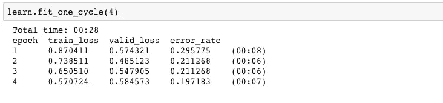
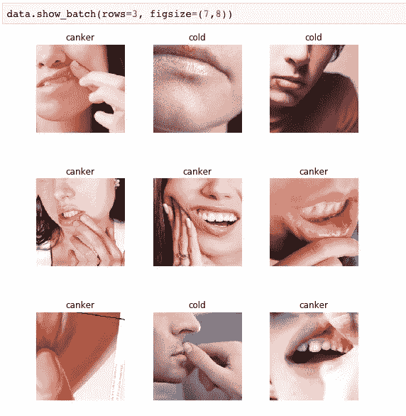

# 使用深度学习构建感冒或口腔溃疡分类器应用程序

> 原文：<https://medium.datadriveninvestor.com/building-a-cold-or-canker-sores-classifier-app-using-deep-learning-242b8c80fbe5?source=collection_archive---------27----------------------->

我一直在学习杰瑞米·霍华德 FastAI 课程的最新版本，并决定根据我迄今为止学到的知识开发一个简单的应用程序。

在我看来，Fastai 是学习深度学习的最佳资源之一。我不打算花太多时间来谈论为什么它会出现在这里，但是来看看吧:[https://www.fast.ai/](https://www.fast.ai/)

除了作为一门课程，fastai 还是一个位于 Pytorch 之上的库，它简化了你开始训练模型所需的大量设置。

# 迁移学习

在过去的几年中，深度学习的一个主要发展是迁移学习，它真正实现了深度学习的大众化。迁移学习可以让你用大量的数据和计算训练出一个模型，并在上面添加你的用例，瞧，你就有了自己的模型！有点像站在巨人的肩膀上。:)

举个例子可能是更好的解释方式。最著名的图像数据集之一叫做 Imagenet，它有数百万张普通物体的图像。许多人都在这个数据集上工作，并训练了一个模型，该模型非常擅长基于它对对象进行分类。现在——假设你想做一个猫/狗分类器，也就是说，一个模型可以告诉你你展示的图像是猫还是狗。

你可以这样做的一个方法是从头开始建立一个模型，给它大量的猫和狗的照片，然后花大量的时间来训练它。或者——你可以在 Imagenet 上使用一个预先训练好的模型，它已经非常擅长识别物体的照片(对角线、线条、形状等),然后根据猫和狗的照片训练模型的最后几层。这就是我们所说的迁移学习，使用这种方法，你需要少得多的数据和计算来获得你的用例的最先进的结果(在这种情况下识别猫和狗)。

# 这个想法

如果你在大学，你有，或者至少认识一个朋友，他因为嘴上的疮而吓坏了。:D

我想这可能是一个很酷的应用程序，人们可以上传一张照片，并得到一个结果，如果他们的疮是感冒疮或口腔溃疡。

# **获取数据**

获取图片的一个非常巧妙的方法是使用 google image 搜索你想要的东西(比如唇疱疹),然后使用 javascript 抓取所有的图片。你可以通过控制台或者使用 Chrome 扩展来实现。

无论哪种方式，一旦我有了一些图像，我就在上面运行我预先训练的模型，并能够获得一些不错的准确性:

80%左右！考虑到我只使用了几百张图片，其中很多并不理想，这还算不错:

正如你所看到的，一些图片是整张脸，没有描绘任何伤口。理想情况下，我会希望放大溃疡的图像，但这是使用谷歌图像与医学来源的陷阱之一。如果我能找到更好的数据，这可能是一个伟大的版本 2！

然而，这只是一个快速和肮脏的版本 1。我想看看能不能很快造出东西。

# 模型

利用迁移学习，我用一个预先训练好的 Imagenet 模型(一个 resnet34)给我的模型输入感冒和口腔溃疡的图片。

# 该应用程序

我拿着我的模型，用一个叫 Zeit 的服务把它投入生产:[https://zeit.co/](https://zeit.co/)

Zeit 是一个很好的服务，非常容易设置。Fastai 实际上有一个他们在 Zeit 上部署的演示应用程序，所以我需要做的就是获取代码并用我的模型替换它！

还有…这是我的应用:【https://cold-or-canker.now.sh/ 

对一个[来说，几个小时的工作还不错！](https://mc.ai/building-a-cold-or-canker-sores-classifier-app-using-deep-learning/)

**免责声明:**该模型远不能以可接受的确定性预测像医疗状况这样敏感和重要的事情，所以如果你担心，请去看医生！

对图像分类有什么很酷的想法？它不一定是 X 和 y。你也可以做多标签分类，例如，通过喂养不同狗品种的相同预训练模型图片来识别不同的狗品种。你的想法是什么？让我知道，也许我会为它建立一个应用程序。:)