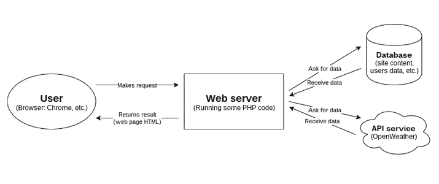
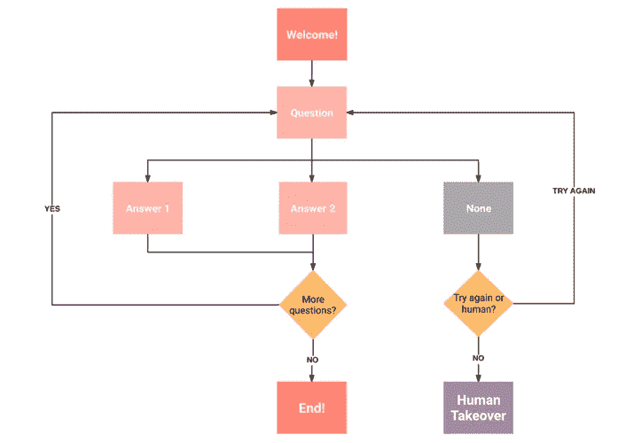

# 为商业网站构建客户支持机器人:PHP 是正确的选择吗？

> 原文：<https://medium.datadriveninvestor.com/building-a-customer-support-bot-for-a-business-website-is-php-the-right-choice-de78cc06198c?source=collection_archive---------2----------------------->

在数字时代，我们对客户支持部门有什么期望？

首先，是**更快的响应时间:**目前，公司处理通过网站表格发送的服务请求、客户问题和投诉需要 12 个多小时。

第二，这是**五星级网站用户体验:**尽管今年移动搜索预计将比桌面搜索多产生 278 亿个查询，但 90%的消费者承认他们在移动搜索上寻求支持时体验不佳。

最后，是**“永不停机”的客户服务方式:**大多数客户(43%且仍在增长)希望公司能够全天候提供服务。

如果不能满足这些基本需求，你的 B2C 公司可能会损失一大笔钱(如果不是让你彻底破产的话)。

> 网络聊天机器人——轻量级关键字触发或基于人工智能的对话应用程序，旨在以类似人类的方式回答问题，并帮助用户导航网站——可以帮助企业实现客户支持自动化，改善服务并提高内容可发现性。虽然 Python 被广泛认为是自然语言处理(NLP)编程的全面解决方案，但有时企业不得不转向 PHP 等成熟的编程语言来创建对话应用程序。如果你有一个大的 PHP 代码库，这可能是必需的(毕竟，这种语言驱动了 80%的网站！)或者由熟练的 PHP 开发人员组成的内部团队。

*PHP 真的适合聊天机器人开发吗？*

# 是什么让 PHP 成为网站聊天机器人的首选技术？

凭借其通用的开源 NLP 和机器学习(ML)库，如 NLTK 和 TextBlob，Python 是当今聊天机器人开发的瑞士军刀语言。如果你联系一个有经验的软件供应商，你可以将 Python 对话程序与基于 Drupal、WordPress 或 Laravel 的网站集成；然而，这将需要特殊的扩展，如 PHP 中的 Python(PiP)和额外的开发时间。

*你也可以利用你现有的东西，创建一个 PHP 机器人来代替。*

尽管你可能听说过关于这种语言的一切(它经常被贴上不安全和不适合大型商业级应用的标签)，PHP——尤其是它的最新版本——事实上确实允许开发者为网站和流行的消息应用程序设计智能机器人。

## 以下是用 PHP 构建客户服务机器人的几个原因:

*   用于聊天机器人开发的框架&平台的可用性。有几个可靠的 PHP 框架，包括 **BotMan** 和基于 Laravel 的 **FondBot** ，它们使软件供应商能够为网络频道、流行的移动信使和基于语音的服务创建虚拟助手。这两个框架都被设计为产生结构良好且易于维护的代码，并且可以合并到现有的代码库中，也可以从头开始促进 bot 开发。您还可以实施第三方基于云的人工智能平台(Microsoft Bot Framework、Pandorabots、Dialogflow ),该平台具有内置的语言处理功能和现成的模板，可用于各种客户支持场景，从而缩短上市时间并优化开发预算。
*   **bot 开发的无服务器方法&消息处理。**使用 PHP，您可以释放第三方后端即服务(BaaS)和事件触发功能即服务(FaaS)解决方案(如 AWS Lambda)的威力。这对您的企业意味着什么？首先，它降低了成本，因为您不需要服务器来运行聊天机器人代码和管理历史聊天数据，并且只需为代码执行付费。第二，它增加了 bot 的可伸缩性——即处理更多请求和增强程序功能而无需大量编码的能力。
*   **快速发展&成本效益。虽然 Python 等所谓的人工智能友好语言可能在运行时提供更好的整体性能，但 PHP 是在创纪录的时间内启动并运行 web 解决方案的必要工具，这也是大多数企业通常寻求的。不过，这并没有让这种语言成为初创企业的唯一解决方案。随着 PHP 7 的发布，这个[版本通过更快的代码执行、高效的内存使用和对安全性的关注来实现持续的性能优化](https://r-stylelab.com/company/blog/web-development/latest-trends-in-php-development)，开发人员能够创建商业级的 web 解决方案，包括那些具有对话界面的解决方案。PHP 享有巨大的社区支持，并且作为一种成熟的语言，拥有大量有技能的开发人员可供选择。**

最后但同样重要的是，你可以在基于 PHP 的网站和聊天机器人的工作流程之间找到许多相似之处:在这两种情况下，来自浏览器的用户请求都由运行 PHP 代码的 web 服务器进行分析；然后，服务器请求信息，从数据库接收信息，并将其返回给浏览器，在浏览器中数据被可视化。如果你打算为 Facebook Messenger 或 Telegram 创建一个聊天机器人，你只需要向消息应用发送一个 HTTP 请求来完成请求，而不是简单地在浏览器中显示 HTML。

There are more similarities between PHP websites & chatbots than you think

> 也就是说，网络渠道为对话元素的定制提供了更多的机会，从而使公司能够创建虚拟的客户助理来补充他们的品牌身份。

## 近距离观察网站客户支持机器人功能和架构

用 PHP 可以创建两种类型的网站聊天机器人:

*   **以流量为导向的机器人**，识别客户查询中的关键词，允许用户在预设选项中进行选择。关键词触发的机器人并不试图表现得像人类助手，而是通过从你的 FAQ 库中检索数据来处理第一层问题。
*   **具有自然语言处理能力的智能机器人**，它们经过专门训练，可以随时处理客户回复，对它们进行分类，并生成基于上下文的回复。值得一提的是[人工智能发展的当前水平](https://venturebeat.com/2017/07/01/the-reality-of-automating-customer-service-chat-with-ai-today/)既没有为理解客户意图提供一刀切的解决方案，也没有超越标准的机器学习方法来确定自由文本中单词之间的语义关系。

基于人工智能和关键字触发的聊天机器人都有非常简单的流程和架构。他们向用户打招呼并参与对话；根据用户的信息，该程序提供答案，建议访问特定的 FAQ 类别，或将客户与人类专家联系起来。目前，聊天机器人大多能够处理高达 80%的 1 级支持问题；第 2-3 级问题通常需要人工干预。

Basic Chatbot Architecture

## 如何建立一个机器人:4 个步骤，以恒星对话的经验

在你向一家 [PHP 开发服务](https://r-stylelab.com/technologies/custom-php-development-services)公司发表演讲之前，你和你的团队应该为你的聊天机器人制定一个清晰的愿景，并确保它能为你的客户带来价值:

*   设定你的目标。不要仅仅因为“聊天机器人”是一个新的流行词，而你需要一个“在场”的聊天机器人，就为你的客户创造对话体验。这个决定应该基于一个彻底的市场调查和你想要达到的某些目标——例如，提供卓越的客户支持或减少 20%的客户支持费用。
*   **定义你的受众&他们的背景。**你的观众有一百万种方式可以联系到虚拟支持代理:他们可能坐在家中的电脑前，通过手机访问你的网站，或者使用亚马逊 Echo。此外，您的客户多种多样；根据他们的年龄和数字习惯，你可能会采用不同的聊天机器人的感觉和语气，并选择某些机器人 UI 组件。
*   **概述聊天机器人的功能需求。**您的客户支持自动化之旅应该从一个详细的场景开始，包括您的聊天机器人能够执行的任务、它将提供的信息类型以及它将从中检索数据的资源列表。此外，您应该确定一旦 smart 程序没有问题或遇到不熟悉的问题，是否会有人类专家准备接手。
*   **决定自己需要什么类型的 bot**。正如我们前面提到的，有两种主要类型的网站聊天机器人。线性机器人的构建成本更低，但可能无法提供您所寻求的自动化水平。构建一个基于机器学习的机器人可以减轻你员工的负担，也是一个将更多时间投入创造性工作的好机会。然而，这种聊天机器人需要大量的训练数据(包括聊天记录历史)和至少 200 小时的编码，才能正确地调整现成的自然语言处理工具。你应该选择哪种类型的虚拟助理？这完全取决于你最初的功能需求，产品的复杂性和你的开发预算。

总而言之，用 PHP 构建客户支持聊天机器人是一项可行的任务——与用 Python、Ruby 或 Clojure 做所有事情相比，它在现有 PHP 代码环境的上下文中更有意义。

*贵公司使用客服机器人吗？它由什么技术支持？请在下面的评论中告诉我们！*