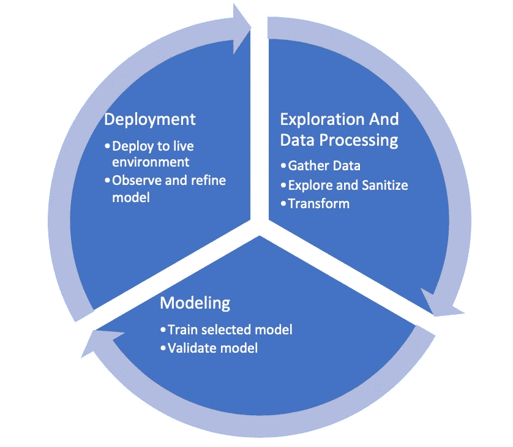

# 构建机器学习管道——探索和数据处理

> 原文：<https://medium.datadriveninvestor.com/building-a-machine-learning-pipeline-exploration-and-data-processing-13b465e23898?source=collection_archive---------7----------------------->

在这个由三部分组成的博客系列中，我们将探索如何建立一个机器学习管道(定义如下)。每个部分将涵盖管道建设过程的一个关键领域。我非常相信实践学习，因此作为这一旅程的一部分，整个端到端过程将通过构建一个功能性的机器学习管道来体现。使用机器学习模型或框架(如 PyTorch)的一些经验，以及构建 web 服务的经验将在本系列的实践部分派上用场。

所以让我们开始吧…

什么是机器学习管道？

 [## DDI 编辑推荐:5 本让你从新手变成专家的机器学习书籍|数据驱动…

### 机器学习行业的蓬勃发展重新引起了人们对人工智能的兴趣

www.datadriveninvestor.com](https://www.datadriveninvestor.com/2019/03/03/editors-pick-5-machine-learning-books/) 

试图利用人工智能或机器学习能力的组织通常会发现自己陷入从哪里开始的难题。他们拥有所有这些结构化和非结构化数据，但不知道如何连接和利用这些数据。有时这些数据存在于一个数据湖中，而其他时候则分布在多个数据源中。此外，了解如何将不同的元素缝合在一起以达到智能洞察的最终目标看起来是一项艰巨的任务。机器学习管道是一种循序渐进的方法，确保人们能够从已经可用的数据中获取价值。毕竟，如果没有有效的方法来连接所有元素，并利用人工智能承诺提供的魔力，仅仅拥有数据和/或机器学习模型是没有用的。一般来说，管道提供了一种从可用数据中以批处理或实时方式获得洞察力的方法。

整个机器学习工作流程/流水线构建过程可以分为三个主要阶段

1.  勘探和数据处理
2.  建模(将在第 2 部分中讨论)
3.  部署(将在第 3 部分中讨论)

Machine learning Workflow

勘探和数据处理

这是初始准备阶段，我们准备好数据以供使用。这个阶段可以进一步细分为——

1.  收集数据—将数据组织为文件系统或某种数据库上的文件。
2.  探索和净化-这包括探索和可视化数据，以绘制出数据集中最有趣的特征。作为净化的一部分，我们希望移除任何可能在模型中产生偏差的异常值或错误。
3.  转换—这一步包括转换数据(标准化、翻译、编码等)。)以便它可以用于训练模型。

总之，成功的机器学习之旅始于正确的数据，并确保这些数据可供消费。

在下一篇文章中，我们将讨论机器学习工作流的建模阶段。在我们涵盖了所有阶段之后，我们将回顾一个使用行业标准工具(如 Jupyter Notebooks、PyTorch、Anaconda、AWS API Gateway 等)构建整个工作流的实际例子。我将发表另一篇关于如何在你的笔记本电脑上设置机器学习环境的文章。快乐学习！